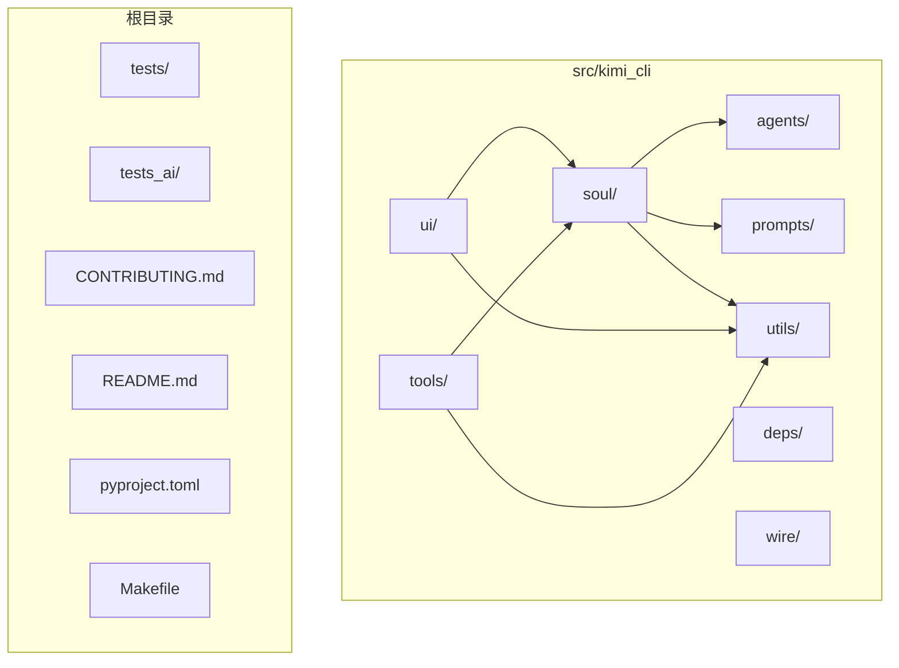
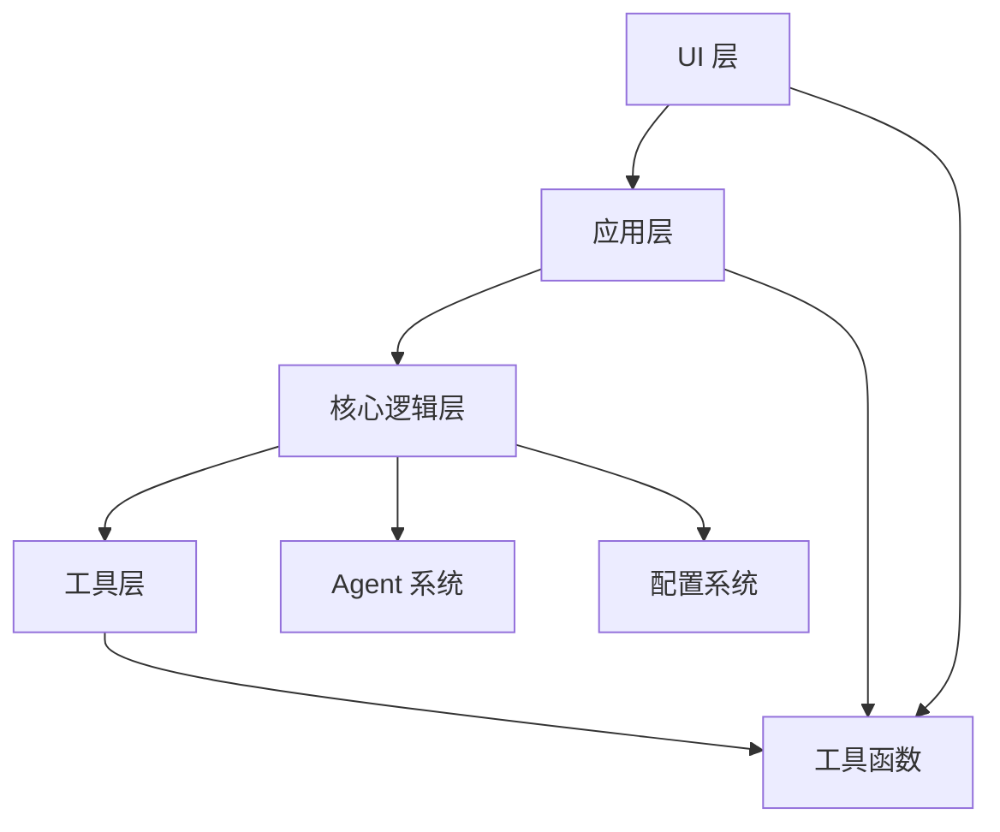
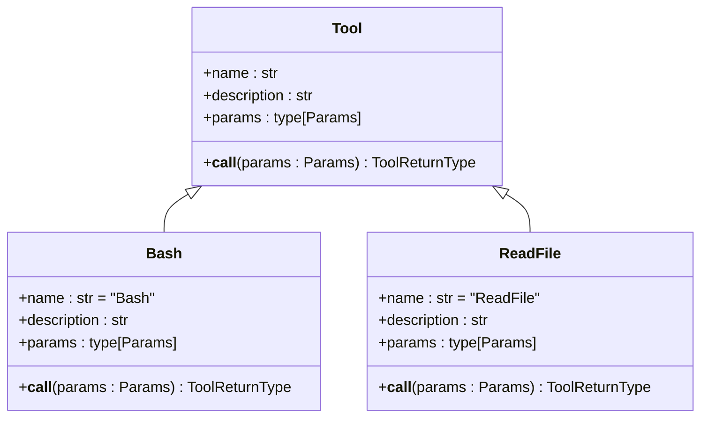
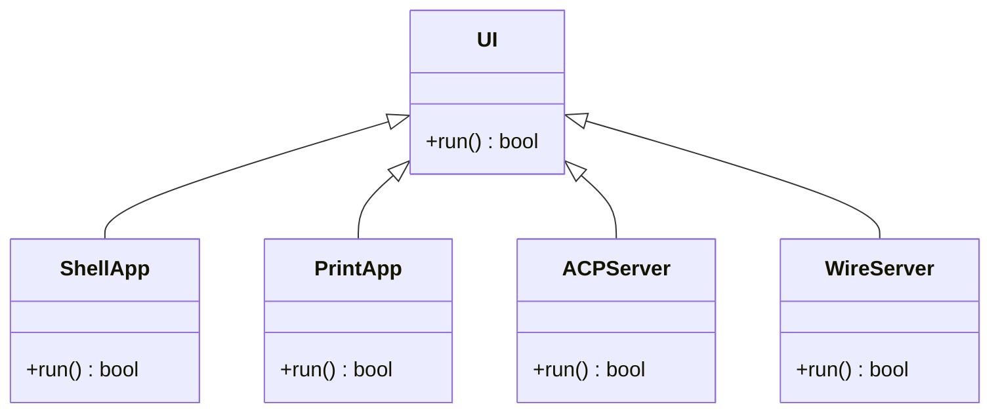
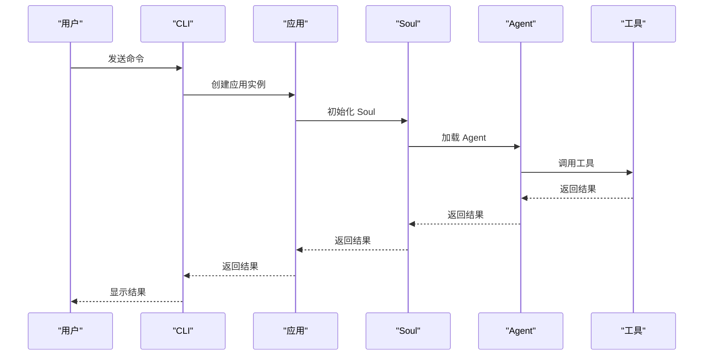
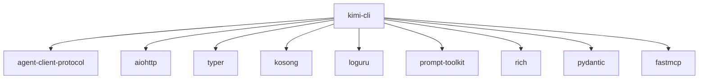

# 开发者指南

<cite>
**本文档中引用的文件**  
- [CONTRIBUTING.md](file://CONTRIBUTING.md)
- [README.md](file://README.md)
- [pyproject.toml](file://pyproject.toml)
- [Makefile](file://Makefile)
- [src/kimi_cli/cli.py](file://src/kimi_cli/cli.py)
- [src/kimi_cli/app.py](file://src/kimi_cli/app.py)
- [src/kimi_cli/soul/agent.py](file://src/kimi_cli/soul/agent.py)
- [src/kimi_cli/tools/__init__.py](file://src/kimi_cli/tools/__init__.py)
- [src/kimi_cli/tools/bash/__init__.py](file://src/kimi_cli/tools/bash/__init__.py)
- [src/kimi_cli/tools/file/__init__.py](file://src/kimi_cli/tools/file/__init__.py)
- [src/kimi_cli/ui/shell/__init__.py](file://src/kimi_cli/ui/shell/__init__.py)
- [src/kimi_cli/ui/print/__init__.py](file://src/kimi_cli/ui/print/__init__.py)
- [src/kimi_cli/ui/acp/__init__.py](file://src/kimi_cli/ui/acp/__init__.py)
- [src/kimi_cli/agents/CLAUDE.md](file://src/kimi_cli/agents/CLAUDE.md)
- [src/kimi_cli/agentspec.py](file://src/kimi_cli/agentspec.py)
- [src/kimi_cli/soul/toolset.py](file://src/kimi_cli/soul/toolset.py)
</cite>

## 目录
1. [简介](#简介)
2. [项目结构](#项目结构)
3. [核心组件](#核心组件)
4. [架构概述](#架构概述)
5. [详细组件分析](#详细组件分析)
6. [依赖分析](#依赖分析)
7. [性能考虑](#性能考虑)
8. [故障排除指南](#故障排除指南)
9. [结论](#结论)

## 简介
Kimi CLI 是一个创新的命令行代理工具，旨在帮助开发者完成软件开发任务和终端操作。本指南面向贡献者，详细介绍了如何扩展和定制 Kimi CLI，包括创建新工具、实现新的 UI 模式、扩展 Agent 系统以及遵循代码贡献流程。通过本指南，开发者可以快速上手并为项目做出贡献。

## 项目结构
Kimi CLI 项目采用模块化设计，主要目录包括：
- `src/kimi_cli/`: 源代码主目录
  - `agents/`: Agent 配置和系统提示
  - `deps/`: 依赖管理
  - `prompts/`: 提示模板
  - `soul/`: 核心逻辑和运行时
  - `tools/`: 工具模块
  - `ui/`: 用户界面实现
  - `utils/`: 工具函数
  - `wire/`: 通信协议
- `tests/`: 测试代码
- `tests_ai/`: AI 测试脚本

**图源**
- [src/kimi_cli](file://src/kimi_cli)

**本节源**
- [README.md](file://README.md)

## 核心组件
Kimi CLI 的核心组件包括 CLI 入口、应用主类、工具系统、UI 模式和 Agent 系统。这些组件协同工作，提供强大的命令行代理功能。

**本节源**
- [src/kimi_cli/cli.py](file://src/kimi_cli/cli.py)
- [src/kimi_cli/app.py](file://src/kimi_cli/app.py)

## 架构概述
Kimi CLI 采用分层架构，从上到下分为 UI 层、应用层、核心逻辑层和工具层。UI 层负责与用户交互，应用层协调各组件，核心逻辑层处理业务逻辑，工具层提供具体功能。

**图源**
- [src/kimi_cli/app.py](file://src/kimi_cli/app.py)
- [src/kimi_cli/cli.py](file://src/kimi_cli/cli.py)

## 详细组件分析

### 工具系统分析
Kimi CLI 的工具系统允许开发者创建和集成新工具。工具通过自动发现机制被加载，开发者只需在 `tools/` 目录下创建新模块即可。

#### 工具创建教程
1. 在 `tools/` 目录下创建新模块
2. 定义工具函数、描述和参数
3. 确保工具被自动发现

**图源**
- [src/kimi_cli/tools/bash/__init__.py](file://src/kimi_cli/tools/bash/__init__.py)
- [src/kimi_cli/tools/file/__init__.py](file://src/kimi_cli/tools/file/__init__.py)

**本节源**
- [src/kimi_cli/tools/__init__.py](file://src/kimi_cli/tools/__init__.py)
- [src/kimi_cli/soul/agent.py](file://src/kimi_cli/soul/agent.py)

### UI 模式分析
Kimi CLI 支持多种 UI 模式，包括 shell 模式、print 模式、ACP 模式和 wire 模式。开发者可以在 `ui/` 目录下实现新的 UI 接口。

#### UI 模式实现

**图源**
- [src/kimi_cli/ui/shell/__init__.py](file://src/kimi_cli/ui/shell/__init__.py)
- [src/kimi_cli/ui/print/__init__.py](file://src/kimi_cli/ui/print/__init__.py)
- [src/kimi_cli/ui/acp/__init__.py](file://src/kimi_cli/ui/acp/__init__.py)

**本节源**
- [src/kimi_cli/ui/shell/__init__.py](file://src/kimi_cli/ui/shell/__init__.py)
- [src/kimi_cli/ui/print/__init__.py](file://src/kimi_cli/ui/print/__init__.py)
- [src/kimi_cli/ui/acp/__init__.py](file://src/kimi_cli/ui/acp/__init__.py)

### Agent 系统分析
Agent 系统是 Kimi CLI 的核心，负责处理用户请求和调用工具。开发者可以通过扩展 Agent 系统来添加新功能。

#### Agent 扩展方式

**图源**
- [src/kimi_cli/app.py](file://src/kimi_cli/app.py)
- [src/kimi_cli/soul/agent.py](file://src/kimi_cli/soul/agent.py)

**本节源**
- [src/kimi_cli/soul/agent.py](file://src/kimi_cli/soul/agent.py)
- [src/kimi_cli/agentspec.py](file://src/kimi_cli/agentspec.py)

## 依赖分析
Kimi CLI 的依赖关系复杂但清晰，主要依赖包括：
- `agent-client-protocol`: ACP 协议支持
- `aiohttp`: 异步 HTTP 客户端
- `typer`: 命令行接口
- `prompt-toolkit`: 交互式提示
- `rich`: 富文本输出
- `pydantic`: 数据验证

**图源**
- [pyproject.toml](file://pyproject.toml)

**本节源**
- [pyproject.toml](file://pyproject.toml)
- [Makefile](file://Makefile)

## 性能考虑
Kimi CLI 在设计时考虑了性能因素，包括：
- 异步处理：使用 asyncio 实现异步操作
- 缓存机制：缓存常用数据以提高性能
- 资源管理：有效管理内存和文件句柄
- 并发处理：支持并发执行多个任务

## 故障排除指南
当遇到问题时，可以参考以下步骤进行排查：
1. 检查日志文件
2. 验证配置文件
3. 确认依赖项已正确安装
4. 检查网络连接
5. 查看错误消息

**本节源**
- [src/kimi_cli/utils/logging.py](file://src/kimi_cli/utils/logging.py)
- [src/kimi_cli/exception.py](file://src/kimi_cli/exception.py)

## 结论
Kimi CLI 是一个功能强大且可扩展的命令行代理工具。通过本指南，开发者可以了解如何扩展和定制 Kimi CLI，包括创建新工具、实现新的 UI 模式、扩展 Agent 系统以及遵循代码贡献流程。希望本指南能帮助开发者快速上手并为项目做出贡献。