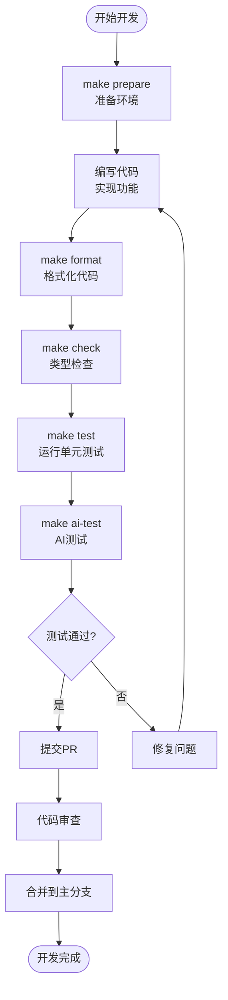
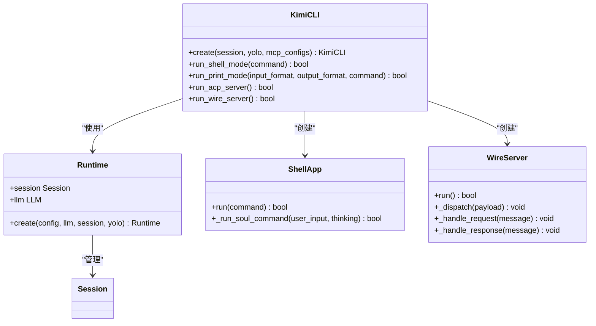

# 贡献流程与规范

<cite>
**本文档中引用的文件**
- [CONTRIBUTING.md](file://CONTRIBUTING.md)
- [Makefile](file://Makefile)
- [pyproject.toml](file://pyproject.toml)
- [pyrightconfig.json](file://pyrightconfig.json)
- [tests/conftest.py](file://tests/conftest.py)
- [src/kimi_cli/app.py](file://src/kimi_cli/app.py)
- [src/kimi_cli/cli.py](file://src/kimi_cli/cli.py)
- [src/kimi_cli/metadata.py](file://src/kimi_cli/metadata.py)
- [README.md](file://README.md)
- [tests_ai/scripts/run.py](file://tests_ai/scripts/run.py)
</cite>

## 目录
1. [项目概述](#项目概述)
2. [贡献指南](#贡献指南)
3. [开发环境准备](#开发环境准备)
4. [代码规范与质量标准](#代码规范与质量标准)
5. [开发工作流程](#开发工作流程)
6. [测试策略](#测试策略)
7. [CI/CD集成](#cicd集成)
8. [异步编程最佳实践](#异步编程最佳实践)
9. [故障排除指南](#故障排除指南)
10. [社区协作规范](#社区协作规范)

## 项目概述

Kimi CLI是一个先进的CLI智能代理，能够帮助用户完成软件开发任务和终端操作。该项目采用现代化的Python架构，支持多种交互模式，包括Shell模式、打印模式、ACP服务器和Wire服务器。

### 技术栈特点
- **Python版本要求**: Python 3.13+
- **核心框架**: Typer用于命令行界面，AsyncIO用于异步编程
- **依赖管理**: 使用uv作为包管理器
- **代码质量工具**: Ruff用于代码格式化和检查，Pyright用于类型检查
- **测试框架**: pytest配合pytest-asyncio进行异步测试

**章节来源**
- [pyproject.toml](file://pyproject.toml#L6-L67)
- [README.md](file://README.md#L1-L162)

## 贡献指南

### 贡献原则

我们欢迎各种形式的贡献，包括但不限于：
- 错误修复
- 功能增强
- 文档改进
- 拼写修正
- 性能优化

### 提交要求

#### 小规模变更
对于100行代码以下的小规模变更，可以直接提交Pull Request。这类变更通常包括：
- 微小的功能修复
- 文档更新
- 代码格式化
- 拼写和语法修正

#### 大规模变更
对于超过100行代码的重大变更，必须遵循以下流程：
1. **预先讨论**: 在GitHub上创建Issue或参与现有Issue讨论
2. **路线图对齐**: 确保变更与项目的发展路线图一致
3. **设计评审**: 可能需要进行设计讨论和方案确认
4. **逐步实施**: 建议分阶段提交相关功能

### 质量标准

我们坚持高标准的代码质量要求：
- 代码质量应达到或超过前沿编码代理的水平
- 变更可能需要修改才能被合并
- 所有贡献都必须经过代码审查

**章节来源**
- [CONTRIBUTING.md](file://CONTRIBUTING.md#L1-L9)

## 开发环境准备

### 环境要求

#### Python环境
- **最低版本**: Python 3.13+
- **推荐版本**: Python 3.13.x
- **包管理器**: uv (推荐) 或 pip

#### 开发工具
- **代码编辑器**: VS Code、PyCharm或其他支持Python的IDE
- **Git**: 版本控制工具
- **Make**: 构建工具（可选）

### 环境设置步骤

#### 1. 克隆仓库
```bash
git clone https://github.com/MoonshotAI/kimi-cli.git
cd kimi-cli
```

#### 2. 准备开发环境
使用提供的Makefile简化环境准备过程：

```bash
make prepare
```

该命令会：
- 安装锁定版本的依赖项
- 同步所有开发依赖
- 配置本地开发环境

#### 3. 验证安装
```bash
uv run kimi --help
```

**章节来源**
- [Makefile](file://Makefile#L8-L11)
- [README.md](file://README.md#L137-L157)

## 代码规范与质量标准

### Python版本约束

项目严格要求使用Python 3.13+，这是由以下依赖决定的：
- `requires-python = ">=3.13"`
- 现代异步特性和类型系统的使用

### 代码风格规范

#### 行长度限制
- **最大行宽**: 100字符
- **自动处理**: 使用Ruff工具自动格式化

#### 类型注解要求
- **强制类型注解**: 所有函数参数和返回值必须有类型注解
- **静态类型检查**: 使用Pyright进行类型验证

#### 导入组织
- **导入排序**: 使用isort规则
- **导入分组**: 标准库、第三方库、本地模块的清晰分组

### 代码质量工具配置

#### Ruff配置
```toml
[tool.ruff]
line-length = 100

[tool.ruff.lint]
select = [
    "E",   # pycodestyle错误
    "F",   # Pyflakes
    "UP",  # pyupgrade
    "B",   # flake8-bugbear
    "SIM", # flake8-simplify
    "I",   # isort
]
```

#### Pyright配置
```json
{
    "typeCheckingMode": "standard",
    "include": [
        "src/**/*.py",
        "tests/**/*.py",
        "tests_ai/scripts/**/*.py"
    ],
    "strict": [
        "src/kimi_cli/prompts",
        "src/kimi_cli/soul",
        "src/kimi_cli/tools",
        "src/kimi_cli/ui/acp",
        "src/kimi_cli/ui/print",
        "src/kimi_cli/ui/shell/visualize.py",
        "src/kimi_cli/ui/wire",
        "src/kimi_cli/utils/*.py",
        "src/kimi_cli/wire",
        "src/kimi_cli/*.py"
    ]
}
```

**章节来源**
- [pyproject.toml](file://pyproject.toml#L49-L67)
- [pyrightconfig.json](file://pyrightconfig.json#L1-L24)

## 开发工作流程

### 标准开发流程

#### 1. 环境准备
```bash
make prepare  # 准备开发环境
```

#### 2. 代码格式化
```bash
make format  # 使用Ruff自动格式化代码
```

#### 3. 类型检查
```bash
make check   # 运行linting和类型检查
```

#### 4. 单元测试
```bash
make test    # 运行pytest测试套件
```

#### 5. AI测试
```bash
make ai-test # 使用Kimi CLI自身进行AI驱动测试
```

### 开发工作流图表



**图表来源**
- [Makefile](file://Makefile#L1-L37)

### Makefile目标详解

#### 主要目标
- **prepare**: 同步依赖项，使用锁定版本
- **format**: 使用Ruff自动格式化Python源代码
- **check**: 运行linting、格式检查和类型检查
- **test**: 使用pytest运行测试套件
- **build**: 使用PyInstaller构建独立可执行文件
- **ai-test**: 使用Kimi CLI自身进行AI驱动测试

#### 辅助目标
- **help**: 显示可用的make目标
- **download-deps**: 下载依赖项（包含在prepare中）

**章节来源**
- [Makefile](file://Makefile#L1-L37)

## 测试策略

### 测试架构

项目采用多层次的测试策略：

#### 1. 单元测试
- **框架**: pytest
- **异步支持**: pytest-asyncio
- **覆盖率**: 覆盖所有工具和核心组件
- **测试文件**: `tests/`目录下的各个测试文件

#### 2. AI驱动测试
- **框架**: 专门的AI测试脚本
- **工具**: 使用Kimi CLI自身进行测试
- **目的**: 验证实际使用场景中的功能

#### 3. 集成测试
- **端到端测试**: 测试完整的用户工作流程
- **工具集成**: 验证各工具间的协作

### 测试配置

#### pytest配置
```python
# conftest.py中的测试夹具
@pytest.fixture
def config() -> Config:
    """创建Config实例"""
    conf = get_default_config()
    conf.services.moonshot_search = MoonshotSearchConfig(
        base_url="https://api.kimi.com/coding/v1/search",
        api_key=SecretStr("test-api-key"),
    )
    return conf

@pytest.fixture
def llm() -> LLM:
    """创建LLM实例"""
    return LLM(
        chat_provider=MockChatProvider([]),
        max_context_size=100_000,
        capabilities=set(),
    )
```

#### AI测试配置
```python
# tests_ai/scripts/run.py中的测试执行
def run_agent(script_dir: Path, tests_dir: Path) -> None:
    cmd = [
        "uv",
        "run",
        "kimi",
        "--yolo",
        "--agent-file",
        str(script_dir / "main.yaml"),
        "-c",
        str(tests_dir),
    ]
    subprocess.run(cmd, check=True)
```

### 测试覆盖率要求

虽然具体覆盖率百分比未明确，但项目强调：
- **全面覆盖**: 所有工具和核心组件都需要测试
- **质量优先**: 代码质量高于覆盖率数字
- **持续改进**: 不断完善测试套件

**章节来源**
- [tests/conftest.py](file://tests/conftest.py#L1-L245)
- [tests_ai/scripts/run.py](file://tests_ai/scripts/run.py#L1-L159)

## CI/CD集成

### 持续集成流程

项目已经集成了GitHub Actions进行持续集成：

#### 检查状态
- **提交活动**: 
- **检查状态**: 

#### CI/CD特性
- **自动化测试**: 每次提交都会运行测试套件
- **类型检查**: 自动进行Pyright类型检查
- **代码格式化**: 验证代码是否符合Ruff规范
- **跨平台支持**: 支持不同操作系统和Python版本

### 质量保证措施

#### 多层质量控制
1. **类型检查**: Pyright静态类型分析
2. **代码风格**: Ruff格式化和检查
3. **测试覆盖率**: 综合测试覆盖报告
4. **文档同步**: 代码和文档保持同步

#### 质量门禁
- **必须通过**: 所有测试必须成功
- **类型安全**: 无类型错误
- **代码规范**: 符合Ruff规则
- **文档完整性**: 代码变更需要相应文档更新

**章节来源**
- [README.md](file://README.md#L1-L10)

## 异步编程最佳实践

### 异步架构设计

项目广泛使用AsyncIO进行异步编程，体现了现代Python的最佳实践。

#### 核心异步组件



**图表来源**
- [src/kimi_cli/app.py](file://src/kimi_cli/app.py#L25-L217)
- [src/kimi_cli/cli.py](file://src/kimi_cli/cli.py#L1-L358)

### 异步编程规范

#### 1. 异步函数定义
- **装饰器使用**: 广泛使用`@pytest.mark.asyncio`标记异步测试
- **类型注解**: 正确标注异步函数的返回类型
- **异常处理**: 使用`try/except`块处理异步异常

#### 2. 信号处理
```python
# 信号处理示例
async def _run_soul_command(self, user_input: str | list[ContentPart], thinking: bool | None = None) -> bool:
    cancel_event = asyncio.Event()
    
    def _handler():
        logger.debug("SIGINT received.")
        cancel_event.set()
    
    loop = asyncio.get_running_loop()
    remove_sigint = install_sigint_handler(loop, _handler)
```

#### 3. 并发控制
- **事件循环**: 正确管理事件循环生命周期
- **资源清理**: 使用上下文管理器确保资源正确释放
- **超时处理**: 为长时间运行的操作设置合理超时

#### 4. 异常传播
- **异常捕获**: 在适当层级捕获和处理异步异常
- **错误恢复**: 实现优雅的错误恢复机制
- **日志记录**: 记录异步操作中的关键事件和错误

### 异步测试最佳实践

#### 测试异步代码
```python
@pytest.mark.asyncio
async def test_async_function():
    # 异步测试代码
    result = await async_function()
    assert result == expected_value
```

#### 异步资源管理
```python
@contextmanager
def tool_call_context(tool_name: str) -> Generator[None]:
    token = current_tool_call.set(
        ToolCall(id="test", function=ToolCall.FunctionBody(name=tool_name, arguments=None))
    )
    try:
        yield
    finally:
        current_tool_call.reset(token)
```

**章节来源**
- [src/kimi_cli/ui/shell/__init__.py](file://src/kimi_cli/ui/shell/__init__.py#L160-L182)
- [tests/conftest.py](file://tests/conftest.py#L131-L145)

## 故障排除指南

### 常见开发问题

#### 1. 环境问题
**问题**: Python版本不兼容
**解决方案**: 确保使用Python 3.13+
```bash
python --version  # 检查Python版本
uv tool install --python 3.13 kimi-cli  # 安装指定版本
```

#### 2. 依赖问题
**问题**: 依赖冲突或缺失
**解决方案**: 重新准备环境
```bash
make prepare  # 重新同步依赖
```

#### 3. 格式化问题
**问题**: Ruff格式化导致代码差异
**解决方案**: 自动修复
```bash
make format  # 自动格式化代码
```

#### 4. 类型检查问题
**问题**: Pyright类型检查失败
**解决方案**: 检查类型注解
```bash
make check  # 查看类型检查结果
```

### 调试技巧

#### 1. 日志调试
- **启用调试**: 使用`--debug`选项
- **日志级别**: 使用`logger.debug()`记录详细信息
- **日志文件**: 查看`~/.local/share/kimi/logs/kimi.log`

#### 2. 测试调试
- **详细输出**: 使用`-vv`参数运行测试
- **单个测试**: 运行特定测试文件
```bash
uv run pytest tests/test_specific.py -vv
```

#### 3. AI测试调试
- **查看报告**: 检查`tests_ai/report.json`文件
- **详细输出**: 使用颜色输出查看测试结果

### 性能优化建议

#### 1. 异步性能
- **避免阻塞**: 确保异步函数不包含阻塞调用
- **并发控制**: 合理使用`asyncio.gather()`进行并发操作
- **资源池**: 对于网络请求等操作，使用连接池

#### 2. 内存管理
- **及时清理**: 使用上下文管理器清理资源
- **对象复用**: 对于频繁创建的对象，考虑复用
- **垃圾回收**: 在必要时手动触发垃圾回收

**章节来源**
- [src/kimi_cli/utils/logging.py](file://src/kimi_cli/utils/logging.py)
- [tests_ai/scripts/run.py](file://tests_ai/scripts/run.py#L120-L159)

## 社区协作规范

### 沟通渠道

#### GitHub Issues
- **Bug报告**: 详细的错误描述和重现步骤
- **功能请求**: 清晰的需求描述和使用场景
- **讨论**: 技术方案讨论和设计评审

#### Pull Request流程
1. **创建分支**: 基于最新主分支创建功能分支
2. **提交更改**: 遵循代码规范和测试要求
3. **创建PR**: 提供详细的变更说明
4. **代码审查**: 响应及时的反馈和讨论
5. **合并**: 通过审查后合并到主分支

### 文档贡献

#### 文档类型
- **API文档**: 详细的函数和类文档
- **使用指南**: 用户教程和最佳实践
- **架构文档**: 系统设计和组件说明

#### 文档维护
- **及时更新**: 代码变更时同步更新文档
- **示例代码**: 提供可运行的示例
- **语言规范**: 使用准确的技术术语

### 社区价值观

#### 包容性
- **尊重差异**: 尊重不同的观点和背景
- **建设性反馈**: 提供建设性的意见和建议
- **学习氛围**: 鼓励知识分享和技能提升

#### 质量导向
- **高标准**: 追求卓越的代码质量和用户体验
- **持续改进**: 不断优化和改进项目
- **用户中心**: 以用户需求为导向进行开发

**章节来源**
- [CONTRIBUTING.md](file://CONTRIBUTING.md#L1-L9)
- [README.md](file://README.md#L159-L162)