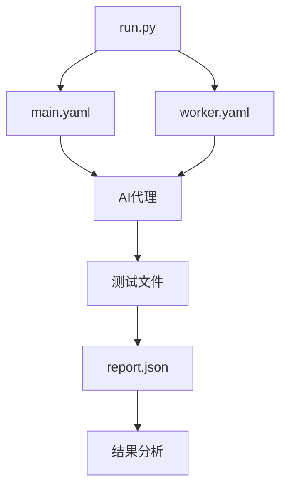

# AI测试

<cite>
**本文档中引用的文件**
- [test_cli_loading_time.md](file://tests_ai/test_cli_loading_time.md)
- [test_encoding_error_handling.md](file://tests_ai/test_encoding_error_handling.md)
- [test_utf8_encoding.md](file://tests_ai/test_utf8_encoding.md)
- [run.py](file://tests_ai/scripts/run.py)
- [main.yaml](file://tests_ai/scripts/main.yaml)
- [worker.yaml](file://tests_ai/scripts/worker.yaml)
- [cli.py](file://src/kimi_cli/cli.py)
- [app.py](file://src/kimi_cli/app.py)
- [__init__.py](file://src/kimi_cli/__init__.py)
- [read.py](file://src/kimi_cli/tools/file/read.py)
- [write.py](file://src/kimi_cli/tools/file/write.py)
- [__init__.py](file://src/kimi_cli/tools/bash/__init__.py)
</cite>

## 目录
1. [引言](#引言)
2. [AI测试套件概述](#ai测试套件概述)
3. [核心AI测试用例](#核心ai测试用例)
4. [自动化测试架构](#自动化测试架构)
5. [测试执行流程](#测试执行流程)
6. [结果分析与验证](#结果分析与验证)
7. [结论](#结论)

## 引言
本文档详细阐述了`tests_ai/`目录下针对AI代理行为和边缘场景的测试方法。这些测试专门设计用于评估CLI启动性能、编码错误处理鲁棒性以及UTF-8文本处理能力，确保AI代理在复杂输入、非标准字符集和长时间运行任务下的稳定性和可靠性。

## AI测试套件概述
AI测试套件是一组专门针对AI代理行为和边缘场景的测试，与传统单元测试不同，它更侧重于评估系统在真实用户交互中的表现。测试套件位于`tests_ai/`目录下，包含多个测试文件和自动化脚本，共同确保AI驱动功能的质量。

**Section sources**
- [test_cli_loading_time.md](file://tests_ai/test_cli_loading_time.md)
- [test_encoding_error_handling.md](file://tests_ai/test_encoding_error_handling.md)
- [test_utf8_encoding.md](file://tests_ai/test_utf8_encoding.md)

## 核心AI测试用例

### CLI启动性能测试
该测试评估CLI工具的启动时间，确保在各种条件下都能快速响应用户请求。

**Scope**
`src/kimi_cli/__init__.py`

**Requirements**
`src/kimi_cli/__init__.py`文件必须为空，不包含任何代码或导入。

**Scope**
`src/kimi_cli/cli.py`

**Requirements**
`src/kimi_cli/cli.py`文件在顶层不能导入任何来自`kimi_cli`或`kosong`的模块，除了`kimi_cli.constant`。

**Scope**
`src/kimi_cli/app.py`

**Requirements**
`src/kimi_cli/app.py`文件在顶层不能导入任何以`kimi_cli.ui`为前缀的模块；相反，UI特定的模块应在函数内按需导入。

**Scope**
无特定源文件

**Requirements**
运行`uv run kimi --help`的时间必须在5次运行的平均值中小于150毫秒，经过3次预热运行后。

**Section sources**
- [test_cli_loading_time.md](file://tests_ai/test_cli_loading_time.md)
- [cli.py](file://src/kimi_cli/cli.py)
- [app.py](file://src/kimi_cli/app.py)
- [__init__.py](file://src/kimi_cli/__init__.py)

### 编码错误处理鲁棒性测试
该测试确保AI代理在处理用户提供的内容时能够正确处理解码错误，避免因格式错误的UTF-8序列导致运行时崩溃。

**Scope**
`src/kimi_cli/tools/`目录下的所有Python文件，除了`load_desc`函数。

**Requirements**
在解码用户提供的内容时，例如读取文件、解码子进程输出等，必须指定`errors="replace"`以避免因格式错误的UTF-8序列导致运行时崩溃。

**Section sources**
- [test_encoding_error_handling.md](file://tests_ai/test_encoding_error_handling.md)
- [read.py](file://src/kimi_cli/tools/file/read.py)
- [__init__.py](file://src/kimi_cli/tools/bash/__init__.py)

### UTF-8文本处理能力测试
该测试验证AI代理在处理文件读写和文本编码解码时是否显式指定了UTF-8编码，确保跨平台和跨系统的兼容性。

**Scope**
`src/kimi_cli/`目录下的所有Python文件。

**Requirements**
在读写文件、编码或解码文本时，必须显式指定`encoding="utf-8"`。

**Section sources**
- [test_utf8_encoding.md](file://tests_ai/test_utf8_encoding.md)
- [read.py](file://src/kimi_cli/tools/file/read.py)
- [write.py](file://src/kimi_cli/tools/file/write.py)

## 自动化测试架构
自动化测试脚本和YAML配置文件协同工作，模拟真实用户交互，确保AI代理在各种场景下的稳定性和可靠性。

**Diagram sources**
- [run.py](file://tests_ai/scripts/run.py)
- [main.yaml](file://tests_ai/scripts/main.yaml)
- [worker.yaml](file://tests_ai/scripts/worker.yaml)

**Section sources**
- [run.py](file://tests_ai/scripts/run.py)
- [main.yaml](file://tests_ai/scripts/main.yaml)
- [worker.yaml](file://tests_ai/scripts/worker.yaml)

## 测试执行流程
测试执行流程包括启动AI代理、执行测试用例、收集结果和生成报告。自动化脚本`run.py`负责协调整个过程，确保测试的高效和准确。

**Section sources**
- [run.py](file://tests_ai/scripts/run.py)

## 结果分析与验证
测试结果以JSON格式存储在`report.json`文件中，包含每个测试用例的通过或失败状态。通过分析这些结果，可以识别和修复潜在的问题，确保AI代理的高质量。

**Section sources**
- [run.py](file://tests_ai/scripts/run.py)

## 结论
AI测试套件通过评估CLI启动性能、编码错误处理鲁棒性和UTF-8文本处理能力，确保AI代理在复杂输入、非标准字符集和长时间运行任务下的稳定性和可靠性。自动化测试脚本和YAML配置文件的协同工作，使得测试过程高效且准确，为提升AI驱动功能的质量提供了重要保障。