# 单元测试

<cite>
**本文档中引用的文件**   
- [conftest.py](file://tests/conftest.py)
- [test_config.py](file://tests/test_config.py)
- [test_session.py](file://tests/test_session.py)
- [test_read_file.py](file://tests/test_read_file.py)
- [test_write_file.py](file://tests/test_write_file.py)
- [test_bash.py](file://tests/test_bash.py)
- [Makefile](file://Makefile)
- [pyproject.toml](file://pyproject.toml)
</cite>

## 目录
1. [简介](#简介)
2. [测试结构与组织](#测试结构与组织)
3. [核心测试组件分析](#核心测试组件分析)
4. [关键模块测试用例设计](#关键模块测试用例设计)
5. [异步测试与模拟](#异步测试与模拟)
6. [测试运行与CI集成](#测试运行与ci集成)
7. [测试最佳实践](#测试最佳实践)

## 简介
本单元测试文档详细介绍了kimi-cli项目的基于pytest的测试框架实现。文档涵盖了`tests/`目录下的测试结构，包括`conftest.py`中的共享fixture配置和测试初始化逻辑。重点分析了关键模块的测试用例设计，如配置加载、会话管理、文件操作工具和Shell命令执行。文档还提供了使用`pytest-asyncio`处理异步代码的最佳实践，展示了如何模拟LLM响应和工具调用，并包含了运行测试套件、生成覆盖率报告和CI集成的方法。

## 测试结构与组织

kimi-cli项目的测试结构遵循清晰的组织原则，所有测试文件都位于`tests/`目录下。测试文件命名采用`test_*.py`模式，与被测试的源代码模块相对应。项目使用pytest作为测试框架，通过`pyproject.toml`文件中的配置定义了测试依赖，包括`pytest`和`pytest-asyncio`。

```mermaid
graph TD
tests[tests/]
--> conftest[conftest.py]
--> test_config[test_config.py]
--> test_session[test_session.py]
--> test_read_file[test_read_file.py]
--> test_write_file[test_write_file.py]
--> test_bash[test_bash.py]
--> test_glob[test_glob.py]
--> test_grep[test_grep.py]
--> test_patch[test_patch_file.py]
--> test_str_replace[test_str_replace_file.py]
--> test_fetch_url[test_fetch_url.py]
--> test_search[test_web/search.py]
--> test_task[test_task_subagents.py]
--> test_tool_schemas[test_tool_schemas.py]
--> test_tool_descriptions[test_tool_descriptions.py]
--> test_metacmd[test_metacmd.py]
--> test_changelog[test_changelog.py]
--> test_pyinstaller[test_pyinstaller_utils.py]
--> test_file_completer[test_file_completer.py]
--> test_result_builder[test_result_builder.py]
--> test_message_utils[test_message_utils.py]
--> test_load_agent[test_load_agent.py]
--> test_load_agents_md[test_load_agents_md.py]
--> test_default_agent[test_default_agent.py]
--> test_agent_spec[test_agent_spec.py]
--> test_soul_message[test_soul_message.py]
--> test_utils_path[test_utils_path.py]
--> test_wire_message[test_wire_message.py]
```

**Diagram sources**
- [tests/conftest.py](file://tests/conftest.py)
- [tests/test_config.py](file://tests/test_config.py)
- [tests/test_session.py](file://tests/test_session.py)
- [tests/test_read_file.py](file://tests/test_read_file.py)
- [tests/test_write_file.py](file://tests/test_write_file.py)
- [tests/test_bash.py](file://tests/test_bash.py)

**Section sources**
- [tests/conftest.py](file://tests/conftest.py)
- [pyproject.toml](file://pyproject.toml)

## 核心测试组件分析

### conftest.py中的共享fixture
`conftest.py`文件是pytest测试配置的核心，定义了多个共享的fixture，用于在测试之间提供一致的测试环境和依赖注入。

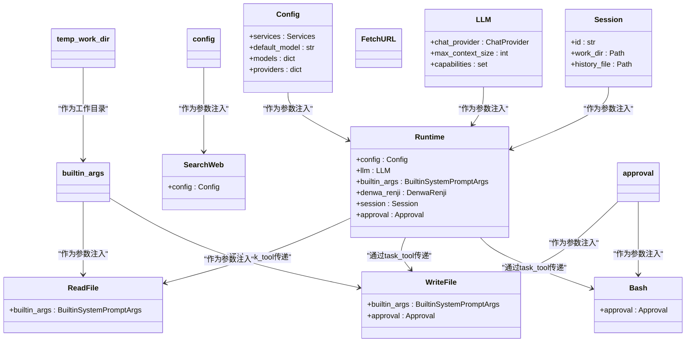

**Diagram sources**
- [tests/conftest.py](file://tests/conftest.py#L37-L245)

**Section sources**
- [tests/conftest.py](file://tests/conftest.py#L1-L245)

### 测试初始化与依赖注入
`conftest.py`中的fixture实现了复杂的依赖注入链，确保每个测试都能获得正确配置的测试对象。例如，`runtime` fixture依赖于`config`、`llm`、`session`等多个其他fixture，构建了一个完整的运行时环境。

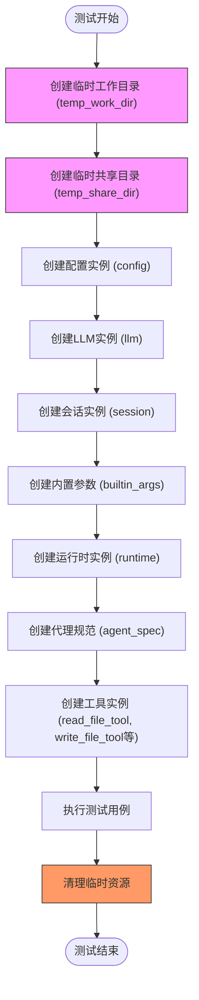

**Diagram sources**
- [tests/conftest.py](file://tests/conftest.py#L59-L123)

**Section sources**
- [tests/conftest.py](file://tests/conftest.py#L37-L123)

## 关键模块测试用例设计

### 配置加载测试
`test_config.py`文件中的测试用例验证了默认配置的正确性，确保配置对象的结构和默认值符合预期。

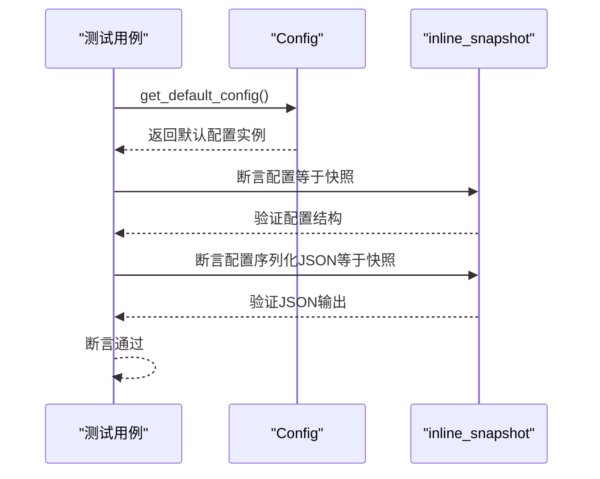

**Diagram sources**
- [tests/test_config.py](file://tests/test_config.py#L12-L40)

**Section sources**
- [tests/test_config.py](file://tests/test_config.py#L1-L40)

### 会话管理测试
`test_session.py`文件中的测试用例专注于会话管理功能，特别是共享目录的隔离和元数据操作。

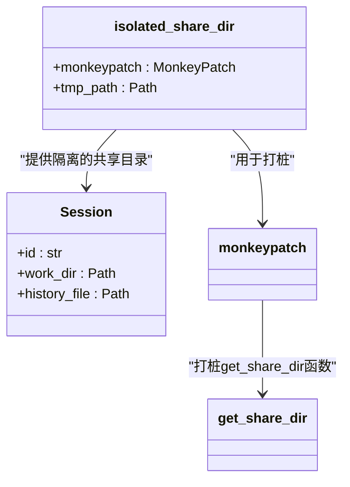

**Diagram sources**
- [tests/test_session.py](file://tests/test_session.py#L8-L22)

**Section sources**
- [tests/test_session.py](file://tests/test_session.py#L1-L22)

### 文件读取工具测试
`test_read_file.py`文件中的测试用例全面覆盖了文件读取工具的各种使用场景和边界条件。

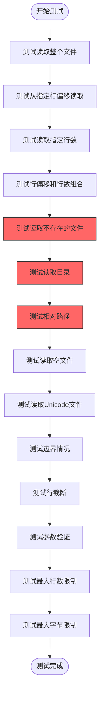

**Diagram sources**
- [tests/test_read_file.py](file://tests/test_read_file.py#L28-L315)

**Section sources**
- [tests/test_read_file.py](file://tests/test_read_file.py#L1-L315)

### 文件写入工具测试
`test_write_file.py`文件中的测试用例验证了文件写入工具的各种模式和错误处理。

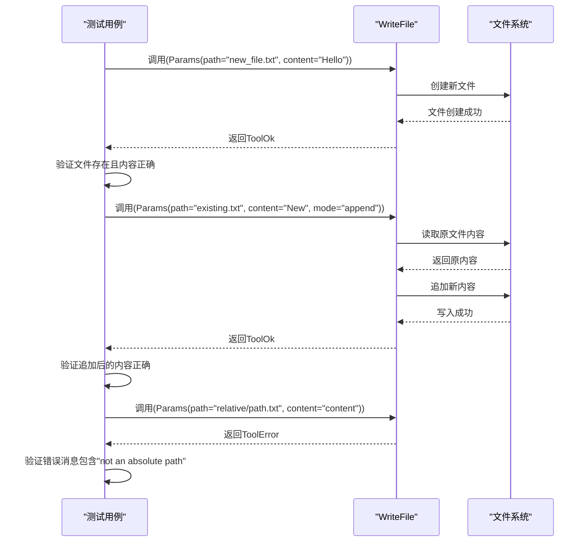

**Diagram sources**
- [tests/test_write_file.py](file://tests/test_write_file.py#L15-L162)

**Section sources**
- [tests/test_write_file.py](file://tests/test_write_file.py#L1-L162)

### Shell命令执行测试
`test_bash.py`文件中的测试用例验证了Shell命令执行工具的各种功能和错误处理。

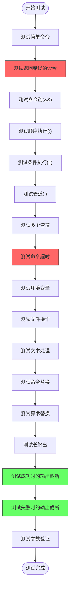

**Diagram sources**
- [tests/test_bash.py](file://tests/test_bash.py#L21-L221)

**Section sources**
- [tests/test_bash.py](file://tests/test_bash.py#L1-L221)

## 异步测试与模拟

### pytest-asyncio最佳实践
kimi-cli项目中的测试大量使用`pytest-asyncio`来处理异步代码。所有异步测试用例都使用`@pytest.mark.asyncio`装饰器，确保测试函数在异步事件循环中执行。

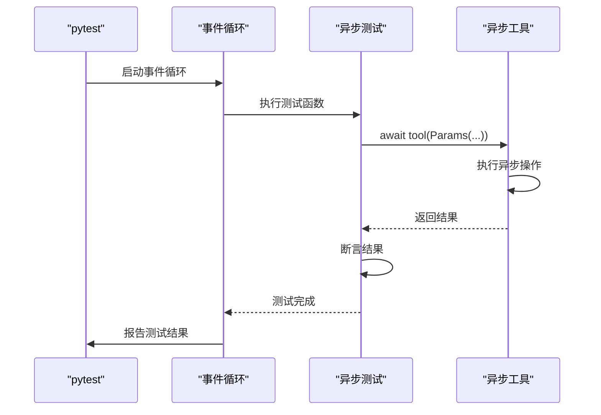

**Diagram sources**
- [tests/test_read_file.py](file://tests/test_read_file.py#L27-L315)
- [tests/test_write_file.py](file://tests/test_write_file.py#L14-L162)
- [tests/test_bash.py](file://tests/test_bash.py#L20-L221)

**Section sources**
- [tests/test_read_file.py](file://tests/test_read_file.py#L27-L315)
- [tests/test_write_file.py](file://tests/test_write_file.py#L14-L162)
- [tests/test_bash.py](file://tests/test_bash.py#L20-L221)

### 模拟LLM响应
项目使用`kosong.chat_provider.mock.MockChatProvider`来模拟LLM响应，避免在测试中调用真实的LLM服务。

```mermaid
classDiagram
class MockChatProvider {
+responses : list
+__call__(messages : list) Response
}
class LLM {
+chat_provider : ChatProvider
}
class Runtime {
+llm : LLM
}
MockChatProvider --> LLM : "作为chat_provider注入"
LLM --> Runtime : "作为依赖注入"
note right of MockChatProvider
在conftest.py中配置为返回
预定义的响应列表，用于
测试不同场景
end note
```

**Diagram sources**
- [tests/conftest.py](file://tests/conftest.py#L51-L55)

**Section sources**
- [tests/conftest.py](file://tests/conftest.py#L48-L56)

## 测试运行与CI集成

### 测试套件运行
项目通过Makefile中的`test`目标来运行测试套件，使用`uv run pytest`命令执行所有测试。

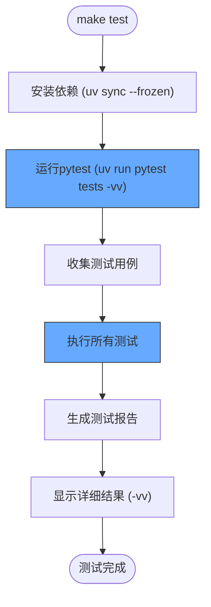

**Diagram sources**
- [Makefile](file://Makefile#L24-L27)

**Section sources**
- [Makefile](file://Makefile#L24-L27)

### CI集成
项目通过`pyproject.toml`文件定义了测试依赖，并通过Makefile提供了标准化的测试运行接口，便于在CI/CD环境中集成。

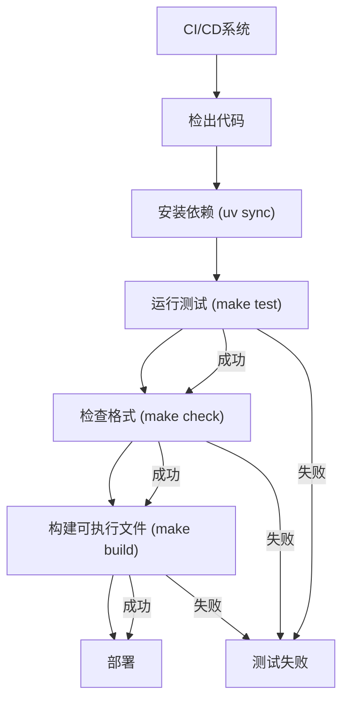

**Diagram sources**
- [Makefile](file://Makefile)
- [pyproject.toml](file://pyproject.toml)

**Section sources**
- [Makefile](file://Makefile#L1-L37)
- [pyproject.toml](file://pyproject.toml#L1-L67)

## 测试最佳实践

### 测试设计原则
kimi-cli项目的测试设计遵循了多项最佳实践，确保测试的可维护性和高覆盖率。

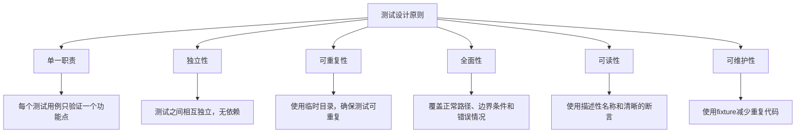

**Section sources**
- [tests/conftest.py](file://tests/conftest.py)
- [tests/test_read_file.py](file://tests/test_read_file.py)
- [tests/test_write_file.py](file://tests/test_write_file.py)
- [tests/test_bash.py](file://tests/test_bash.py)

### 测试覆盖率
项目通过全面的测试用例确保了核心功能的高覆盖率，特别是在文件操作和Shell命令执行等关键模块。

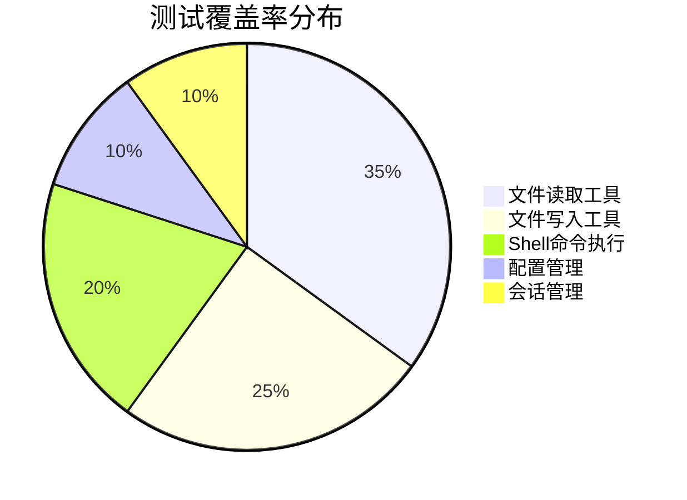

**Section sources**
- [tests/test_read_file.py](file://tests/test_read_file.py)
- [tests/test_write_file.py](file://tests/test_write_file.py)
- [tests/test_bash.py](file://tests/test_bash.py)
- [tests/test_config.py](file://tests/test_config.py)
- [tests/test_session.py](file://tests/test_session.py)