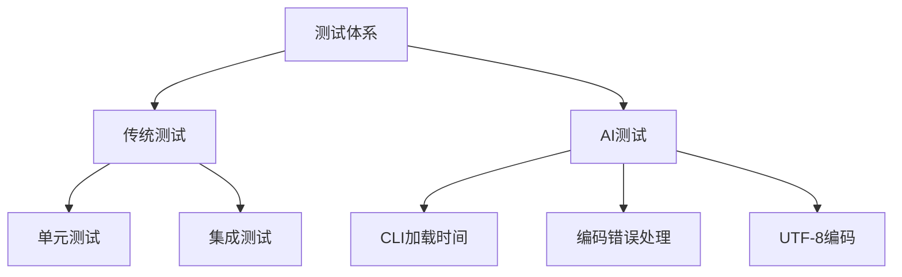
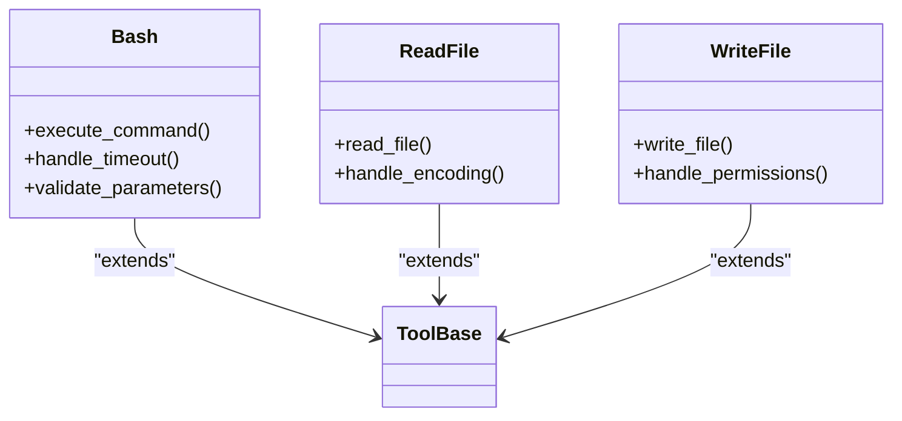
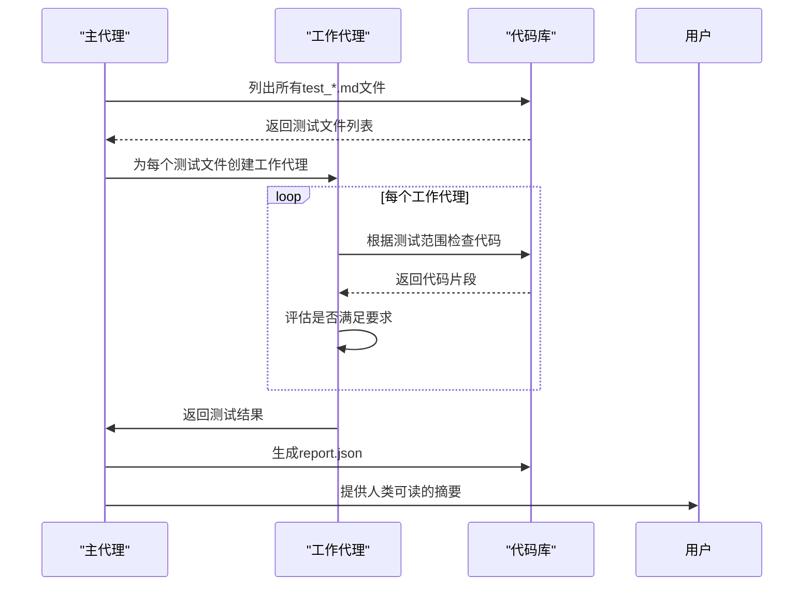

# 测试策略

<cite>
**本文档引用的文件**
- [Makefile](file://Makefile)
- [pyproject.toml](file://pyproject.toml)
- [conftest.py](file://tests/conftest.py)
- [test_config.py](file://tests/test_config.py)
- [test_session.py](file://tests/test_session.py)
- [test_bash.py](file://tests/test_bash.py)
- [test_utils_path.py](file://tests/test_utils_path.py)
- [run.py](file://tests_ai/scripts/run.py)
- [main.yaml](file://tests_ai/scripts/main.yaml)
- [worker.yaml](file://tests_ai/scripts/worker.yaml)
- [test_cli_loading_time.md](file://tests_ai/test_cli_loading_time.md)
- [test_encoding_error_handling.md](file://tests_ai/test_encoding_error_handling.md)
- [test_utf8_encoding.md](file://tests_ai/test_utf8_encoding.md)
</cite>

## 目录
1. [简介](#简介)
2. [项目测试体系](#项目测试体系)
3. [单元测试与集成测试](#单元测试与集成测试)
4. [AI测试体系](#ai测试体系)
5. [测试执行与覆盖率](#测试执行与覆盖率)
6. [编写新测试的最佳实践](#编写新测试的最佳实践)
7. [测试在AI代理可靠性中的作用](#测试在ai代理可靠性中的作用)

## 简介
本文档全面阐述了kimi-cli项目的测试策略，涵盖基于pytest的传统测试体系和基于AI驱动的高级测试方法。文档详细描述了测试目录结构、关键模块的测试用例、AI测试的目的和方法，以及如何运行测试套件和生成覆盖率报告。通过建立全面的测试策略，确保AI代理在各种场景下的可靠性和安全性。

## 项目测试体系
kimi-cli项目采用双层测试体系，包括传统的单元测试/集成测试（位于`tests/`目录）和创新的AI驱动测试（位于`tests_ai/`目录）。这种双重体系确保了代码质量和系统行为的全面验证。



**Diagram sources**
- [Makefile](file://Makefile#L24-L34)
- [pyproject.toml](file://pyproject.toml#L33-L35)

**Section sources**
- [Makefile](file://Makefile#L24-L34)
- [pyproject.toml](file://pyproject.toml#L33-L35)

## 单元测试与集成测试
项目使用pytest框架进行单元测试和集成测试，测试用例覆盖了核心模块如工具、配置和会话等关键功能。

### 测试覆盖率目标
虽然项目中未明确指定测试覆盖率目标，但通过全面的测试用例设计，确保了核心功能的高覆盖率。测试用例设计遵循以下原则：
- 每个核心模块都有对应的测试文件
- 关键功能路径都有正向和负向测试用例
- 边界条件和异常情况得到充分测试

### 关键模块测试用例
#### 配置模块测试
配置模块的测试确保了默认配置的正确性和序列化的一致性。

**Section sources**
- [test_config.py](file://tests/test_config.py#L12-L40)

#### 会话模块测试
会话模块的测试关注于会话状态的隔离和持久化。

**Section sources**
- [test_session.py](file://tests/test_session.py#L8-L22)

#### 工具模块测试
工具模块的测试覆盖了各种工具的功能和边界条件。



**Diagram sources**
- [test_bash.py](file://tests/test_bash.py#L20-L221)
- [test_read_file.py](file://tests/test_read_file.py)
- [test_write_file.py](file://tests/test_write_file.py)

## AI测试体系
AI测试体系通过kimi-cli自身的AI能力来审计代码库，确保代码质量和一致性。

### AI测试目的
AI测试的主要目的是验证代码库中的关键约束和最佳实践，包括：
- CLI加载时间性能
- 编码错误处理
- UTF-8编码一致性

### AI测试方法
AI测试通过一个主代理和多个工作代理协同工作来完成审计任务。



**Diagram sources**
- [main.yaml](file://tests_ai/scripts/main.yaml#L1-L49)
- [worker.yaml](file://tests_ai/scripts/worker.yaml#L1-L32)
- [run.py](file://tests_ai/scripts/run.py#L37-L49)

### 具体AI测试内容
#### CLI加载时间测试
确保CLI的快速启动性能，特别是`--help`命令的响应时间。

**Section sources**
- [test_cli_loading_time.md](file://tests_ai/test_cli_loading_time.md#L1-L57)

#### 编码错误处理测试
确保在处理用户提供的内容时正确处理编码错误。

**Section sources**
- [test_encoding_error_handling.md](file://tests_ai/test_encoding_error_handling.md#L1-L21)

#### UTF-8编码测试
确保所有文件读写操作都显式指定UTF-8编码。

**Section sources**
- [test_utf8_encoding.md](file://tests_ai/test_utf8_encoding.md#L1-L22)

## 测试执行与覆盖率
### 如何运行测试套件
通过Makefile中的`make test`命令可以运行完整的测试套件。

```makefile
test: ## Run the test suite with pytest.
	uv run pytest tests -vv
```

对于AI测试，使用`make ai-test`命令。

```makefile
ai-test: ## Run the test suite with Kimi CLI.
	uv run tests_ai/scripts/run.py tests_ai
```

**Section sources**
- [Makefile](file://Makefile#L24-L34)

### 覆盖率报告生成
虽然项目中未直接显示覆盖率报告生成命令，但可以通过pytest-cov插件生成覆盖率报告。建议的命令如下：
```bash
uv run pytest tests --cov=src/kimi_cli --cov-report=html
```

## 编写新测试的最佳实践
### 使用pytest-asyncio处理异步代码
对于异步代码的测试，应使用`@pytest.mark.asyncio`装饰器。

```python
@pytest.mark.asyncio
async def test_async_function():
    result = await async_function()
    assert result == expected
```

**Section sources**
- [test_bash.py](file://tests/test_bash.py#L20-L221)
- [test_utils_path.py](file://tests/test_utils_path.py#L13-L238)

### 测试组织原则
- 每个模块对应一个测试文件
- 使用fixture提供测试依赖
- 保持测试的独立性和可重复性

## 测试在AI代理可靠性中的作用
全面的测试策略对于确保AI代理的可靠性和安全性至关重要。通过传统测试和AI测试的结合，可以：
- 验证核心功能的正确性
- 确保性能指标的达标
- 维护代码质量的一致性
- 预防潜在的安全风险

**Section sources**
- [conftest.py](file://tests/conftest.py#L1-L245)
- [pyproject.toml](file://pyproject.toml#L33-L35)