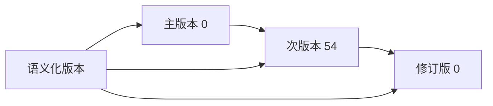
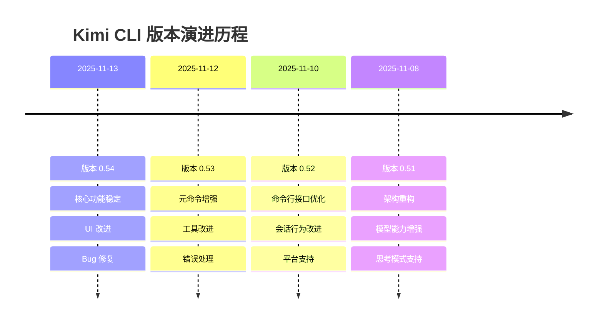
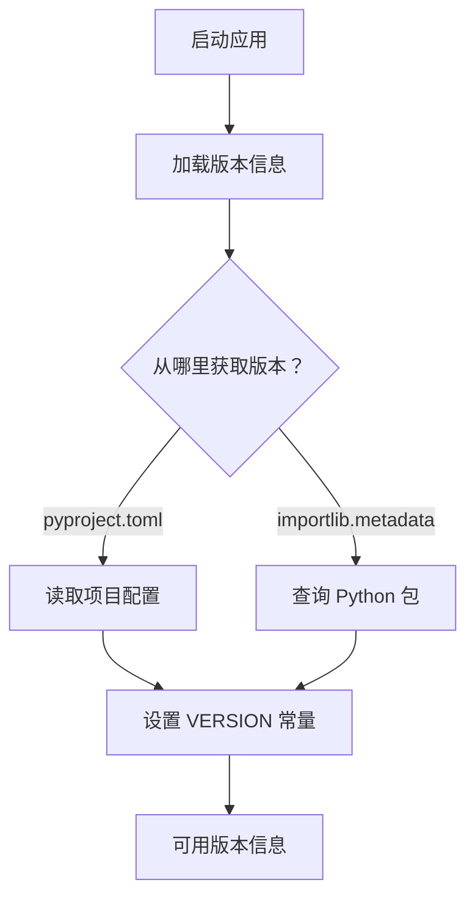
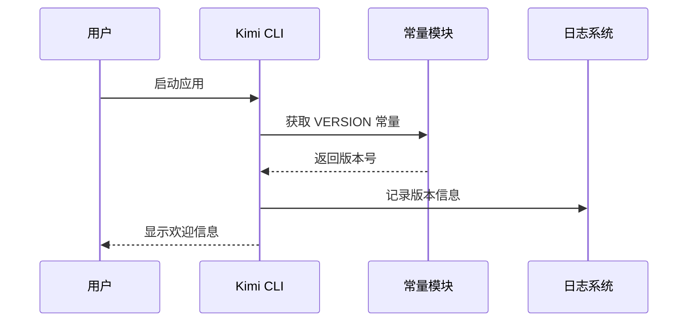
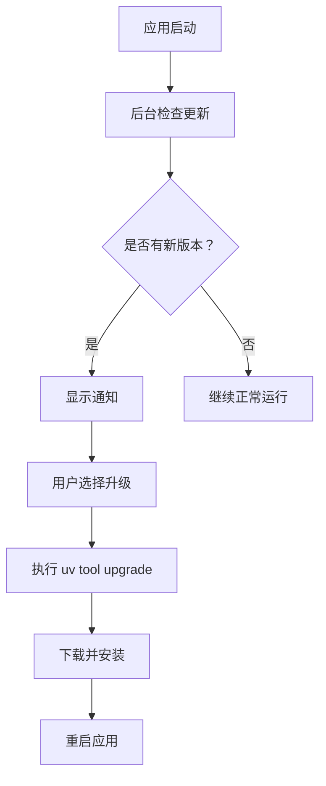
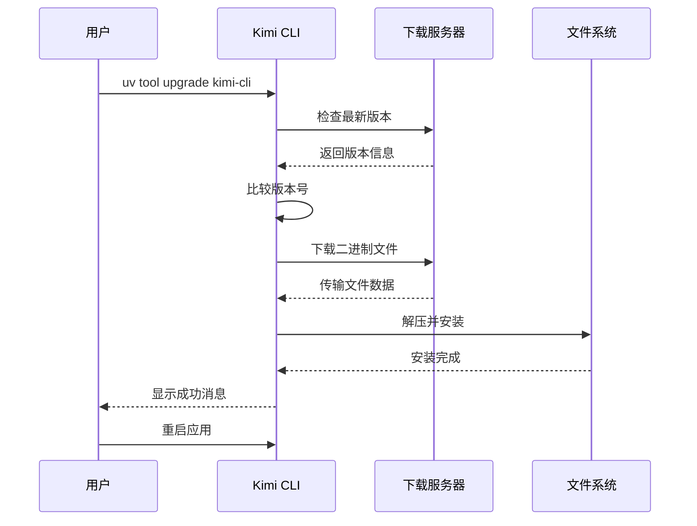
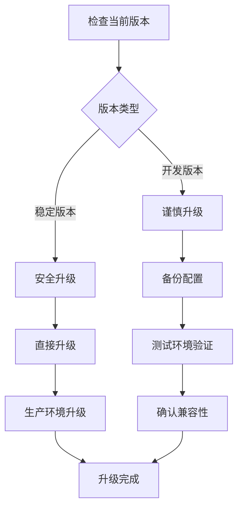
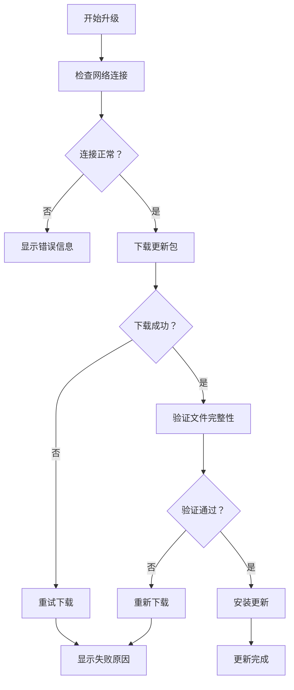

# 版本管理

<cite>
**本文档中引用的文件**
- [CHANGELOG.md](file://CHANGELOG.md)
- [pyproject.toml](file://pyproject.toml)
- [src/kimi_cli/constant.py](file://src/kimi_cli/constant.py)
- [src/kimi_cli/cli.py](file://src/kimi_cli/cli.py)
- [src/kimi_cli/metadata.py](file://src/kimi_cli/metadata.py)
- [src/kimi_cli/ui/shell/update.py](file://src/kimi_cli/ui/shell/update.py)
- [src/kimi_cli/ui/shell/metacmd.py](file://src/kimi_cli/ui/shell/metacmd.py)
- [src/kimi_cli/utils/changelog.py](file://src/kimi_cli/utils/changelog.py)
</cite>

## 目录
1. [简介](#简介)
2. [版本号语义化](#版本号语义化)
3. [版本历史概览](#版本历史概览)
4. [版本管理工具](#版本管理工具)
5. [查看当前版本](#查看当前版本)
6. [升级到最新版本](#升级到最新版本)
7. [版本兼容性](#版本兼容性)
8. [升级注意事项](#升级注意事项)
9. [故障排除](#故障排除)
10. [总结](#总结)

## 简介

Kimi CLI 是一个基于 AI 的命令行代理工具，采用严格的版本管理策略来确保用户体验的一致性和稳定性。本文档详细介绍了项目的版本管理机制，包括版本号的语义化含义、版本历史演进、升级流程以及兼容性信息。

项目使用语义化版本控制（Semantic Versioning），遵循 `主版本号.次版本号.修订号` 的格式，并通过 CHANGELOG.md 文件系统化地记录每个版本的变更历史。

## 版本号语义化

### 语义化版本规范

Kimi CLI 严格遵循语义化版本控制规范（SemVer），版本号格式为：`主版本号.次版本号.修订号`

- **主版本号（Major）**：不兼容的 API 变更
- **次版本号（Minor）**：向后兼容的功能性新增
- **修订号（Patch）**：向后兼容的问题修正

### 当前版本信息

根据项目配置，当前版本为：
- **版本号**：0.54
- **发布日期**：2025-11-13
- **语义化含义**：这是一个稳定的发布版本，包含新的功能增强和问题修复



**图表来源**
- [pyproject.toml](file://pyproject.toml#L3)
- [src/kimi_cli/constant.py](file://src/kimi_cli/constant.py#L5)

**章节来源**
- [pyproject.toml](file://pyproject.toml#L3)
- [src/kimi_cli/constant.py](file://src/kimi_cli/constant.py#L5)

## 版本历史概览

### 最新版本（0.54）

#### 主要变更
- **Lib**：将 `WireMessage` 从 `kimi_cli.wire.message` 移动到 `kimi_cli.wire`
- **Print**：修复 `stream-json` 输出格式缺少最后一个助手消息的问题
- **UI**：添加 API 密钥被 `KIMI_API_KEY` 环境变量覆盖时的警告
- **UI**：添加审批请求时的铃声提示
- **Core**：修复 Windows 上的上下文压缩和清除问题

### 近期版本演进



**图表来源**
- [CHANGELOG.md](file://CHANGELOG.md#L12-L18)
- [CHANGELOG.md](file://CHANGELOG.md#L20-L28)
- [CHANGELOG.md](file://CHANGELOG.md#L30-L38)
- [CHANGELOG.md](file://CHANGELOG.md#L40-L52)

### 版本变更分类

| 类别 | 描述 | 示例 |
|------|------|------|
| **新增功能** | 引入新特性或工具 | 思考模式支持、MCP 工具集成 |
| **改进** | 现有功能优化 | UI 界面改善、性能提升 |
| **修复** | Bug 修复和错误处理 | 平台兼容性、稳定性改进 |
| **架构** | 内部结构重构 | 模块化改进、API 设计 |

**章节来源**
- [CHANGELOG.md](file://CHANGELOG.md#L12-L488)

## 版本管理工具

### 内置版本命令

Kimi CLI 提供了专门的元命令来管理版本信息：

#### `/version` 命令
显示当前安装的 Kimi CLI 版本信息。

```bash
/version
```

输出示例：
```
kimi, version 0.54
```

#### `/release-notes` 命令
显示详细的版本发布说明，包括所有版本的历史变更。

```bash
/release-notes
```

该命令会以分页方式显示完整的发布说明，支持样式渲染。

### 版本检测机制

系统通过以下方式确定当前版本：



**图表来源**
- [src/kimi_cli/constant.py](file://src/kimi_cli/constant.py#L5)
- [pyproject.toml](file://pyproject.toml#L3)

**章节来源**
- [src/kimi_cli/ui/shell/metacmd.py](file://src/kimi_cli/ui/shell/metacmd.py#L178-L183)
- [src/kimi_cli/ui/shell/metacmd.py](file://src/kimi_cli/ui/shell/metacmd.py#L186-L191)

## 查看当前版本

### 方法一：使用内置命令

在 Kimi CLI 交互界面中运行以下命令：

```bash
/version
```

这将立即显示当前安装的版本号。

### 方法二：命令行参数

使用命令行参数查看版本：

```bash
kimi --version
# 或
kimi -V
```

### 方法三：程序内部检查

系统会在启动时自动检查版本信息，并在日志中记录：



**图表来源**
- [src/kimi_cli/cli.py](file://src/kimi_cli/cli.py#L32-L35)
- [src/kimi_cli/constant.py](file://src/kimi_cli/constant.py#L5)

**章节来源**
- [src/kimi_cli/cli.py](file://src/kimi_cli/cli.py#L32-L35)
- [src/kimi_cli/ui/shell/metacmd.py](file://src/kimi_cli/ui/shell/metacmd.py#L178-L183)

## 升级到最新版本

### 使用 uv 工具升级

Kimi CLI 推荐使用 `uv` 包管理器进行升级：

```bash
uv tool upgrade kimi-cli
```

### 自动更新机制

系统提供自动更新检查功能：



**图表来源**
- [src/kimi_cli/ui/shell/update.py](file://src/kimi_cli/ui/shell/update.py#L81-L84)
- [src/kimi_cli/ui/shell/__init__.py](file://src/kimi_cli/ui/shell/__init__.py#L231-L243)

### 手动检查更新

使用内置命令检查更新：

```bash
/update
```

或者仅检查是否有可用更新：

```bash
/check-update
```

### 更新流程详解



**图表来源**
- [src/kimi_cli/ui/shell/update.py](file://src/kimi_cli/ui/shell/update.py#L89-L200)

### 支持的平台

系统自动检测目标平台并下载相应的二进制文件：

| 平台 | 架构 | 文件名格式 |
|------|------|------------|
| macOS | x86_64 | `kimi-版本号-x86_64-apple-darwin.tar.gz` |
| macOS | ARM64 | `kimi-版本号-aarch64-apple-darwin.tar.gz` |
| Linux | x86_64 | `kimi-版本号-x86_64-unknown-linux-gnu.tar.gz` |
| Linux | ARM64 | `kimi-版本号-aarch64-unknown-linux-gnu.tar.gz` |

**章节来源**
- [src/kimi_cli/ui/shell/update.py](file://src/kimi_cli/ui/shell/update.py#L50-L67)
- [src/kimi_cli/ui/shell/update.py](file://src/kimi_cli/ui/shell/update.py#L136-L137)

## 版本兼容性

### 向后兼容性

Kimi CLI 在版本升级时保持良好的向后兼容性：

#### 配置文件兼容性
- 旧版本的配置文件在新版本中仍然有效
- 新增的配置选项具有合理的默认值
- 废弃的配置项会被自动忽略

#### 命令行接口兼容性
- 保留了对旧版命令行参数的支持
- 新增的参数不会破坏现有工作流
- 重要的废弃功能会提前通知

### 版本迁移指南



### 兼容性矩阵

| 功能类别 | 当前版本 | 上一版本 | 兼容状态 |
|----------|----------|----------|----------|
| 基础命令 | ✅ 完全兼容 | ✅ 完全兼容 | 向后兼容 |
| 配置文件 | ✅ 完全兼容 | ⚠️ 部分兼容 | 向后兼容 |
| API 接口 | ✅ 稳定 | ✅ 稳定 | 向后兼容 |
| 工具集 | ✅ 新增工具 | ❌ 移除工具 | 需要调整 |

**章节来源**
- [src/kimi_cli/metadata.py](file://src/kimi_cli/metadata.py#L33-L58)

## 升级注意事项

### 升级前准备

#### 备份重要数据
```bash
# 备份配置文件
cp ~/.local/share/kimi-cli/kimi.json ~/.local/share/kimi-cli/kimi.json.backup

# 备份会话历史
cp -r ~/.local/share/kimi-cli/sessions/ ~/.local/share/kimi-cli/sessions.backup/
```

#### 检查系统要求
- 确保系统满足最低要求（Python 3.13+）
- 检查磁盘空间是否充足
- 确认网络连接正常

### 升级过程监控



**图表来源**
- [src/kimi_cli/ui/shell/update.py](file://src/kimi_cli/ui/shell/update.py#L144-L161)
- [src/kimi_cli/ui/shell/update.py](file://src/kimi_cli/ui/shell/update.py#L165-L180)

### 升级后验证

#### 验证安装
```bash
# 验证版本号
kimi --version

# 检查基本功能
kimi --help
```

#### 恢复配置
如果升级出现问题，可以恢复到之前的版本：

```bash
# 卸载当前版本
uv tool uninstall kimi-cli

# 回滚到备份版本
# （需要手动管理备份文件）
```

### 常见问题及解决方案

| 问题 | 原因 | 解决方案 |
|------|------|----------|
| 下载失败 | 网络连接问题 | 检查网络，稍后重试 |
| 权限错误 | 文件系统权限不足 | 使用 sudo 或检查目录权限 |
| 平台不支持 | 不支持的操作系统/架构 | 手动下载对应版本 |
| 依赖冲突 | Python 环境问题 | 清理 uv 缓存，重新安装 |

**章节来源**
- [src/kimi_cli/ui/shell/update.py](file://src/kimi_cli/ui/shell/update.py#L96-L99)
- [src/kimi_cli/ui/shell/update.py](file://src/kimi_cli/ui/shell/update.py#L174-L176)

## 故障排除

### 常见升级问题

#### 问题 1：无法连接到更新服务器
**症状**：显示 "Failed to check for updates" 错误

**解决方案**：
1. 检查网络连接
2. 验证防火墙设置
3. 尝试手动下载最新版本

#### 问题 2：下载中断
**症状**：下载过程中断，显示 "Failed to download" 错误

**解决方案**：
1. 检查磁盘空间
2. 关闭杀毒软件临时文件
3. 使用稳定网络环境重试

#### 问题 3：安装失败
**症状**：显示 "Failed to install" 错误

**解决方案**：
1. 检查目标目录权限
2. 确认 `.local/bin` 目录存在
3. 手动复制二进制文件

### 检查更新状态

```bash
# 手动检查更新
kimi --version

# 查看最近的版本信息
cat ~/.local/share/kimi-cli/latest_version.txt
```

### 回滚到旧版本

如果新版本存在问题，可以通过以下方式回滚：

```bash
# 查看已安装的版本
uv tool list

# 卸载当前版本
uv tool uninstall kimi-cli

# 安装特定版本
uv tool install kimi-cli==0.53
```

**章节来源**
- [src/kimi_cli/ui/shell/update.py](file://src/kimi_cli/ui/shell/update.py#L105-L107)
- [src/kimi_cli/ui/shell/update.py](file://src/kimi_cli/ui/shell/update.py#L156-L161)

## 总结

Kimi CLI 的版本管理系统提供了完整而可靠的版本控制解决方案：

### 主要特性
- **语义化版本控制**：遵循标准的版本号规范
- **自动化更新**：提供自动检查和更新机制
- **多平台支持**：支持主流操作系统和架构
- **向后兼容**：保持配置和命令行接口的兼容性
- **用户友好**：提供清晰的版本信息和升级指导

### 版本价值
每个版本都带来了实质性的改进：
- **功能增强**：新增思考模式、MCP 集成等高级功能
- **性能优化**：启动时间改善、内存使用优化
- **稳定性提升**：Bug 修复和错误处理改进
- **用户体验**：界面美化和交互优化

### 最佳实践建议
1. **定期检查更新**：使用 `/update` 命令保持最新
2. **备份重要数据**：升级前做好配置文件备份
3. **测试新功能**：在非关键环境中验证新版本
4. **关注发布说明**：通过 `/release-notes` 了解变更详情

通过这套完善的版本管理机制，用户可以安全、便捷地体验 Kimi CLI 的持续改进和功能增强，同时确保系统的稳定性和数据的安全性。