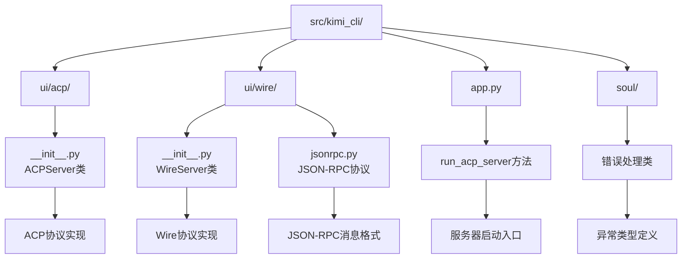
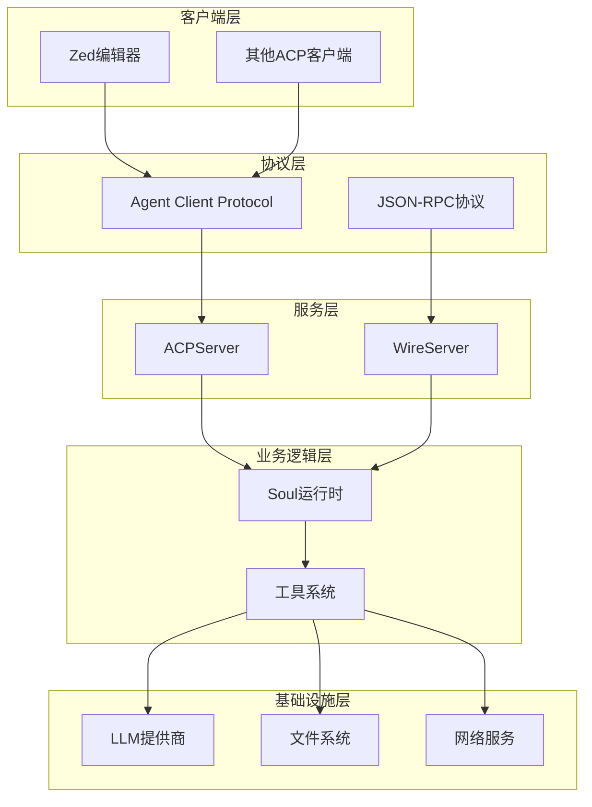
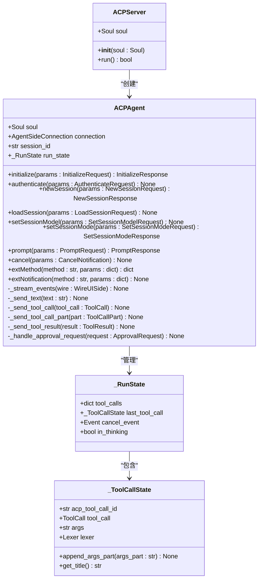
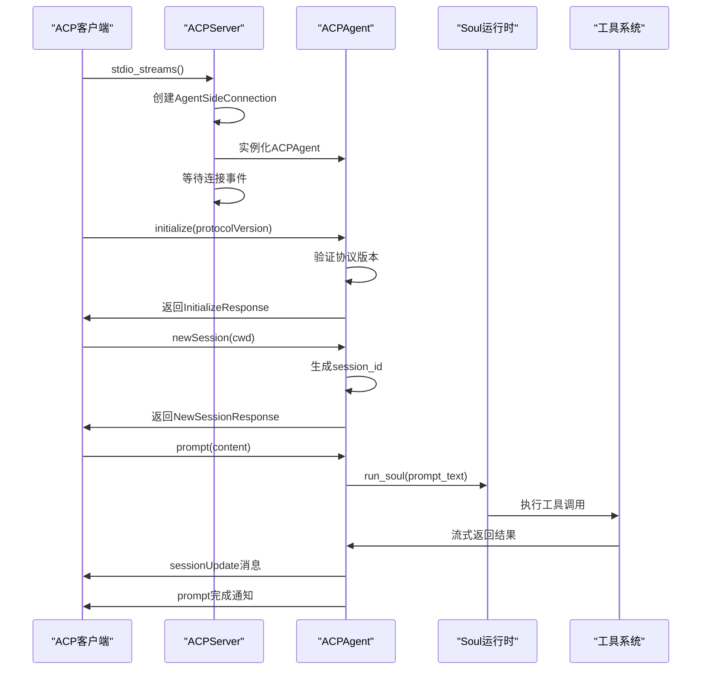
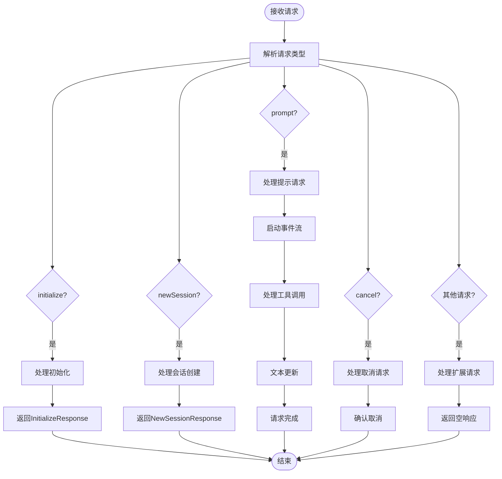
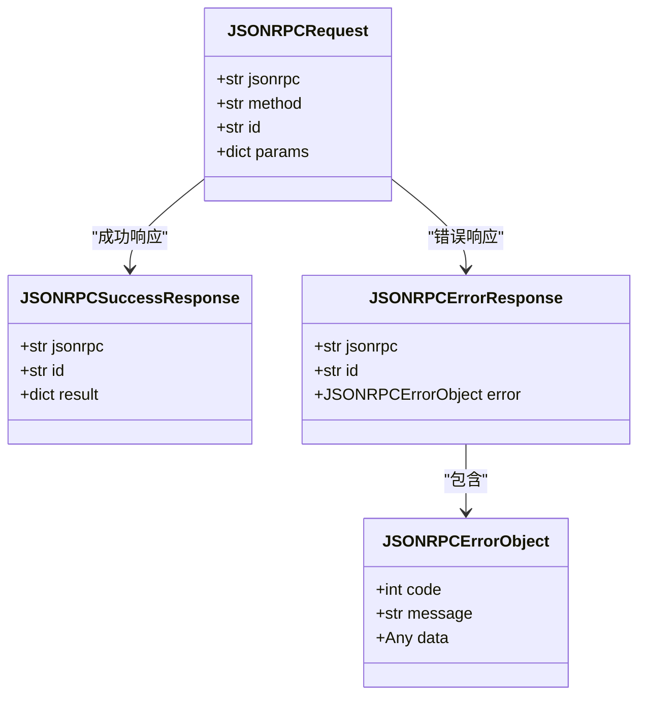
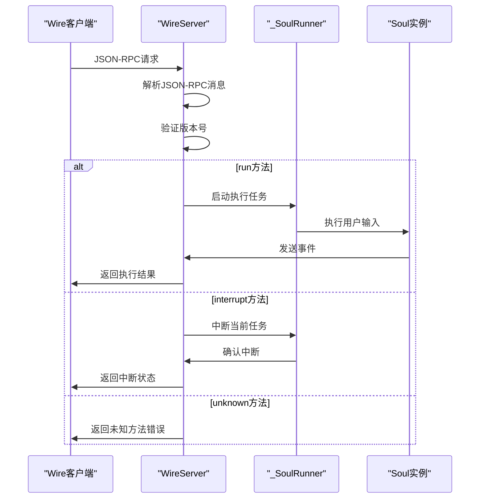
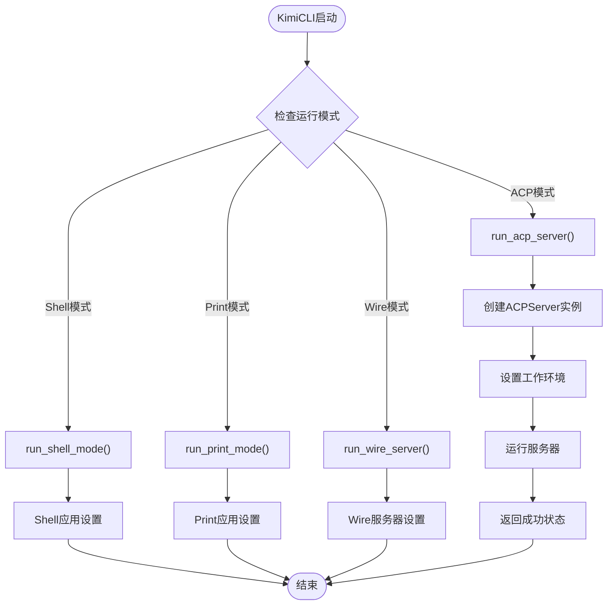
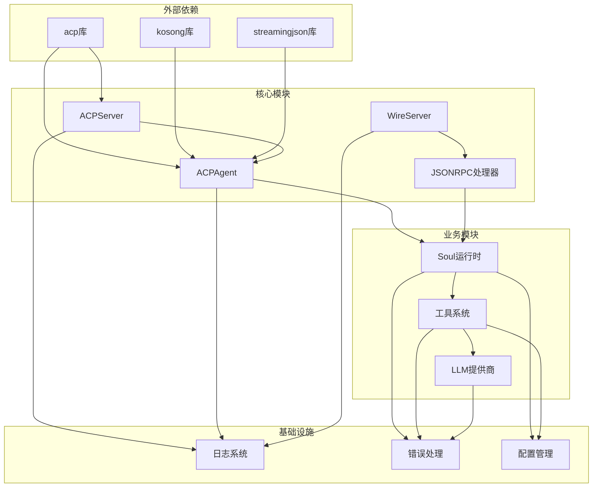

# ACP模式

<cite>
**本文档中引用的文件**
- [src/kimi_cli/ui/acp/__init__.py](file://src/kimi_cli/ui/acp/__init__.py)
- [src/kimi_cli/app.py](file://src/kimi_cli/app.py)
- [src/kimi_cli/ui/wire/__init__.py](file://src/kimi_cli/ui/wire/__init__.py)
- [src/kimi_cli/ui/wire/jsonrpc.py](file://src/kimi_cli/ui/wire/jsonrpc.py)
- [src/kimi_cli/soul/__init__.py](file://src/kimi_cli/soul/__init__.py)
- [src/kimi_cli/agents/CLAUDE.md](file://src/kimi_cli/agents/CLAUDE.md)
- [README.md](file://README.md)
</cite>

## 目录
1. [简介](#简介)
2. [项目结构](#项目结构)
3. [核心组件](#核心组件)
4. [架构概览](#架构概览)
5. [详细组件分析](#详细组件分析)
6. [依赖关系分析](#依赖关系分析)
7. [性能考虑](#性能考虑)
8. [故障排除指南](#故障排除指南)
9. [结论](#结论)

## 简介

ACP（Agent Client Protocol）模式是Kimí CLI提供的一个强大的API接口，它将Kimí CLI作为Agent Client Protocol服务器运行，为各种编辑器和IDE提供深度集成能力。该模式允许用户通过支持ACP协议的编辑器（如Zed）直接与Kimí CLI进行交互，实现智能代码补全、自动修复、代码分析等功能。

ACP模式的核心价值在于：
- **无缝编辑器集成**：通过标准的Agent Client Protocol实现与编辑器的深度集成
- **实时交互体验**：支持流式响应和实时状态更新
- **安全权限控制**：内置工具调用权限管理系统
- **多平台兼容**：支持多种编辑器和IDE的ACP客户端

## 项目结构

ACP模式相关的文件主要分布在以下目录中：

**图表来源**
- [src/kimi_cli/ui/acp/__init__.py](file://src/kimi_cli/ui/acp/__init__.py#L447-L472)
- [src/kimi_cli/ui/wire/__init__.py](file://src/kimi_cli/ui/wire/__init__.py#L114-L342)
- [src/kimi_cli/app.py](file://src/kimi_cli/app.py#L204-L209)

**章节来源**
- [src/kimi_cli/ui/acp/__init__.py](file://src/kimi_cli/ui/acp/__init__.py#L1-L473)
- [src/kimi_cli/ui/wire/__init__.py](file://src/kimi_cli/ui/wire/__init__.py#L1-L343)

## 核心组件

ACP模式包含两个主要的服务器实现：

### ACPServer类
负责处理Agent Client Protocol请求，提供标准的ACP协议接口。

### WireServer类  
提供基于JSON-RPC的消息传输协议，主要用于内部通信和调试。

### KimiCLI类
应用程序入口点，提供统一的服务启动接口。

**章节来源**
- [src/kimi_cli/ui/acp/__init__.py](file://src/kimi_cli/ui/acp/__init__.py#L447-L472)
- [src/kimi_cli/ui/wire/__init__.py](file://src/kimi_cli/ui/wire/__init__.py#L114-L342)
- [src/kimi_cli/app.py](file://src/kimi_cli/app.py#L204-L209)

## 架构概览

ACP模式采用分层架构设计，确保了良好的可扩展性和维护性：

**图表来源**
- [src/kimi_cli/ui/acp/__init__.py](file://src/kimi_cli/ui/acp/__init__.py#L447-L472)
- [src/kimi_cli/ui/wire/__init__.py](file://src/kimi_cli/ui/wire/__init__.py#L114-L342)

## 详细组件分析

### ACPServer类详细分析

ACPServer是ACP模式的核心组件，实现了Agent Client Protocol的标准接口。

#### 类图

**图表来源**
- [src/kimi_cli/ui/acp/__init__.py](file://src/kimi_cli/ui/acp/__init__.py#L447-L472)
- [src/kimi_cli/ui/acp/__init__.py](file://src/kimi_cli/ui/acp/__init__.py#L74-L472)

#### 启动流程分析

**图表来源**
- [src/kimi_cli/ui/acp/__init__.py](file://src/kimi_cli/ui/acp/__init__.py#L453-L472)
- [src/kimi_cli/ui/acp/__init__.py](file://src/kimi_cli/ui/acp/__init__.py#L83-L168)

#### 请求处理流程

ACP服务器支持多种类型的请求，每种都有特定的处理逻辑：

**图表来源**
- [src/kimi_cli/ui/acp/__init__.py](file://src/kimi_cli/ui/acp/__init__.py#L83-L168)
- [src/kimi_cli/ui/acp/__init__.py](file://src/kimi_cli/ui/acp/__init__.py#L169-L222)

**章节来源**
- [src/kimi_cli/ui/acp/__init__.py](file://src/kimi_cli/ui/acp/__init__.py#L447-L472)
- [src/kimi_cli/ui/acp/__init__.py](file://src/kimi_cli/ui/acp/__init__.py#L74-L472)

### WireServer类详细分析

WireServer提供了基于JSON-RPC的内部通信协议，主要用于调试和测试目的。

#### JSON-RPC协议支持

**图表来源**
- [src/kimi_cli/ui/wire/jsonrpc.py](file://src/kimi_cli/ui/wire/jsonrpc.py#L16-L37)

#### WireServer消息处理流程

**图表来源**
- [src/kimi_cli/ui/wire/__init__.py](file://src/kimi_cli/ui/wire/__init__.py#L172-L210)

**章节来源**
- [src/kimi_cli/ui/wire/__init__.py](file://src/kimi_cli/ui/wire/__init__.py#L114-L342)
- [src/kimi_cli/ui/wire/jsonrpc.py](file://src/kimi_cli/ui/wire/jsonrpc.py#L1-L51)

### KimiCLI集成分析

KimiCLI类提供了统一的应用程序入口，支持多种运行模式，包括ACP服务器模式。

#### 服务启动流程

**图表来源**
- [src/kimi_cli/app.py](file://src/kimi_cli/app.py#L204-L216)

**章节来源**
- [src/kimi_cli/app.py](file://src/kimi_cli/app.py#L204-L216)

## 依赖关系分析

ACP模式的依赖关系体现了清晰的分层架构：

**图表来源**
- [src/kimi_cli/ui/acp/__init__.py](file://src/kimi_cli/ui/acp/__init__.py#L1-L22)
- [src/kimi_cli/ui/wire/__init__.py](file://src/kimi_cli/ui/wire/__init__.py#L1-L15)

**章节来源**
- [src/kimi_cli/ui/acp/__init__.py](file://src/kimi_cli/ui/acp/__init__.py#L1-L22)
- [src/kimi_cli/ui/wire/__init__.py](file://src/kimi_cli/ui/wire/__init__.py#L1-L15)

## 性能考虑

ACP模式在设计时充分考虑了性能优化：

### 异步处理
- 使用asyncio实现非阻塞的请求处理
- 支持并发的多个会话同时运行
- 流式响应减少延迟

### 内存管理
- 及时清理工具调用状态
- 会话结束后释放资源
- 避免内存泄漏

### 连接管理
- 支持长连接和断线重连
- 超时检测和自动恢复
- 连接池管理

## 故障排除指南

### 常见错误及解决方案

#### 连接问题
- **症状**：客户端无法连接到ACP服务器
- **原因**：端口被占用或权限不足
- **解决**：检查端口状态和防火墙设置

#### 协议错误
- **症状**：请求被拒绝或返回错误
- **原因**：协议版本不匹配或消息格式错误
- **解决**：验证客户端和服务端的协议版本

#### 权限问题
- **症状**：工具调用被拒绝
- **原因**：缺少必要的权限或配置错误
- **解决**：检查工具权限配置和用户授权

#### 超时问题
- **症状**：长时间无响应
- **原因**：网络延迟或服务器负载过高
- **解决**：增加超时时间或优化服务器性能

**章节来源**
- [src/kimi_cli/ui/acp/__init__.py](file://src/kimi_cli/ui/acp/__init__.py#L149-L168)
- [src/kimi_cli/ui/wire/__init__.py](file://src/kimi_cli/ui/wire/__init__.py#L148-L152)

## 结论

ACP模式为Kimí CLI提供了强大的编辑器集成能力，通过标准化的Agent Client Protocol接口，实现了与各种编辑器和IDE的无缝集成。该模式具有以下优势：

1. **标准化接口**：遵循Agent Client Protocol标准，确保跨平台兼容性
2. **实时交互**：支持流式响应和实时状态更新
3. **安全可靠**：内置权限控制系统和错误处理机制
4. **易于扩展**：模块化设计便于功能扩展和维护

通过ACPServer类的实现，开发者可以轻松地将Kimí CLI集成到现有的编辑器生态系统中，为用户提供智能化的编码体验。随着编辑器生态系统的不断发展，ACP模式将继续发挥重要作用，推动AI辅助编程的发展。