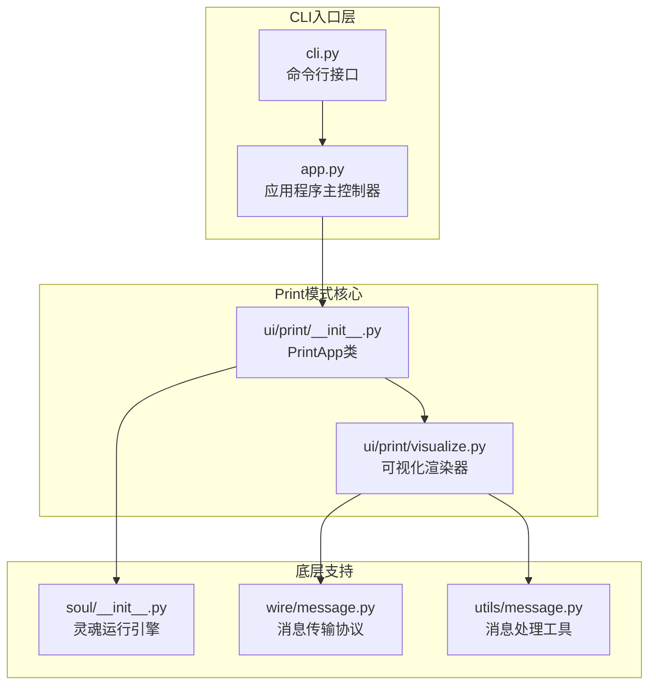
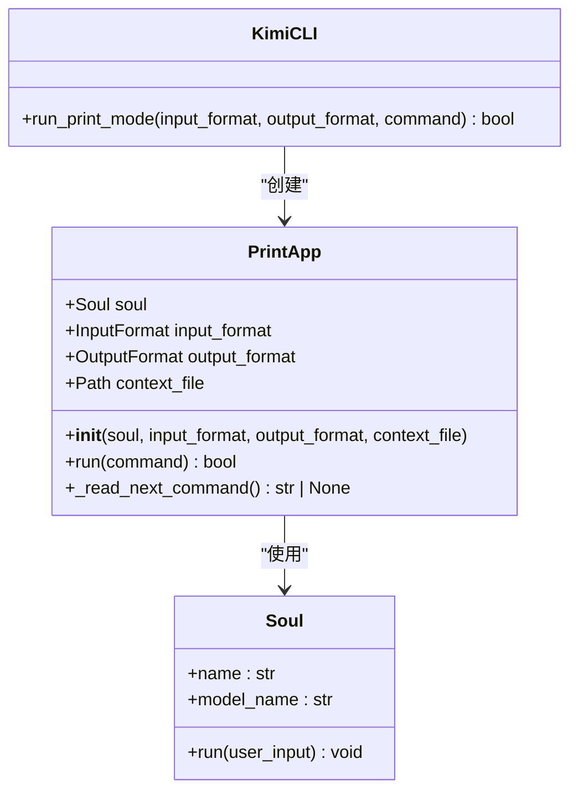
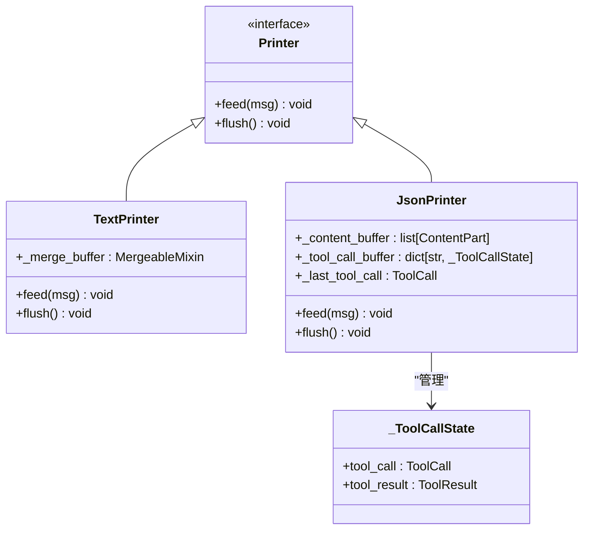
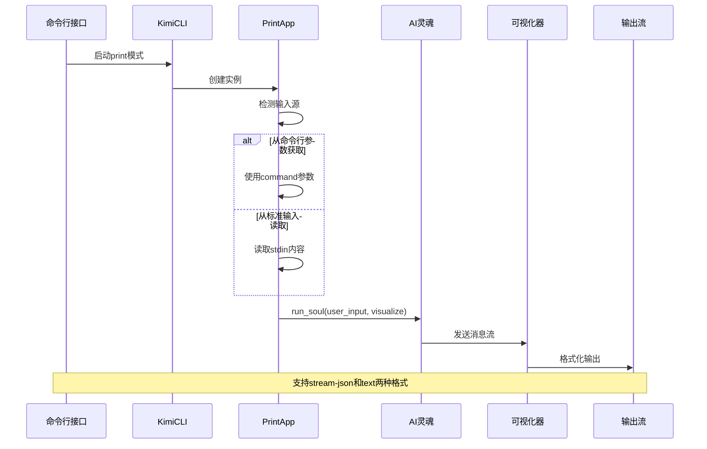
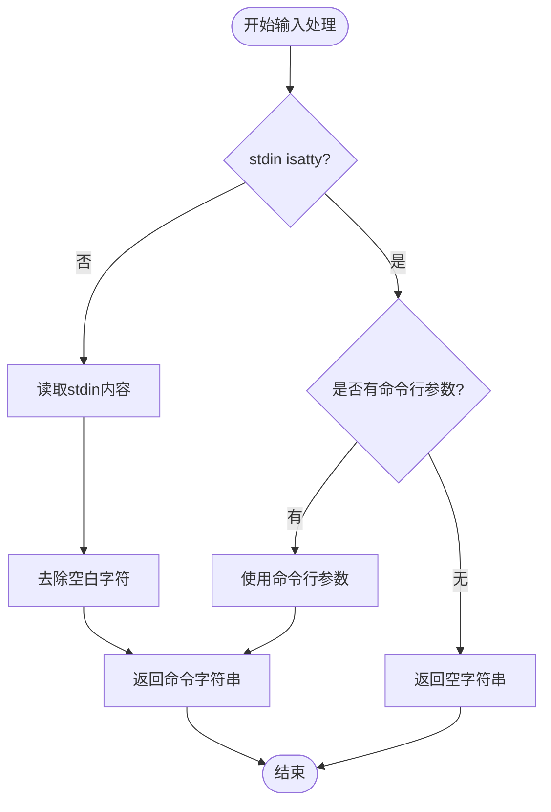
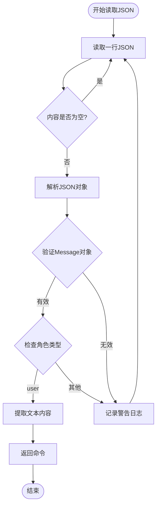
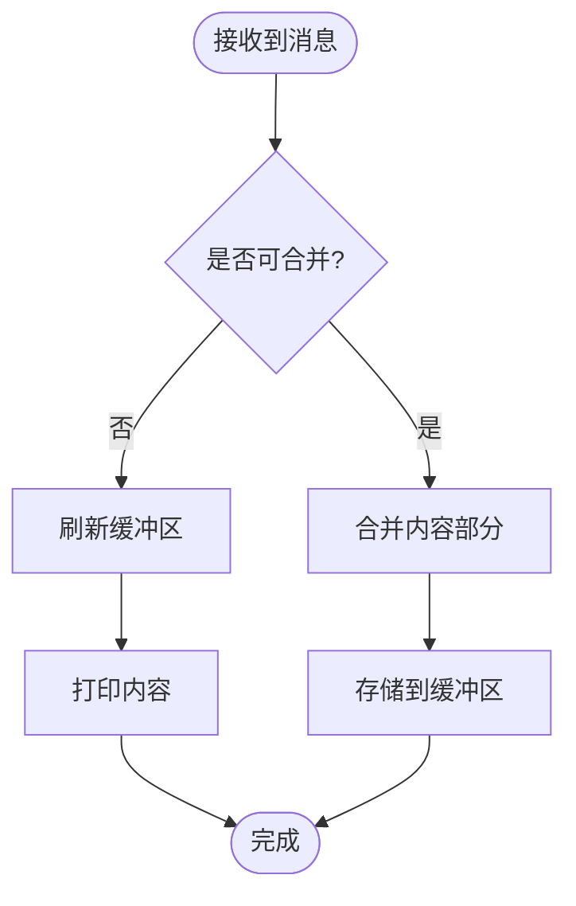
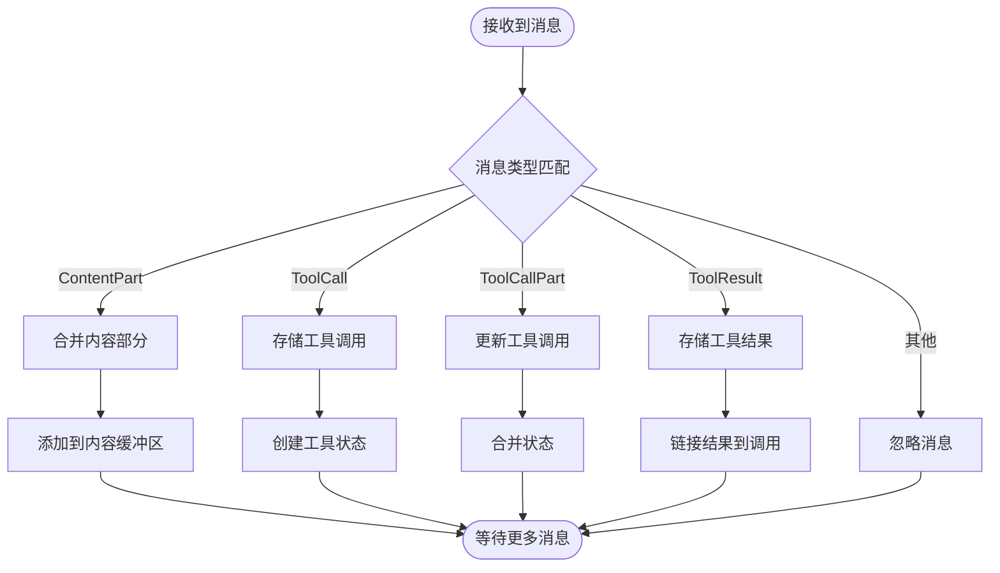
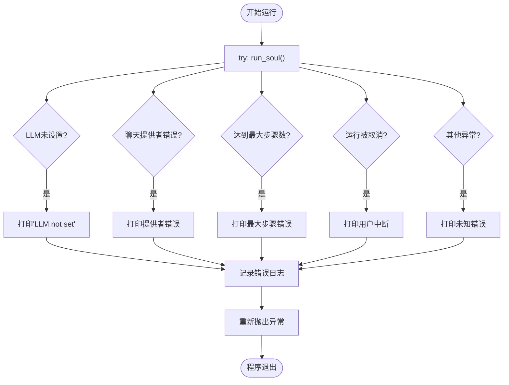
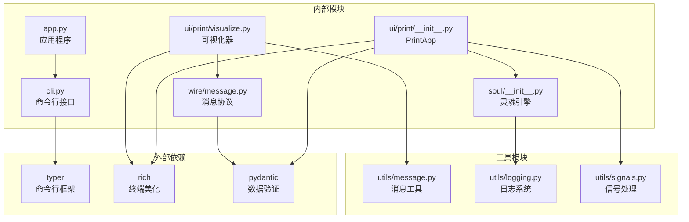

# Print模式

<cite>
**本文档中引用的文件**
- [src/kimi_cli/ui/print/visualize.py](file://src/kimi_cli/ui/print/visualize.py)
- [src/kimi_cli/ui/print/__init__.py](file://src/kimi_cli/ui/print/__init__.py)
- [src/kimi_cli/app.py](file://src/kimi_cli/app.py)
- [src/kimi_cli/cli.py](file://src/kimi_cli/cli.py)
- [src/kimi_cli/soul/message.py](file://src/kimi_cli/soul/message.py)
- [src/kimi_cli/wire/message.py](file://src/kimi_cli/wire/message.py)
- [src/kimi_cli/soul/__init__.py](file://src/kimi_cli/soul/__init__.py)
- [src/kimi_cli/utils/message.py](file://src/kimi_cli/utils/message.py)
- [src/kimi_cli/ui/CLAUDE.md](file://src/kimi_cli/ui/CLAUDE.md)
</cite>

## 目录
1. [简介](#简介)
2. [项目结构](#项目结构)
3. [核心组件](#核心组件)
4. [架构概览](#架构概览)
5. [详细组件分析](#详细组件分析)
6. [依赖关系分析](#依赖关系分析)
7. [性能考虑](#性能考虑)
8. [故障排除指南](#故障排除指南)
9. [结论](#结论)

## 简介

Print模式是Kimi CLI中的一个非交互式批处理工具，专为自动化场景设计。它作为AI代理的纯文本输出工具，能够接收输入并以结构化格式输出AI生成的内容，特别适用于脚本集成、CI/CD流水线和自动化工具链。

Print模式的核心特点包括：
- **非交互式设计**：无用户界面，完全自动化运行
- **多格式支持**：支持纯文本和stream-json两种输出格式
- **管道友好**：原生支持stdin/stdout管道操作
- **批处理优化**：针对大量任务处理进行了优化
- **CI/CD集成**：可无缝集成到持续集成和部署流水线

## 项目结构

Print模式的实现分布在多个模块中，形成了清晰的分层架构：

**图表来源**
- [src/kimi_cli/cli.py](file://src/kimi_cli/cli.py#L1-L50)
- [src/kimi_cli/app.py](file://src/kimi_cli/app.py#L187-L202)
- [src/kimi_cli/ui/print/__init__.py](file://src/kimi_cli/ui/print/__init__.py#L1-L50)

**章节来源**
- [src/kimi_cli/cli.py](file://src/kimi_cli/cli.py#L1-L358)
- [src/kimi_cli/app.py](file://src/kimi_cli/app.py#L1-L217)

## 核心组件

### PrintApp类

PrintApp是Print模式的核心控制器，负责管理整个非交互式运行流程：

**图表来源**
- [src/kimi_cli/ui/print/__init__.py](file://src/kimi_cli/ui/print/__init__.py#L21-L42)
- [src/kimi_cli/app.py](file://src/kimi_cli/app.py#L187-L202)

### 可视化渲染器

可视化渲染器负责将AI输出转换为适当的格式：

**图表来源**
- [src/kimi_cli/ui/print/visualize.py](file://src/kimi_cli/ui/print/visualize.py#L15-L130)

**章节来源**
- [src/kimi_cli/ui/print/__init__.py](file://src/kimi_cli/ui/print/__init__.py#L1-L127)
- [src/kimi_cli/ui/print/visualize.py](file://src/kimi_cli/ui/print/visualize.py#L1-L130)

## 架构概览

Print模式采用事件驱动的异步架构，通过消息传递机制实现解耦：

**图表来源**
- [src/kimi_cli/cli.py](file://src/kimi_cli/cli.py#L283-L318)
- [src/kimi_cli/app.py](file://src/kimi_cli/app.py#L187-L202)
- [src/kimi_cli/ui/print/__init__.py](file://src/kimi_cli/ui/print/__init__.py#L44-L98)

## 详细组件分析

### 输入处理机制

Print模式支持多种输入方式，适应不同的使用场景：

#### 命令行参数输入
当通过`--command`或`-c`参数提供输入时，系统直接使用该参数值作为用户输入。

#### 标准输入读取
当没有提供命令行参数且stdin不是终端时，系统自动从标准输入读取内容：

**图表来源**
- [src/kimi_cli/ui/print/__init__.py](file://src/kimi_cli/ui/print/__init__.py#L54-L56)

#### Stream-JSON输入格式
对于需要批量处理的场景，Print模式支持stream-json格式输入：

**图表来源**
- [src/kimi_cli/ui/print/__init__.py](file://src/kimi_cli/ui/print/__init__.py#L103-L127)

### 输出格式处理

Print模式提供两种主要的输出格式，满足不同的集成需求：

#### 文本格式输出
文本格式是最简单的输出方式，直接输出AI生成的纯文本内容：

**图表来源**
- [src/kimi_cli/ui/print/visualize.py](file://src/kimi_cli/ui/print/visualize.py#L20-L42)

#### Stream-JSON格式输出
Stream-JSON格式提供结构化的机器可读输出，包含完整的消息历史：

**图表来源**
- [src/kimi_cli/ui/print/visualize.py](file://src/kimi_cli/ui/print/visualize.py#L57-L81)

### 异常处理机制

Print模式实现了完善的异常处理机制，确保在各种错误情况下都能优雅地终止：

**图表来源**
- [src/kimi_cli/ui/print/__init__.py](file://src/kimi_cli/ui/print/__init__.py#L83-L98)

**章节来源**
- [src/kimi_cli/ui/print/__init__.py](file://src/kimi_cli/ui/print/__init__.py#L44-L98)
- [src/kimi_cli/ui/print/visualize.py](file://src/kimi_cli/ui/print/visualize.py#L112-L130)

## 依赖关系分析

Print模式的依赖关系体现了清晰的分层架构设计：

**图表来源**
- [src/kimi_cli/cli.py](file://src/kimi_cli/cli.py#L1-L20)
- [src/kimi_cli/app.py](file://src/kimi_cli/app.py#L1-L25)
- [src/kimi_cli/ui/print/__init__.py](file://src/kimi_cli/ui/print/__init__.py#L1-L20)

**章节来源**
- [src/kimi_cli/cli.py](file://src/kimi_cli/cli.py#L1-L358)
- [src/kimi_cli/app.py](file://src/kimi_cli/app.py#L1-L217)

## 性能考虑

Print模式在设计时充分考虑了性能优化，特别是在处理大量批处理任务时：

### 内存管理
- **流式处理**：避免将大文件全部加载到内存
- **缓冲区管理**：合理使用缓冲区减少频繁的I/O操作
- **及时清理**：在适当时候清空缓冲区释放内存

### 并发处理
- **异步I/O**：使用asyncio实现非阻塞的输入输出
- **事件驱动**：基于事件循环的消息处理机制
- **资源隔离**：每个任务独立的资源分配

### 网络优化
- **连接复用**：重用LLM连接减少建立连接的开销
- **请求合并**：智能合并相似的请求减少网络往返
- **超时控制**：合理的超时设置避免长时间等待

## 故障排除指南

### 常见问题及解决方案

#### LLM配置问题
**问题**：运行时出现"LLM not set"错误
**原因**：未正确配置大语言模型
**解决方案**：
1. 检查配置文件中的模型设置
2. 设置环境变量`KIMI_API_KEY`
3. 使用`--model`参数指定模型名称

#### 输入格式错误
**问题**：stream-json格式输入无法解析
**原因**：JSON格式不正确或缺少必需字段
**解决方案**：
1. 验证JSON语法正确性
2. 确保消息包含有效的`role`字段
3. 检查`content`字段格式

#### 权限问题
**问题**：无法访问某些工具或文件
**原因**：权限不足或工具未启用
**解决方案**：
1. 检查Agent配置中的工具列表
2. 验证工作目录权限
3. 确认所需工具已启用

**章节来源**
- [src/kimi_cli/ui/print/__init__.py](file://src/kimi_cli/ui/print/__init__.py#L83-L98)

## 结论

Print模式作为Kimi CLI的重要组成部分，成功实现了非交互式批处理工具的设计目标。它通过以下特性为用户提供了一个强大而灵活的自动化解决方案：

### 核心优势
- **自动化友好**：完全无界面设计，适合无人值守运行
- **格式多样**：支持文本和JSON两种输出格式，满足不同集成需求
- **管道支持**：原生支持Unix管道操作，易于与其他工具组合
- **错误处理**：完善的异常处理机制确保稳定性
- **性能优化**：异步架构和流式处理提供良好的性能表现

### 应用场景
- **CI/CD流水线**：在构建和部署过程中执行AI辅助任务
- **批处理作业**：处理大量重复性的文本分析任务
- **脚本集成**：与其他系统和工具无缝集成
- **监控告警**：自动分析日志和监控数据

### 与交互式Shell模式的区别
Print模式与交互式Shell模式在设计理念上存在根本差异：
- **交互性**：Print模式完全无交互，Shell模式提供实时对话
- **用户体验**：Print模式面向自动化，Shell模式面向人类用户
- **输出格式**：Print模式支持结构化输出，Shell模式注重可读性
- **使用场景**：Print模式适合后台处理，Shell模式适合即时反馈

Print模式的设计充分体现了现代软件工程的最佳实践，通过清晰的架构设计、完善的错误处理和优秀的性能表现，为用户提供了可靠的自动化解决方案。随着AI技术的不断发展，这种非交互式批处理模式将在更多领域发挥重要作用。