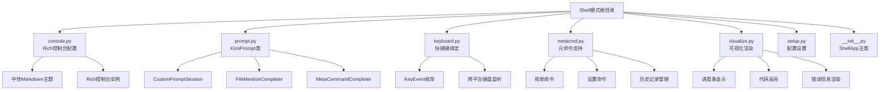
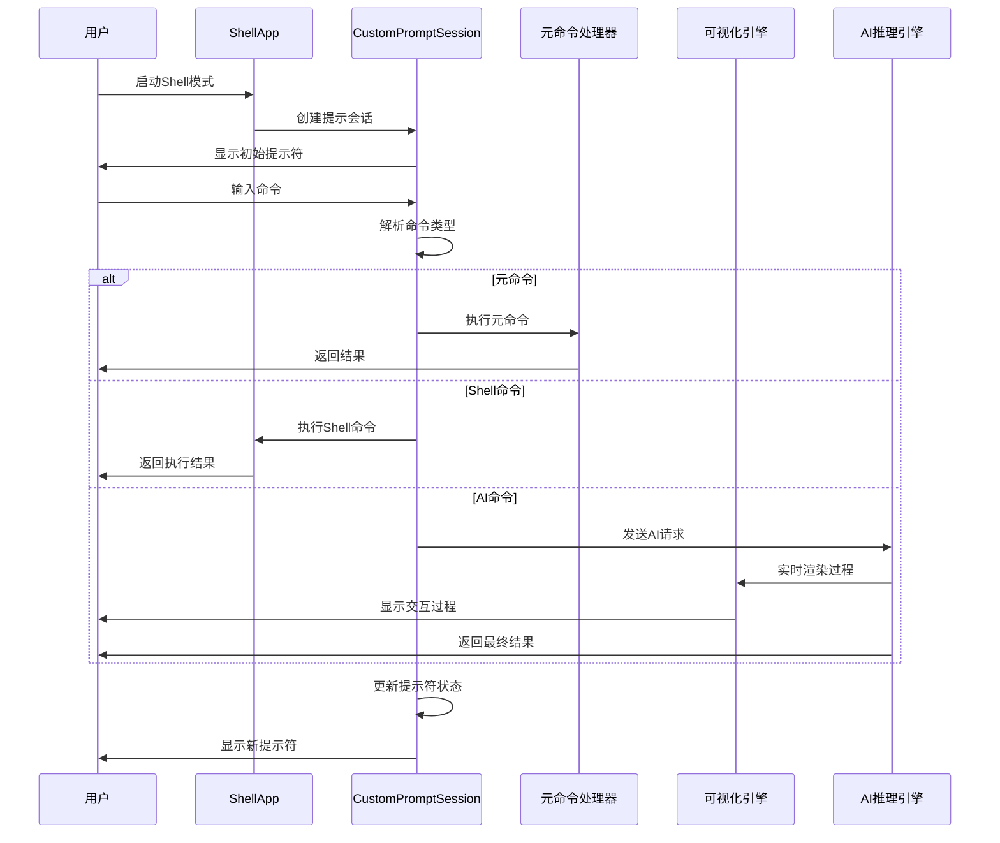
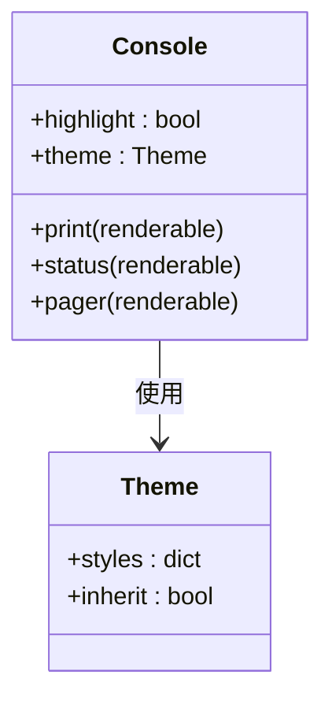
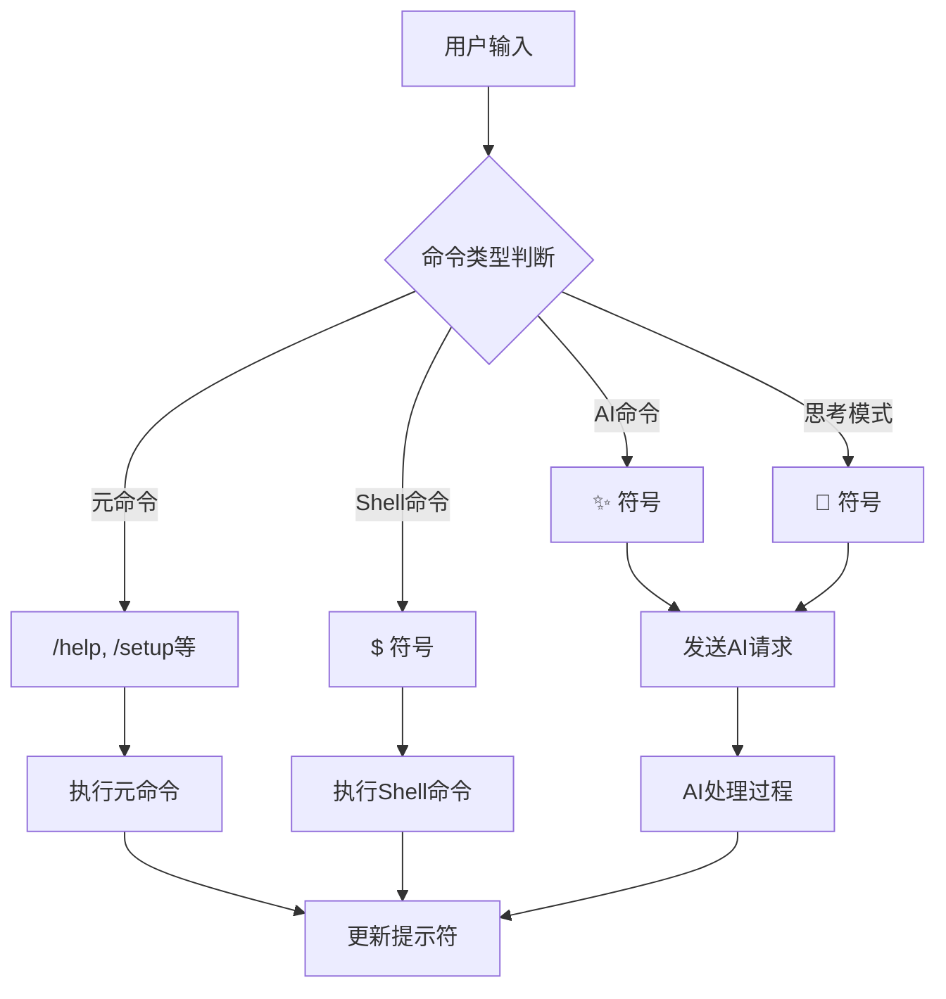
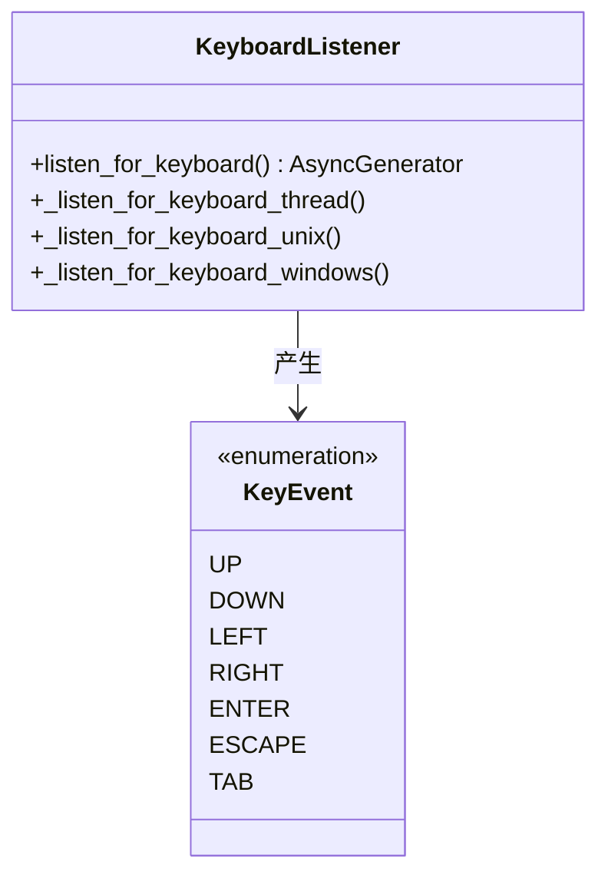
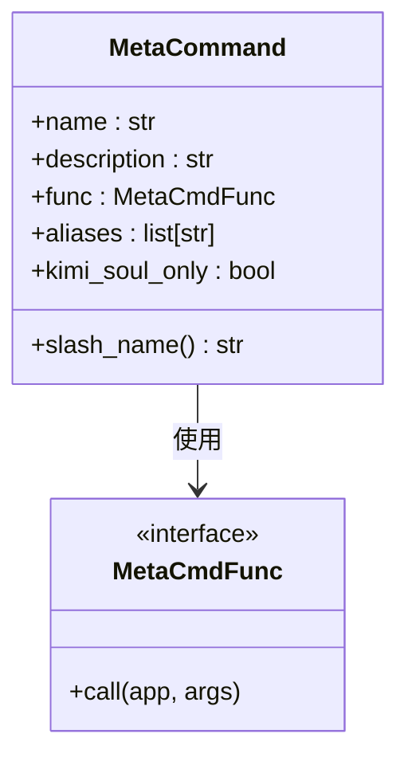
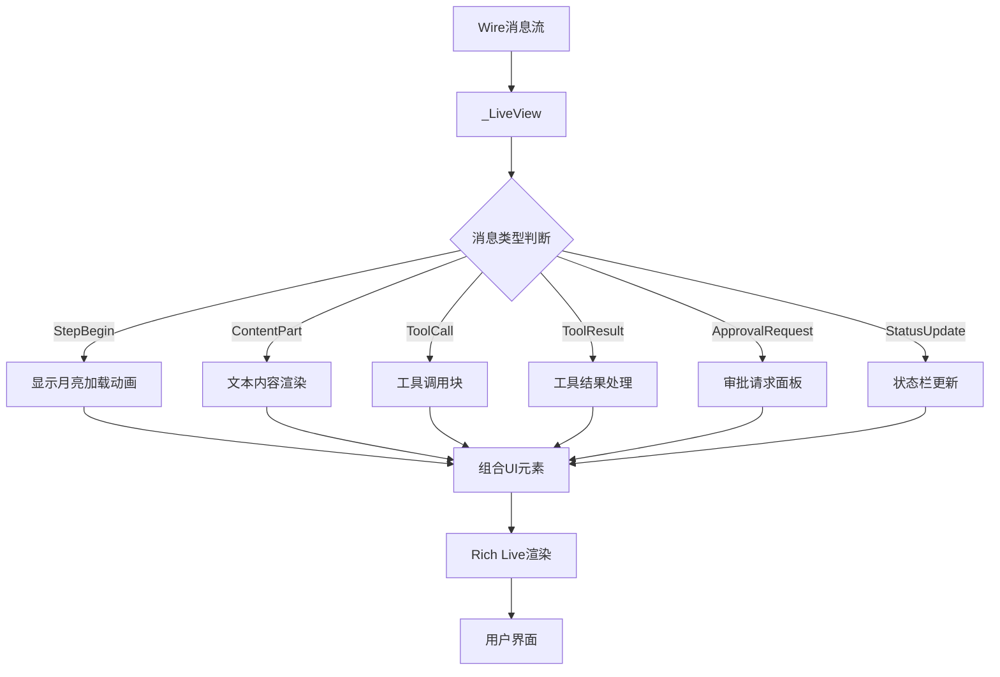
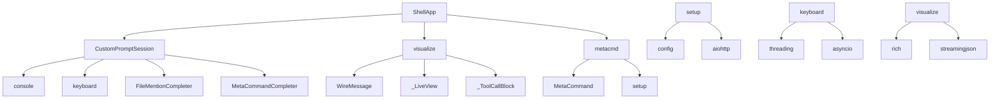

# Shell模式详细文档

<cite>
**本文档引用的文件**
- [console.py](file://src/kimi_cli/ui/shell/console.py)
- [prompt.py](file://src/kimi_cli/ui/shell/prompt.py)
- [keyboard.py](file://src/kimi_cli/ui/shell/keyboard.py)
- [metacmd.py](file://src/kimi_cli/ui/shell/metacmd.py)
- [visualize.py](file://src/kimi_cli/ui/shell/visualize.py)
- [__init__.py](file://src/kimi_cli/ui/shell/__init__.py)
- [setup.py](file://src/kimi_cli/ui/shell/setup.py)
- [CLAUDE.md](file://src/kimi_cli/ui/CLAUDE.md)
- [cli.py](file://src/kimi_cli/cli.py)
</cite>

## 目录
1. [简介](#简介)
2. [项目结构](#项目结构)
3. [核心组件](#核心组件)
4. [架构概览](#架构概览)
5. [详细组件分析](#详细组件分析)
6. [依赖关系分析](#依赖关系分析)
7. [性能考虑](#性能考虑)
8. [故障排除指南](#故障排除指南)
9. [结论](#结论)

## 简介

Shell模式是kimi-cli项目中的核心交互式命令行界面，为用户提供了一个强大而灵活的AI驱动的交互环境。该模式结合了传统Shell的命令执行能力与现代AI助手的智能对话功能，通过多种快捷键绑定、智能自动补全和丰富的可视化反馈，为用户提供了卓越的交互体验。

Shell模式的设计遵循了CLAUDE.md中定义的设计原则，特别强调响应性、可访问性和内存优化策略。通过精心设计的UI组件和交互机制，确保了流畅的用户体验和高效的系统资源利用。

## 项目结构

Shell模式的文件组织结构体现了清晰的职责分离和模块化设计：



**图表来源**
- [console.py](file://src/kimi_cli/ui/shell/console.py#L1-L32)
- [prompt.py](file://src/kimi_cli/ui/shell/prompt.py#L1-L100)
- [keyboard.py](file://src/kimi_cli/ui/shell/keyboard.py#L1-L50)
- [metacmd.py](file://src/kimi_cli/ui/shell/metacmd.py#L1-L100)
- [visualize.py](file://src/kimi_cli/ui/shell/visualize.py#L1-L100)

**章节来源**
- [console.py](file://src/kimi_cli/ui/shell/console.py#L1-L32)
- [prompt.py](file://src/kimi_cli/ui/shell/prompt.py#L1-L794)
- [keyboard.py](file://src/kimi_cli/ui/shell/keyboard.py#L1-L186)
- [metacmd.py](file://src/kimi_cli/ui/shell/metacmd.py#L1-L276)
- [visualize.py](file://src/kimi_cli/ui/shell/visualize.py#L1-L566)

## 核心组件

Shell模式由以下核心组件构成，每个组件都承担着特定的职责：

### Rich控制台配置
`console.py`负责配置Rich库的控制台实例，确保一致的内容渲染风格。通过中性Markdown主题的配置，消除了不必要的视觉装饰，专注于内容本身。

### 动态提示符生成
`prompt.py`中的`KimiPrompt`类（现为`CustomPromptSession`）实现了智能的提示符生成机制，支持Agent模式和Shell模式之间的切换，并能根据思考状态动态调整显示符号。

### 快捷键绑定系统
`keyboard.py`提供了跨平台的键盘事件监听和处理机制，支持Ctrl-X模式切换、Ctrl-C中断操作、Tab自动补全等快捷键功能。

### 元命令处理器
`metacmd.py`实现了丰富的元命令系统，包括/help、/setup、/clear、/history等管理功能，为用户提供便捷的操作接口。

### 可视化渲染引擎
`visualize.py`负责实时渲染AI交互过程中的各种元素，包括进度条、代码高亮、错误信息等，提供直观的视觉反馈。

**章节来源**
- [console.py](file://src/kimi_cli/ui/shell/console.py#L1-L32)
- [prompt.py](file://src/kimi_cli/ui/shell/prompt.py#L466-L600)
- [keyboard.py](file://src/kimi_cli/ui/shell/keyboard.py#L21-L186)
- [metacmd.py](file://src/kimi_cli/ui/shell/metacmd.py#L1-L276)
- [visualize.py](file://src/kimi_cli/ui/shell/visualize.py#L1-L566)

## 架构概览

Shell模式采用了分层架构设计，确保了各组件间的松耦合和高内聚：



**图表来源**
- [__init__.py](file://src/kimi_cli/ui/shell/__init__.py#L30-L92)
- [prompt.py](file://src/kimi_cli/ui/shell/prompt.py#L689-L722)
- [metacmd.py](file://src/kimi_cli/ui/shell/metacmd.py#L121-L158)

## 详细组件分析

### Rich控制台样式配置

`console.py`中的`_NEUTRAL_MARKDOWN_THEME`定义了中性化的Markdown渲染主题，消除了所有默认的样式装饰：



**图表来源**
- [console.py](file://src/kimi_cli/ui/shell/console.py#L6-L31)

该主题配置确保了所有Markdown内容都以最简洁的形式呈现，避免了视觉干扰，使用户能够专注于内容本身。

**章节来源**
- [console.py](file://src/kimi_cli/ui/shell/console.py#L1-L32)

### 动态提示符生成机制

`CustomPromptSession`类实现了复杂的提示符生成逻辑，支持多种模式和状态：



**图表来源**
- [prompt.py](file://src/kimi_cli/ui/shell/prompt.py#L590-L595)

提示符系统通过不同的符号和颜色编码，为用户提供了清晰的状态指示：

| 模式 | 符号 | 描述 |
|------|------|------|
| Agent模式 | ✨ | AI助手交互模式 |
| Shell模式 | $ | 系统命令执行模式 |
| 思考模式 | 💫 | AI正在深度思考 |
| 用户名 | 当前用户名 | 显示当前登录用户 |

**章节来源**
- [prompt.py](file://src/kimi_cli/ui/shell/prompt.py#L52-L55)
- [prompt.py](file://src/kimi_cli/ui/shell/prompt.py#L590-L595)

### 快捷键绑定机制

`keyboard.py`提供了全面的键盘事件处理系统，支持跨平台的键盘交互：



**图表来源**
- [keyboard.py](file://src/kimi_cli/ui/shell/keyboard.py#L11-L19)

快捷键系统的关键功能包括：

- **Ctrl-X**: 在Agent模式和Shell模式间切换
- **Ctrl-C**: 中断当前操作
- **Tab**: 触发自动补全或切换思考模式
- **Ctrl-V**: 粘贴剪贴板内容（支持图片）
- **Ctrl-J**: 插入换行符
- **ESC**: 取消操作或退出

**章节来源**
- [keyboard.py](file://src/kimi_cli/ui/shell/keyboard.py#L1-L186)

### 元命令系统

`metacmd.py`实现了丰富的元命令框架，支持扩展和自定义：



**图表来源**
- [metacmd.py](file://src/kimi_cli/ui/shell/metacmd.py#L40-L60)

主要元命令包括：

| 命令 | 别名 | 功能描述 |
|------|------|----------|
| /help | /h, /? | 显示帮助信息 |
| /setup | - | 配置LLM服务 |
| /clear | /reset | 清除上下文 |
| /version | - | 显示版本信息 |
| /init | - | 分析代码库 |
| /compact | - | 压缩上下文 |
| /yolo | - | 启用YOLO模式 |

**章节来源**
- [metacmd.py](file://src/kimi_cli/ui/shell/metacmd.py#L1-L276)

### 可视化渲染引擎

`visualize.py`提供了强大的实时渲染能力，支持多种UI元素的动态显示：



**图表来源**
- [visualize.py](file://src/kimi_cli/ui/shell/visualize.py#L291-L361)

可视化系统的核心特性：

- **实时进度跟踪**: 通过Spinner显示AI处理进度
- **语法高亮**: 支持多种编程语言的代码高亮
- **错误处理**: 直观的错误信息显示
- **工具调用可视化**: 展示工具执行过程和结果
- **审批流程**: 图形化显示权限请求和审批状态

**章节来源**
- [visualize.py](file://src/kimi_cli/ui/shell/visualize.py#L1-L566)

### 文件自动补全系统

`FileMentionCompleter`提供了智能的文件路径补全功能：

```mermaid
flowchart TD
A["用户输入"] --> B{"检查@符号"}
B --> |无@| C["跳过补全"]
B --> |有@| D["提取文件片段"]
D --> E{"片段长度检查"}
E --> |短于3字符| F["顶级目录补全"]
E --> |长于等于3字符| G["深层路径补全"]
F --> H["扫描工作目录"]
G --> I["递归扫描文件树"]
H --> J["应用过滤规则"]
I --> J
J --> K["Fuzzy匹配排序"]
K --> L["返回补全建议"]
```

**图表来源**
- [prompt.py](file://src/kimi_cli/ui/shell/prompt.py#L96-L342)

补全系统的智能特性：

- **智能缓存**: 缓存文件列表以提高性能
- **模糊匹配**: 支持部分匹配和相似度排序
- **过滤规则**: 自动忽略临时文件和构建产物
- **性能优化**: 限制最大文件数量和刷新间隔

**章节来源**
- [prompt.py](file://src/kimi_cli/ui/shell/prompt.py#L96-L342)

## 依赖关系分析

Shell模式的组件间存在复杂的依赖关系，形成了一个有机的整体：



**图表来源**
- [__init__.py](file://src/kimi_cli/ui/shell/__init__.py#L1-L50)
- [prompt.py](file://src/kimi_cli/ui/shell/prompt.py#L1-L50)
- [visualize.py](file://src/kimi_cli/ui/shell/visualize.py#L1-L50)

关键依赖关系：

1. **ShellApp**作为顶层协调者，连接所有子组件
2. **CustomPromptSession**依赖多个补全器和键盘监听器
3. **visualize**模块处理异步消息流和UI渲染
4. **metacmd**提供命令解析和执行能力
5. **setup**模块负责配置管理和API集成

**章节来源**
- [__init__.py](file://src/kimi_cli/ui/shell/__init__.py#L1-L320)
- [prompt.py](file://src/kimi_cli/ui/shell/prompt.py#L1-L794)
- [visualize.py](file://src/kimi_cli/ui/shell/visualize.py#L1-L566)
- [metacmd.py](file://src/kimi_cli/ui/shell/metacmd.py#L1-L276)

## 性能考虑

Shell模式在设计时充分考虑了性能优化，特别是在内存使用和响应性方面：

### 内存优化策略

1. **智能缓存机制**: 文件补全系统使用时间戳控制缓存刷新，避免频繁的文件系统扫描
2. **增量更新**: UI渲染采用增量更新策略，只重新绘制变化的部分
3. **资源清理**: 异步任务完成后自动清理资源，防止内存泄漏
4. **流式处理**: 大型输出采用流式处理，避免一次性加载大量数据

### 响应性优化

1. **非阻塞I/O**: 所有网络操作和文件操作都采用异步模式
2. **并发处理**: 支持多个后台任务同时运行
3. **快速反馈**: 用户操作后立即提供视觉反馈
4. **智能等待**: 在适当的时候提供加载指示器

### 可访问性设计

1. **键盘导航**: 完整的键盘操作支持
2. **屏幕阅读器兼容**: Rich库提供的无障碍支持
3. **高对比度模式**: 支持不同的主题和颜色方案
4. **语音反馈**: 通过终端输出支持语音合成

**章节来源**
- [CLAUDE.md](file://src/kimi_cli/ui/CLAUDE.md#L293-L298)
- [prompt.py](file://src/kimi_cli/ui/shell/prompt.py#L174-L278)
- [visualize.py](file://src/kimi_cli/ui/shell/visualize.py#L291-L361)

## 故障排除指南

### 常见问题及解决方案

#### 1. 模式切换问题
**症状**: Ctrl-X无法切换模式
**原因**: 终端不支持某些键盘序列
**解决方案**: 检查终端设置，确保支持标准键盘序列

#### 2. 自动补全失效
**症状**: Tab键不触发补全
**原因**: 文件系统权限不足或磁盘空间不足
**解决方案**: 检查文件权限，清理磁盘空间

#### 3. 可视化渲染异常
**症状**: UI显示混乱或卡顿
**原因**: 终端不支持某些ANSI转义序列
**解决方案**: 设置`TERM`环境变量为支持的值

#### 4. 元命令执行失败
**症状**: /setup等命令报错
**原因**: 网络连接问题或API密钥无效
**解决方案**: 检查网络连接，验证API密钥

**章节来源**
- [keyboard.py](file://src/kimi_cli/ui/shell/keyboard.py#L57-L178)
- [visualize.py](file://src/kimi_cli/ui/shell/visualize.py#L400-L450)
- [metacmd.py](file://src/kimi_cli/ui/shell/metacmd.py#L121-L158)

### 调试技巧

1. **启用调试模式**: 使用`--debug`参数获取详细日志
2. **检查配置文件**: 验证配置文件的正确性
3. **网络诊断**: 测试API连接和认证
4. **权限检查**: 确保有足够的文件系统权限

## 结论

Shell模式作为kimi-cli的核心交互界面，成功地将传统Shell的命令执行能力与现代AI助手的智能对话功能相结合。通过精心设计的架构和丰富的功能特性，为用户提供了高效、直观且富有表现力的交互体验。

该模式的设计充分体现了CLAUDE.md中提出的设计原则：响应性、可访问性和内存优化。通过模块化的组件设计、智能的缓存机制和优雅的错误处理，确保了系统的稳定性和用户体验。

未来的发展方向包括：
- 进一步优化性能，特别是在大型文件系统上的补全速度
- 增强可访问性支持，更好地服务于残障用户
- 扩展元命令系统，提供更多实用的功能
- 改进可视化效果，提供更丰富的交互反馈

Shell模式的成功实现证明了AI技术与传统工具的完美融合，为未来的交互式开发工具树立了新的标杆。