# 元命令处理

<cite>
**本文档中引用的文件**
- [metacmd.py](file://src/kimi_cli/ui/shell/metacmd.py)
- [test_metacmd.py](file://tests/test_metacmd.py)
- [setup.py](file://src/kimi_cli/ui/shell/setup.py)
- [console.py](file://src/kimi_cli/ui/shell/console.py)
- [__init__.py](file://src/kimi_cli/ui/shell/__init__.py)
- [prompt.py](file://src/kimi_cli/ui/shell/prompt.py)
</cite>

## 目录
1. [简介](#简介)
2. [项目结构](#项目结构)
3. [核心组件](#核心组件)
4. [架构概览](#架构概览)
5. [详细组件分析](#详细组件分析)
6. [依赖关系分析](#依赖关系分析)
7. [性能考虑](#性能考虑)
8. [故障排除指南](#故障排除指南)
9. [结论](#结论)

## 简介

`metacmd.py`是Kimi CLI中负责处理元命令的核心模块，提供了丰富的命令行交互功能。该模块实现了统一的元命令注册机制、解析路由系统以及各种内置命令的处理逻辑，包括帮助系统、配置设置、历史记录管理等功能。

元命令系统采用装饰器模式设计，通过`@meta_command`装饰器实现命令的注册和管理，支持别名、参数解析、异步处理等多种高级特性。系统还提供了完善的错误处理机制和扩展接口，便于开发者添加新的元命令。

## 项目结构

元命令处理模块位于`src/kimi_cli/ui/shell/`目录下，主要包含以下关键文件：

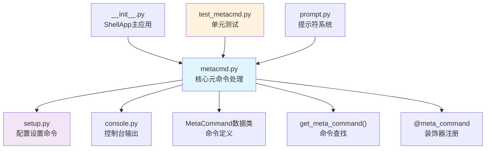

**图表来源**
- [metacmd.py](file://src/kimi_cli/ui/shell/metacmd.py#L1-L276)
- [setup.py](file://src/kimi_cli/ui/shell/setup.py#L1-L195)
- [__init__.py](file://src/kimi_cli/ui/shell/__init__.py#L1-L320)

**章节来源**
- [metacmd.py](file://src/kimi_cli/ui/shell/metacmd.py#L1-L276)
- [setup.py](file://src/kimi_cli/ui/shell/setup.py#L1-L195)

## 核心组件

### MetaCommand数据类

`MetaCommand`是元命令系统的核心数据结构，定义了命令的基本属性和行为：

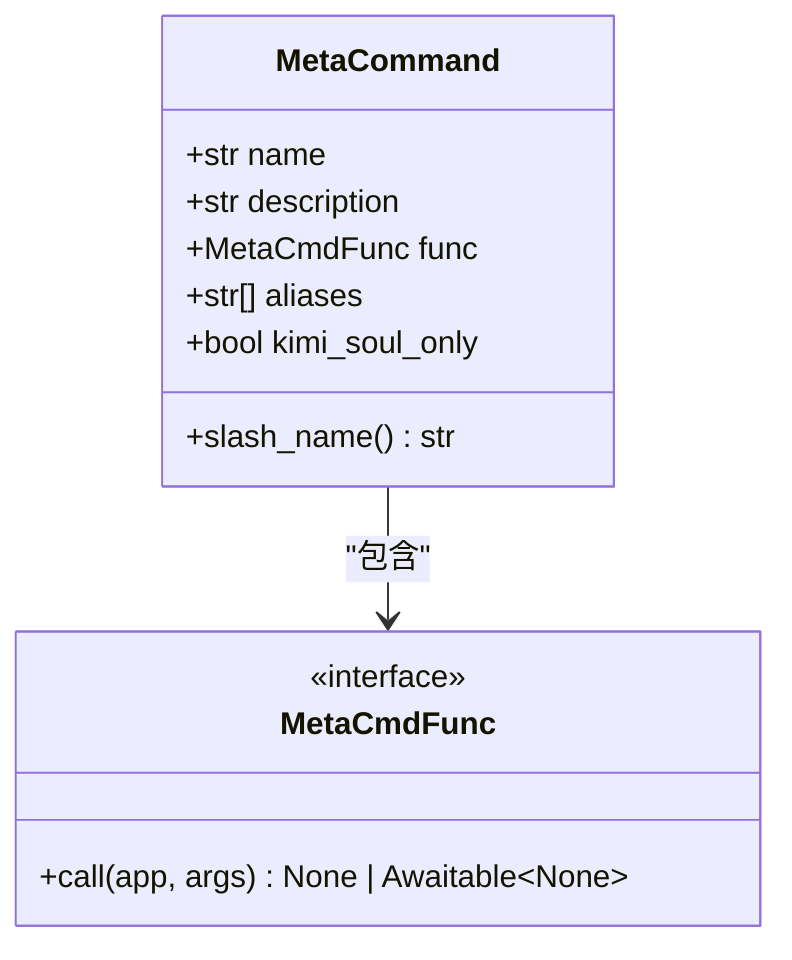

**图表来源**
- [metacmd.py](file://src/kimi_cli/ui/shell/metacmd.py#L40-L54)

### 命令注册机制

系统使用全局字典维护命令注册表：

| 注册表名称 | 类型 | 用途 |
|-----------|------|------|
| `_meta_commands` | `dict[str, MetaCommand]` | 主要名称到命令映射 |
| `_meta_command_aliases` | `dict[str, MetaCommand]` | 别名到命令映射 |

### 解析路由系统

`get_meta_command()`函数负责命令解析和路由：

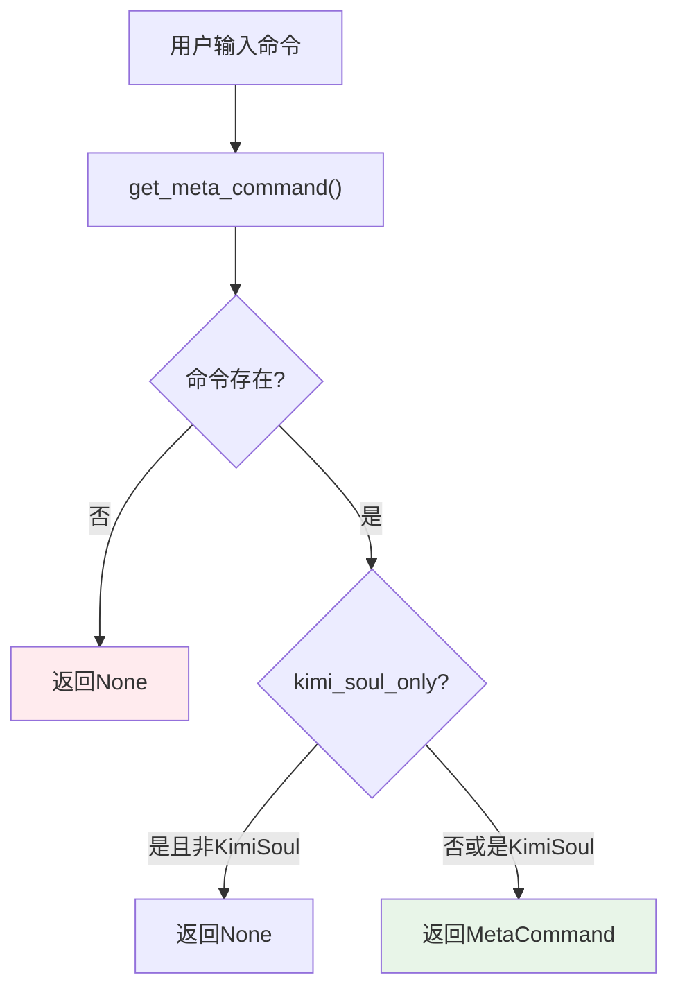

**图表来源**
- [metacmd.py](file://src/kimi_cli/ui/shell/metacmd.py#L62-L63)
- [__init__.py](file://src/kimi_cli/ui/shell/__init__.py#L126-L132)

**章节来源**
- [metacmd.py](file://src/kimi_cli/ui/shell/metacmd.py#L40-L135)

## 架构概览

元命令处理系统采用分层架构设计，从底层的命令注册到顶层的应用集成：

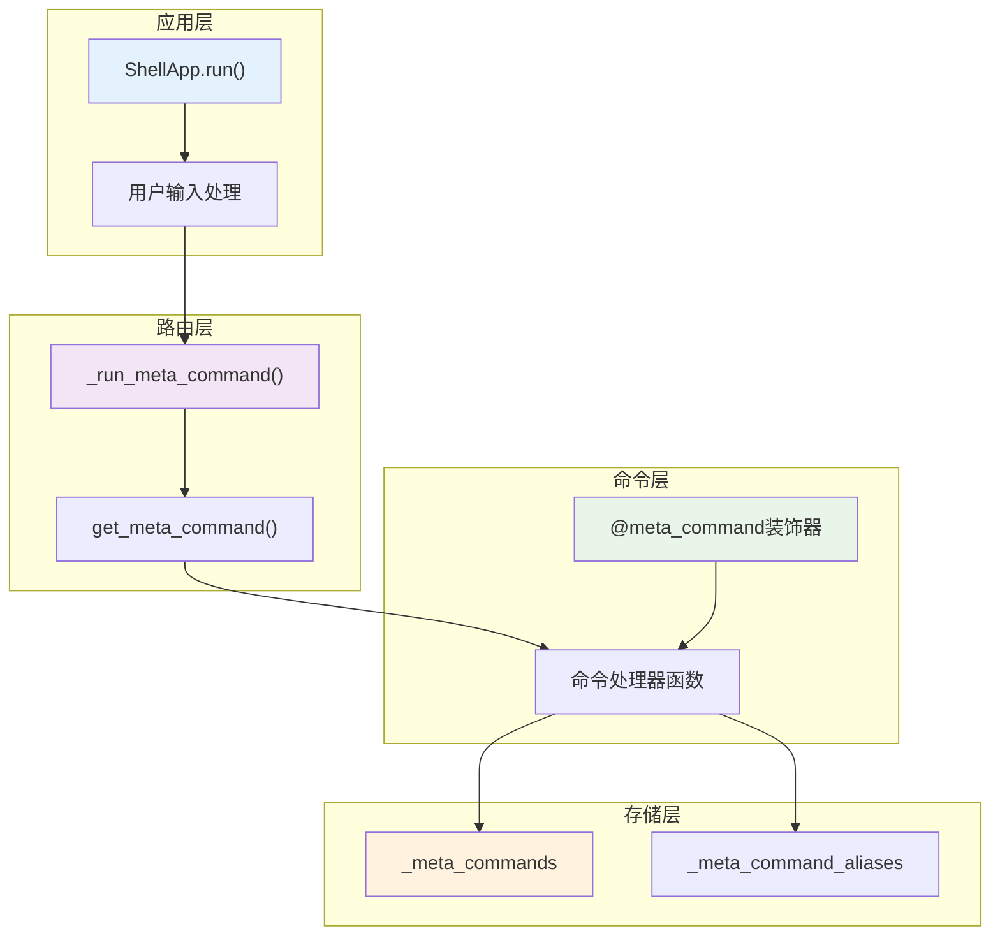

**图表来源**
- [__init__.py](file://src/kimi_cli/ui/shell/__init__.py#L121-L158)
- [metacmd.py](file://src/kimi_cli/ui/shell/metacmd.py#L62-L69)

## 详细组件分析

### 元命令装饰器系统

`@meta_command`装饰器提供了灵活的命令注册机制：

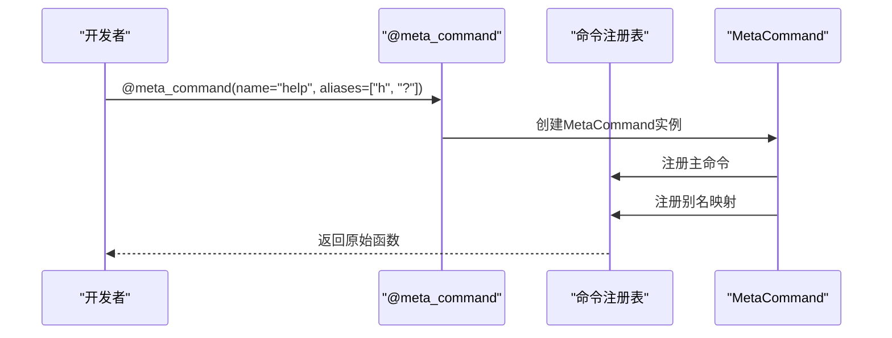

**图表来源**
- [metacmd.py](file://src/kimi_cli/ui/shell/metacmd.py#L110-L131)

#### 装饰器重载支持

系统支持多种装饰器调用方式：

| 调用方式 | 示例 | 用途 |
|---------|------|------|
| 简单装饰 | `@meta_command` | 使用函数名作为命令名 |
| 自定义名称 | `@meta_command(name="run")` | 指定自定义命令名称 |
| 别名装饰 | `@meta_command(aliases=["h", "?"])` | 添加命令别名 |
| 组合装饰 | `@meta_command(name="search", aliases=["s", "find"])` | 同时指定名称和别名 |

### 内置元命令详解

#### /help 帮助命令

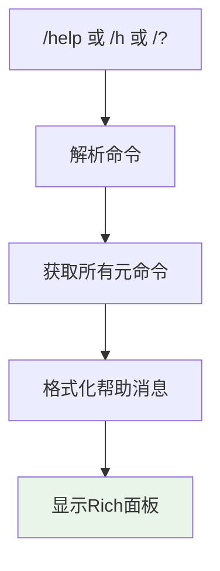

**图表来源**
- [metacmd.py](file://src/kimi_cli/ui/shell/metacmd.py#L159-L175)

#### /setup 配置命令

`/setup`命令引导用户完成完整的配置向导：

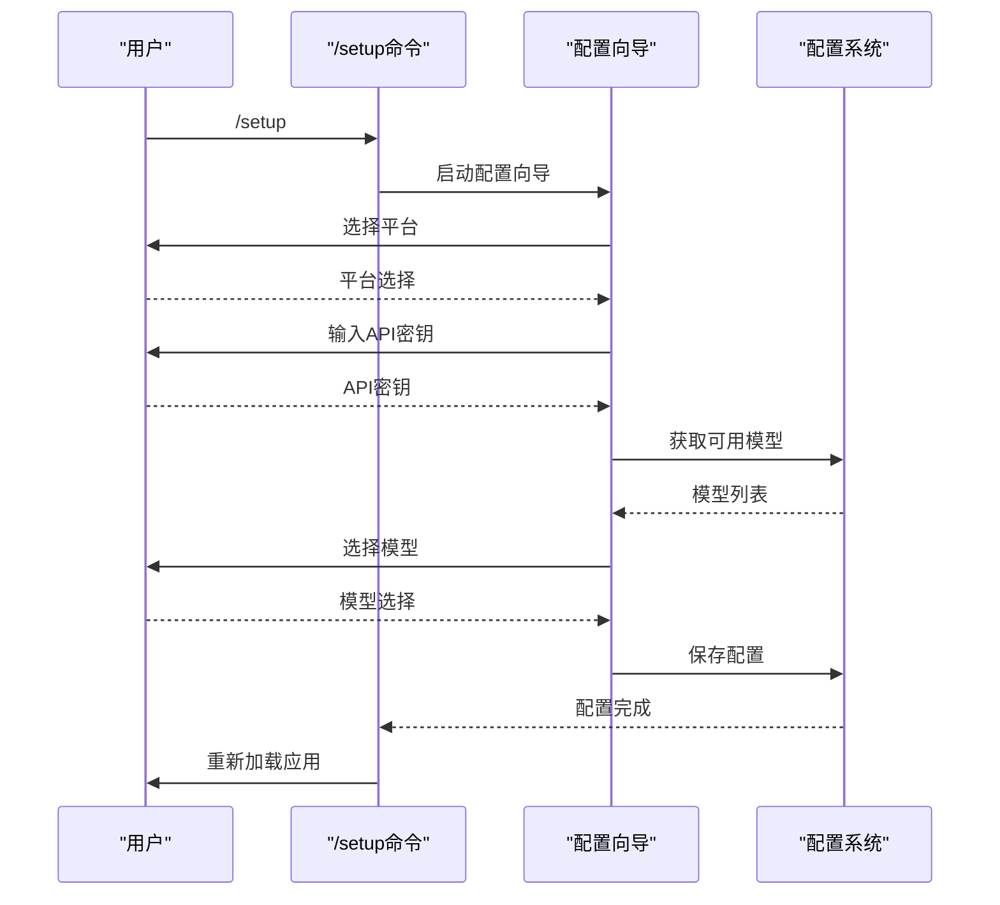

**图表来源**
- [setup.py](file://src/kimi_cli/ui/shell/setup.py#L50-L84)

#### /clear 清屏命令

`/clear`命令安全地清理上下文但保留会话状态：

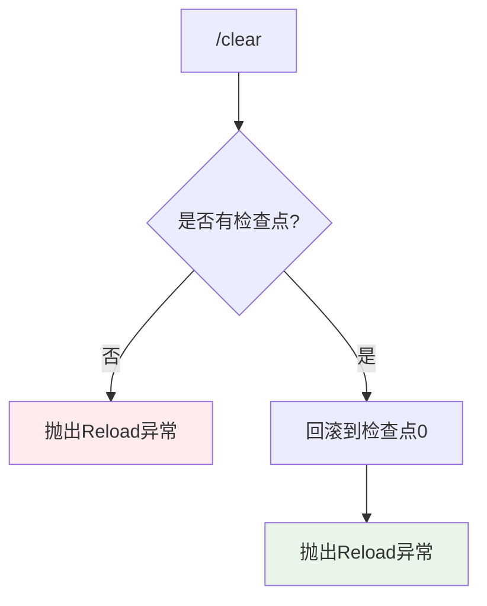

**图表来源**
- [metacmd.py](file://src/kimi_cli/ui/shell/metacmd.py#L235-L244)

#### /init 初始化命令

`/init`命令分析代码库并生成代理配置文件：

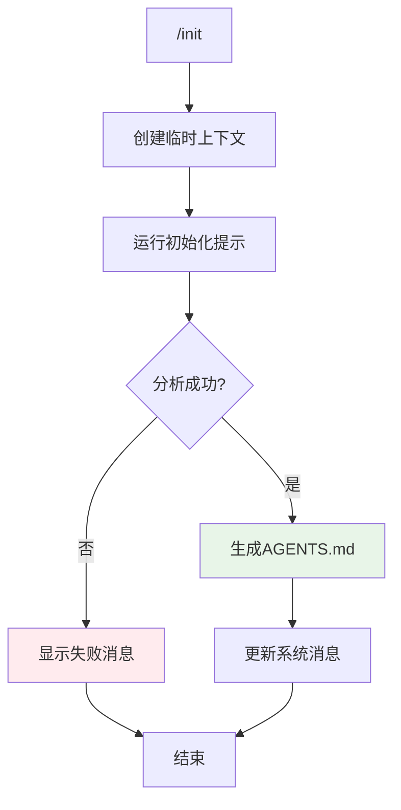

**图表来源**
- [metacmd.py](file://src/kimi_cli/ui/shell/metacmd.py#L204-L233)

### 错误处理机制

系统实现了分层的错误处理策略：

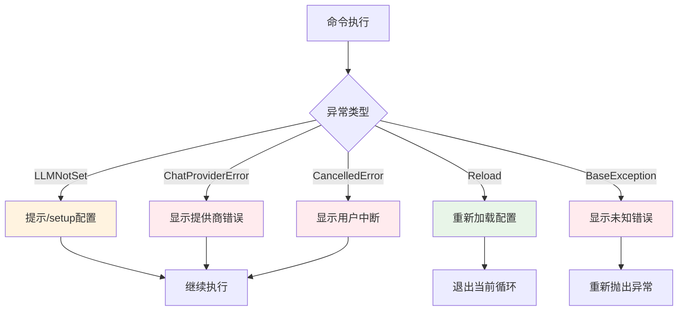

**图表来源**
- [__init__.py](file://src/kimi_cli/ui/shell/__init__.py#L143-L157)

**章节来源**
- [metacmd.py](file://src/kimi_cli/ui/shell/metacmd.py#L159-L275)
- [setup.py](file://src/kimi_cli/ui/shell/setup.py#L50-L84)

## 依赖关系分析

元命令系统的依赖关系图展示了各组件间的相互依赖：

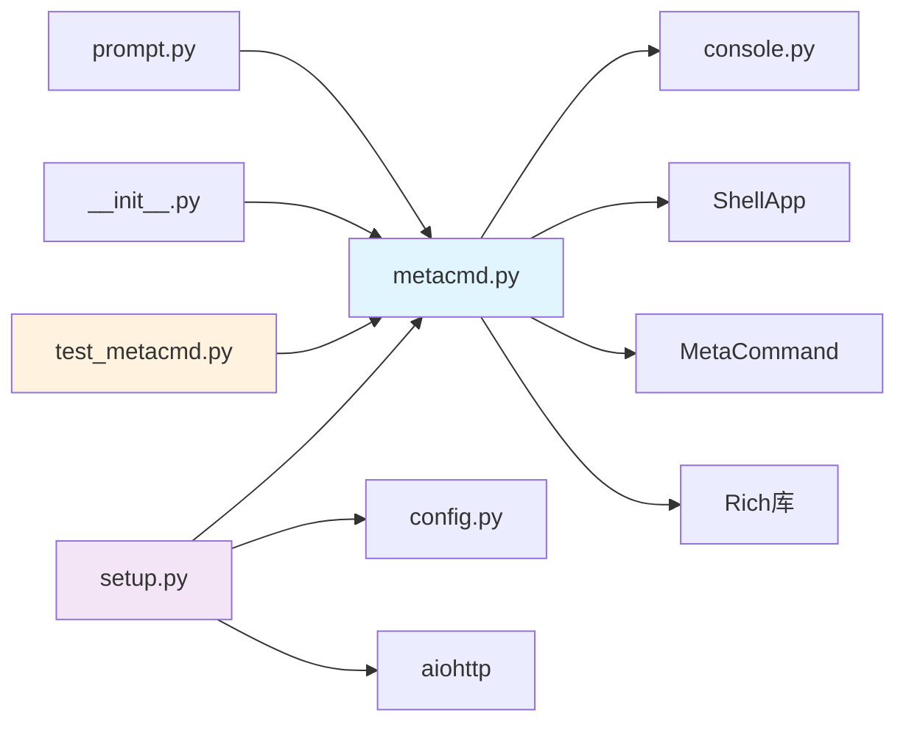

**图表来源**
- [metacmd.py](file://src/kimi_cli/ui/shell/metacmd.py#L1-L25)
- [setup.py](file://src/kimi_cli/ui/shell/setup.py#L1-L15)

### 外部依赖

| 依赖项 | 版本要求 | 用途 |
|--------|----------|------|
| `rich` | 最新版本 | 控制台输出和格式化 |
| `kosong` | 最新版本 | 消息处理 |
| `aiohttp` | 可选 | 异步HTTP请求 |
| `prompt_toolkit` | 可选 | 交互式输入 |

**章节来源**
- [metacmd.py](file://src/kimi_cli/ui/shell/metacmd.py#L1-L25)
- [setup.py](file://src/kimi_cli/ui/shell/setup.py#L1-L15)

## 性能考虑

### 命令查找优化

系统使用哈希表实现O(1)时间复杂度的命令查找：

- 主要名称索引：直接通过命令名快速定位
- 别名索引：通过别名映射到实际命令
- 缓存机制：避免重复解析相同命令

### 内存管理

- 延迟加载：只在需要时加载命令处理器
- 弱引用：防止循环引用导致的内存泄漏
- 及时清理：测试结束后自动清理注册的命令

### 异步处理

- 协程支持：所有元命令都支持异步执行
- 并发控制：合理使用asyncio避免阻塞
- 资源管理：正确处理异步资源的生命周期

## 故障排除指南

### 常见问题及解决方案

#### 命令未找到

**症状**：输入元命令后显示"Meta command not found"

**原因**：
- 命令尚未注册
- 命令名称拼写错误
- 命令被条件禁用

**解决方法**：
1. 检查命令是否已正确注册
2. 验证命令名称拼写
3. 确认命令是否受条件限制

#### 配置相关错误

**症状**：收到"LLM not set"错误

**原因**：
- 尚未完成初始配置
- 配置文件损坏
- API密钥无效

**解决方法**：
1. 运行`/setup`命令重新配置
2. 检查配置文件完整性
3. 验证API密钥有效性

#### 权限问题

**症状**：某些命令无法执行

**原因**：
- 命令仅适用于特定环境
- 缺少必要的权限
- 系统资源不足

**解决方法**：
1. 检查命令的适用范围
2. 确认系统权限设置
3. 检查系统资源使用情况

**章节来源**
- [test_metacmd.py](file://tests/test_metacmd.py#L1-L133)
- [__init__.py](file://src/kimi_cli/ui/shell/__init__.py#L128-L157)

## 结论

Kimi CLI的元命令处理系统是一个设计精良、功能完备的命令框架。它通过装饰器模式实现了灵活的命令注册机制，通过分层架构确保了良好的可维护性和扩展性。

### 主要优势

1. **统一的接口设计**：所有元命令都遵循相同的接口规范
2. **灵活的注册机制**：支持多种注册方式和别名配置
3. **完善的错误处理**：多层次的异常处理确保系统稳定性
4. **良好的扩展性**：清晰的接口设计便于添加新命令
5. **丰富的内置功能**：涵盖配置、调试、管理等各个方面

### 最佳实践建议

1. **命令命名规范**：使用有意义的命令名称和描述
2. **错误处理**：为每个命令提供适当的错误处理逻辑
3. **文档维护**：保持命令文档的及时更新
4. **测试覆盖**：为新命令编写充分的测试用例
5. **性能优化**：避免在命令中执行耗时操作

该系统为Kimi CLI提供了强大的命令行交互能力，是整个应用程序的重要基础设施。通过合理的架构设计和完善的测试体系，确保了系统的稳定性和可扩展性。