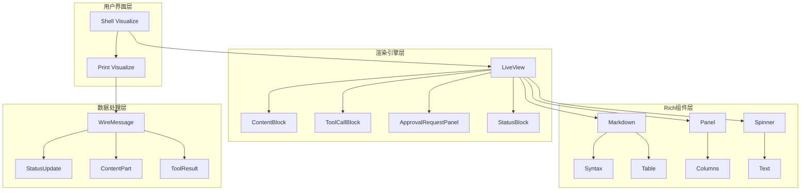
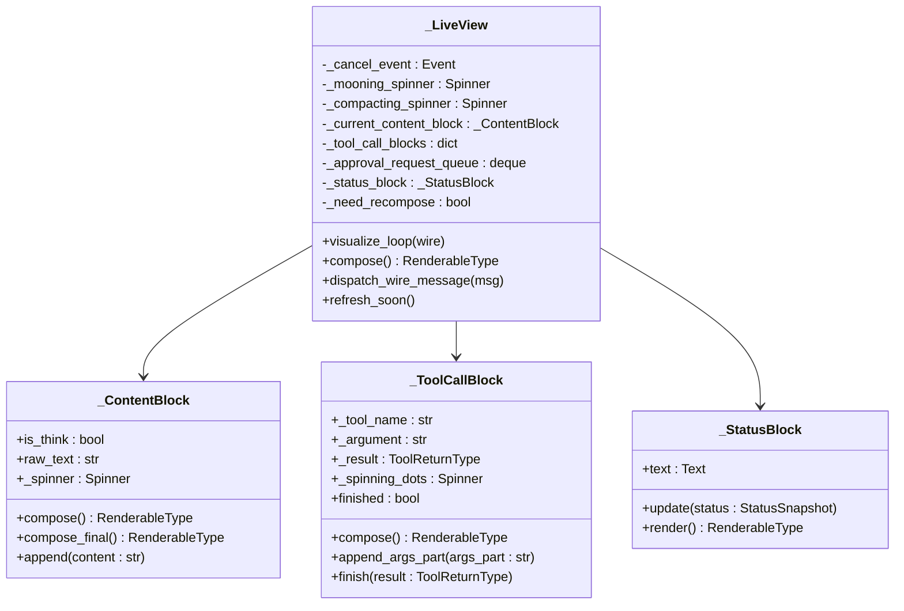
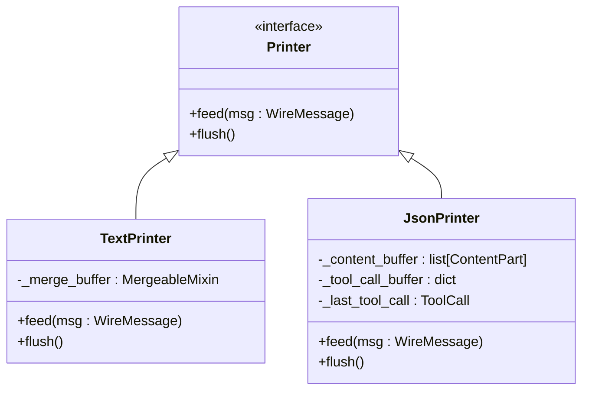
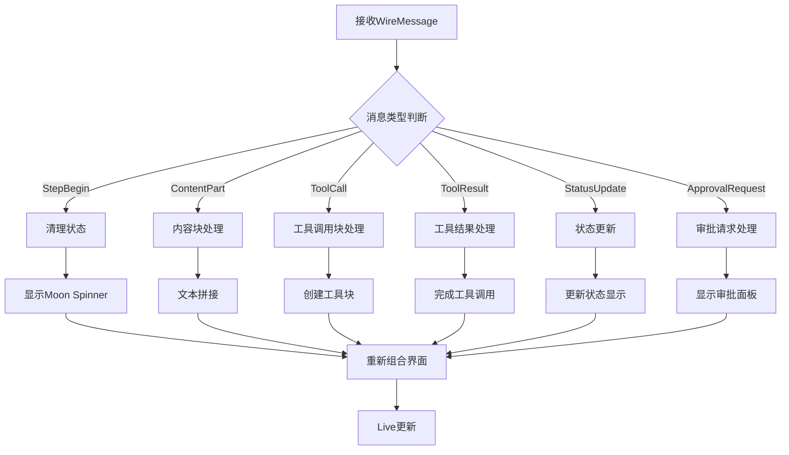
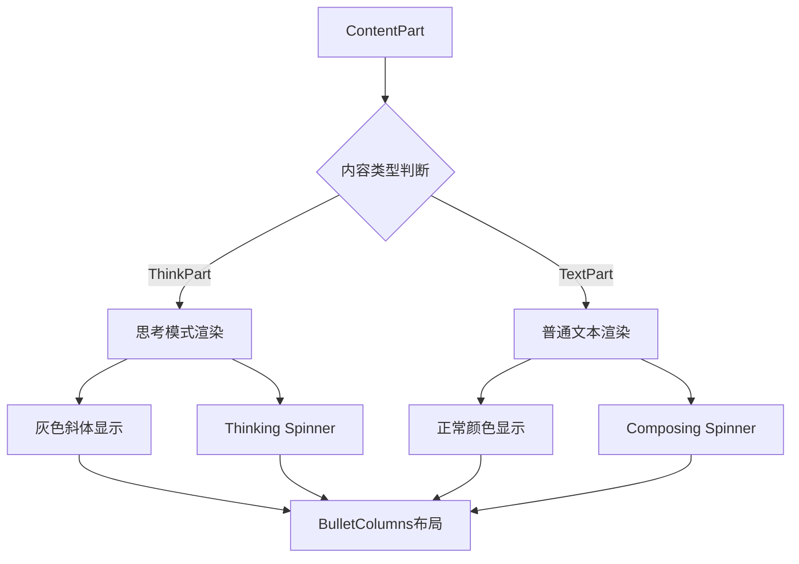
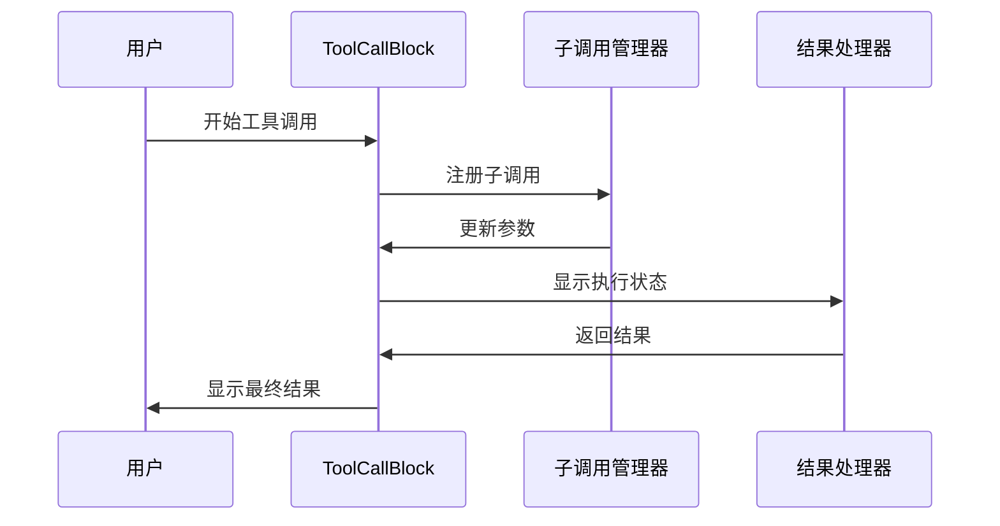
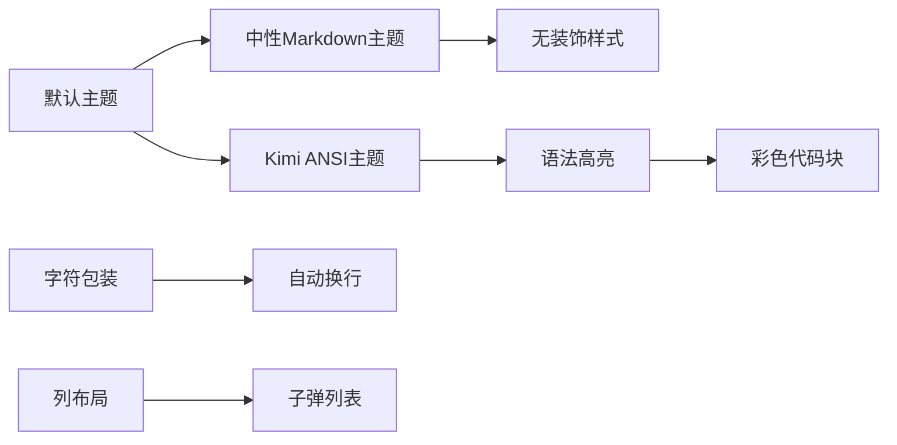
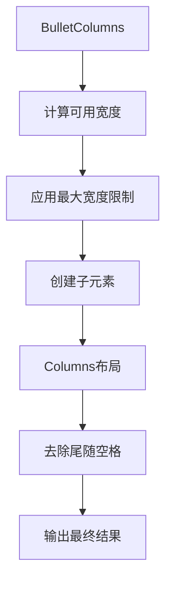
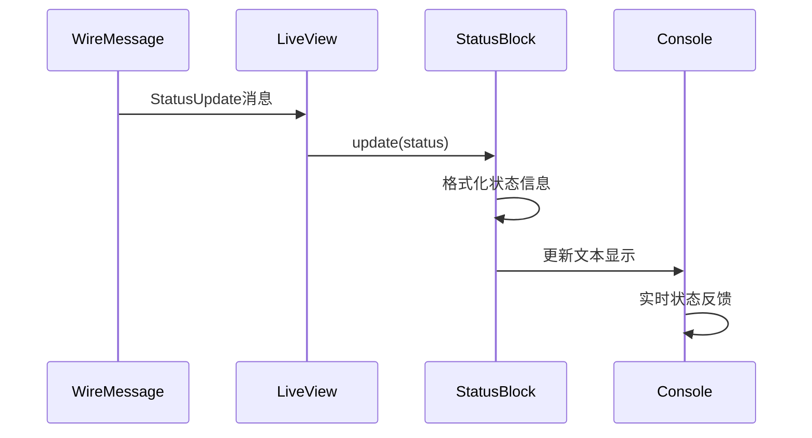
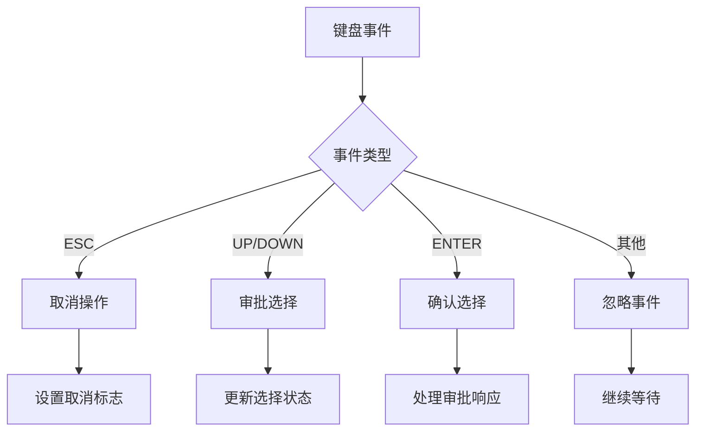

# 可视化渲染引擎深度解析

<cite>
**本文档中引用的文件**
- [visualize.py](file://src/kimi_cli/ui/print/visualize.py)
- [visualize.py](file://src/kimi_cli/ui/shell/visualize.py)
- [console.py](file://src/kimi_cli/ui/shell/console.py)
- [markdown.py](file://src/kimi_cli/utils/rich/markdown.py)
- [columns.py](file://src/kimi_cli/utils/rich/columns.py)
- [__init__.py](file://src/kimi_cli/utils/rich/__init__.py)
- [message.py](file://src/kimi_cli/soul/message.py)
</cite>

## 目录
1. [引言](#引言)
2. [项目架构概览](#项目架构概览)
3. [核心可视化组件](#核心可视化组件)
4. [可视化渲染引擎实现](#可视化渲染引擎实现)
5. [Rich库集成与样式系统](#rich库集成与样式系统)
6. [状态更新与动态刷新](#状态更新与动态刷新)
7. [可访问性设计原则](#可访问性设计原则)
8. [扩展接口与自定义样式](#扩展接口与自定义样式)
9. [性能优化策略](#性能优化策略)
10. [总结](#总结)

## 引言

Kimi CLI的可视化渲染引擎是一个基于Rich库构建的专业级终端UI系统，负责将LLM输出、工具执行结果和系统状态转换为富文本终端输出。该引擎通过精心设计的组件架构，实现了动态进度指示、语法高亮、表格渲染和错误信息展示等高级功能，同时严格遵循可访问性设计原则。

## 项目架构概览

可视化渲染系统采用分层架构设计，主要包含以下核心层次：



**图表来源**
- [visualize.py](file://src/kimi_cli/ui/shell/visualize.py#L40-L566)
- [visualize.py](file://src/kimi_cli/ui/print/visualize.py#L112-L130)

**章节来源**
- [visualize.py](file://src/kimi_cli/ui/shell/visualize.py#L1-L50)
- [visualize.py](file://src/kimi_cli/ui/print/visualize.py#L1-L30)

## 核心可视化组件

### Shell Visualize组件

Shell Visualize是交互式终端可视化的主入口点，提供了实时动态更新的用户体验。

#### LiveView核心架构



**图表来源**
- [visualize.py](file://src/kimi_cli/ui/shell/visualize.py#L291-L566)

#### 组件生命周期管理

每个可视化组件都遵循严格的生命周期管理模式：

1. **初始化阶段**: 创建组件实例并设置初始状态
2. **渲染阶段**: 将组件转换为Rich可渲染对象
3. **更新阶段**: 处理消息流并更新组件状态
4. **清理阶段**: 释放资源并重置状态

**章节来源**
- [visualize.py](file://src/kimi_cli/ui/shell/visualize.py#L291-L340)

### Print Visualize组件

Print Visualize专注于纯文本输出和JSON流式处理，提供了简洁高效的渲染方案。

#### 渲染器协议设计



**图表来源**
- [visualize.py](file://src/kimi_cli/ui/print/visualize.py#L15-L130)

**章节来源**
- [visualize.py](file://src/kimi_cli/ui/print/visualize.py#L15-L130)

## 可视化渲染引擎实现

### visualize()函数核心逻辑

`visualize()`函数是整个渲染引擎的协调中心，负责消息路由和组件调度。

#### 消息处理流程



**图表来源**
- [visualize.py](file://src/kimi_cli/ui/shell/visualize.py#L362-L397)

#### 动态刷新机制

系统采用增量更新策略，只有在需要时才触发界面重绘：

```python
# 刷新控制示例
def refresh_soon(self) -> None:
    self._need_recompose = True

def compose(self) -> RenderableType:
    # 只有在需要时才重新组合
    if self._need_recompose:
        return Group(*blocks)
```

**章节来源**
- [visualize.py](file://src/kimi_cli/ui/shell/visualize.py#L342-L361)

### 内容块渲染策略

#### 思考过程与普通内容的区分

系统能够智能识别和渲染不同类型的文本内容：



**图表来源**
- [visualize.py](file://src/kimi_cli/ui/shell/visualize.py#L479-L495)

#### 工具调用块的复杂渲染

工具调用块支持嵌套子调用和实时参数更新：



**图表来源**
- [visualize.py](file://src/kimi_cli/ui/shell/visualize.py#L80-L210)

**章节来源**
- [visualize.py](file://src/kimi_cli/ui/shell/visualize.py#L479-L510)

## Rich库集成与样式系统

### Markdown渲染引擎

系统集成了增强版的Rich Markdown渲染器，支持丰富的格式化选项。

#### 主题配置系统



**图表来源**
- [console.py](file://src/kimi_cli/ui/shell/console.py#L6-L32)
- [__init__.py](file://src/kimi_cli/utils/rich/__init__.py#L15-L34)

#### 语法高亮配置

系统定义了专门的Kimi ANSI主题，提供专业的代码着色：

| 元素类型 | 颜色方案 | 特殊效果 |
|---------|---------|---------|
| 关键字 | bright_magenta, bold | 突出显示 |
| 函数名 | bright_blue | 清晰标识 |
| 字符串 | yellow | 区分常量 |
| 注释 | bright_black, italic | 降低优先级 |
| 数字 | bright_green | 数值强调 |

**章节来源**
- [markdown.py](file://src/kimi_cli/utils/rich/markdown.py#L68-L118)

### 布局组件系统

#### BulletColumns布局

BulletColumns提供了智能的子弹列表布局，支持动态宽度调整：



**图表来源**
- [columns.py](file://src/kimi_cli/utils/rich/columns.py#L54-L100)

#### Panel组件应用

审批请求面板使用Rich Panel组件实现：

```python
Panel.fit(
    content,
    title="[yellow]⚠ Approval Requested[/yellow]",
    border_style="yellow",
    padding=(1, 2),
)
```

**章节来源**
- [visualize.py](file://src/kimi_cli/ui/shell/visualize.py#L212-L249)

## 状态更新与动态刷新

### StatusUpdate消息处理

StatusUpdate是系统状态监控的核心机制，支持实时进度跟踪。

#### 状态快照更新流程



**图表来源**
- [visualize.py](file://src/kimi_cli/ui/shell/visualize.py#L264-L274)

#### 进度指示器管理

系统维护多种进度指示器以适应不同的操作状态：

| 指示器类型 | 触发条件 | 显示内容 |
|-----------|---------|---------|
| Moon Spinner | StepBegin | "探索中..." |
| Balloon Spinner | CompactionBegin | "压缩中..." |
| Dots Spinner | 工具调用 | "执行中..." |
| 静态文本 | 状态更新 | "上下文使用率" |

**章节来源**
- [visualize.py](file://src/kimi_cli/ui/shell/visualize.py#L366-L382)

### 动态刷新策略

#### 增量更新机制

系统采用增量更新策略，避免不必要的界面重绘：

```python
# 刷新标记机制
def refresh_soon(self) -> None:
    self._need_recompose = True

# 条件更新检查
if self._need_recompose:
    live.update(self.compose())
    self._need_recompose = False
```

#### 键盘事件处理

系统支持实时键盘交互，不影响正在进行的操作：



**图表来源**
- [visualize.py](file://src/kimi_cli/ui/shell/visualize.py#L398-L435)

**章节来源**
- [visualize.py](file://src/kimi_cli/ui/shell/visualize.py#L398-L435)

## 可访问性设计原则

### 色彩对比度优化

系统严格遵循WCAG可访问性标准，确保良好的视觉对比度：

#### 颜色方案设计

| 元素类别 | 前景色 | 背景色 | 对比度 | 可访问性等级 |
|---------|-------|-------|--------|-------------|
| 标题 | bright_white | 默认 | AAA | 最高 |
| 代码 | bright_cyan | 默认 | AA | 高 |
| 链接 | bright_blue | 默认 | AA | 高 |
| 错误 | red | 默认 | AAA | 最高 |
| 灰色文本 | grey50 | 默认 | AA | 中等 |

#### 屏幕阅读器兼容性

系统通过语义化标记和适当的ARIA属性支持屏幕阅读器：

```python
# 语义化文本标记
Text.from_markup(f"[blue]{self._tool_name}[/blue]")
Text(f"→ {option_text}", style="cyan")
```

**章节来源**
- [markdown.py](file://src/kimi_cli/utils/rich/markdown.py#L45-L66)

### 结构化输出设计

#### 信息层次化组织

系统采用清晰的信息层次结构：

1. **标题级别**: H1-H6提供明确的文档结构
2. **代码块**: 语法高亮区分不同类型的内容
3. **列表**: 有序和无序列表帮助信息分组
4. **表格**: 结构化数据显示

#### 错误信息标准化

错误信息采用统一的格式和颜色编码：

```python
# 错误信息渲染
if isinstance(tool_result.result, ToolError):
    content = [system(f"ERROR: {message}")]
    if tool_result.result.output:
        content.extend(_output_to_content_parts(tool_result.result.output))
```

**章节来源**
- [message.py](file://src/kimi_cli/soul/message.py#L16-L35)

## 扩展接口与自定义样式

### 自定义渲染样式

#### 主题扩展接口

系统提供了灵活的主题扩展机制：

```python
# 自定义主题示例
custom_theme = Theme({
    "custom.success": "green bold",
    "custom.error": "red bold",
    "custom.warning": "yellow bold",
})

console = Console(theme=custom_theme)
```

#### 组件样式定制

开发者可以通过继承现有组件来自定义渲染行为：

```python
class CustomContentBlock(_ContentBlock):
    def compose_final(self) -> RenderableType:
        # 自定义最终渲染逻辑
        return Panel(
            Markdown(self.raw_text),
            title="Custom Title",
            border_style="blue"
        )
```

### 扩展接口规范

#### 自定义消息处理器

```python
class CustomMessageHandler:
    def __init__(self, console: Console):
        self.console = console
    
    def handle_custom_message(self, message: CustomMessage) -> None:
        # 自定义消息处理逻辑
        self.console.print(
            Text(message.content, style="custom.format")
        )
```

#### 插件化渲染器

系统支持插件化的渲染器扩展：

```python
# 渲染器注册机制
class RendererPlugin:
    @classmethod
    def register(cls, message_type: Type):
        # 注册自定义消息类型处理器
        pass
```

**章节来源**
- [console.py](file://src/kimi_cli/ui/shell/console.py#L31-L32)

## 性能优化策略

### 渲染性能优化

#### 增量渲染算法

系统采用增量渲染算法，只更新发生变化的部分：

```python
# 性能优化示例
def compose(self) -> RenderableType:
    if not self._need_recompose:
        return self._cached_renderable
    
    # 只在需要时重新计算
    self._cached_renderable = self._compute_new_layout()
    self._need_recompose = False
    return self._cached_renderable
```

#### 内存管理优化

- **对象池化**: 重用频繁创建的对象
- **延迟加载**: 按需创建渲染组件
- **垃圾回收**: 及时清理不再使用的资源

### 并发处理优化

#### 异步消息处理

系统采用异步消息处理模式，避免阻塞UI线程：

```python
async def visualize_loop(self, wire: WireUISide):
    async with _keyboard_listener(keyboard_handler):
        while True:
            msg = await wire.receive()
            self.dispatch_wire_message(msg)
```

**章节来源**
- [visualize.py](file://src/kimi_cli/ui/shell/visualize.py#L308-L341)

## 总结

Kimi CLI的可视化渲染引擎代表了现代终端UI设计的最佳实践。通过Rich库的强大功能和精心设计的架构，系统实现了：

1. **专业级视觉呈现**: 支持复杂的富文本格式和交互式组件
2. **实时动态更新**: 无中断的状态监控和进度反馈
3. **可访问性优先**: 严格遵循无障碍设计标准
4. **高度可扩展**: 提供完善的扩展接口和自定义能力
5. **卓越性能**: 优化的渲染算法和内存管理

该系统不仅满足了当前的功能需求，还为未来的功能扩展和性能优化奠定了坚实的基础。通过模块化的设计和清晰的接口定义，开发者可以轻松地添加新的渲染组件和自定义样式，使系统始终保持与时俱进的技术先进性。