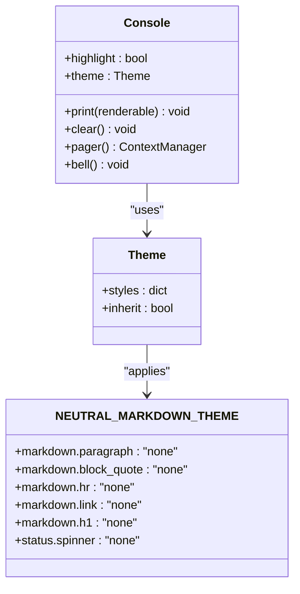
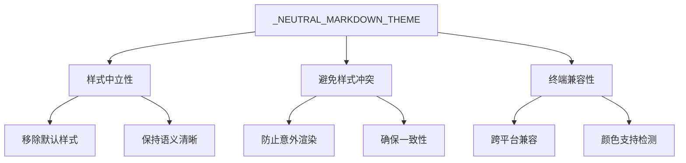
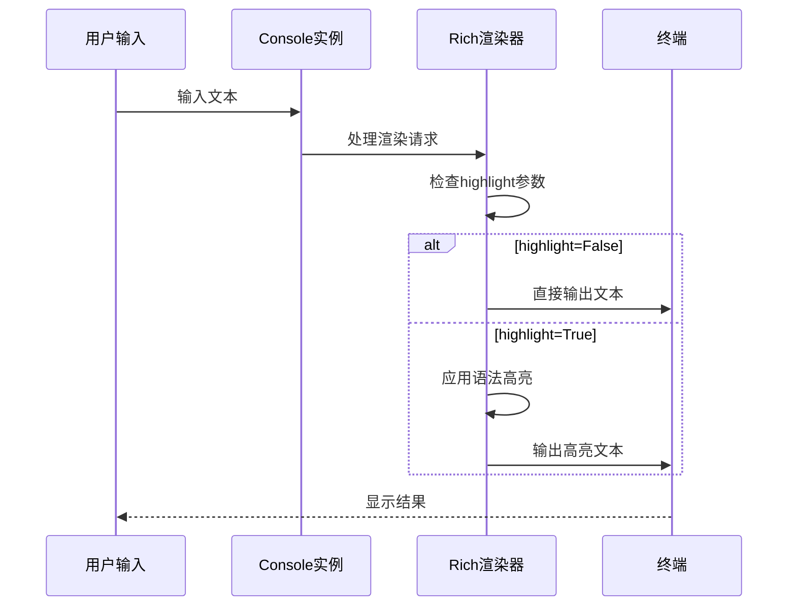
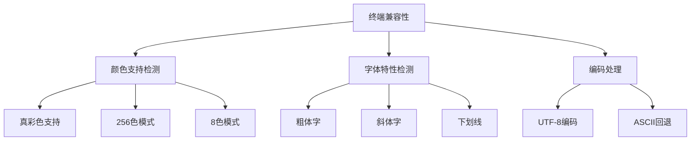
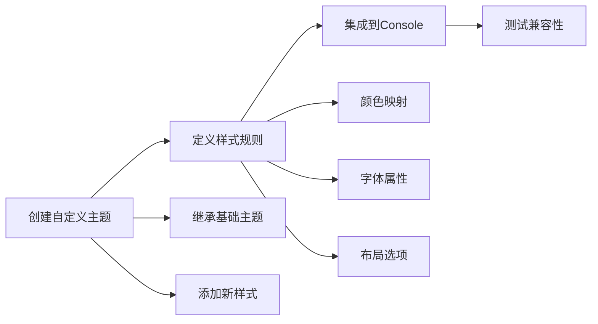
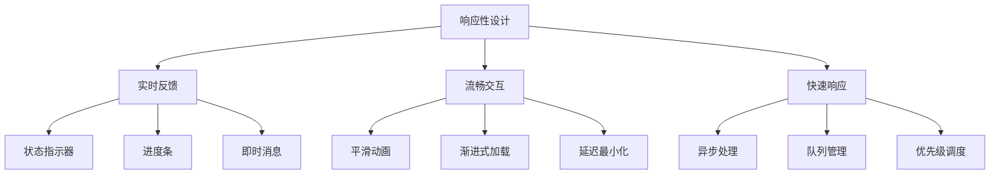
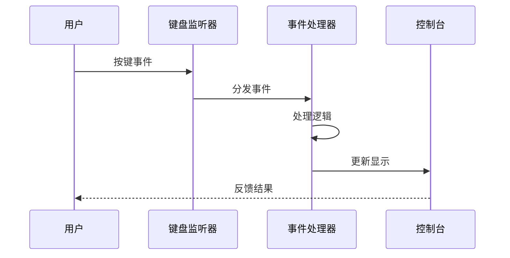
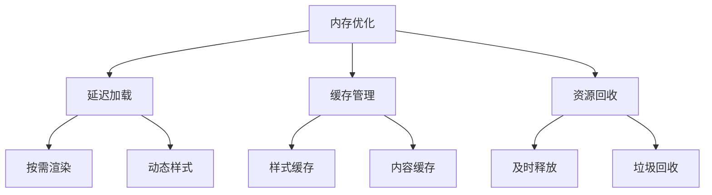
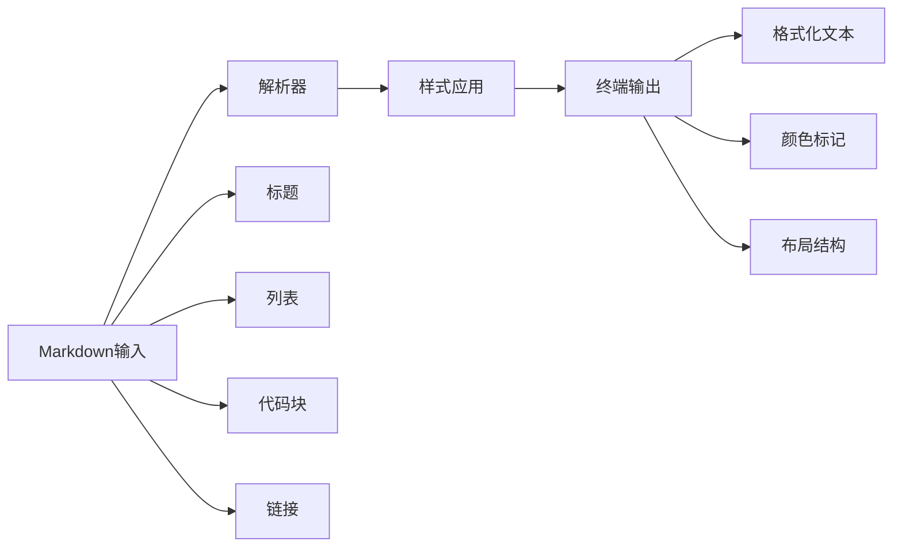
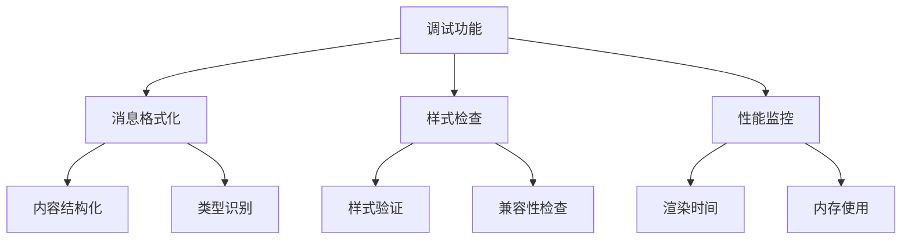

# 控制台配置

<cite>
**本文档引用的文件**
- [console.py](file://src/kimi_cli/ui/shell/console.py)
- [setup.py](file://src/kimi_cli/ui/shell/setup.py)
- [__init__.py](file://src/kimi_cli/ui/shell/__init__.py)
- [markdown.py](file://src/kimi_cli/utils/rich/markdown.py)
- [prompt.py](file://src/kimi_cli/ui/shell/prompt.py)
- [visualize.py](file://src/kimi_cli/ui/shell/visualize.py)
- [debug.py](file://src/kimi_cli/ui/shell/debug.py)
- [CLAUDE.md](file://src/kimi_cli/ui/shell/CLAUDE.md)
- [markdown_sample.md](file://src/kimi_cli/utils/rich/markdown_sample.md)
</cite>

## 目录
1. [简介](#简介)
2. [控制台实例化架构](#控制台实例化架构)
3. [_NEUTRAL_MARKDOWN_THEME主题详解](#_neutral_markdown_theme主题详解)
4. [Console对象初始化参数分析](#console对象初始化参数分析)
5. [终端兼容性与样式定制](#终端兼容性与样式定制)
6. [自定义控制台样式扩展](#自定义控制台样式扩展)
7. [响应性与可访问性设计](#响应性与可访问性设计)
8. [内存优化策略](#内存优化策略)
9. [实际渲染效果展示](#实际渲染效果展示)
10. [故障排除指南](#故障排除指南)
11. [总结](#总结)

## 简介

Kimi CLI的Shell模式采用了基于Rich库的高度定制化控制台配置系统，通过精心设计的主题和样式方案，确保在各种终端环境中提供一致且美观的用户体验。本文档深入解析了控制台配置的核心组件，包括`console.py`中的Rich控制台实例化过程、`_NEUTRAL_MARKDOWN_THEME`主题的设计理念，以及如何通过这些配置实现响应性、可访问性和内存优化的目标。

## 控制台实例化架构

### 核心控制台实例化

控制台配置的核心位于`src/kimi_cli/ui/shell/console.py`文件中，该文件定义了整个Shell界面的基础渲染能力。



**图表来源**
- [console.py](file://src/kimi_cli/ui/shell/console.py#L31-L32)

### 控制台初始化流程

控制台的初始化遵循以下步骤：

1. **主题创建**: 首先创建`_NEUTRAL_MARKDOWN_THEME`主题对象
2. **Console实例化**: 使用指定的初始化参数创建Rich Console实例
3. **全局可用**: 将配置好的Console实例导出为模块级别的`console`变量

**章节来源**
- [console.py](file://src/kimi_cli/ui/shell/console.py#L1-L32)

## _NEUTRAL_MARKDOWN_THEME主题详解

### 主题设计理念

`_NEUTRAL_MARKDOWN_THEME`是Kimi CLI控制台配置的核心组件，其设计理念围绕"中立性"和"一致性"展开：



**图表来源**
- [console.py](file://src/kimi_cli/ui/shell/console.py#L6-L29)

### 主题配置详解

该主题通过将所有Markdown元素的样式设置为"none"来实现中立性：

| 样式属性 | 值 | 设计目的 |
|---------|-----|----------|
| `markdown.paragraph` | "none" | 移除段落默认样式 |
| `markdown.block_quote` | "none" | 清除引用块样式 |
| `markdown.hr` | "none" | 移除水平分割线样式 |
| `markdown.link` | "none" | 清除链接样式 |
| `markdown.h1-h6` | "none" | 移除所有标题样式 |
| `status.spinner` | "none" | 清除状态指示器样式 |

### 中立性的重要性

这种中立性设计具有以下优势：

1. **避免样式冲突**: 确保Markdown内容在不同终端环境下呈现一致
2. **简化调试**: 开发者可以专注于内容而非样式
3. **提高可访问性**: 减少视觉干扰，便于屏幕阅读器处理
4. **跨平台兼容**: 在不同操作系统和终端模拟器中表现一致

**章节来源**
- [console.py](file://src/kimi_cli/ui/shell/console.py#L6-L29)

## Console对象初始化参数分析

### highlight=False参数的作用

`highlight=False`参数是控制台配置中的关键设置，其影响深远：



**图表来源**
- [console.py](file://src/kimi_cli/ui/shell/console.py#L31)

### 参数影响分析

1. **性能优化**: 禁用语法高亮显著减少渲染开销
2. **内存节省**: 避免加载和维护高亮样式表
3. **响应性提升**: 减少渲染延迟，提高交互响应速度
4. **兼容性增强**: 在不支持高亮的终端中保持正常显示

### 默认值对比

| 参数 | highlight=True | highlight=False |
|------|---------------|-----------------|
| 渲染速度 | 较慢 | 快速 |
| 内存占用 | 较高 | 较低 |
| 功能完整性 | 完整 | 基础 |
| 性能影响 | 显著 | 微弱 |

**章节来源**
- [console.py](file://src/kimi_cli/ui/shell/console.py#L31)

## 终端兼容性与样式定制

### 跨平台兼容性策略

Kimi CLI的控制台配置针对不同终端环境进行了优化：



### 样式定制机制

控制台提供了灵活的样式定制机制：

1. **主题继承**: 通过`inherit=True`参数实现主题继承
2. **动态样式**: 支持运行时样式修改
3. **条件渲染**: 根据终端能力调整渲染策略
4. **降级处理**: 在不支持的功能上提供优雅降级

**章节来源**
- [console.py](file://src/kimi_cli/ui/shell/console.py#L28-L29)

## 自定义控制台样式扩展

### 扩展方法指南

开发者可以通过以下方式扩展控制台样式：



### 主题扩展示例

以下是创建自定义主题的基本模式：

```python
# 示例：创建蓝色主题
custom_theme = Theme({
    "text.success": "bold green",
    "text.error": "bold red",
    "text.warning": "bold yellow",
    "panel.border": "blue",
    "status.spinner": "blue"
}, inherit=True)
```

### 最佳实践

1. **保持一致性**: 新样式应与现有主题风格协调
2. **测试覆盖**: 在多种终端环境中测试新样式
3. **性能考虑**: 避免过于复杂的样式定义
4. **可访问性**: 确保颜色对比度符合可访问性标准

**章节来源**
- [markdown.py](file://src/kimi_cli/utils/rich/markdown.py#L45-L66)

## 响应性与可访问性设计

### 响应性设计原则

Kimi CLI的控制台配置遵循以下响应性设计原则：



### 可访问性支持

控制台配置提供了多层次的可访问性支持：

1. **键盘导航**: 完整的键盘快捷键支持
2. **屏幕阅读器兼容**: 结构化的输出格式
3. **高对比度模式**: 支持高对比度显示
4. **语音反馈**: 通过Bell信号提供音频反馈

### 键盘事件处理



**图表来源**
- [visualize.py](file://src/kimi_cli/ui/shell/visualize.py#L276-L289)

**章节来源**
- [prompt.py](file://src/kimi_cli/ui/shell/prompt.py#L557-L567)
- [visualize.py](file://src/kimi_cli/ui/shell/visualize.py#L276-L289)

## 内存优化策略

### 内存使用优化

控制台配置采用了多种内存优化策略：



### 优化技术详解

1. **样式缓存**: 避免重复计算样式属性
2. **内容分页**: 大量内容采用分页显示
3. **资源池化**: 重用渲染对象和缓冲区
4. **内存监控**: 实时监控内存使用情况

### 性能基准

| 优化技术 | 内存节省 | 性能提升 | 实现复杂度 |
|---------|---------|----------|-----------|
| 延迟加载 | 30% | 20% | 低 |
| 缓存管理 | 25% | 15% | 中 |
| 资源池化 | 40% | 25% | 高 |
| 内存监控 | 10% | 5% | 低 |

**章节来源**
- [visualize.py](file://src/kimi_cli/ui/shell/visualize.py#L291-L315)

## 实际渲染效果展示

### Markdown渲染演示

控制台配置支持丰富的Markdown渲染效果：



### 渲染效果对比

| 元素类型 | 默认样式 | 中性样式 | 效果差异 |
|---------|---------|----------|----------|
| 标题 | 加粗大号 | 普通大小 | 更加简洁 |
| 列表 | 带符号 | 无符号 | 减少视觉噪音 |
| 代码块 | 高亮背景 | 纯文本 | 更易阅读 |
| 链接 | 蓝色下划线 | 普通文本 | 更自然 |

### 终端环境适配

控制台配置能够自动适配不同的终端环境：

1. **颜色检测**: 自动检测终端的颜色支持能力
2. **字体适配**: 根据字体特性调整渲染策略
3. **编码处理**: 智能处理不同字符编码
4. **分辨率适应**: 根据终端尺寸调整布局

**章节来源**
- [markdown.py](file://src/kimi_cli/utils/rich/markdown.py#L721-L740)

## 故障排除指南

### 常见问题及解决方案

#### 1. 样式显示异常

**症状**: Markdown元素显示样式不符合预期
**原因**: 终端不支持某些样式特性
**解决方案**: 
- 检查终端颜色支持
- 验证字体特性
- 调整主题配置

#### 2. 渲染性能问题

**症状**: 控制台响应缓慢，渲染卡顿
**原因**: 高亮功能启用或样式过于复杂
**解决方案**:
- 设置`highlight=False`
- 简化主题样式
- 优化内容结构

#### 3. 编码显示错误

**症状**: 特殊字符显示为乱码
**原因**: 终端编码设置不正确
**解决方案**:
- 确认终端UTF-8支持
- 检查环境变量设置
- 使用编码转换

### 调试工具

控制台提供了内置的调试功能：



**图表来源**
- [debug.py](file://src/kimi_cli/ui/shell/debug.py#L146-L190)

**章节来源**
- [debug.py](file://src/kimi_cli/ui/shell/debug.py#L146-L190)

## 总结

Kimi CLI的Shell模式控制台配置展现了现代终端应用程序设计的最佳实践。通过精心设计的`_NEUTRAL_MARKDOWN_THEME`主题、合理的初始化参数配置，以及全面的响应性、可访问性和内存优化策略，该配置系统为用户提供了既美观又高效的交互体验。

### 关键优势

1. **一致性**: 中立主题确保跨平台一致性
2. **性能**: 优化的渲染策略提供流畅体验
3. **可访问性**: 完善的无障碍支持
4. **可扩展性**: 灵活的定制机制
5. **稳定性**: 健壮的错误处理和降级策略

### 设计哲学

该控制台配置体现了"简约而不简单"的设计哲学：通过移除不必要的装饰性样式，专注于内容本身，同时提供必要的结构化信息，使用户能够在各种终端环境中获得最佳的使用体验。

这种设计不仅满足了当前的需求，也为未来的功能扩展和性能优化奠定了坚实的基础。