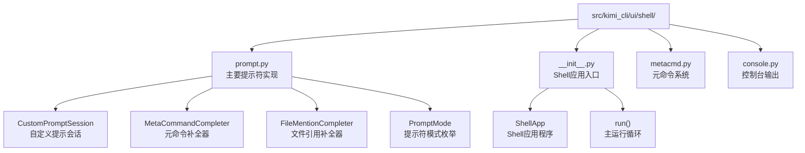
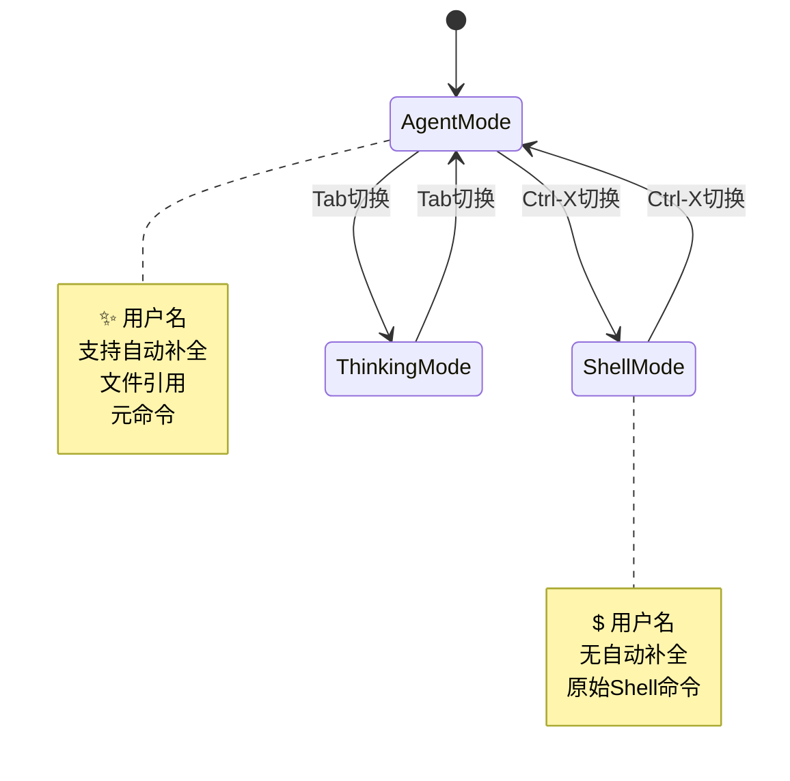
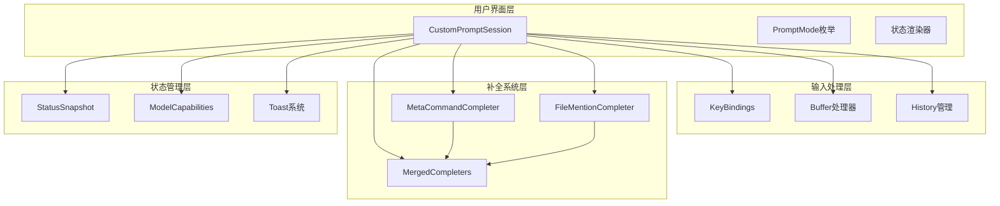
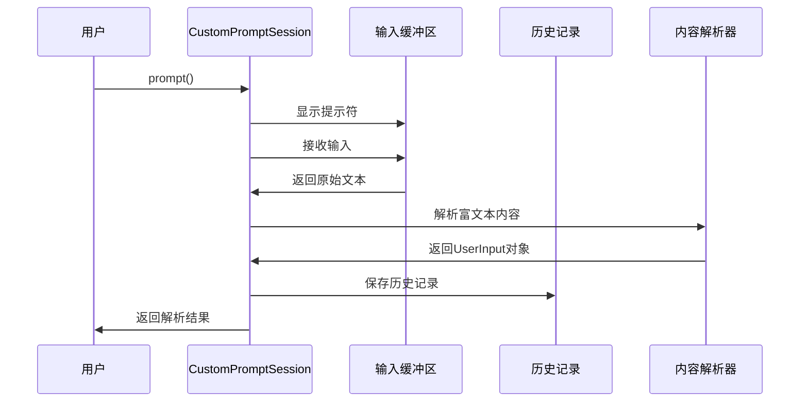
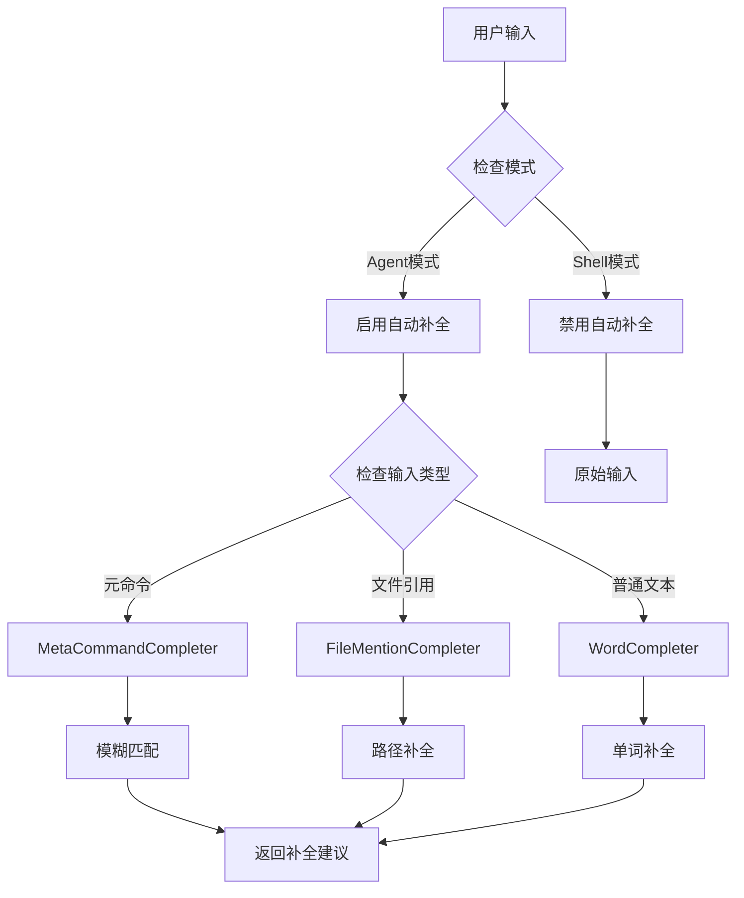
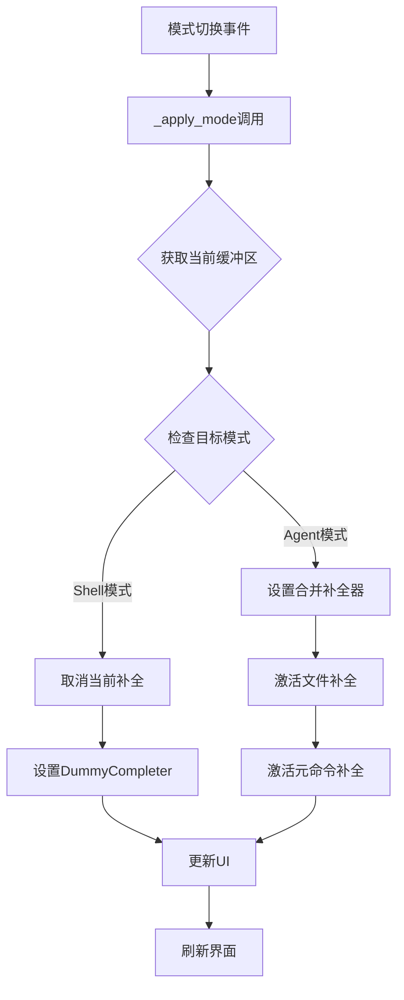
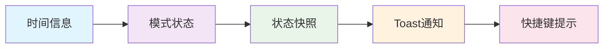
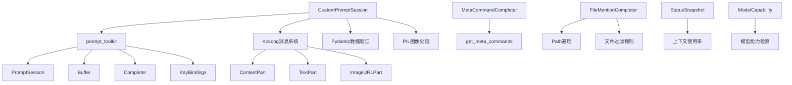

# 提示符系统

<cite>
**本文档引用的文件**
- [prompt.py](file://src/kimi_cli/ui/shell/prompt.py)
- [__init__.py](file://src/kimi_cli/ui/shell/__init__.py)
- [metacmd.py](file://src/kimi_cli/ui/shell/metacmd.py)
- [console.py](file://src/kimi_cli/ui/shell/console.py)
- [config.py](file://src/kimi_cli/config.py)
- [session.py](file://src/kimi_cli/session.py)
- [term.py](file://src/kimi_cli/utils/term.py)
</cite>

## 目录
1. [简介](#简介)
2. [项目结构](#项目结构)
3. [核心组件](#核心组件)
4. [架构概览](#架构概览)
5. [详细组件分析](#详细组件分析)
6. [依赖关系分析](#依赖关系分析)
7. [性能考虑](#性能考虑)
8. [故障排除指南](#故障排除指南)
9. [结论](#结论)

## 简介

KimiPrompt系统是kimi-cli项目中的核心交互组件，负责为用户提供智能、上下文感知的命令行提示符体验。该系统基于prompt-toolkit构建，提供了丰富的功能包括智能自动补全、多模式交互、实时状态显示和自定义输入处理。

系统的核心设计理念是为用户提供无缝的Agent模式和Shell模式之间的切换体验，同时保持高度的可定制性和扩展性。通过CustomPromptSession类，系统实现了复杂的输入处理逻辑，包括多行输入支持、输入缓冲区管理、智能补全器动态替换等功能。

## 项目结构

KimiPrompt系统的文件组织结构体现了清晰的职责分离：

**图表来源**
- [prompt.py](file://src/kimi_cli/ui/shell/prompt.py#L1-L50)
- [__init__.py](file://src/kimi_cli/ui/shell/__init__.py#L1-L50)

**章节来源**
- [prompt.py](file://src/kimi_cli/ui/shell/prompt.py#L1-L794)
- [__init__.py](file://src/kimi_cli/ui/shell/__init__.py#L1-L320)

## 核心组件

### CustomPromptSession类

CustomPromptSession是整个提示符系统的核心类，继承自prompt-toolkit的PromptSession并扩展了丰富的功能：

- **智能模式切换**: 支持Agent模式和Shell模式之间的无缝切换
- **动态补全器管理**: 根据当前模式动态替换补全器
- **状态监控**: 实时显示系统状态和用户信息
- **输入处理**: 支持多行输入、粘贴图像、历史记录等功能

### 补全器系统

系统包含两个主要的补全器：

1. **MetaCommandCompleter**: 处理元命令自动补全
2. **FileMentionCompleter**: 处理文件引用自动补全

### 模式系统

**章节来源**
- [prompt.py](file://src/kimi_cli/ui/shell/prompt.py#L466-L613)

## 架构概览

KimiPrompt系统采用分层架构设计，确保了良好的可维护性和扩展性：

**图表来源**
- [prompt.py](file://src/kimi_cli/ui/shell/prompt.py#L466-L580)
- [prompt.py](file://src/kimi_cli/ui/shell/prompt.py#L581-L613)

## 详细组件分析

### get_prompt()方法实现机制

虽然代码中没有直接的`get_prompt()`方法，但`CustomPromptSession.prompt()`方法实现了类似的功能：

**图表来源**
- [prompt.py](file://src/kimi_cli/ui/shell/prompt.py#L689-L722)

### get_input()异步输入处理流程

异步输入处理通过`prompt()`方法实现，支持以下特性：

1. **多行输入支持**: 通过`patch_stdout`装饰器实现
2. **输入缓冲区管理**: 自动处理输入缓冲和清理
3. **富文本解析**: 支持附件占位符解析
4. **历史记录集成**: 自动保存用户输入到历史文件

### CustomPromptSession智能自动补全功能

系统实现了智能的自动补全功能，通过以下机制实现：

**图表来源**
- [prompt.py](file://src/kimi_cli/ui/shell/prompt.py#L496-L502)
- [prompt.py](file://src/kimi_cli/ui/shell/prompt.py#L596-L613)

### _apply_mode()模式切换逻辑

模式切换通过`_apply_mode()`方法实现，负责动态替换补全器：

**图表来源**
- [prompt.py](file://src/kimi_cli/ui/shell/prompt.py#L596-L613)

**章节来源**
- [prompt.py](file://src/kimi_cli/ui/shell/prompt.py#L689-L722)
- [prompt.py](file://src/kimi_cli/ui/shell/prompt.py#L596-L613)

### 提示符符号系统

系统使用不同的符号来表示当前交互模式：

| 模式 | 符号 | 描述 |
|------|------|------|
| Agent模式 | ✨ | 标准AI助手交互 |
| Shell模式 | $ | 原始Shell命令 |
| Thinking模式 | 💫 | AI思考过程 |
| 用户名 | 用户名 | 当前登录用户 |

### 底部工具栏渲染

底部工具栏显示实时信息：

**图表来源**
- [prompt.py](file://src/kimi_cli/ui/shell/prompt.py#L745-L788)

**章节来源**
- [prompt.py](file://src/kimi_cli/ui/shell/prompt.py#L590-L594)
- [prompt.py](file://src/kimi_cli/ui/shell/prompt.py#L745-L788)

## 依赖关系分析

KimiPrompt系统的依赖关系体现了清晰的分层设计：

**图表来源**
- [prompt.py](file://src/kimi_cli/ui/shell/prompt.py#L21-L49)
- [prompt.py](file://src/kimi_cli/ui/shell/prompt.py#L466-L490)

**章节来源**
- [prompt.py](file://src/kimi_cli/ui/shell/prompt.py#L1-L50)
- [config.py](file://src/kimi_cli/config.py#L1-L158)

## 性能考虑

### 缓存策略

系统实现了多层次的缓存机制：

1. **文件补全缓存**: 文件路径缓存，避免重复扫描
2. **历史记录缓存**: 内存中的历史记录存储
3. **状态刷新**: 定期的状态更新，避免频繁I/O操作

### 异步处理

所有长时间运行的操作都采用异步处理：

- 状态刷新任务
- 图像粘贴处理
- 历史记录保存

### 内存管理

系统实现了智能的内存管理：

- 及时清理临时数据
- 控制历史记录大小
- 限制补全结果数量

## 故障排除指南

### 常见问题及解决方案

1. **补全功能不工作**
   - 检查当前模式是否为Agent模式
   - 验证模型能力是否支持自动补全

2. **模式切换失效**
   - 确认键盘绑定是否正确安装
   - 检查状态提供函数是否正常工作

3. **历史记录丢失**
   - 验证配置文件权限
   - 检查共享目录是否存在

**章节来源**
- [prompt.py](file://src/kimi_cli/ui/shell/prompt.py#L551-L567)
- [prompt.py](file://src/kimi_cli/ui/shell/prompt.py#L689-L722)

## 结论

KimiPrompt系统是一个功能丰富、设计精良的命令行交互系统。它成功地将复杂的提示符功能封装在一个易于使用的接口后面，同时保持了高度的可扩展性和灵活性。

系统的主要优势包括：

1. **智能上下文感知**: 根据当前状态动态调整提示符外观和行为
2. **无缝模式切换**: 在Agent模式和Shell模式之间平滑切换
3. **强大的自动补全**: 智能的文件和命令补全功能
4. **实时状态反馈**: 清晰的状态指示和用户反馈
5. **高度可定制**: 支持各种自定义扩展点

对于开发者而言，该系统提供了良好的扩展基础，可以通过添加新的补全器、修改提示符渲染逻辑或扩展现有功能来满足特定需求。系统的模块化设计使得这些扩展变得相对简单和直观。