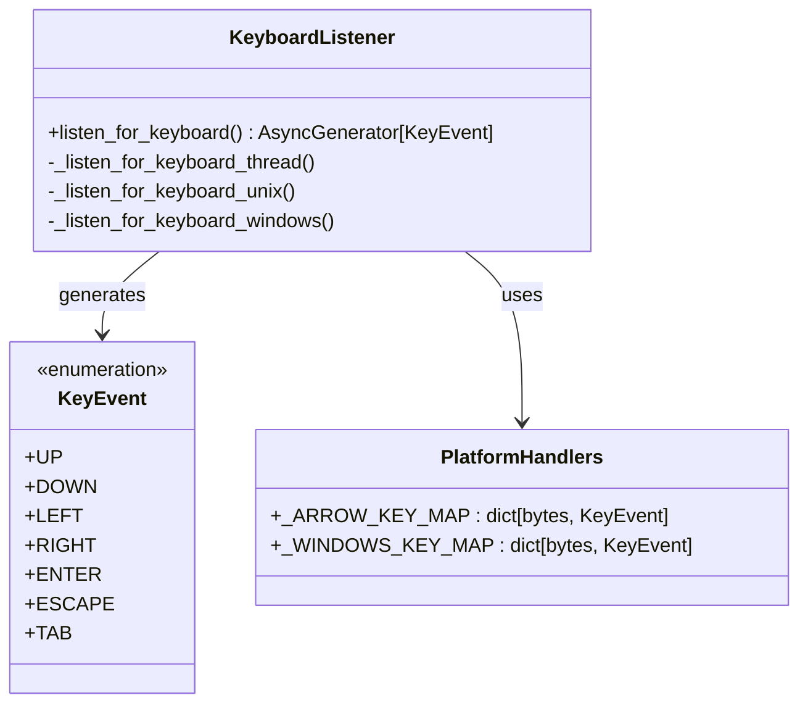
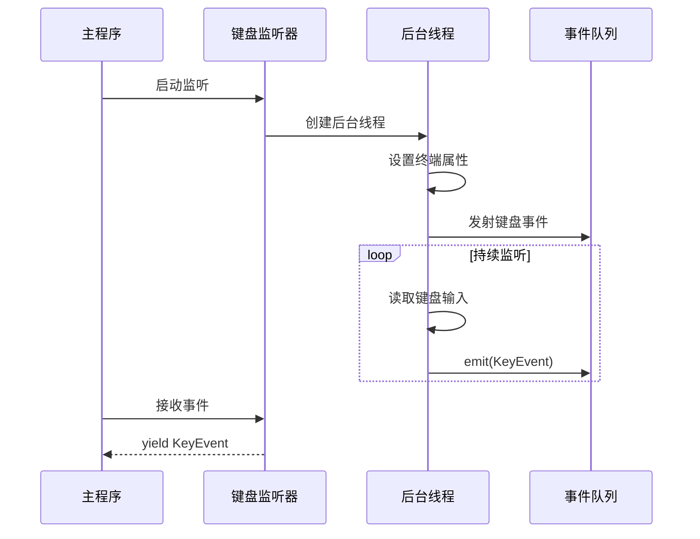
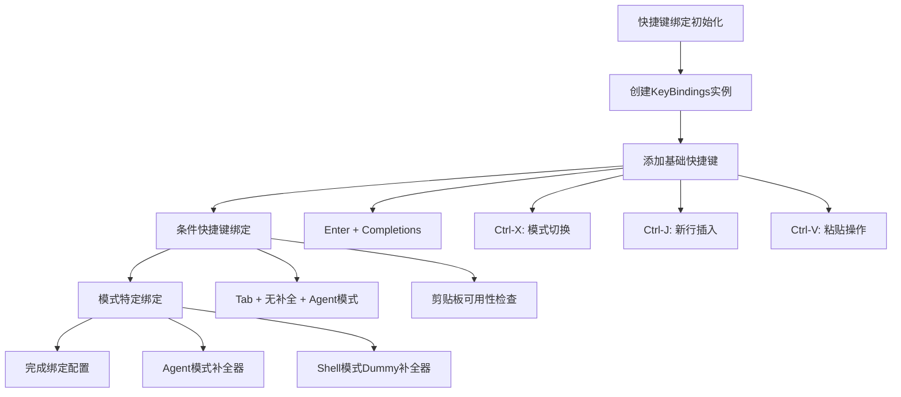
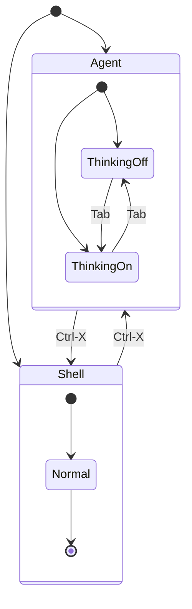
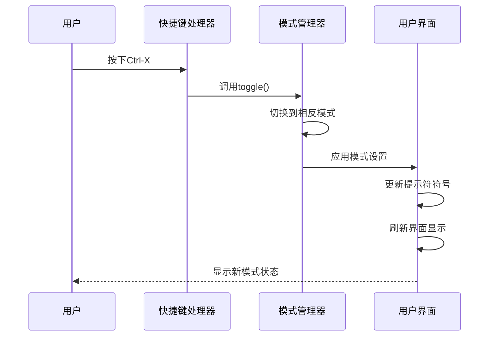
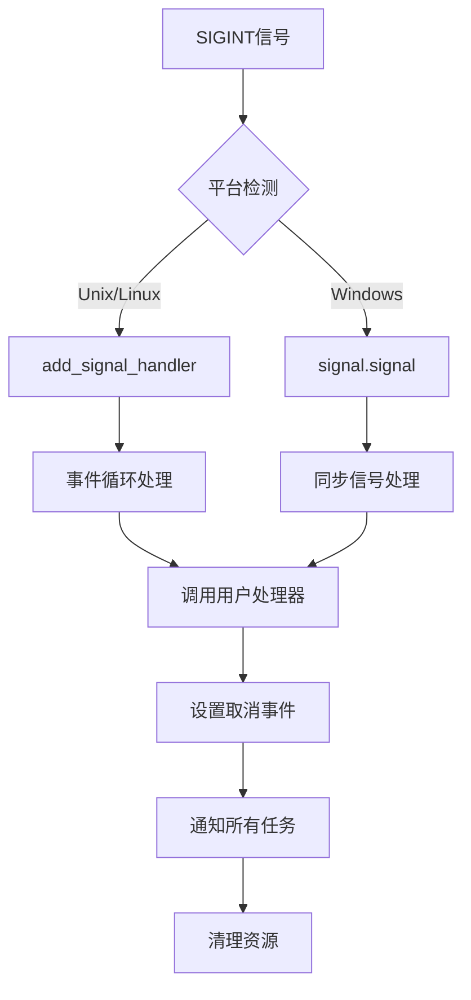
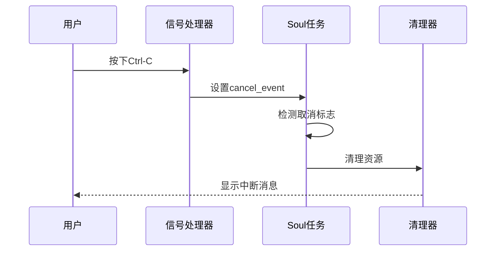
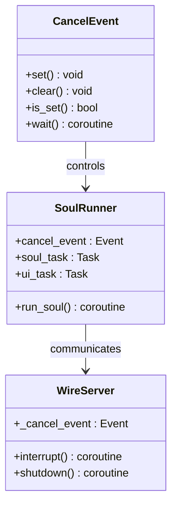
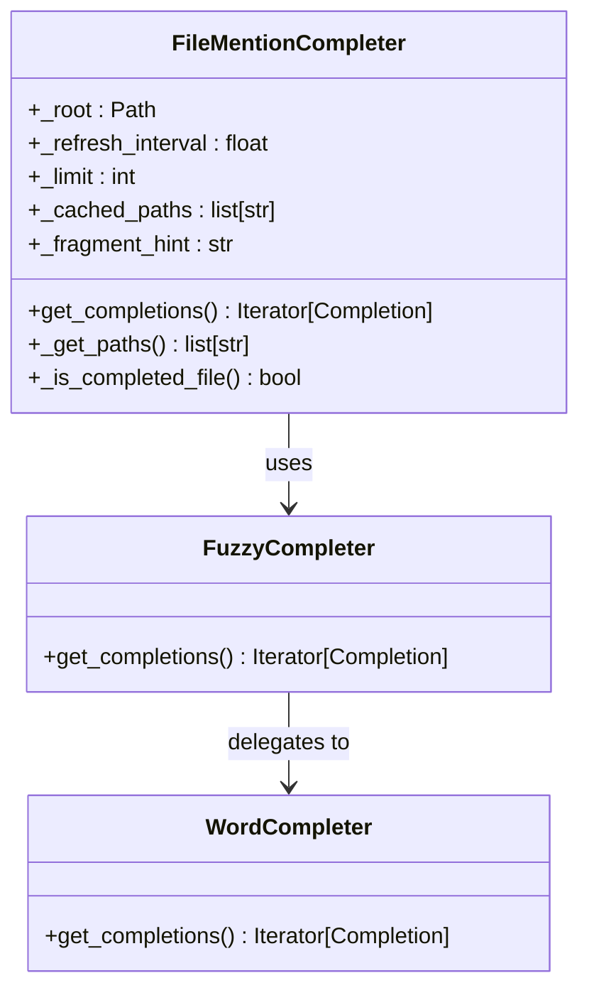
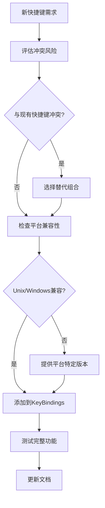

# 键盘交互与快捷键

<cite>
**本文档引用的文件**
- [keyboard.py](file://src/kimi_cli/ui/shell/keyboard.py)
- [prompt.py](file://src/kimi_cli/ui/shell/prompt.py)
- [signals.py](file://src/kimi_cli/utils/signals.py)
- [__init__.py](file://src/kimi_cli/ui/shell/__init__.py)
- [setup.py](file://src/kimi_cli/ui/shell/setup.py)
- [test_file_completer.py](file://tests/test_file_completer.py)
- [__init__.py](file://src/kimi_cli/ui/wire/__init__.py)
- [soul/__init__.py](file://src/kimi_cli/soul/__init__.py)
</cite>

## 目录
1. [简介](#简介)
2. [键盘事件处理架构](#键盘事件处理架构)
3. [核心快捷键系统](#核心快捷键系统)
4. [模式切换机制](#模式切换机制)
5. [信号处理与中断控制](#信号处理与中断控制)
6. [自动补全系统](#自动补全系统)
7. [开发者扩展指南](#开发者扩展指南)
8. [故障排除](#故障排除)
9. [总结](#总结)

## 简介

kimi-cli 的键盘交互系统是一个高度模块化和可扩展的事件处理框架，为用户提供丰富的快捷键操作和智能的自动补全功能。该系统支持跨平台的键盘事件捕获、实时的模式切换、优雅的中断处理以及基于文件系统的智能补全建议。

## 键盘事件处理架构

### 核心事件枚举

系统定义了一个简洁的 `KeyEvent` 枚举来表示所有可能的键盘事件：



**图表来源**
- [keyboard.py](file://src/kimi_cli/ui/shell/keyboard.py#L11-L18)
- [keyboard.py](file://src/kimi_cli/ui/shell/keyboard.py#L21-L45)

### 异步键盘监听器

键盘事件处理采用异步协程模式，确保不会阻塞主线程：



**图表来源**
- [keyboard.py](file://src/kimi_cli/ui/shell/keyboard.py#L21-L45)

**章节来源**
- [keyboard.py](file://src/kimi_cli/ui/shell/keyboard.py#L1-L186)

## 核心快捷键系统

### setup_keybindings() 函数详解

虽然源代码中没有直接的 `setup_keybindings()` 函数，但系统通过 `KeyBindings` 类实现了完整的快捷键绑定机制：



**图表来源**
- [prompt.py](file://src/kimi_cli/ui/shell/prompt.py#L486-L579)

### 关键快捷键映射表

| 快捷键组合 | 功能描述 | 触发条件 | 实现位置 |
|------------|----------|----------|----------|
| `Ctrl-X` | Agent与Shell模式切换 | 无条件触发 | `_switch_mode` |
| `Enter` | 接受补全选项 | 存在补全时 | `_accept_completion` |
| `Ctrl-J` | 插入新行 | 无条件触发 | `_insert_newline` |
| `Alt-Enter` | 插入新行 | 无条件触发 | `_insert_newline` |
| `Ctrl-V` | 粘贴内容 | 剪贴板可用 | `_paste` |
| `Tab` | 思考模式切换 | Agent模式且无补全 | `_switch_thinking` |

**章节来源**
- [prompt.py](file://src/kimi_cli/ui/shell/prompt.py#L508-L568)

## 模式切换机制

### PromptMode 枚举设计

系统通过 `PromptMode` 枚举管理两种主要操作模式：



**图表来源**
- [prompt.py](file://src/kimi_cli/ui/shell/prompt.py#L385-L393)

### 模式切换技术实现

模式切换通过以下步骤实现：



**图表来源**
- [prompt.py](file://src/kimi_cli/ui/shell/prompt.py#L519-L526)

### UI反馈机制

每次模式切换都会更新以下界面元素：

| 模式 | 提示符符号 | 补全器类型 | 特殊功能 |
|------|------------|------------|----------|
| Agent | ✨ | `MetaCommandCompleter` + `FileMentionCompleter` | 思考模式切换 |
| Shell | $ | `DummyCompleter` | 直接命令执行 |

**章节来源**
- [prompt.py](file://src/kimi_cli/ui/shell/prompt.py#L596-L612)

## 信号处理与中断控制

### SIGINT 处理架构

系统实现了跨平台的信号处理机制来优雅地处理中断请求：



**图表来源**
- [signals.py](file://src/kimi_cli/utils/signals.py#L8-L42)

### Soul任务取消流程

当用户按下 `Ctrl-C` 时，系统会触发以下取消流程：



**图表来源**
- [__init__.py](file://src/kimi_cli/ui/shell/__init__.py#L171-L178)
- [soul/__init__.py](file://src/kimi_cli/soul/__init__.py#L101-L148)

### 取消运行中的Soul任务

系统通过以下机制确保Soul任务能够被正确取消：



**图表来源**
- [soul/__init__.py](file://src/kimi_cli/soul/__init__.py#L101-L148)
- [__init__.py](file://src/kimi_cli/ui/wire/__init__.py#L48-L77)

**章节来源**
- [signals.py](file://src/kimi_cli/utils/signals.py#L1-L43)
- [__init__.py](file://src/kimi_cli/ui/shell/__init__.py#L160-L228)

## 自动补全系统

### FileCompleter 集成方式

系统集成了强大的文件路径自动补全功能，通过 `FileMentionCompleter` 实现：



**图表来源**
- [prompt.py](file://src/kimi_cli/ui/shell/prompt.py#L96-L342)

### 异步补全建议生成

文件补全采用异步缓存策略，确保性能和响应性：

```mermaid
flowchart TD
A[用户输入@] --> B[提取片段]
B --> C{是否已完成文件?}
C --> |是| D[停止补全]
C --> |否| E[检查缓存]
E --> F{缓存有效?}
F --> |是| G[使用缓存]
F --> |否| H[扫描文件系统]
H --> I[构建补全列表]
I --> J[应用模糊匹配]
J --> K[重新排序结果]
K --> L[返回补全建议]
G --> L
D --> M[显示空结果]
```

**图表来源**
- [prompt.py](file://src/kimi_cli/ui/shell/prompt.py#L310-L342)

### 补全触发条件

| 触发场景 | 条件 | 补全器 | 优先级规则 |
|----------|------|--------|------------|
| 文件引用 | 输入`@`后跟随路径 | `FileMentionCompleter` | 基名前缀优先 |
| 元命令 | 输入`/`后跟随命令 | `MetaCommandCompleter` | 字母顺序 |
| 一般文本 | 任意输入 | `WordCompleter` | 完全匹配优先 |

**章节来源**
- [prompt.py](file://src/kimi_cli/ui/shell/prompt.py#L96-L342)
- [test_file_completer.py](file://tests/test_file_completer.py#L1-L119)

## 开发者扩展指南

### 安全绑定新键位的指导原则

为了确保新快捷键不会破坏现有交互流程，开发者应遵循以下原则：



### 扩展快捷键的最佳实践

1. **避免常用组合冲突**：不要使用 `Ctrl-C`, `Ctrl-V`, `Ctrl-Z` 等系统保留组合
2. **提供清晰的帮助信息**：在 `shortcut_hints` 中记录新快捷键
3. **使用条件过滤**：通过 `@Condition` 控制快捷键激活条件
4. **保持一致性**：遵循现有的命名和组织模式

### 示例：添加自定义快捷键

```python
# 在KeyBindings部分添加
@Condition
def my_custom_condition() -> bool:
    return some_custom_state()

@kb.add("ctrl-shift-m", filter=my_custom_condition)
def my_custom_handler(event: KeyPressEvent) -> None:
    """我的自定义功能"""
    # 实现自定义逻辑
    event.app.invalidate()  # 刷新界面
```

### 模式特定扩展

对于不同模式下的特殊功能，可以通过模式检查来实现：

```python
@kb.add("ctrl-alt-n", filter=is_agent_mode)
def new_feature_in_agent_mode(event: KeyPressEvent) -> None:
    """仅在Agent模式下可用的新功能"""
    if self._mode == PromptMode.AGENT:
        # 实现Agent模式特定功能
        pass
```

## 故障排除

### 常见问题与解决方案

| 问题症状 | 可能原因 | 解决方案 |
|----------|----------|----------|
| 快捷键无响应 | 绑定未正确安装 | 检查KeyBindings配置 |
| 模式切换失败 | 状态管理错误 | 验证PromptMode.toggle() |
| 自动补全不工作 | 缓存过期或权限问题 | 清理缓存或检查文件权限 |
| 中断处理异常 | 信号处理器冲突 | 检查install_sigint_handler调用 |

### 调试技巧

1. **启用调试日志**：设置适当的日志级别查看详细事件流
2. **检查事件队列**：验证键盘事件是否正确传递到监听器
3. **模式状态跟踪**：监控 `_mode` 和 `_thinking` 状态变化
4. **补全器验证**：确认正确的补全器已绑定到当前模式

### 平台特定注意事项

- **Unix系统**：确保终端处于原始模式且非阻塞
- **Windows系统**：注意 `msvcrt` 库的限制和行为差异
- **跨平台兼容性**：测试所有主要快捷键在不同平台上的表现

## 总结

kimi-cli 的键盘交互与快捷键系统展现了现代终端应用程序的设计精髓。通过异步事件驱动架构、智能的模式管理和优雅的中断处理，系统为用户提供了流畅而强大的交互体验。

### 关键特性回顾

1. **高性能键盘监听**：异步协程+后台线程模式确保响应性
2. **智能模式切换**：无缝的Agent/Shell模式转换
3. **优雅的中断处理**：跨平台的SIGINT信号处理
4. **强大的自动补全**：基于文件系统的智能路径补全
5. **可扩展的快捷键系统**：安全的自定义键位绑定机制

### 技术亮点

- **跨平台兼容性**：统一的接口下处理Unix和Windows差异
- **内存效率**：智能缓存和增量更新策略
- **用户体验**：即时反馈和视觉状态指示
- **错误恢复**：健壮的异常处理和资源清理

这套键盘交互系统不仅满足了当前的功能需求，更为未来的功能扩展奠定了坚实的基础，体现了优秀的软件架构设计原则。