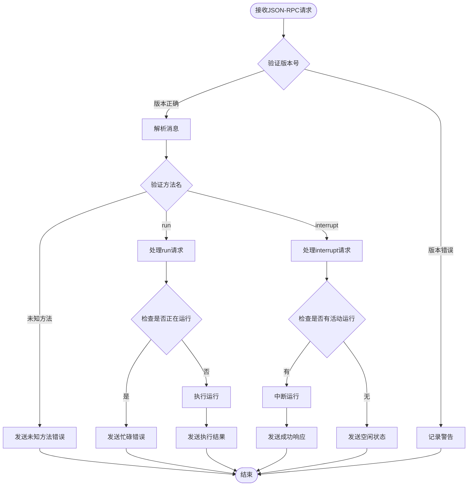

# Wire模式API文档

<cite>
**本文档中引用的文件**
- [src/kimi_cli/ui/wire/jsonrpc.py](file://src/kimi_cli/ui/wire/jsonrpc.py)
- [src/kimi_cli/ui/wire/README.md](file://src/kimi_cli/ui/wire/README.md)
- [src/kimi_cli/ui/wire/__init__.py](file://src/kimi_cli/ui/wire/__init__.py)
- [src/kimi_cli/app.py](file://src/kimi_cli/app.py)
- [src/kimi_cli/wire/message.py](file://src/kimi_cli/wire/message.py)
- [tests/test_wire_message.py](file://tests/test_wire_message.py)
</cite>

## 目录
1. [简介](#简介)
2. [项目结构](#项目结构)
3. [核心组件](#核心组件)
4. [架构概览](#架构概览)
5. [详细组件分析](#详细组件分析)
6. [协议规范](#协议规范)
7. [状态更新机制](#状态更新机制)
8. [客户端交互示例](#客户端交互示例)
9. [性能考虑](#性能考虑)
10. [故障排除指南](#故障排除指南)
11. [结论](#结论)

## 简介

Wire模式是Kimi CLI中的实验性JSON-RPC服务器，专门设计用于进程间通信和自动化系统集成。它提供了一个标准化的接口，允许外部客户端与Kimi的Soul引擎进行实时交互，支持状态监控、任务执行和审批流程。

### 实验性质声明

**重要提示：Wire模式目前处于实验阶段**  
- 协议可能会在未来版本中发生变化
- 存在潜在的不稳定性
- 不建议在生产环境中使用
- API兼容性可能无法得到保证

## 项目结构

Wire模式的实现分布在以下关键文件中：


**图表来源**
- [src/kimi_cli/ui/wire/jsonrpc.py](file://src/kimi_cli/ui/wire/jsonrpc.py#L1-L51)
- [src/kimi_cli/ui/wire/__init__.py](file://src/kimi_cli/ui/wire/__init__.py#L1-L343)
- [src/kimi_cli/app.py](file://src/kimi_cli/app.py#L211-L216)

**章节来源**
- [src/kimi_cli/ui/wire/jsonrpc.py](file://src/kimi_cli/ui/wire/jsonrpc.py#L1-L51)
- [src/kimi_cli/ui/wire/README.md](file://src/kimi_cli/ui/wire/README.md#L1-L110)
- [src/kimi_cli/ui/wire/__init__.py](file://src/kimi_cli/ui/wire/__init__.py#L1-L343)

## 核心组件

Wire模式包含以下核心组件：

### JSON-RPC协议层
- **消息类型定义**：`JSONRPCRequest`、`JSONRPCSuccessResponse`、`JSONRPCErrorResponse`
- **版本控制**：支持JSON-RPC 2.0标准
- **类型验证**：使用Pydantic进行严格的数据验证

### WireServer核心类
- **异步处理**：基于asyncio的非阻塞I/O
- **流式通信**：通过stdio进行进程间通信
- **队列管理**：内部消息队列确保FIFO顺序

### 消息处理系统
- **事件分发**：根据消息类型路由到相应处理器
- **状态同步**：实时推送Soul状态变化
- **审批管理**：处理工具调用的权限审批

**章节来源**
- [src/kimi_cli/ui/wire/jsonrpc.py](file://src/kimi_cli/ui/wire/jsonrpc.py#L10-L51)
- [src/kimi_cli/ui/wire/__init__.py](file://src/kimi_cli/ui/wire/__init__.py#L114-L343)

## 架构概览

Wire模式采用客户端-服务器架构，通过标准输入输出进行通信：


**图表来源**
- [src/kimi_cli/ui/wire/__init__.py](file://src/kimi_cli/ui/wire/__init__.py#L139-L170)
- [src/kimi_cli/ui/wire/__init__.py](file://src/kimi_cli/ui/wire/__init__.py#L280-L302)

## 详细组件分析

### WireServer类分析

WireServer是Wire模式的核心组件，负责处理所有JSON-RPC通信：


**图表来源**
- [src/kimi_cli/ui/wire/__init__.py](file://src/kimi_cli/ui/wire/__init__.py#L114-L125)
- [src/kimi_cli/ui/wire/__init__.py](file://src/kimi_cli/ui/wire/__init__.py#L35-L75)
- [src/kimi_cli/ui/wire/jsonrpc.py](file://src/kimi_cli/ui/wire/jsonrpc.py#L16-L19)

#### handle_jsonrpc方法详解

`_handle_request`方法是WireServer的核心处理逻辑：



**图表来源**
- [src/kimi_cli/ui/wire/__init__.py](file://src/kimi_cli/ui/wire/__init__.py#L178-L190)
- [src/kimi_cli/ui/wire/__init__.py](file://src/kimi_cli/ui/wire/__init__.py#L215-L241)

#### send_status_update方法详解

`_send_event`方法负责向客户端推送状态更新：


**图表来源**
- [src/kimi_cli/ui/wire/__init__.py](file://src/kimi_cli/ui/wire/__init__.py#L253-L255)
- [src/kimi_cli/wire/message.py](file://src/kimi_cli/wire/message.py#L109-L155)

**章节来源**
- [src/kimi_cli/ui/wire/__init__.py](file://src/kimi_cli/ui/wire/__init__.py#L178-L241)
- [src/kimi_cli/ui/wire/__init__.py](file://src/kimi_cli/ui/wire/__init__.py#L253-L269)

## 协议规范

### 传输层

Wire模式使用以下传输特性：
- **通信方式**：标准输入输出（stdio）
- **消息格式**：换行符分隔的JSON对象
- **编码方式**：UTF-8编码
- **紧凑格式**：使用`(",", ":")`分隔符

### 生命周期管理


**图表来源**
- [src/kimi_cli/ui/wire/__init__.py](file://src/kimi_cli/ui/wire/__init__.py#L127-L137)
- [src/kimi_cli/ui/wire/__init__.py](file://src/kimi_cli/ui/wire/__init__.py#L139-L155)

### 客户端到服务器调用

#### run方法
```json
{
  "jsonrpc": "2.0",
  "id": "<request-id>",
  "method": "run", 
  "params": {"input": "<prompt>"}
}
```

**参数说明：**
- `input`或`prompt`：必需的字符串参数，指定用户输入
- `id`：可选的请求标识符

**成功响应：**
- `{"status": "finished"}`：运行完成
- `{"status": "cancelled"}`：运行被中断
- `{"status": "max_steps_reached", "steps": <int>}`：达到最大步数限制

**错误代码：**
- `-32000`：运行已在进行中
- `-32602`：缺少或无效的输入参数
- `-32001`：未配置LLM
- `-32002`：LLM提供商错误
- `-32003`：不支持的LLM
- `-32099`：运行过程中发生未处理异常

#### interrupt方法
```json
{
  "jsonrpc": "2.0", 
  "id": "<request-id>", 
  "method": "interrupt", 
  "params": {}
}
```

**响应：**
- `{"status": "ok"}`：成功中断
- `{"status": "idle"}`：当前无活动运行

### 服务器到客户端流量

#### 事件通知
事件采用JSON-RPC通知格式（无`id`字段）：

```json
{
  "jsonrpc": "2.0",
  "method": "event",
  "params": {
    "type": "<event-type>",
    "payload": {...}
  }
}
```

**支持的事件类型：**
- `step_begin`: 步骤开始，携带`{"n": <int>}`
- `step_interrupted`: 步骤中断
- `compaction_begin`: 上下文压缩开始
- `compaction_end`: 上下文压缩结束
- `status_update`: 状态更新，携带`{"context_usage": <float>}`
- `content_part`: 内容片段
- `tool_call`: 工具调用
- `tool_call_part`: 工具调用片段
- `tool_result`: 工具执行结果

#### 审批请求
```json
{
  "jsonrpc": "2.0",
  "id": "<approval-id>",
  "method": "request",
  "params": {
    "type": "approval",
    "payload": {
      "id": "<approval-id>",
      "tool_call_id": "<tool-call-id>",
      "sender": "<agent>",
      "action": "<action>",
      "description": "<human readable context>"
    }
  }
}
```

**审批响应：**
```json
{
  "jsonrpc": "2.0", 
  "id": "<approval-id>", 
  "result": {"response": "approve"}
}
```

**响应值：**
- `approve`：批准执行
- `approve_for_session`：会话内批准
- `reject`：拒绝执行

**章节来源**
- [src/kimi_cli/ui/wire/README.md](file://src/kimi_cli/ui/wire/README.md#L18-L109)
- [src/kimi_cli/ui/wire/__init__.py](file://src/kimi_cli/ui/wire/__init__.py#L178-L210)

## 状态更新机制

### StatusSnapshot数据模型

基于CLAUDE.md中的状态更新数据模型，Wire模式使用以下状态结构：


**图表来源**
- [src/kimi_cli/wire/message.py](file://src/kimi_cli/wire/message.py#L52-L55)
- [src/kimi_cli/wire/message.py](file://src/kimi_cli/wire/message.py#L16-L49)

### 状态更新流程


**图表来源**
- [src/kimi_cli/wire/message.py](file://src/kimi_cli/wire/message.py#L122-L126)
- [src/kimi_cli/ui/wire/__init__.py](file://src/kimi_cli/ui/wire/__init__.py#L253-L255)

**章节来源**
- [src/kimi_cli/wire/message.py](file://src/kimi_cli/wire/message.py#L52-L55)
- [src/kimi_cli/wire/message.py](file://src/kimi_cli/wire/message.py#L122-L126)

## 客户端交互示例

### 基本客户端实现

以下是一个Python客户端的基本实现示例：

```python
import asyncio
import json
import sys

class WireClient:
    def __init__(self):
        self.reader = None
        self.writer = None
        
    async def connect(self):
        """建立与Wire服务器的连接"""
        self.reader, self.writer = await asyncio.open_connection(
            host='localhost',
            port=8080
        )
        
    async def send_request(self, method, params=None, request_id=None):
        """发送JSON-RPC请求"""
        request = {
            "jsonrpc": "2.0",
            "method": method,
            "params": params or {}
        }
        
        if request_id:
            request["id"] = request_id
            
        self.writer.write(json.dumps(request).encode('utf-8') + b'\n')
        await self.writer.drain()
        
    async def receive_response(self):
        """接收JSON-RPC响应"""
        line = await self.reader.readline()
        if not line:
            return None
            
        return json.loads(line.decode('utf-8'))
        
    async def run(self, prompt):
        """执行run请求"""
        request_id = "run_1"
        await self.send_request("run", {"input": prompt}, request_id)
        
        while True:
            response = await self.receive_response()
            if response and response.get("id") == request_id:
                return response
                
    async def interrupt(self):
        """发送中断请求"""
        await self.send_request("interrupt")
        
    async def close(self):
        """关闭连接"""
        if self.writer:
            self.writer.close()
            await self.writer.wait_closed()
```

### 状态监控客户端

```python
class StatusMonitor:
    def __init__(self):
        self.handlers = {
            "status_update": self.handle_status_update,
            "step_begin": self.handle_step_begin,
            "step_interrupted": self.handle_step_interrupted,
            "compaction_begin": self.handle_compaction_begin,
            "compaction_end": self.handle_compaction_end
        }
        
    def handle_status_update(self, payload):
        """处理状态更新"""
        context_usage = payload.get("context_usage", 0)
        print(f"上下文使用率: {context_usage:.2%}")
        
    def handle_step_begin(self, payload):
        """处理步骤开始"""
        step_number = payload.get("n", 0)
        print(f"开始步骤 {step_number}")
        
    def handle_step_interrupted(self, payload):
        """处理步骤中断"""
        print("步骤被中断")
        
    def handle_compaction_begin(self, payload):
        """处理压缩开始"""
        print("开始上下文压缩")
        
    def handle_compaction_end(self, payload):
        """处理压缩结束"""
        print("上下文压缩完成")
```

### 审批处理示例

```python
class ApprovalHandler:
    def __init__(self):
        self.pending_approvals = {}
        
    async def handle_approval_request(self, request_id, payload):
        """处理审批请求"""
        tool_call_id = payload.get("tool_call_id")
        action = payload.get("action")
        description = payload.get("description")
        
        print(f"工具调用审批请求:")
        print(f"  工具: {tool_call_id}")
        print(f"  动作: {action}")
        print(f"  描述: {description}")
        
        # 用户确认
        response = input("是否批准? (y/n): ").strip().lower()
        
        approval_response = "approve" if response == "y" else "reject"
        
        # 发送审批响应
        await self.send_approval_response(request_id, approval_response)
```

**章节来源**
- [src/kimi_cli/ui/wire/README.md](file://src/kimi_cli/ui/wire/README.md#L114-L136)
- [src/kimi_cli/ui/wire/__init__.py](file://src/kimi_cli/ui/wire/__init__.py#L257-L269)

## 性能考虑

### 异步处理优势

Wire模式采用异步架构带来以下性能优势：

1. **非阻塞I/O**：避免长时间运行的操作阻塞主线程
2. **并发处理**：支持多个客户端同时连接
3. **内存效率**：使用队列管理消息，避免内存泄漏
4. **快速响应**：实时状态更新，毫秒级延迟

### 资源管理


### 优化建议

1. **批量处理**：合并多个小消息为批量传输
2. **压缩传输**：对大型消息启用压缩
3. **连接复用**：保持长连接减少握手开销
4. **背压控制**：当队列满时暂停生产者

## 故障排除指南

### 常见问题及解决方案

#### 连接问题

**问题**：无法连接到Wire服务器
**原因**：服务器未启动或端口被占用
**解决方案**：
1. 检查服务器是否已启动
2. 验证端口可用性
3. 查看日志文件获取详细错误信息

#### 消息格式错误

**问题**：收到"Invalid JSON line"警告
**原因**：客户端发送的消息格式不正确
**解决方案**：
1. 确保消息是有效的JSON格式
2. 每条消息以换行符结尾
3. 验证`jsonrpc`字段值为"2.0"

#### 认证失败

**问题**：审批请求被自动拒绝
**原因**：客户端未及时响应审批请求
**解决方案**：
1. 实现异步审批处理
2. 设置合理的超时时间
3. 在服务器关闭前处理所有待审批请求

#### 性能问题

**问题**：消息延迟过高
**原因**：队列积压或网络延迟
**解决方案**：
1. 监控队列长度
2. 优化消息序列化
3. 考虑使用本地缓存

### 调试技巧

1. **启用详细日志**：设置日志级别为DEBUG
2. **消息追踪**：记录每个消息的发送和接收时间
3. **状态监控**：定期检查服务器状态
4. **压力测试**：模拟高并发场景测试系统稳定性

**章节来源**
- [src/kimi_cli/ui/wire/__init__.py](file://src/kimi_cli/ui/wire/__init__.py#L151-L152)
- [src/kimi_cli/ui/wire/__init__.py](file://src/kimi_cli/ui/wire/__init__.py#L198-L204)

## 结论

Wire模式为Kimi CLI提供了强大的进程间通信能力，特别适合以下应用场景：

### 适用场景

1. **自动化系统集成**：与其他工具和服务的无缝集成
2. **监控和仪表板**：实时显示Kimi的状态和进度
3. **调试和开发**：开发过程中的实时反馈
4. **批量处理**：大规模任务的协调和监控

### 技术特点

- **标准化协议**：基于JSON-RPC 2.0的成熟标准
- **实时通信**：支持双向实时消息传递
- **类型安全**：使用Pydantic确保数据完整性
- **异步架构**：高性能的非阻塞处理

### 发展方向

随着Wire模式的成熟，未来可能的发展方向包括：
- 更丰富的事件类型支持
- 更灵活的认证机制
- 更好的错误恢复能力
- 更完善的监控和诊断功能

**重要提醒**：由于Wire模式仍处于实验阶段，请谨慎评估其在生产环境中的适用性。建议在正式部署前进行充分的测试和验证。