# 用户界面模式

<cite>
**本文档引用的文件**
- [src/kimi_cli/ui/shell/__init__.py](file://src/kimi_cli/ui/shell/__init__.py)
- [src/kimi_cli/ui/shell/console.py](file://src/kimi_cli/ui/shell/console.py)
- [src/kimi_cli/ui/shell/prompt.py](file://src/kimi_cli/ui/shell/prompt.py)
- [src/kimi_cli/ui/shell/keyboard.py](file://src/kimi_cli/ui/shell/keyboard.py)
- [src/kimi_cli/ui/shell/metacmd.py](file://src/kimi_cli/ui/shell/metacmd.py)
- [src/kimi_cli/ui/shell/visualize.py](file://src/kimi_cli/ui/shell/visualize.py)
- [src/kimi_cli/ui/print/__init__.py](file://src/kimi_cli/ui/print/__init__.py)
- [src/kimi_cli/ui/print/visualize.py](file://src/kimi_cli/ui/print/visualize.py)
- [src/kimi_cli/ui/acp/__init__.py](file://src/kimi_cli/ui/acp/__init__.py)
- [src/kimi_cli/ui/wire/__init__.py](file://src/kimi_cli/ui/wire/__init__.py)
- [src/kimi_cli/ui/wire/jsonrpc.py](file://src/kimi_cli/ui/wire/jsonrpc.py)
- [src/kimi_cli/ui/wire/README.md](file://src/kimi_cli/ui/wire/README.md)
- [src/kimi_cli/ui/CLAUDE.md](file://src/kimi_cli/ui/CLAUDE.md)
</cite>

## 目录
1. [简介](#简介)
2. [项目结构](#项目结构)
3. [核心组件](#核心组件)
4. [架构概览](#架构概览)
5. [Shell模式详解](#shell模式详解)
6. [Print模式详解](#print模式详解)
7. [ACP模式详解](#acp模式详解)
8. [Wire模式详解](#wire模式详解)
9. [UI设计原则](#ui设计原则)
10. [错误处理机制](#错误处理机制)
11. [总结](#总结)

## 简介

Kimi CLI提供了四种不同的用户界面模式，每种模式都针对特定的使用场景进行了优化。这些模式包括交互式的Shell模式、非交互式的Print模式、服务器集成的ACP模式，以及实验性的Wire协议模式。每个模式都有其独特的特性和适用场景，为用户提供了灵活的交互选择。

## 项目结构

Kimi CLI的UI模块采用模块化设计，每个界面模式都有独立的实现：

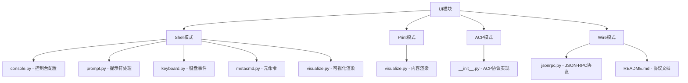

**图表来源**
- [src/kimi_cli/ui/shell/__init__.py](file://src/kimi_cli/ui/shell/__init__.py#L1-L320)
- [src/kimi_cli/ui/print/__init__.py](file://src/kimi_cli/ui/print/__init__.py#L1-L127)
- [src/kimi_cli/ui/acp/__init__.py](file://src/kimi_cli/ui/acp/__init__.py#L1-L473)
- [src/kimi_cli/ui/wire/__init__.py](file://src/kimi_cli/ui/wire/__init__.py#L1-L343)

**章节来源**
- [src/kimi_cli/ui/CLAUDE.md](file://src/kimi_cli/ui/CLAUDE.md#L1-L298)

## 核心组件

UI模块的核心组件包括：

### Shell模式组件
- **Console**: Rich控制台配置和样式管理
- **Prompt**: 命令提示符和输入处理
- **Keyboard**: 键盘事件处理和快捷键绑定
- **MetaCommand**: 元命令处理器
- **Visualize**: 可视化渲染引擎

### Print模式组件  
- **Visualize**: 打印模式的内容渲染器

### ACP模式组件
- **ACPAgent**: ACP协议代理实现
- **ACPServer**: ACP服务器实现

### Wire模式组件
- **WireServer**: Wire协议服务器
- **JSONRPC**: JSON-RPC协议实现

**章节来源**
- [src/kimi_cli/ui/shell/__init__.py](file://src/kimi_cli/ui/shell/__init__.py#L28-L320)
- [src/kimi_cli/ui/print/__init__.py](file://src/kimi_cli/ui/print/__init__.py#L21-L127)
- [src/kimi_cli/ui/acp/__init__.py](file://src/kimi_cli/ui/acp/__init__.py#L74-L473)
- [src/kimi_cli/ui/wire/__init__.py](file://src/kimi_cli/ui/wire/__init__.py#L35-L343)

## 架构概览

Kimi CLI的UI架构采用分层设计，支持多种交互模式：

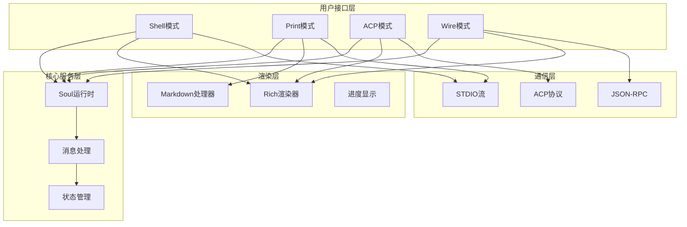

**图表来源**
- [src/kimi_cli/ui/shell/__init__.py](file://src/kimi_cli/ui/shell/__init__.py#L28-L92)
- [src/kimi_cli/ui/print/__init__.py](file://src/kimi_cli/ui/print/__init__.py#L21-L101)
- [src/kimi_cli/ui/acp/__init__.py](file://src/kimi_cli/ui/acp/__init__.py#L447-L473)
- [src/kimi_cli/ui/wire/__init__.py](file://src/kimi_cli/ui/wire/__init__.py#L114-L137)

## Shell模式详解

Shell模式是Kimi CLI的主要交互方式，提供类似终端的用户体验。

### 核心特性

#### 1. 模式切换机制
Shell模式支持两种主要模式之间的无缝切换：

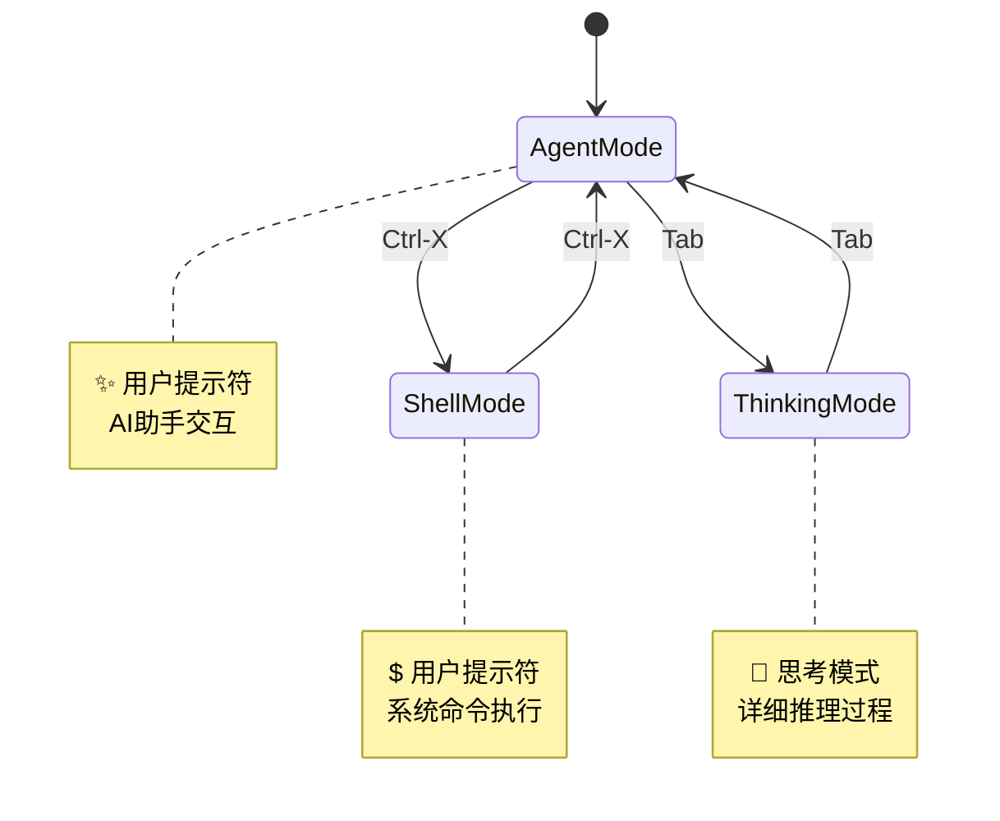

**图表来源**
- [src/kimi_cli/ui/shell/prompt.py](file://src/kimi_cli/ui/shell/prompt.py#L386-L395)
- [src/kimi_cli/ui/shell/prompt.py](file://src/kimi_cli/ui/shell/prompt.py#L557-L567)

#### 2. 键盘交互系统
Shell模式提供了丰富的键盘快捷键支持：

| 快捷键组合 | 功能描述 | 触发条件 |
|-----------|----------|----------|
| `Ctrl-X` | 切换Agent/Shell模式 | 任何时候 |
| `Tab` | 切换思考模式 | Agent模式且支持思考能力 |
| `Ctrl-J`/`Alt-Enter` | 插入新行 | 输入过程中 |
| `Ctrl-V` | 粘贴内容 | 支持剪贴板时 |
| `Ctrl-D` | 退出程序 | 默认行为 |

#### 3. 自动补全系统
Shell模式集成了智能自动补全功能：

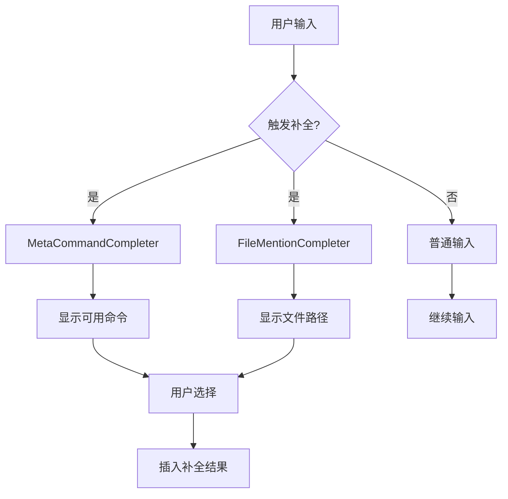

**图表来源**
- [src/kimi_cli/ui/shell/prompt.py](file://src/kimi_cli/ui/shell/prompt.py#L57-L94)
- [src/kimi_cli/ui/shell/prompt.py](file://src/kimi_cli/ui/shell/prompt.py#L96-L339)

#### 4. 元命令系统
Shell模式支持丰富的元命令：

| 元命令 | 功能描述 | 是否仅限KimiSoul |
|--------|----------|------------------|
| `/help` | 显示帮助信息 | 否 |
| `/setup` | 设置向导 | 否 |
| `/exit` | 退出程序 | 否 |
| `/clear` | 清屏 | 否 |
| `/history` | 显示历史记录 | 否 |
| `/mode` | 切换模式 | 否 |
| `/init` | 分析代码库 | 是 |
| `/clear` | 清除上下文 | 是 |
| `/compact` | 压缩上下文 | 是 |
| `/yolo` | 启用YOLO模式 | 是 |

**章节来源**
- [src/kimi_cli/ui/shell/__init__.py](file://src/kimi_cli/ui/shell/__init__.py#L53-L91)
- [src/kimi_cli/ui/shell/metacmd.py](file://src/kimi_cli/ui/shell/metacmd.py#L138-L276)

### 视觉反馈系统

Shell模式提供了丰富的视觉反馈：

#### 1. 实时状态显示
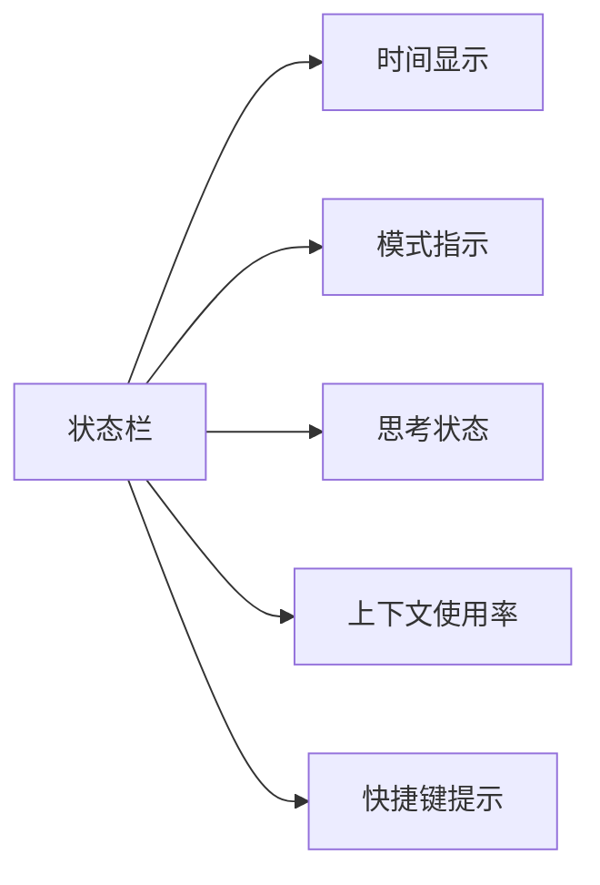

#### 2. 工具调用可视化
工具调用过程以树状结构展示：

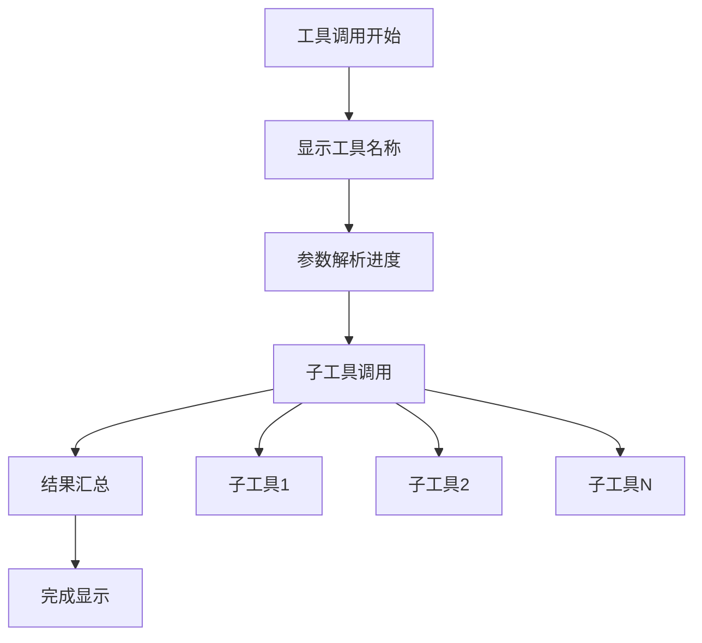

**图表来源**
- [src/kimi_cli/ui/shell/visualize.py](file://src/kimi_cli/ui/shell/visualize.py#L80-L209)

#### 3. 审批请求处理
当需要用户授权时，系统会显示审批面板：

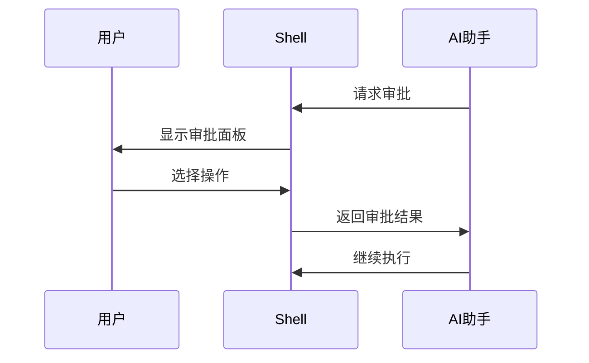

**图表来源**
- [src/kimi_cli/ui/shell/visualize.py](file://src/kimi_cli/ui/shell/visualize.py#L212-L262)

**章节来源**
- [src/kimi_cli/ui/shell/visualize.py](file://src/kimi_cli/ui/shell/visualize.py#L40-L566)

## Print模式详解

Print模式专为非交互式批处理任务设计，适合脚本集成和自动化场景。

### 核心特性

#### 1. 输出格式支持
Print模式支持多种输出格式：

| 格式 | 描述 | 使用场景 |
|------|------|----------|
| `text` | 纯文本输出 | 直接查看结果 |
| `stream-json` | 流式JSON输出 | 实时处理 |

#### 2. 输入处理机制
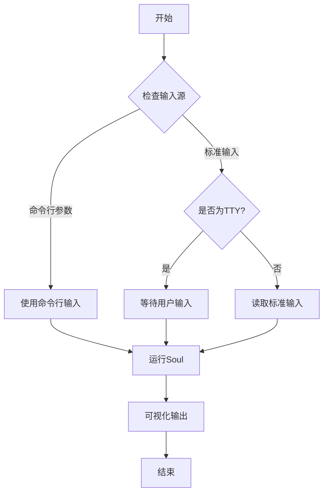

**图表来源**
- [src/kimi_cli/ui/print/__init__.py](file://src/kimi_cli/ui/print/__init__.py#L44-L82)

#### 3. 流式JSON处理
对于`stream-json`格式，系统能够处理连续的JSON消息流：

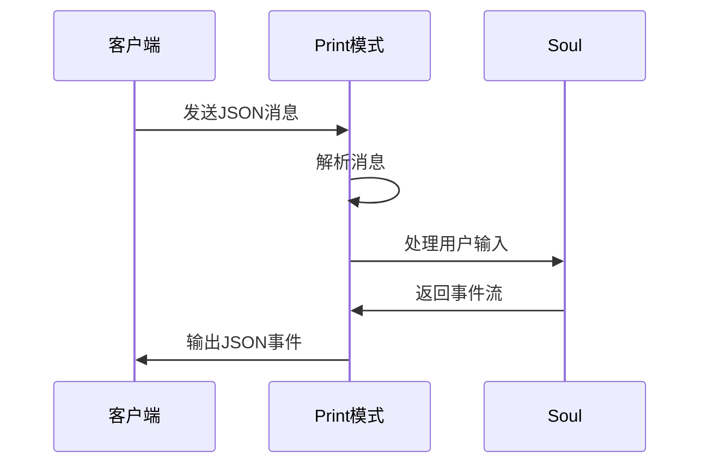

**图表来源**
- [src/kimi_cli/ui/print/__init__.py](file://src/kimi_cli/ui/print/__init__.py#L103-L127)

### 应用场景

Print模式特别适用于以下场景：
- CI/CD流水线集成
- 自动化脚本处理
- 批量处理任务
- 系统监控和日志分析

**章节来源**
- [src/kimi_cli/ui/print/__init__.py](file://src/kimi_cli/ui/print/__init__.py#L21-L127)
- [src/kimi_cli/ui/print/visualize.py](file://src/kimi_cli/ui/print/visualize.py#L15-L130)

## ACP模式详解

ACP（Agent Client Protocol）模式实现了标准化的代理客户端协议，支持与各种编辑器和IDE的集成。

### 协议特性

#### 1. 协议能力声明
ACP服务器声明了其支持的能力：

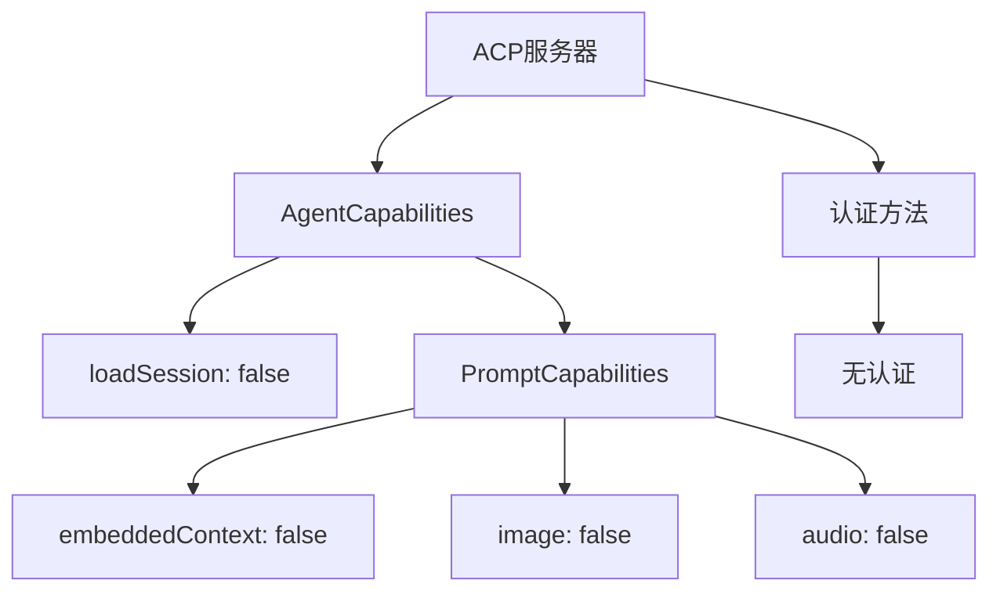

**图表来源**
- [src/kimi_cli/ui/acp/__init__.py](file://src/kimi_cli/ui/acp/__init__.py#L90-L99)

#### 2. 会话管理
ACP协议支持会话生命周期管理：

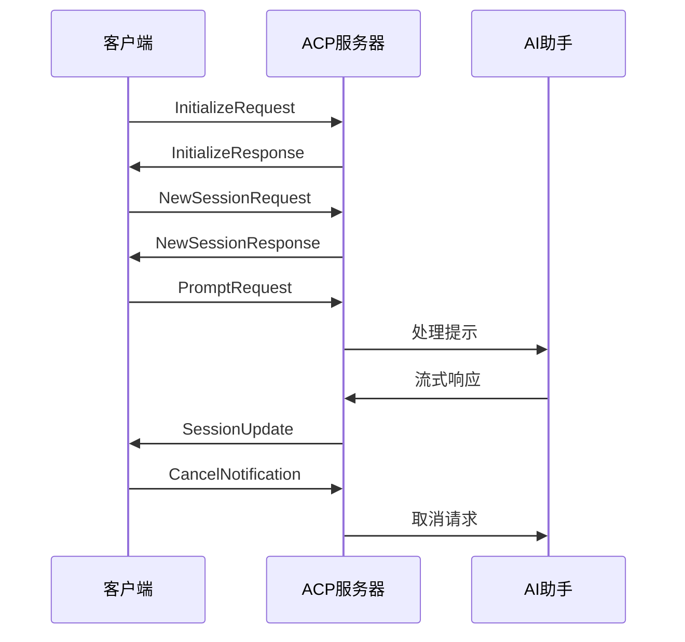

**图表来源**
- [src/kimi_cli/ui/acp/__init__.py](file://src/kimi_cli/ui/acp/__init__.py#L105-L180)

#### 3. 工具调用集成
ACP模式支持复杂的工具调用链：

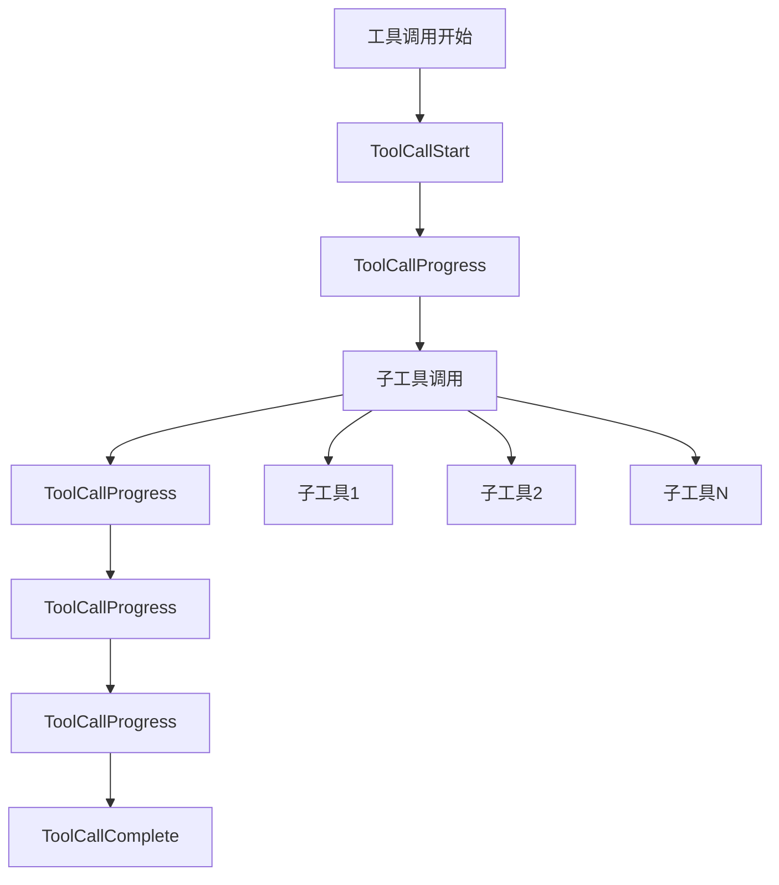

**图表来源**
- [src/kimi_cli/ui/acp/__init__.py](file://src/kimi_cli/ui/acp/__init__.py#L238-L326)

### 编辑器集成配置

#### Zed编辑器配置示例
要在Zed中使用Kimi CLI作为代理服务器，需要添加以下配置：

```json
{
  "agent_servers": {
    "Kimi CLI": {
      "command": "kimi",
      "args": ["--acp"],
      "env": {}
    }
  }
}
```

#### 支持的编辑器
- **Zed**: 原生支持，通过配置即可使用
- **VS Code**: 通过插件支持
- **其他编辑器**: 任何支持ACP协议的编辑器

**章节来源**
- [src/kimi_cli/ui/acp/__init__.py](file://src/kimi_cli/ui/acp/__init__.py#L74-L473)

## Wire模式详解

Wire模式是一个实验性的协议，提供基于JSON-RPC的通信接口。

### 协议规范

#### 1. 传输层
Wire协议使用标准输入输出进行通信：

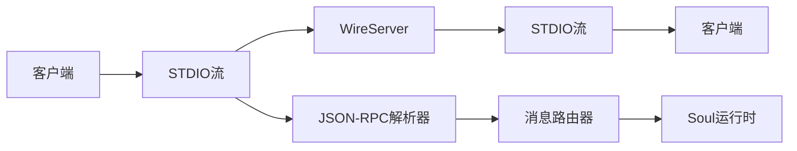

**图表来源**
- [src/kimi_cli/ui/wire/__init__.py](file://src/kimi_cli/ui/wire/__init__.py#L114-L137)

#### 2. 方法调用
Wire协议支持以下方法：

| 方法名 | 请求参数 | 响应类型 | 描述 |
|--------|----------|----------|------|
| `run` | `{"input": "prompt"}` | 成功/错误 | 执行AI任务 |
| `interrupt` | `{}` | 成功/错误 | 中断当前任务 |

#### 3. 事件通知
服务器会发送各种事件通知：

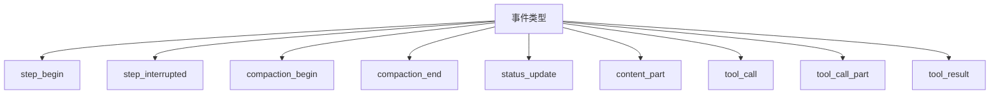

**图表来源**
- [src/kimi_cli/ui/wire/README.md](file://src/kimi_cli/ui/wire/README.md#L51-L67)

### JSON-RPC实现

Wire模式使用标准的JSON-RPC 2.0协议：

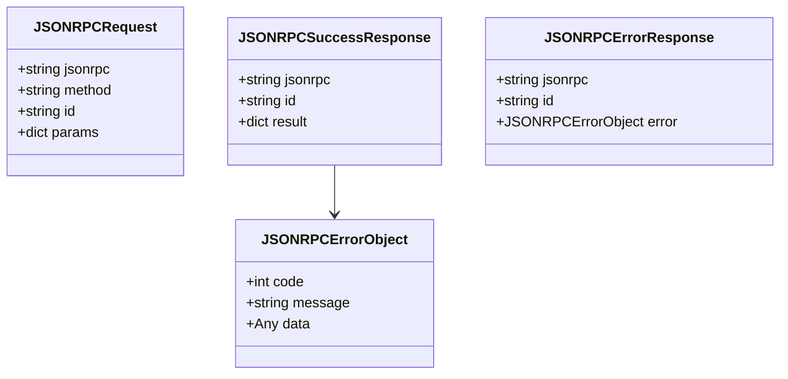

**图表来源**
- [src/kimi_cli/ui/wire/jsonrpc.py](file://src/kimi_cli/ui/wire/jsonrpc.py#L16-L38)

### 错误码定义

| 错误码 | 含义 | 场景 |
|--------|------|------|
| -32000 | 运行中 | 当前已有运行中的任务 |
| -32001 | LLM未配置 | AI模型未正确设置 |
| -32002 | 提供商错误 | AI服务提供商返回错误 |
| -32003 | 不支持的LLM | 当前模型不支持某些功能 |
| -32099 | 运行失败 | 未知异常导致的运行失败 |

**章节来源**
- [src/kimi_cli/ui/wire/__init__.py](file://src/kimi_cli/ui/wire/__init__.py#L35-L343)
- [src/kimi_cli/ui/wire/jsonrpc.py](file://src/kimi_cli/ui/wire/jsonrpc.py#L1-L51)
- [src/kimi_cli/ui/wire/README.md](file://src/kimi_cli/ui/wire/README.md#L1-L110)

## UI设计原则

基于CLAUDE.md中的设计原则，Kimi CLI的UI设计遵循以下核心理念：

### 1. 用户体验优先
- **直观的界面**: 清晰的状态指示和操作反馈
- **快速响应**: 最小化延迟，提供实时反馈
- **一致性**: 统一的交互模式和视觉风格

### 2. 可访问性设计
- **键盘导航**: 完整的键盘快捷键支持
- **屏幕阅读器**: 支持辅助技术
- **色彩对比**: 高对比度的颜色方案

### 3. 错误处理策略
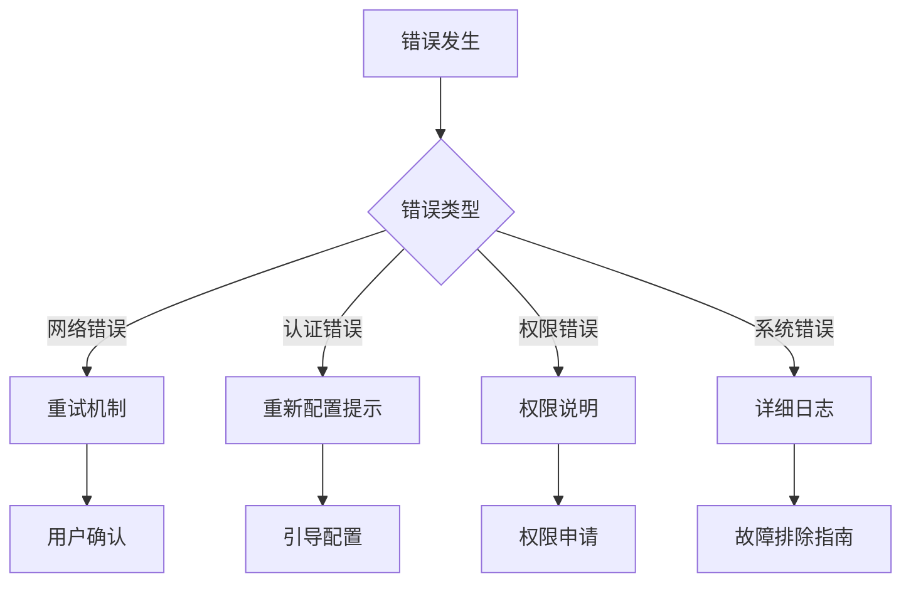

### 4. 渐进式披露
- **基础功能**: 新用户可以立即上手
- **高级特性**: 有经验的用户可以探索
- **配置选项**: 渐进式暴露高级设置

**章节来源**
- [src/kimi_cli/ui/CLAUDE.md](file://src/kimi_cli/ui/CLAUDE.md#L1-L298)

## 错误处理机制

Kimi CLI的UI层实现了完善的错误处理机制：

### 1. 异常分类处理
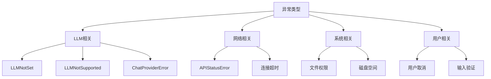

### 2. 错误恢复策略
- **自动重试**: 对于临时性错误
- **降级处理**: 功能不可用时的替代方案
- **用户引导**: 清晰的错误说明和解决建议

### 3. 日志记录
- **结构化日志**: 便于分析和调试
- **敏感信息过滤**: 避免泄露个人信息
- **分级日志**: 不同严重级别的日志分离

**章节来源**
- [src/kimi_cli/ui/shell/__init__.py](file://src/kimi_cli/ui/shell/__init__.py#L160-L229)
- [src/kimi_cli/ui/print/__init__.py](file://src/kimi_cli/ui/print/__init__.py#L78-L98)

## 总结

Kimi CLI的用户界面模式系统提供了丰富而灵活的交互选择：

### 模式对比

| 特性 | Shell模式 | Print模式 | ACP模式 | Wire模式 |
|------|-----------|-----------|---------|----------|
| 交互性 | 完全交互 | 非交互 | 交互 | 交互 |
| 适用场景 | 日常使用 | 批处理 | 编辑器集成 | 开发工具 |
| 配置复杂度 | 中等 | 低 | 中等 | 高 |
| 性能开销 | 中等 | 低 | 中等 | 中等 |
| 扩展性 | 高 | 中等 | 高 | 高 |

### 设计优势

1. **模块化架构**: 每个模式独立实现，便于维护和扩展
2. **统一接口**: 底层Soul运行时保持一致的接口
3. **渐进增强**: 从简单到复杂的功能递进
4. **标准化协议**: ACP和Wire模式符合行业标准

### 未来发展方向

- **更多编辑器支持**: 扩展ACP协议支持范围
- **性能优化**: 减少延迟，提升响应速度
- **功能增强**: 添加更多交互特性
- **协议完善**: Wire协议的标准化和稳定化

通过这四种不同的用户界面模式，Kimi CLI能够满足从日常开发到专业集成的各种需求，为用户提供最佳的AI辅助开发体验。