# Agent配置

<cite>
**本文档中引用的文件**
- [agent.yaml](file://src/kimi_cli/agents/default/agent.yaml)
- [sub.yaml](file://src/kimi_cli/agents/default/sub.yaml)
- [system.md](file://src/kimi_cli/agents/default/system.md)
- [agentspec.py](file://src/kimi_cli/agentspec.py)
- [toolset.py](file://src/kimi_cli/soul/toolset.py)
- [runtime.py](file://src/kimi_cli/soul/runtime.py)
- [app.py](file://src/kimi_cli/app.py)
- [read.py](file://src/kimi_cli/tools/file/read.py)
- [search.py](file://src/kimi_cli/tools/web/search.py)
- [test_default_agent.py](file://tests/test_default_agent.py)
- [test_load_agent.py](file://tests/test_load_agent.py)
</cite>

## 目录
1. [简介](#简介)
2. [项目结构概览](#项目结构概览)
3. [核心配置文件分析](#核心配置文件分析)
4. [Agent配置架构](#agent配置架构)
5. [详细组件分析](#详细组件分析)
6. [系统提示词模板机制](#系统提示词模板机制)
7. [工具模块配置](#工具模块配置)
8. [子代理配置](#子代理配置)
9. [配置加载机制](#配置加载机制)
10. [最佳实践与故障排除](#最佳实践与故障排除)
11. [总结](#总结)

## 简介

Kimi CLI的Agent配置系统是一个基于YAML格式的灵活框架，用于定义AI代理的行为规范、可用工具和子代理能力。该系统通过`agent.yaml`和`sub.yaml`文件实现分层配置管理，支持动态系统提示词生成、工具模块的启用/禁用控制以及领域特定的子代理扩展。

## 项目结构概览

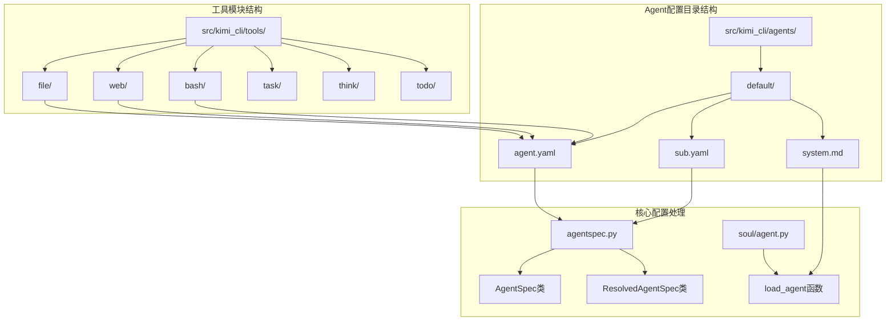

**图表来源**
- [agent.yaml](file://src/kimi_cli/agents/default/agent.yaml#L1-L25)
- [sub.yaml](file://src/kimi_cli/agents/default/sub.yaml#L1-L12)
- [agentspec.py](file://src/kimi_cli/agentspec.py#L1-L120)

## 核心配置文件分析

### 主Agent配置 (agent.yaml)

主Agent配置文件定义了基础代理的核心属性和行为规范：

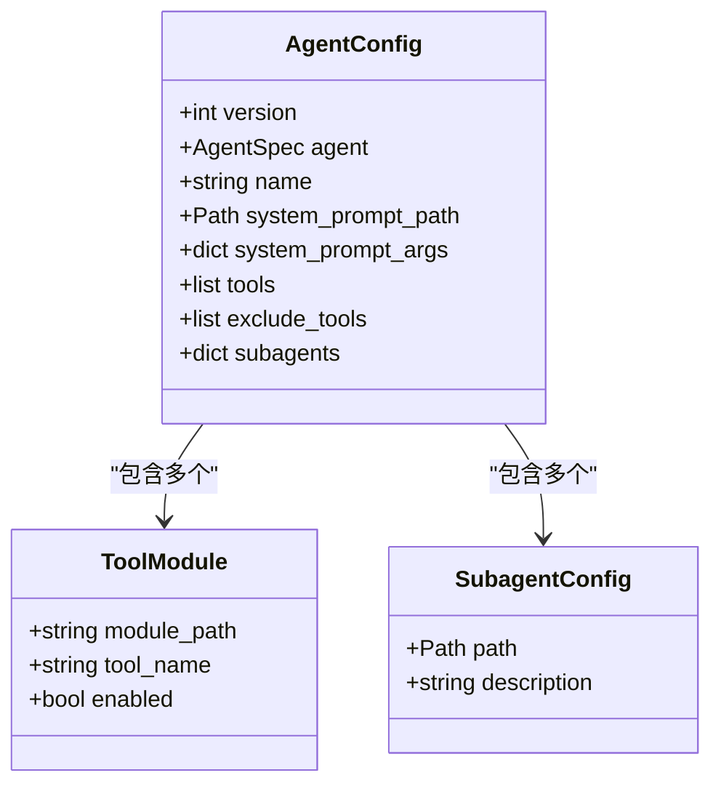

**图表来源**
- [agent.yaml](file://src/kimi_cli/agents/default/agent.yaml#L1-L25)
- [agentspec.py](file://src/kimi_cli/agentspec.py#L20-L34)

**节来源**
- [agent.yaml](file://src/kimi_cli/agents/default/agent.yaml#L1-L25)
- [agentspec.py](file://src/kimi_cli/agentspec.py#L20-L34)

### 子代理配置 (sub.yaml)

子代理配置文件提供了对主代理功能的扩展和定制：

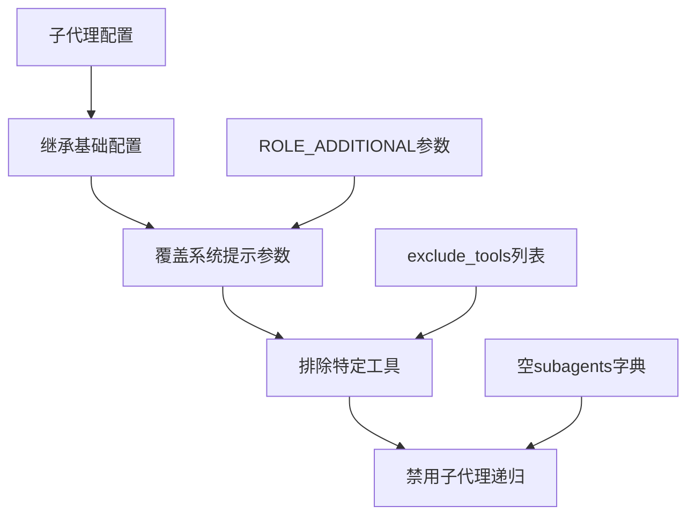

**图表来源**
- [sub.yaml](file://src/kimi_cli/agents/default/sub.yaml#L1-L12)

**节来源**
- [sub.yaml](file://src/kimi_cli/agents/default/sub.yaml#L1-L12)

## Agent配置架构

### 配置层次结构

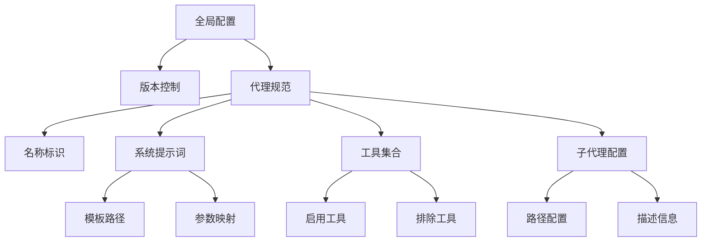

**图表来源**
- [agentspec.py](file://src/kimi_cli/agentspec.py#L20-L34)

### 数据模型定义

Agent配置系统使用Pydantic数据模型确保配置的类型安全和验证：

| 字段名 | 类型 | 必需 | 描述 |
|--------|------|------|------|
| version | int | 是 | 配置文件版本号 |
| name | str | 是 | 代理名称标识符 |
| system_prompt_path | Path | 是 | 系统提示词模板文件路径 |
| system_prompt_args | dict[str, str] | 否 | 系统提示词参数映射表 |
| tools | list[str] | 是 | 启用的工具模块列表 |
| exclude_tools | list[str] | 否 | 排除的工具模块列表 |
| subagents | dict[str, SubagentSpec] | 否 | 子代理配置字典 |

**节来源**
- [agentspec.py](file://src/kimi_cli/agentspec.py#L20-L34)

## 详细组件分析

### 版本控制机制

配置系统采用版本控制确保向后兼容性：

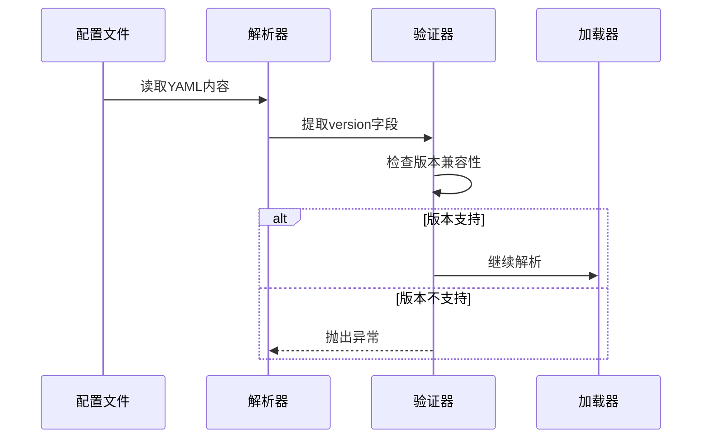

**图表来源**
- [agentspec.py](file://src/kimi_cli/agentspec.py#L89-L91)

### 系统提示词参数处理

系统提示词支持动态参数替换机制：

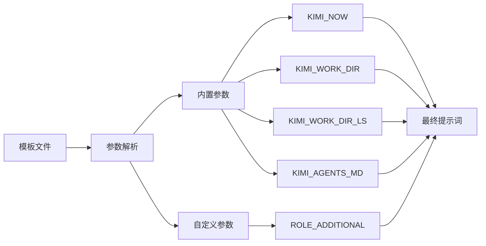

**图表来源**
- [system.md](file://src/kimi_cli/agents/default/system.md#L1-L73)
- [runtime.py](file://src/kimi_cli/soul/runtime.py#L18-L29)

**节来源**
- [system.md](file://src/kimi_cli/agents/default/system.md#L1-L73)
- [runtime.py](file://src/kimi_cli/soul/runtime.py#L18-L29)

## 系统提示词模板机制

### 模板变量系统

系统提示词模板支持多种内置和自定义变量：

| 变量名 | 类型 | 描述 | 示例值 |
|--------|------|------|--------|
| ${KIMI_NOW} | 时间戳 | 当前日期时间 | 2024-01-15T10:30:00+08:00 |
| ${KIMI_WORK_DIR} | 路径 | 工作目录绝对路径 | /home/user/project |
| ${KIMI_WORK_DIR_LS} | 字符串 | 目录列表输出 | drwxr-xr-x 2 user group ... |
| ${KIMI_AGENTS_MD} | 文本 | AGENTS.md文件内容 | 项目配置说明... |
| ${ROLE_ADDITIONAL} | 文本 | 角色补充说明 | 作为软件工程师... |

### 动态内容生成流程

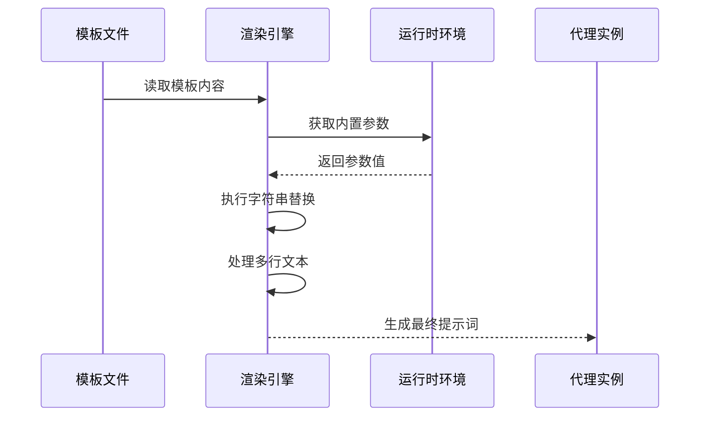

**图表来源**
- [runtime.py](file://src/kimi_cli/soul/runtime.py#L32-L41)
- [agentspec.py](file://src/kimi_cli/agentspec.py#L81-L118)

**节来源**
- [runtime.py](file://src/kimi_cli/soul/runtime.py#L32-L41)
- [agentspec.py](file://src/kimi_cli/agentspec.py#L81-L118)

## 工具模块配置

### 工具导入路径格式

工具模块使用Python导入路径格式：`模块路径:工具类名`

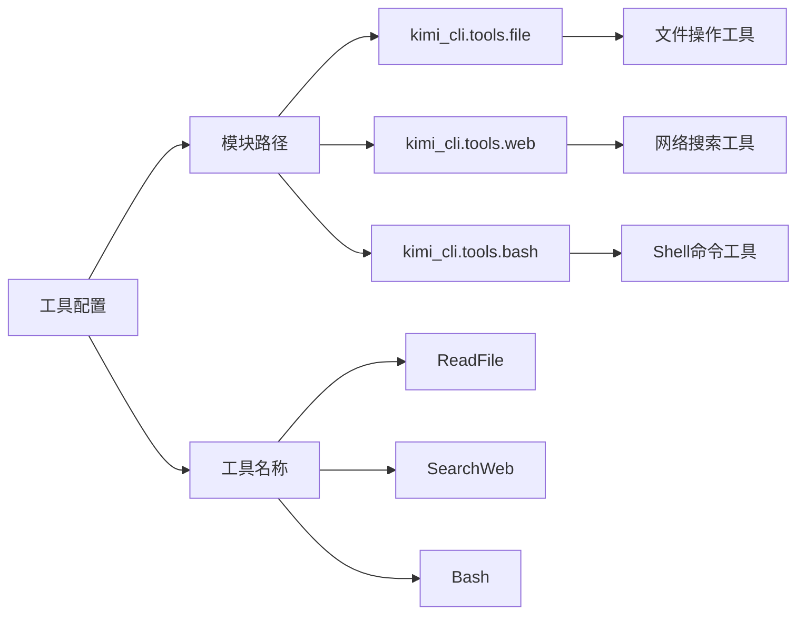

**图表来源**
- [agent.yaml](file://src/kimi_cli/agents/default/agent.yaml#L8-L20)

### 工具启用/禁用机制

工具可以通过注释语法进行启用或禁用：

| 配置状态 | 实际效果 | 使用场景 |
|----------|----------|----------|
| 未注释 | 启用工具 | 正常使用工具功能 |
| 注释掉 | 禁用工具 | 临时禁用或调试 |
| 排除列表 | 强制禁用 | 子代理中移除特定工具 |

### 支持的工具模块

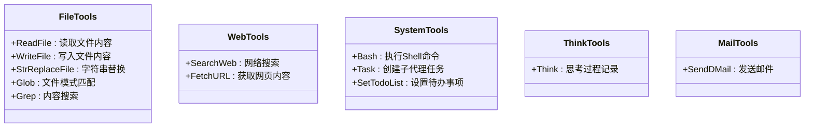

**图表来源**
- [agent.yaml](file://src/kimi_cli/agents/default/agent.yaml#L8-L20)
- [read.py](file://src/kimi_cli/tools/file/read.py#L38-L49)
- [search.py](file://src/kimi_cli/tools/web/search.py#L38-L42)

**节来源**
- [agent.yaml](file://src/kimi_cli/agents/default/agent.yaml#L8-L20)
- [read.py](file://src/kimi_cli/tools/file/read.py#L38-L49)
- [search.py](file://src/kimi_cli/tools/web/search.py#L38-L42)

## 子代理配置

### 子代理概念与用途

子代理是主代理的专用扩展，具有独立的上下文和工具集：

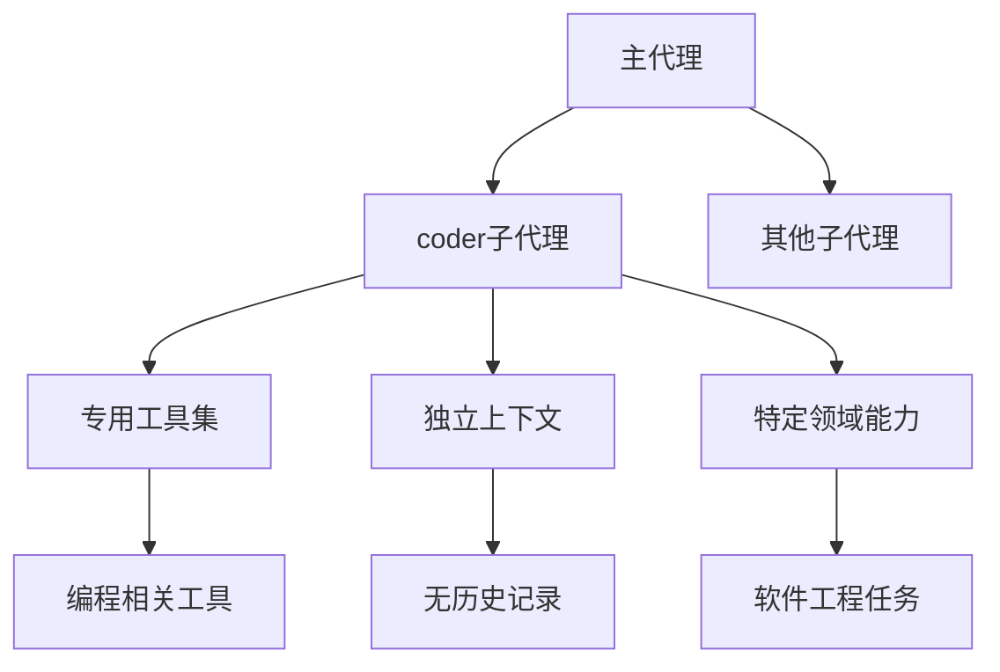

**图表来源**
- [agent.yaml](file://src/kimi_cli/agents/default/agent.yaml#L21-L25)
- [sub.yaml](file://src/kimi_cli/agents/default/sub.yaml#L1-L12)

### coder子代理配置详解

coder子代理通过以下方式扩展特定领域能力：

| 配置项 | 值 | 作用 |
|--------|-----|------|
| path | ./sub.yaml | 指向子代理配置文件 |
| description | "Good at general software engineering tasks." | 描述子代理的专业领域 |
| extend | ./agent.yaml | 继承基础代理配置 |
| ROLE_ADDITIONAL | 专用角色说明 | 定义子代理的特殊职责 |
| exclude_tools | 移除通用工具 | 优化工具集，专注编程任务 |

### 子代理工作流程

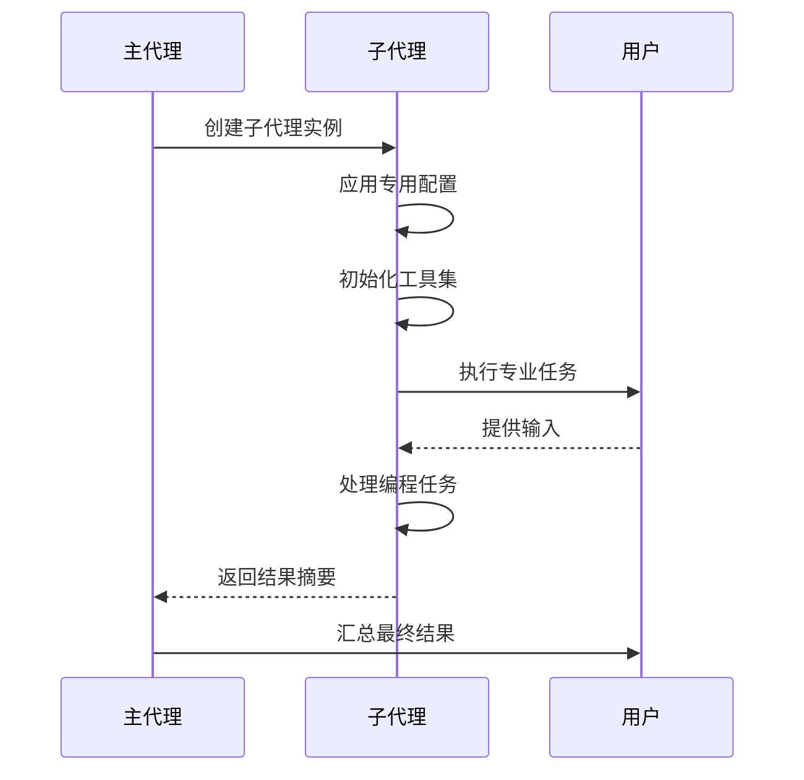

**图表来源**
- [sub.yaml](file://src/kimi_cli/agents/default/sub.yaml#L5-L7)

**节来源**
- [agent.yaml](file://src/kimi_cli/agents/default/agent.yaml#L21-L25)
- [sub.yaml](file://src/kimi_cli/agents/default/sub.yaml#L1-L12)

## 配置加载机制

### 配置解析流程

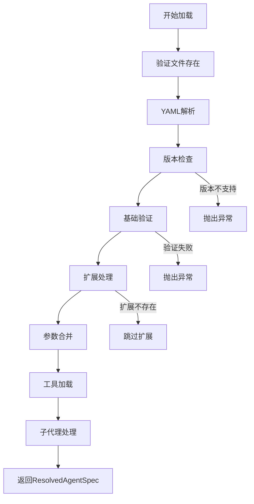

**图表来源**
- [agentspec.py](file://src/kimi_cli/agentspec.py#L55-L119)

### 运行时配置应用

配置系统在运行时动态应用到代理实例：

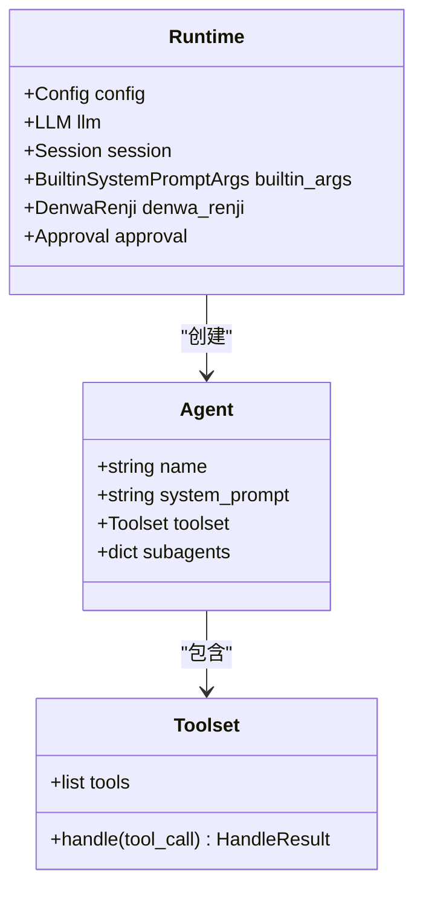

**图表来源**
- [runtime.py](file://src/kimi_cli/soul/runtime.py#L66-L100)
- [toolset.py](file://src/kimi_cli/soul/toolset.py#L21-L29)

**节来源**
- [agentspec.py](file://src/kimi_cli/agentspec.py#L55-L119)
- [runtime.py](file://src/kimi_cli/soul/runtime.py#L66-L100)
- [toolset.py](file://src/kimi_cli/soul/toolset.py#L21-L29)

## 最佳实践与故障排除

### 配置最佳实践

1. **工具选择原则**
   - 根据具体任务需求选择合适的工具
   - 避免过度配置导致性能下降
   - 合理使用注释语法进行工具管理

2. **系统提示词设计**
   - 使用清晰的角色定位描述
   - 合理利用模板变量
   - 保持提示词的简洁性和针对性

3. **子代理配置策略**
   - 明确子代理的专业领域
   - 避免子代理间的功能重叠
   - 合理设置子代理的生命周期

### 常见问题排查

| 问题类型 | 症状 | 解决方案 |
|----------|------|----------|
| 工具加载失败 | ValueError: Invalid tools | 检查工具路径和类名 |
| 配置文件错误 | AgentSpecError | 验证YAML格式和必需字段 |
| 模板变量缺失 | 渲染错误 | 确保所有模板变量都有对应值 |
| 子代理循环引用 | 无限递归 | 检查subagents配置是否正确 |

### 测试配置有效性

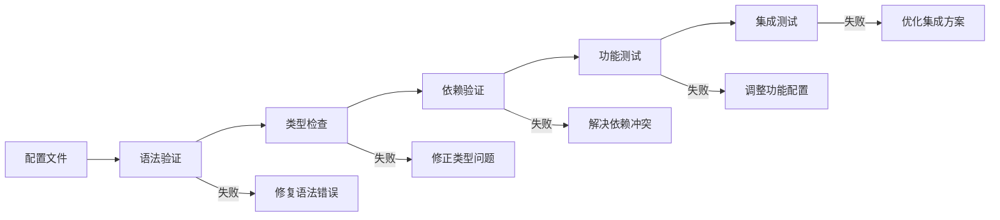

**图表来源**
- [test_load_agent.py](file://tests/test_load_agent.py#L73-L77)
- [test_default_agent.py](file://tests/test_default_agent.py#L15-L17)

**节来源**
- [test_load_agent.py](file://tests/test_load_agent.py#L73-L77)
- [test_default_agent.py](file://tests/test_default_agent.py#L15-L17)

## 总结

Kimi CLI的Agent配置系统通过精心设计的YAML配置文件实现了高度灵活和可扩展的代理配置管理。系统的核心优势包括：

1. **分层配置架构**：通过`agent.yaml`和`sub.yaml`实现基础配置与扩展配置的分离
2. **动态模板系统**：支持复杂的系统提示词模板和参数替换机制
3. **灵活工具管理**：提供精确的工具启用/禁用控制和排除机制
4. **专业化子代理**：支持领域特定的能力扩展和上下文隔离
5. **强类型验证**：基于Pydantic的数据模型确保配置的完整性和安全性

该配置系统为开发者提供了强大而灵活的代理定制能力，同时保持了良好的可维护性和扩展性。通过合理的配置管理和最佳实践遵循，可以构建出高效、专业的AI代理解决方案。