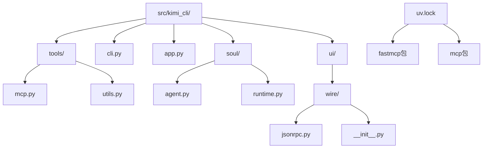
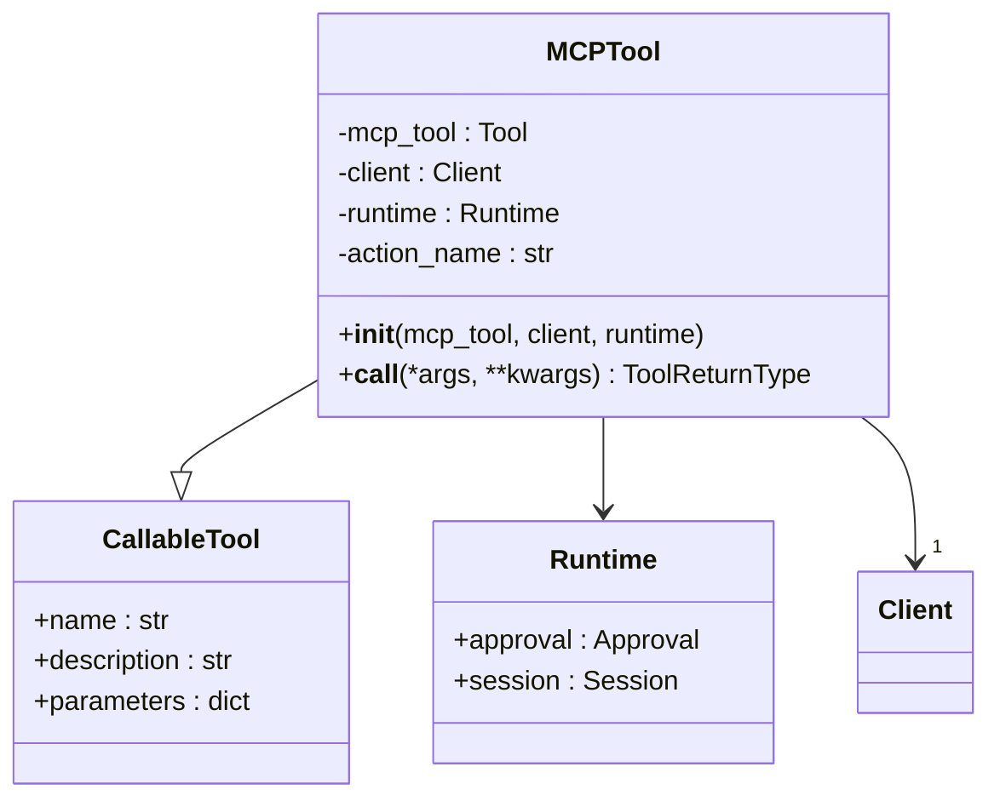
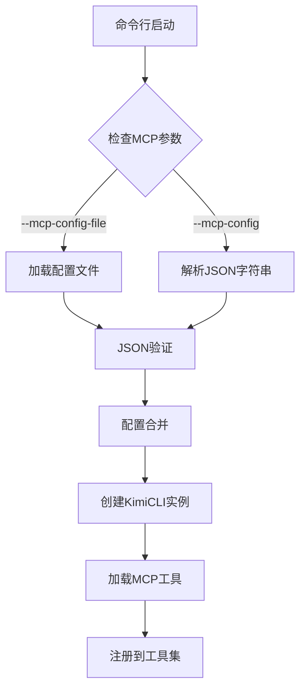
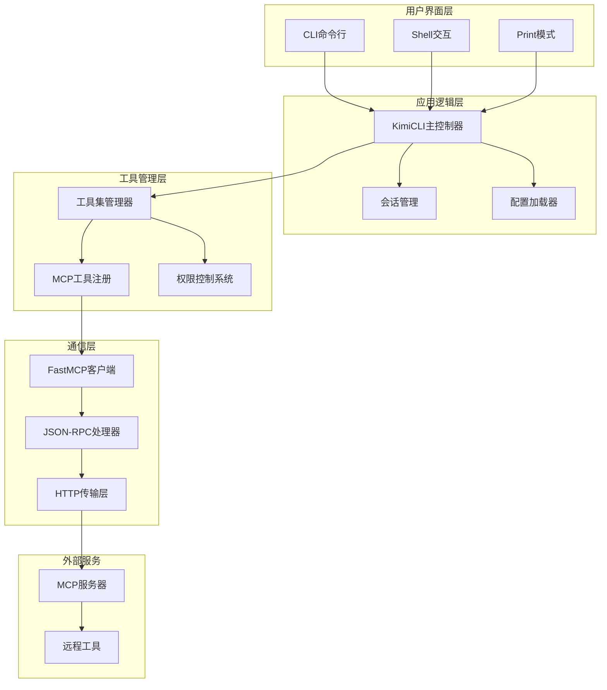
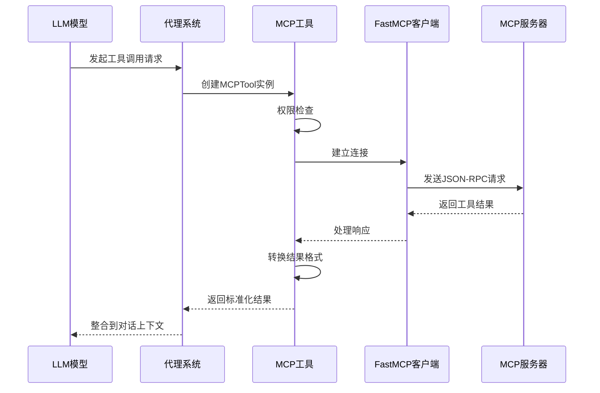
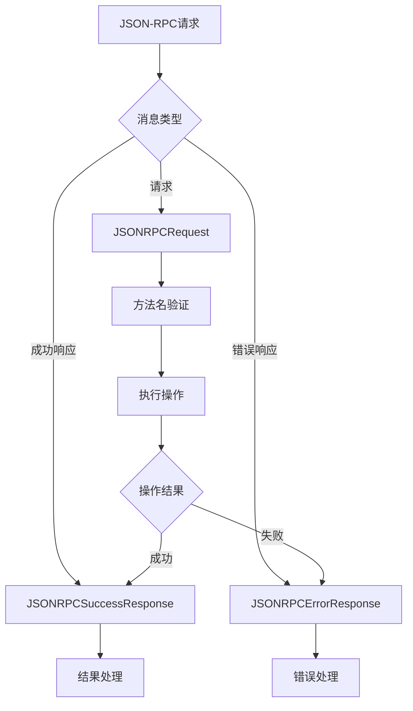
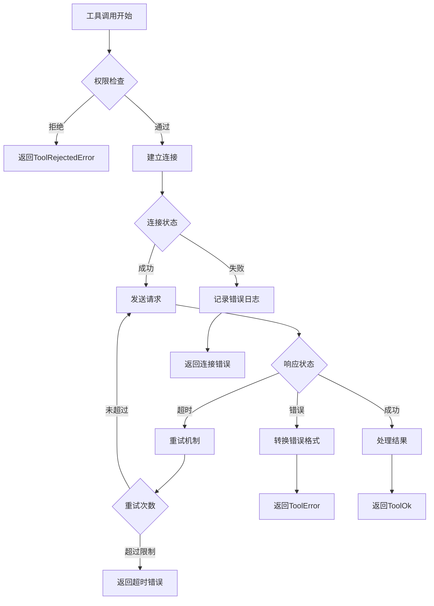
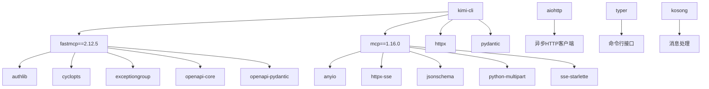

# MCP配置

<cite>
**本文档中引用的文件**
- [src/kimi_cli/tools/mcp.py](file://src/kimi_cli/tools/mcp.py)
- [src/kimi_cli/cli.py](file://src/kimi_cli/cli.py)
- [src/kimi_cli/app.py](file://src/kimi_cli/app.py)
- [src/kimi_cli/soul/agent.py](file://src/kimi_cli/soul/agent.py)
- [src/kimi_cli/ui/wire/jsonrpc.py](file://src/kimi_cli/ui/wire/jsonrpc.py)
- [src/kimi_cli/ui/wire/__init__.py](file://src/kimi_cli/ui/wire/__init__.py)
- [uv.lock](file://uv.lock)
</cite>

## 目录
1. [简介](#简介)
2. [项目结构](#项目结构)
3. [核心组件](#核心组件)
4. [架构概览](#架构概览)
5. [详细组件分析](#详细组件分析)
6. [依赖关系分析](#依赖关系分析)
7. [性能考虑](#性能考虑)
8. [故障排除指南](#故障排除指南)
9. [结论](#结论)

## 简介

MCP（Model Context Protocol）配置是Kimí CLI系统中的重要功能，允许用户通过JSON格式的配置文件集成外部工具服务器。该系统基于FastMCP库构建，提供了完整的MCP协议支持，包括服务器发现、工具注册、JSON-RPC通信和结果处理。

MCP配置系统的核心价值在于：
- **标准化接口**：统一的外部工具接入方式
- **动态注册**：运行时自动发现和注册远程工具
- **类型安全**：基于Pydantic的配置验证
- **异步处理**：高效的并发工具调用
- **安全性**：完善的权限控制和错误处理

## 项目结构

Kimí CLI的MCP配置相关文件主要分布在以下目录结构中：



**图表来源**
- [src/kimi_cli/tools/mcp.py](file://src/kimi_cli/tools/mcp.py#L1-L114)
- [src/kimi_cli/cli.py](file://src/kimi_cli/cli.py#L1-L358)
- [src/kimi_cli/app.py](file://src/kimi_cli/app.py#L1-L217)

**章节来源**
- [src/kimi_cli/tools/mcp.py](file://src/kimi_cli/tools/mcp.py#L1-L114)
- [src/kimi_cli/cli.py](file://src/kimi_cli/cli.py#L1-L358)

## 核心组件

### MCP工具类（MCPTool）

MCPTool是MCP配置系统的核心组件，负责封装远程工具并提供统一的调用接口。



**图表来源**
- [src/kimi_cli/tools/mcp.py](file://src/kimi_cli/tools/mcp.py#L14-L43)

### CLI参数处理

CLI模块提供了灵活的MCP配置加载机制，支持多种配置来源：



**图表来源**
- [src/kimi_cli/cli.py](file://src/kimi_cli/cli.py#L155-L178)
- [src/kimi_cli/cli.py](file://src/kimi_cli/cli.py#L270-L281)

**章节来源**
- [src/kimi_cli/tools/mcp.py](file://src/kimi_cli/tools/mcp.py#L14-L43)
- [src/kimi_cli/cli.py](file://src/kimi_cli/cli.py#L155-L178)

## 架构概览

Kimí CLI的MCP配置架构采用分层设计，确保了系统的可扩展性和维护性：



**图表来源**
- [src/kimi_cli/app.py](file://src/kimi_cli/app.py#L25-L102)
- [src/kimi_cli/soul/agent.py](file://src/kimi_cli/soul/agent.py#L144-L164)

## 详细组件分析

### MCP配置文件结构

MCP配置文件采用JSON格式，支持以下核心字段：

| 字段名 | 类型 | 必需 | 描述 |
|--------|------|------|------|
| `serverUrl` | string | 是 | MCP服务器的URL地址 |
| `headers` | object | 否 | HTTP请求头，通常包含认证信息 |
| `timeout` | integer | 否 | 请求超时时间（秒） |
| `transport` | string | 否 | 传输协议类型（默认为HTTP） |

#### 配置文件示例

```json
{
  "serverUrl": "http://localhost:3000",
  "headers": {
    "Authorization": "Bearer your-token-here",
    "Content-Type": "application/json"
  },
  "timeout": 30,
  "transport": "http"
}
```

### MCP工具调用生命周期

MCP工具的调用遵循严格的生命周期管理：



**图表来源**
- [src/kimi_cli/tools/mcp.py](file://src/kimi_cli/tools/mcp.py#L34-L43)
- [src/kimi_cli/soul/agent.py](file://src/kimi_cli/soul/agent.py#L144-L164)

### JSON-RPC通信协议

系统使用标准的JSON-RPC 2.0协议进行通信：



**图表来源**
- [src/kimi_cli/ui/wire/jsonrpc.py](file://src/kimi_cli/ui/wire/jsonrpc.py#L16-L38)

**章节来源**
- [src/kimi_cli/tools/mcp.py](file://src/kimi_cli/tools/mcp.py#L34-L43)
- [src/kimi_cli/soul/agent.py](file://src/kimi_cli/soul/agent.py#L144-L164)
- [src/kimi_cli/ui/wire/jsonrpc.py](file://src/kimi_cli/ui/wire/jsonrpc.py#L16-L38)

### 错误处理和重试机制

系统实现了完善的错误处理机制：



**图表来源**
- [src/kimi_cli/tools/mcp.py](file://src/kimi_cli/tools/mcp.py#L34-L43)

**章节来源**
- [src/kimi_cli/tools/mcp.py](file://src/kimi_cli/tools/mcp.py#L34-L43)

## 依赖关系分析

Kimí CLI的MCP配置系统依赖于多个关键库：



**图表来源**
- [uv.lock](file://uv.lock#L489-L1074)

**章节来源**
- [uv.lock](file://uv.lock#L489-L1074)

## 性能考虑

### 异步处理优势

MCP配置系统采用异步处理模式，具有以下性能优势：

- **并发执行**：多个MCP工具可以同时调用
- **资源利用率**：避免阻塞式等待
- **响应速度**：减少网络延迟影响
- **内存效率**：按需加载和释放资源

### 连接池管理

系统实现了智能的连接池管理策略：

- **连接复用**：相同服务器的请求共享连接
- **超时控制**：防止连接泄漏
- **健康检查**：定期验证服务器可用性
- **自动重连**：网络中断后的恢复机制

## 故障排除指南

### 常见连接问题

#### 1. 服务器无法访问

**症状**：连接超时或拒绝连接
**解决方案**：
- 检查服务器URL是否正确
- 验证网络连接状态
- 确认防火墙设置
- 检查服务器是否正常运行

#### 2. 认证失败

**症状**：401 Unauthorized响应
**解决方案**：
- 验证认证头格式
- 检查令牌有效性
- 确认权限范围
- 更新认证凭据

#### 3. 配置文件格式错误

**症状**：JSON解析错误
**解决方案**：
- 使用JSON验证工具检查语法
- 确保必需字段存在
- 验证数据类型匹配
- 参考配置示例格式

### 调试技巧

#### 启用详细日志

```bash
kimi --debug --mcp-config-file config.json
```

#### 验证配置文件

```bash
# 检查JSON语法
python -m json.tool config.json

# 测试连接
curl -X GET "http://localhost:3000/tools" \
  -H "Authorization: Bearer your-token"
```

### 安全性考虑

#### 认证头保护

- **敏感信息加密**：避免在日志中暴露认证信息
- **环境变量使用**：推荐使用环境变量存储密钥
- **访问控制**：实施最小权限原则
- **审计日志**：记录所有工具调用活动

#### 网络安全

- **HTTPS优先**：使用加密连接
- **证书验证**：确保证书有效性
- **IP白名单**：限制服务器访问来源
- **速率限制**：防止滥用攻击

**章节来源**
- [src/kimi_cli/cli.py](file://src/kimi_cli/cli.py#L273-L281)
- [src/kimi_cli/tools/mcp.py](file://src/kimi_cli/tools/mcp.py#L34-L43)

## 结论

Kimí CLI的MCP配置系统提供了一个强大而灵活的外部工具集成平台。通过标准化的JSON配置格式、可靠的JSON-RPC通信协议和完善的错误处理机制，系统能够安全高效地集成各种外部MCP服务。

### 主要优势

- **标准化接口**：统一的MCP协议支持
- **灵活配置**：多种配置方式满足不同需求
- **类型安全**：基于Pydantic的严格验证
- **异步处理**：高性能并发执行
- **安全保障**：完善的权限控制和错误处理

### 最佳实践建议

1. **配置管理**：使用环境变量管理敏感配置
2. **监控告警**：建立完善的监控和告警机制
3. **版本控制**：对配置文件进行版本管理
4. **测试验证**：定期测试MCP服务器的可用性
5. **文档维护**：保持配置文档的及时更新

通过合理使用MCP配置功能，开发者可以轻松扩展Kimí CLI的功能，集成各种专业工具和服务，构建更加智能和高效的AI助手系统。