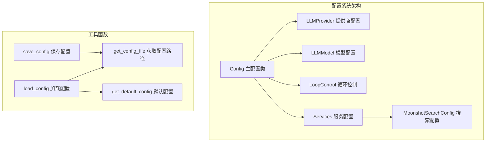
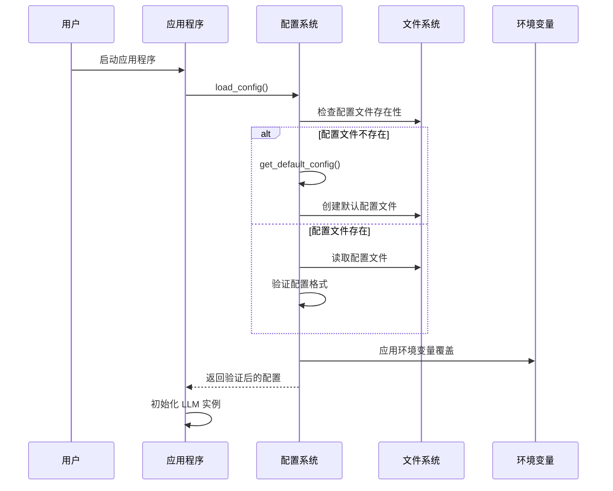
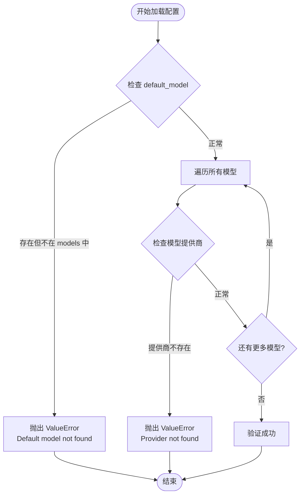
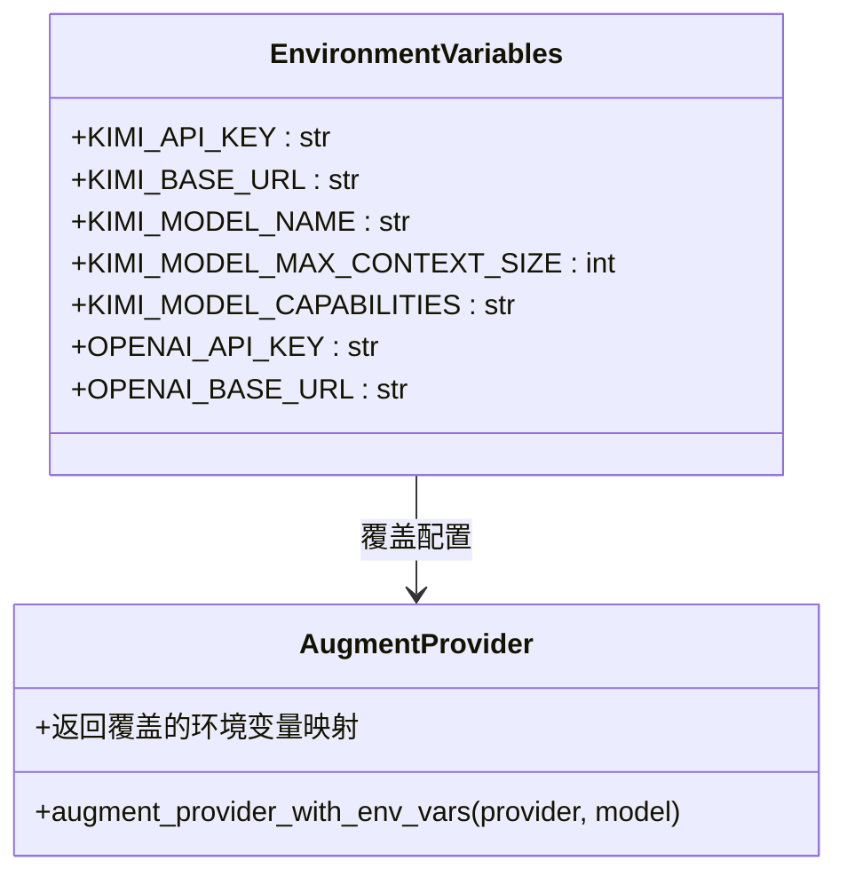
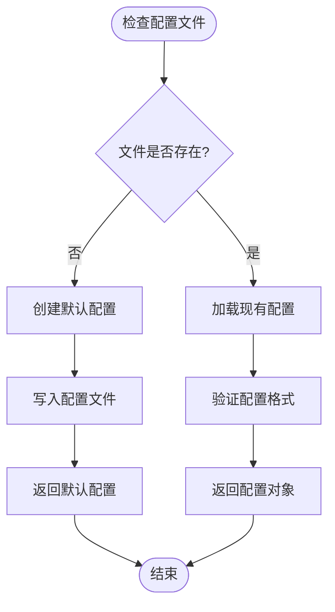
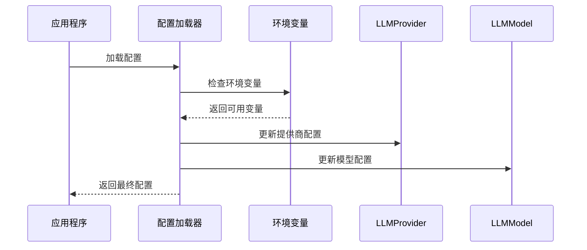
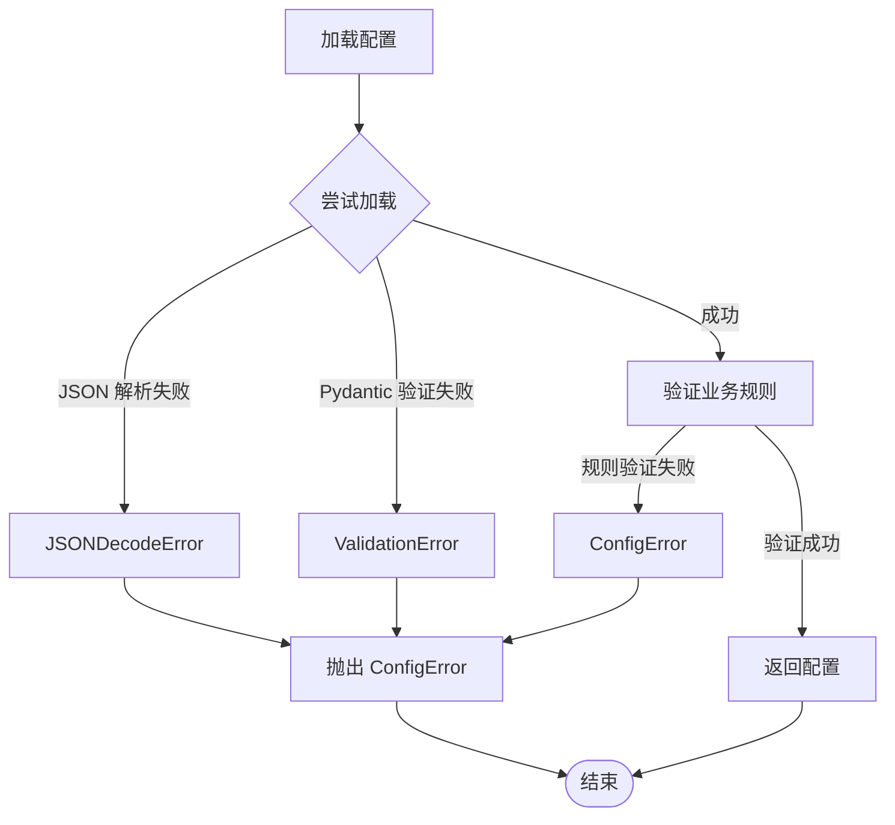

# 用户配置

<cite>
**本文档中引用的文件**
- [config.py](file://src/kimi_cli/config.py)
- [test_config.py](file://tests/test_config.py)
- [llm.py](file://src/kimi_cli/llm.py)
- [share.py](file://src/kimi_cli/share.py)
- [exception.py](file://src/kimi_cli/exception.py)
- [app.py](file://src/kimi_cli/app.py)
- [setup.py](file://src/kimi_cli/ui/shell/setup.py)
</cite>

## 目录
1. [简介](#简介)
2. [项目结构](#项目结构)
3. [核心组件](#核心组件)
4. [架构概览](#架构概览)
5. [详细组件分析](#详细组件分析)
6. [配置文件管理](#配置文件管理)
7. [环境变量支持](#环境变量支持)
8. [配置验证与错误处理](#配置验证与错误处理)
9. [使用示例](#使用示例)
10. [故障排除指南](#故障排除指南)
11. [总结](#总结)

## 简介

Kimi CLI 的配置系统提供了灵活且强大的配置管理功能，允许用户自定义 LLM 提供商、模型设置、循环控制参数和外部服务集成。该系统基于 Pydantic 模型构建，确保配置的类型安全性和完整性验证。

配置系统的核心特性包括：
- 支持多种 LLM 提供商（Kimi、OpenAI、Anthropic 等）
- 可扩展的模型能力定义
- 环境变量覆盖机制
- 自动配置文件管理和验证
- 外部服务集成（如 Moonshot Search）

## 项目结构

配置系统的核心文件位于 `src/kimi_cli/config.py` 中，采用模块化设计：



**图表来源**
- [config.py](file://src/kimi_cli/config.py#L76-L158)

**章节来源**
- [config.py](file://src/kimi_cli/config.py#L1-L158)

## 核心组件

### Config 类 - 主配置容器

Config 类是整个配置系统的核心，包含了所有主要的配置选项：

| 字段名 | 类型 | 默认值 | 描述 |
|--------|------|--------|------|
| default_model | str | "" | 默认使用的模型名称 |
| models | dict[str, LLMModel] | {} | 所有可用的 LLM 模型配置 |
| providers | dict[str, LLMProvider] | {} | 所有 LLM 提供商配置 |
| loop_control | LoopControl | 配置实例 | 代理循环控制参数 |
| services | Services | 配置实例 | 外部服务配置 |

### LLMProvider - LLM 提供商配置

LLMProvider 定义了与特定 LLM 提供商的连接信息：

| 字段名 | 类型 | 必需 | 描述 |
|--------|------|------|------|
| type | ProviderType | 是 | 提供商类型（kimi、openai_legacy、openai_responses、anthropic、_chaos） |
| base_url | str | 是 | API 基础 URL |
| api_key | SecretStr | 是 | API 密钥（自动加密存储） |
| custom_headers | dict[str, str] | 否 | 自定义请求头 |

### LLMModel - LLM 模型配置

LLMModel 定义了具体的模型参数：

| 字段名 | 类型 | 必需 | 描述 |
|--------|------|------|------|
| provider | str | 是 | 关联的提供商名称 |
| model | str | 是 | 模型名称 |
| max_context_size | int | 是 | 最大上下文大小（token 单位） |
| capabilities | set[ModelCapability] | 否 | 模型能力集合 |

### LoopControl - 循环控制配置

控制代理执行过程中的循环行为：

| 字段名 | 类型 | 默认值 | 描述 |
|--------|------|--------|------|
| max_steps_per_run | int | 100 | 一次运行中的最大步骤数 |
| max_retries_per_step | int | 3 | 每个步骤的最大重试次数 |

### Services - 服务配置

管理外部服务集成：

| 字段名 | 类型 | 描述 |
|--------|------|------|
| moonshot_search | MoonshotSearchConfig | Moonshot 搜索服务配置 |

**章节来源**
- [config.py](file://src/kimi_cli/config.py#L15-L75)

## 架构概览

配置系统采用分层架构设计，确保各组件之间的松耦合和高内聚：



**图表来源**
- [config.py](file://src/kimi_cli/config.py#L112-L157)
- [app.py](file://src/kimi_cli/app.py#L52-L82)

## 详细组件分析

### 配置验证机制

配置系统实现了严格的验证逻辑，确保配置的一致性和有效性：



**图表来源**
- [config.py](file://src/kimi_cli/config.py#L87-L94)

### 环境变量覆盖机制

系统支持通过环境变量动态覆盖配置参数：



**图表来源**
- [llm.py](file://src/kimi_cli/llm.py#L32-L69)

**章节来源**
- [config.py](file://src/kimi_cli/config.py#L87-L94)
- [llm.py](file://src/kimi_cli/llm.py#L32-L69)

## 配置文件管理

### 配置文件位置

配置文件默认存储在用户主目录下的 `.kimi` 目录中：

```python
# 配置文件路径：~/.kimi/config.json
def get_config_file() -> Path:
    return get_share_dir() / "config.json"
```

### 配置文件操作

系统提供了完整的配置文件生命周期管理：

| 函数 | 功能 | 参数 | 返回值 |
|------|------|------|--------|
| get_config_file() | 获取配置文件路径 | 无 | Path 对象 |
| get_default_config() | 获取默认配置 | 无 | Config 实例 |
| load_config() | 加载配置 | config_file: Path \| None | 验证后的 Config |
| save_config() | 保存配置 | config: Config, config_file: Path \| None | 无 |

### 配置文件不存在时的行为

当配置文件不存在时，系统会自动创建默认配置：



**图表来源**
- [config.py](file://src/kimi_cli/config.py#L129-L134)

**章节来源**
- [config.py](file://src/kimi_cli/config.py#L97-L157)

## 环境变量支持

### 支持的环境变量

系统支持以下环境变量来覆盖配置参数：

#### Kimi 特定环境变量
- `KIMI_API_KEY`: 覆盖 API 密钥
- `KIMI_BASE_URL`: 覆盖基础 URL
- `KIMI_MODEL_NAME`: 覆盖模型名称
- `KIMI_MODEL_MAX_CONTEXT_SIZE`: 覆盖最大上下文大小
- `KIMI_MODEL_CAPABILITIES`: 覆盖模型能力（逗号分隔）

#### OpenAI 环境变量
- `OPENAI_API_KEY`: 覆盖 API 密钥
- `OPENAI_BASE_URL`: 覆盖基础 URL

### 环境变量处理流程



**图表来源**
- [llm.py](file://src/kimi_cli/llm.py#L32-L69)

**章节来源**
- [llm.py](file://src/kimi_cli/llm.py#L32-L69)

## 配置验证与错误处理

### 错误类型

配置系统定义了专门的异常类型来处理不同类型的配置错误：

| 异常类 | 继承关系 | 用途 |
|--------|----------|------|
| KimiCLIException | Exception | 基础异常类 |
| ConfigError | KimiCLIException | 配置相关错误 |
| AgentSpecError | KimiCLIException | 代理规范错误 |

### 验证规则

系统实现了以下验证规则：

1. **默认模型验证**: 确保 default_model 在 models 字典中存在
2. **提供商验证**: 确保所有模型关联的提供商都存在于 providers 字典中
3. **JSON 格式验证**: 使用 Pydantic 进行结构验证
4. **数据类型验证**: 确保所有字段符合预期的数据类型

### 错误处理机制



**图表来源**
- [config.py](file://src/kimi_cli/config.py#L136-L143)
- [exception.py](file://src/kimi_cli/exception.py#L4-L20)

**章节来源**
- [config.py](file://src/kimi_cli/config.py#L136-L143)
- [exception.py](file://src/kimi_cli/exception.py#L4-L20)

## 使用示例

### 基本配置示例

以下是一个完整的配置文件示例：

```json
{
  "default_model": "kimi-for-coding",
  "models": {
    "kimi-for-coding": {
      "provider": "kimi",
      "model": "kimi-for-coding",
      "max_context_size": 100000,
      "capabilities": ["thinking"]
    },
    "gpt-4": {
      "provider": "openai",
      "model": "gpt-4",
      "max_context_size": 8192,
      "capabilities": []
    }
  },
  "providers": {
    "kimi": {
      "type": "kimi",
      "base_url": "https://api.kimi.com/coding/v1",
      "api_key": "your-api-key-here",
      "custom_headers": {
        "Authorization": "Bearer your-token"
      }
    },
    "openai": {
      "type": "openai",
      "base_url": "https://api.openai.com/v1",
      "api_key": "your-openai-api-key"
    }
  },
  "loop_control": {
    "max_steps_per_run": 100,
    "max_retries_per_step": 3
  },
  "services": {
    "moonshot_search": {
      "base_url": "https://api.moonshot.cn/v1",
      "api_key": "your-moonshot-api-key"
    }
  }
}
```

### 环境变量配置示例

```bash
# 设置 Kimi API 配置
export KIMI_API_KEY="your-secret-key"
export KIMI_BASE_URL="https://api.kimi.com/v1"
export KIMI_MODEL_NAME="kimi-for-coding"

# 设置 OpenAI 配置
export OPENAI_API_KEY="your-openai-key"
export OPENAI_BASE_URL="https://api.openai.com/v1"

# 设置模型能力（多个能力用逗号分隔）
export KIMI_MODEL_CAPABILITIES="thinking,image_in"
```

### 通过代码访问配置

```python
from kimi_cli.config import load_config, save_config
from pathlib import Path

# 加载配置
config = load_config()

# 修改配置
config.default_model = "gpt-4"
config.models["gpt-4"].max_context_size = 16384

# 保存配置
save_config(config)
```

**章节来源**
- [test_config.py](file://tests/test_config.py#L24-L39)
- [setup.py](file://src/kimi_cli/ui/shell/setup.py#L58-L77)

## 故障排除指南

### 常见问题及解决方案

#### 1. 配置文件损坏
**症状**: 启动时出现 JSON 解析错误
**解决方案**: 删除损坏的配置文件，系统会自动生成新的默认配置

#### 2. 模型配置不匹配
**症状**: 报告 "Default model not found in models" 错误
**解决方案**: 确保 default_model 在 models 字典中存在，或清空 default_model 字段

#### 3. 提供商配置缺失
**症状**: 报告 "Provider not found in providers" 错误
**解决方案**: 添加对应的提供商配置到 providers 字典中

#### 4. API 密钥无效
**症状**: LLM 调用失败，返回认证错误
**解决方案**: 检查 API 密钥是否正确，或通过环境变量重新设置

### 调试技巧

1. **启用调试日志**: 查看配置加载过程中的详细信息
2. **检查配置文件**: 验证配置文件的 JSON 格式和内容
3. **使用环境变量**: 临时使用环境变量覆盖配置进行测试
4. **重置配置**: 删除配置文件以恢复为默认设置

**章节来源**
- [config.py](file://src/kimi_cli/config.py#L136-L143)

## 总结

Kimi CLI 的配置系统提供了全面而灵活的配置管理功能，具有以下特点：

### 主要优势
- **类型安全**: 基于 Pydantic 的强类型验证
- **可扩展性**: 支持多种 LLM 提供商和模型
- **灵活性**: 环境变量覆盖机制
- **可靠性**: 完善的错误处理和验证机制
- **易用性**: 自动配置文件管理和默认值

### 设计原则
- **单一职责**: 每个配置类专注于特定的功能领域
- **松耦合**: 组件之间通过接口交互
- **高内聚**: 相关配置项组织在同一类中
- **向后兼容**: 默认配置保持稳定

### 最佳实践
1. 使用环境变量进行开发环境配置
2. 定期备份配置文件
3. 遵循配置命名约定
4. 利用配置验证避免运行时错误

配置系统的设计充分考虑了用户体验和开发者需求，为 Kimi CLI 的各种使用场景提供了坚实的基础支撑。