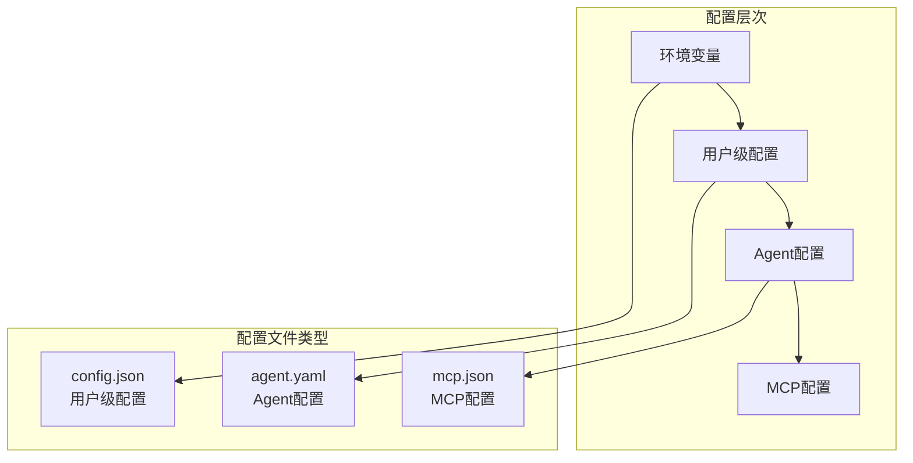
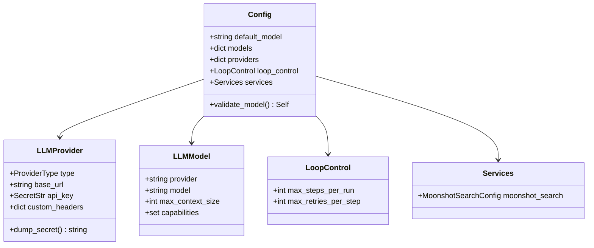
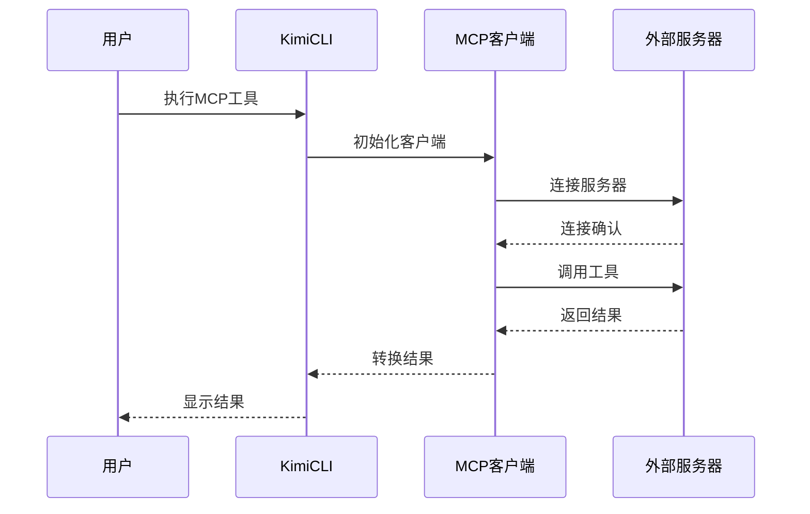
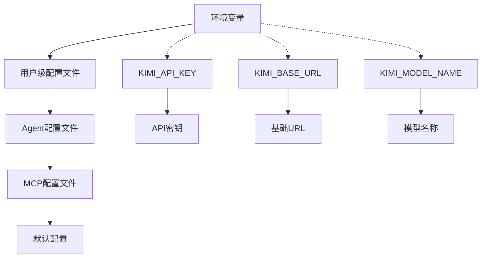
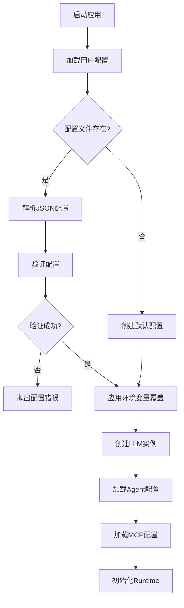
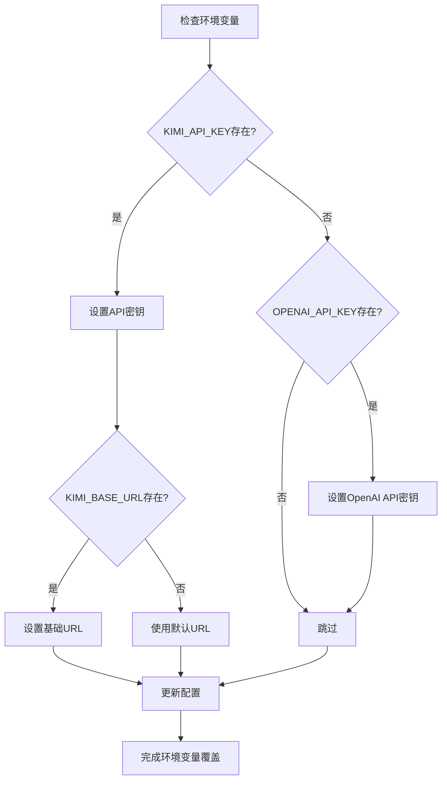
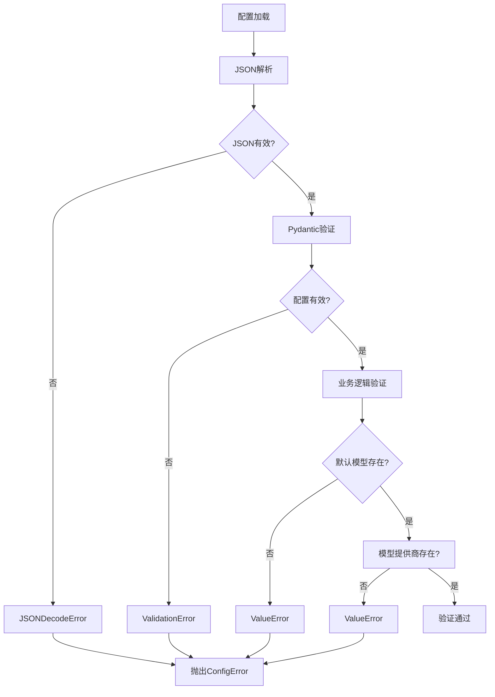

# 配置文件

<cite>
**本文档中引用的文件**
- [config.py](file://src/kimi_cli/config.py)
- [agent.yaml](file://src/kimi_cli/agents/default/agent.yaml)
- [sub.yaml](file://src/kimi_cli/agents/default/sub.yaml)
- [system.md](file://src/kimi_cli/agents/default/system.md)
- [cli.py](file://src/kimi_cli/cli.py)
- [app.py](file://src/kimi_cli/app.py)
- [llm.py](file://src/kimi_cli/llm.py)
- [share.py](file://src/kimi_cli/share.py)
- [mcp.py](file://src/kimi_cli/tools/mcp.py)
- [test_config.py](file://tests/test_config.py)
- [test_default_agent.py](file://tests/test_default_agent.py)
- [test_load_agent.py](file://tests/test_load_agent.py)
</cite>

## 目录
1. [简介](#简介)
2. [配置文件结构](#配置文件结构)
3. [用户级配置文件](#用户级配置文件)
4. [Agent配置文件](#agent配置文件)
5. [MCP配置文件](#mcp配置文件)
6. [配置加载优先级](#配置加载优先级)
7. [环境变量覆盖](#环境变量覆盖)
8. [配置验证与错误处理](#配置验证与错误处理)
9. [最佳实践](#最佳实践)
10. [故障排除](#故障排除)

## 简介

kimi-cli采用分层配置系统，支持多种配置文件格式和加载方式。主要配置包括用户级配置（`~/.kimi/config.json`）、Agent配置（`agent.yaml`）和MCP配置文件。这种设计提供了灵活的配置管理，允许用户在不同层次上定制AI代理的行为。

## 配置文件结构



**图表来源**
- [config.py](file://src/kimi_cli/config.py#L112-L157)
- [cli.py](file://src/kimi_cli/cli.py#L270-L281)

## 用户级配置文件

### 配置文件位置

用户级配置文件位于用户的主目录下的 `.kimi` 目录中，文件名为 `config.json`。

```python
# 配置文件路径计算
def get_config_file() -> Path:
    return get_share_dir() / "config.json"
```

### 配置结构

用户级配置通过 `Config` 类定义，包含以下主要组件：



**图表来源**
- [config.py](file://src/kimi_cli/config.py#L15-L157)

### 主要配置项

| 配置项 | 类型 | 描述 | 默认值 |
|--------|------|------|--------|
| `default_model` | string | 默认使用的LLM模型名称 | "" |
| `models` | dict | 可用模型列表，键为模型名称 | {} |
| `providers` | dict | LLM提供商列表，键为提供商名称 | {} |
| `loop_control.max_steps_per_run` | int | 每次运行的最大步骤数 | 100 |
| `loop_control.max_retries_per_step` | int | 每步的最大重试次数 | 3 |

### 配置示例

```json
{
  "default_model": "kimi-for-coding",
  "models": {
    "kimi-for-coding": {
      "provider": "kimi",
      "model": "kimi-for-coding",
      "max_context_size": 100000,
      "capabilities": ["thinking"]
    }
  },
  "providers": {
    "kimi": {
      "type": "kimi",
      "base_url": "https://api.kimi.com/coding/v1",
      "api_key": "your-api-key-here",
      "custom_headers": {
        "Authorization": "Bearer your-token"
      }
    }
  },
  "loop_control": {
    "max_steps_per_run": 100,
    "max_retries_per_step": 3
  },
  "services": {
    "moonshot_search": {
      "base_url": "https://api.kimi.com/coding/v1/search",
      "api_key": "your-search-api-key",
      "custom_headers": null
    }
  }
}
```

**节来源**
- [config.py](file://src/kimi_cli/config.py#L76-L157)
- [test_config.py](file://tests/test_config.py#L24-L39)

## Agent配置文件

### 配置文件位置

Agent配置文件位于 `src/kimi_cli/agents/default/` 目录下，主要文件包括：

- `agent.yaml`：主Agent配置
- `sub.yaml`：子Agent配置
- `system.md`：系统提示模板

### Agent配置结构

```mermaid
graph TD
A[agent.yaml] --> B[version: 1]
A --> C[agent]
C --> D[name: ""]
C --> E[system_prompt_path: ./system.md]
C --> F[system_prompt_args]
C --> G[tools]
C --> H[subagents]
I[sub.yaml] --> J[extend: ./agent.yaml]
I --> K[system_prompt_args]
I --> L[exclude_tools]
I --> M[subagents: []]
```

**图表来源**
- [agent.yaml](file://src/kimi_cli/agents/default/agent.yaml#L1-L25)
- [sub.yaml](file://src/kimi_cli/agents/default/sub.yaml#L1-L12)

### 主要配置字段

#### system_prompt_path
指定系统提示模板文件路径，默认为 `./system.md`。

#### system_prompt_args
系统提示参数字典，用于模板变量替换。例如：
```yaml
system_prompt_args:
  ROLE_ADDITIONAL: ""
```

#### tools
可用工具列表，每个工具由模块路径和类名组成：
```yaml
tools:
  - "kimi_cli.tools.task:Task"
  - "kimi_cli.tools.bash:Bash"
  - "kimi_cli.tools.file:ReadFile"
  - "kimi_cli.tools.web:SearchWeb"
```

#### subagents
子Agent配置，支持嵌套代理：
```yaml
subagents:
  coder:
    path: ./sub.yaml
    description: "Good at general software engineering tasks."
```

### 系统提示模板

系统提示模板支持动态变量替换：

| 变量 | 描述 | 示例值 |
|------|------|--------|
| `${ROLE_ADDITIONAL}` | 角色额外说明 | 用户自定义内容 |
| `${KIMI_WORK_DIR}` | 工作目录路径 | `/home/user/project` |
| `${KIMI_WORK_DIR_LS}` | 目录列表 | 文件和目录列表 |
| `${KIMI_NOW}` | 当前时间 | `2024-01-01T12:00:00Z` |
| `${KIMI_AGENTS_MD}` | AGENTS.md内容 | 项目相关信息 |

**节来源**
- [agent.yaml](file://src/kimi_cli/agents/default/agent.yaml#L1-L25)
- [sub.yaml](file://src/kimi_cli/agents/default/sub.yaml#L1-L12)
- [system.md](file://src/kimi_cli/agents/default/system.md#L1-L73)

## MCP配置文件

### MCP概述

MCP（Model Context Protocol）配置允许连接外部工具服务器，扩展AI代理的功能。

### 配置格式

MCP配置为JSON格式，包含以下字段：

```json
{
  "transport": {
    "type": "stdio",
    "command": "python",
    "args": ["-m", "mcp.server"]
  },
  "settings": {
    "apiKey": "your-api-key",
    "baseUrl": "https://api.example.com"
  }
}
```

### 配置加载方式

MCP配置可以通过两种方式加载：

1. **文件路径方式**：
```bash
kimi --mcp-config-file /path/to/config.json
```

2. **直接JSON方式**：
```bash
kimi --mcp-config '{"transport": {...}}'
```

### MCP工具集成



**图表来源**
- [mcp.py](file://src/kimi_cli/tools/mcp.py#L14-L43)
- [cli.py](file://src/kimi_cli/cli.py#L270-L281)

**节来源**
- [mcp.py](file://src/kimi_cli/tools/mcp.py#L1-L43)
- [cli.py](file://src/kimi_cli/cli.py#L270-L281)

## 配置加载优先级

配置加载遵循以下优先级顺序（从高到低）：



**图表来源**
- [app.py](file://src/kimi_cli/app.py#L52-L82)
- [llm.py](file://src/kimi_cli/llm.py#L32-L70)

### 具体优先级规则

1. **环境变量**：最高优先级，用于临时覆盖配置
2. **用户级配置**：存储在 `~/.kimi/config.json`
3. **Agent配置**：特定于Agent的配置
4. **MCP配置**：外部工具服务器配置
5. **默认配置**：系统内置默认值

### 配置加载流程



**图表来源**
- [config.py](file://src/kimi_cli/config.py#L112-L157)
- [app.py](file://src/kimi_cli/app.py#L28-L102)

**节来源**
- [app.py](file://src/kimi_cli/app.py#L52-L82)
- [config.py](file://src/kimi_cli/config.py#L112-L157)

## 环境变量覆盖

### 支持的环境变量

kimi-cli支持多个环境变量来自定义配置：

| 环境变量 | 功能 | 示例值 |
|----------|------|--------|
| `KIMI_API_KEY` | 设置API密钥 | `sk-xxxxxxxxxxxx` |
| `KIMI_BASE_URL` | 设置API基础URL | `https://api.kimi.com/v1` |
| `KIMI_MODEL_NAME` | 设置默认模型 | `kimi-for-coding` |
| `KIMI_MODEL_MAX_CONTEXT_SIZE` | 设置上下文大小 | `100000` |
| `KIMI_MODEL_CAPABILITIES` | 设置模型能力 | `thinking,image_in` |

### 环境变量处理流程



**图表来源**
- [llm.py](file://src/kimi_cli/llm.py#L32-L70)

### 环境变量优先级

环境变量具有最高优先级，会覆盖所有其他配置源：

```python
# 环境变量覆盖逻辑
def augment_provider_with_env_vars(provider: LLMProvider, model: LLMModel) -> dict[str, str]:
    applied: dict[str, str] = {}
    
    if base_url := os.getenv("KIMI_BASE_URL"):
        provider.base_url = base_url
        applied["KIMI_BASE_URL"] = base_url
    
    if api_key := os.getenv("KIMI_API_KEY"):
        provider.api_key = SecretStr(api_key)
        applied["KIMI_API_KEY"] = "******"
    
    if model_name := os.getenv("KIMI_MODEL_NAME"):
        model.model = model_name
        applied["KIMI_MODEL_NAME"] = model_name
    
    return applied
```

**节来源**
- [llm.py](file://src/kimi_cli/llm.py#L32-L70)

## 配置验证与错误处理

### 验证规则

配置系统实现了多层次的验证机制：



**图表来源**
- [config.py](file://src/kimi_cli/config.py#L87-L94)
- [config.py](file://src/kimi_cli/config.py#L136-L143)

### 错误类型

| 错误类型 | 描述 | 处理方式 |
|----------|------|----------|
| `ConfigError` | 配置文件无效 | 提供具体错误信息 |
| `JSONDecodeError` | JSON语法错误 | 显示JSON解析错误 |
| `ValidationError` | 配置结构错误 | 显示验证失败详情 |
| `ValueError` | 业务逻辑错误 | 显示具体的验证失败原因 |

### 错误处理示例

```python
try:
    config = load_config(config_file)
except json.JSONDecodeError as e:
    raise ConfigError(f"Invalid JSON in configuration file: {e}") from e
except ValidationError as e:
    raise ConfigError(f"Invalid configuration file: {e}") from e
```

**节来源**
- [config.py](file://src/kimi_cli/config.py#L136-L143)

## 最佳实践

### 配置文件组织

1. **用户级配置**：存储全局设置和API密钥
2. **Agent配置**：针对特定任务的Agent定制
3. **MCP配置**：外部工具服务器连接配置

### 安全考虑

1. **API密钥保护**：避免将API密钥硬编码在配置文件中
2. **环境变量使用**：推荐使用环境变量存储敏感信息
3. **配置文件权限**：确保配置文件权限设置正确

### 性能优化

1. **合理设置超时**：配置适当的超时时间和重试策略
2. **模型选择**：根据任务复杂度选择合适的模型
3. **工具过滤**：只启用必要的工具以提高效率

## 故障排除

### 常见问题

#### 配置文件不存在

**症状**：首次运行时出现配置错误
**解决**：系统会自动创建默认配置文件

#### API密钥无效

**症状**：认证失败或访问被拒绝
**解决**：检查API密钥是否正确，确保有相应权限

#### 模型不可用

**症状**：指定的模型无法找到
**解决**：检查模型名称是否正确，或更新可用模型列表

#### 工具加载失败

**症状**：某些工具无法使用
**解决**：检查工具路径是否正确，确保依赖已安装

### 调试技巧

1. **启用调试日志**：使用 `--verbose` 参数查看详细日志
2. **检查配置加载**：确认配置文件路径和内容
3. **验证环境变量**：检查相关环境变量是否正确设置

**节来源**
- [config.py](file://src/kimi_cli/config.py#L129-L134)
- [app.py](file://src/kimi_cli/app.py#L143-L172)