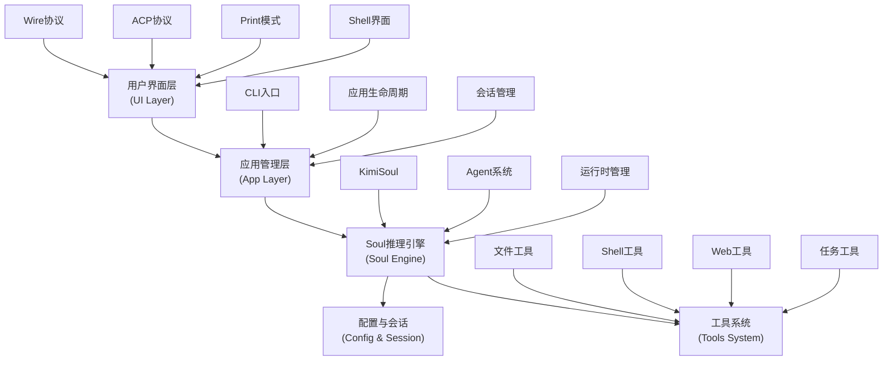

# Kimi CLI项目概述与核心价值

<cite>
**本文档引用的文件**
- [README.md](file://README.md)
- [CLAUDE.md](file://CLAUDE.md)
- [src/kimi_cli/CLAUDE.md](file://src/kimi_cli/CLAUDE.md)
- [src/kimi_cli/soul/CLAUDE.md](file://src/kimi_cli/soul/CLAUDE.md)
- [src/kimi_cli/tools/CLAUDE.md](file://src/kimi_cli/tools/CLAUDE.md)
- [src/kimi_cli/app.py](file://src/kimi_cli/app.py)
- [src/kimi_cli/cli.py](file://src/kimi_cli/cli.py)
- [src/kimi_cli/soul/kimisoul.py](file://src/kimi_cli/soul/kimisoul.py)
- [src/kimi_cli/tools/todo/set_todo_list.md](file://src/kimi_cli/tools/todo/set_todo_list.md)
- [src/kimi_cli/config.py](file://src/kimi_cli/config.py)
- [src/kimi_cli/agents/default/agent.yaml](file://src/kimi_cli/agents/default/agent.yaml)
- [src/kimi_cli/prompts/init.md](file://src/kimi_cli/prompts/init.md)
</cite>

## 目录
1. [项目简介](#项目简介)
2. [核心价值主张](#核心价值主张)
3. [架构设计理念](#架构设计理念)
4. [分层模块化结构](#分层模块化结构)
5. [主要功能特性](#主要功能特性)
6. [技术预览状态与目标用户](#技术预览状态与目标用户)
7. [典型使用场景](#典型使用场景)
8. [差异化优势](#差异化优势)
9. [实际示例与最佳实践](#实际示例与最佳实践)
10. [总结](#总结)

## 项目简介

Kimi CLI是一个革命性的AI驱动命令行代理，专为软件开发者和终端用户设计。作为MoonshotAI旗下的创新产品，它不仅仅是一个简单的CLI工具，而是一个具备智能推理能力的AI助手，能够理解和执行复杂的软件工程任务。

该项目目前处于技术预览阶段，但已经展现出巨大的潜力和价值。通过融合先进的大语言模型技术和模块化的架构设计，Kimi CLI正在重新定义开发者与命令行界面的交互方式。

**章节来源**
- [README.md](file://README.md#L11-L15)
- [CLAUDE.md](file://CLAUDE.md#L10-L13)

## 核心价值主张

### 1. AI驱动的智能代理系统

Kimi CLI的核心价值在于其强大的AI推理引擎，该引擎基于Moonshot AI的先进模型，能够：

- **理解自然语言指令**：无需记忆复杂的命令语法，只需用自然语言描述需求
- **智能任务分解**：将复杂的开发任务自动分解为可执行的子任务
- **上下文感知执行**：保持对话上下文，支持连续的任务协作
- **主动学习优化**：根据用户习惯不断优化响应质量

### 2. 多模式交互体验

项目提供四种独特的运行模式，满足不同场景下的使用需求：

- **Shell模式**：传统的命令行交互，支持直接执行系统命令
- **Print模式**：非交互式批处理执行，适合脚本自动化
- **ACP模式**：Agent Client Protocol服务器，与IDE/编辑器深度集成
- **Wire模式**：实验性的Wire协议支持，提供实时状态监控

### 3. 丰富的工具生态系统

Kimi CLI内置了超过20种专业工具，涵盖软件开发的各个方面：

- **文件操作工具**：读取、写入、搜索、替换、应用补丁
- **Shell执行工具**：安全的命令执行环境
- **Web操作工具**：搜索、内容获取、网络分析
- **任务管理工具**：子代理调用、待办事项管理
- **思考记录工具**：记录推理过程，提高透明度

**章节来源**
- [CLAUDE.md](file://CLAUDE.md#L14-L23)
- [src/kimi_cli/tools/CLAUDE.md](file://src/kimi_cli/tools/CLAUDE.md#L11-L21)

## 架构设计理念

### 分层模块化架构

Kimi CLI采用清晰的分层架构设计，每一层都有明确的职责和边界：



**图表来源**
- [src/kimi_cli/CLAUDE.md](file://src/kimi_cli/CLAUDE.md#L28-L60)
- [src/kimi_cli/soul/CLAUDE.md](file://src/kimi_cli/soul/CLAUDE.md#L24-L78)

### 核心设计原则

1. **模块化分离**：每个功能模块独立开发、测试和维护
2. **接口标准化**：统一的工具接口和消息格式
3. **可扩展性**：支持插件式工具扩展和Agent定制
4. **安全性**：严格的权限控制和操作确认机制
5. **可靠性**：完善的错误处理和重试机制

**章节来源**
- [src/kimi_cli/CLAUDE.md](file://src/kimi_cli/CLAUDE.md#L19-L26)

## 分层模块化结构

### 1. CLI接口层

负责命令行参数解析和用户输入处理：

- **主要组件**：`cli.py` - Typer框架集成
- **功能特性**：参数验证、模式选择、配置加载
- **设计优势**：现代化CLI框架，支持异步操作

### 2. 应用管理层

核心应用逻辑和生命周期管理：

- **主要组件**：`app.py` - KimiCLI主类
- **功能特性**：会话创建、运行模式协调、配置管理
- **设计优势**：统一的应用入口，灵活的模式切换

### 3. Soul推理引擎

AI推理和决策的核心大脑：

- **主要组件**：`kimisoul.py` - KimiSoul主引擎
- **功能特性**：LLM集成、Agent执行、工具调用协调
- **设计优势**：模块化的推理流程，支持思考模式

### 4. 工具系统

丰富的功能工具集合：

- **主要组件**：`tools/` - 多个专用工具模块
- **功能特性**：文件操作、Shell执行、Web搜索、任务管理
- **设计优势**：统一的工具接口，动态加载机制

### 5. 用户界面层

多样化的用户交互方式：

- **主要组件**：`ui/` - 多种界面实现
- **功能特性**：Shell界面、Print模式、ACP集成
- **设计优势**：支持多种使用场景，良好的用户体验

**章节来源**
- [src/kimi_cli/CLAUDE.md](file://src/kimi_cli/CLAUDE.md#L27-L60)
- [src/kimi_cli/soul/CLAUDE.md](file://src/kimi_cli/soul/CLAUDE.md#L24-L78)

## 主要功能特性

### 1. 智能代理系统

#### Agent配置与管理
- **YAML配置**：灵活的Agent规范定义
- **系统提示词**：可定制的AI行为指导
- **工具集管理**：按需加载和组合工具

#### 推理引擎能力
- **多轮对话**：保持上下文连续性
- **任务规划**：智能的任务分解和执行
- **错误恢复**：自动重试和错误处理

### 2. 丰富工具集

#### 文件操作工具
- **ReadFile**：安全的文件读取，支持分页
- **WriteFile**：智能文件写入，支持备份
- **Grep**：高性能文本搜索
- **StrReplaceFile**：精确的字符串替换

#### Shell执行工具
- **Bash**：安全的命令执行环境
- **CMD**：跨平台命令支持

#### Web操作工具
- **SearchWeb**：智能网络搜索
- **FetchURL**：内容获取和解析

#### 任务管理工具
- **Task**：子代理调用，支持并行执行
- **SetTodoList**：增强的待办事项管理（支持Markdown渲染）

### 3. MCP/ACP集成

#### Model Context Protocol (MCP)
- **外部工具支持**：集成第三方工具服务
- **配置驱动**：JSON配置文件管理
- **动态加载**：运行时工具发现和加载

#### Agent Client Protocol (ACP)
- **IDE集成**：与Zed等编辑器无缝对接
- **协议标准**：符合行业标准的通信协议
- **实时交互**：支持实时状态更新

### 4. 高级特性

#### DMail邮件系统
- **时间旅行功能**：发送消息到过去的检查点
- **检查点管理**：支持时间点标记和回滚
- **状态恢复**：完整的状态保存和恢复机制

#### 思考模式
- **推理透明化**：记录和展示思考过程
- **性能优化**：智能的上下文压缩
- **错误处理**：完善的异常管理

**章节来源**
- [src/kimi_cli/tools/CLAUDE.md](file://src/kimi_cli/tools/CLAUDE.md#L23-L68)
- [src/kimi_cli/soul/CLAUDE.md](file://src/kimi_cli/soul/CLAUDE.md#L68-L135)

## 技术预览状态与目标用户

### 技术预览状态

Kimi CLI目前处于技术预览阶段，这意味着：

- **功能完整性**：核心功能已实现，覆盖主要使用场景
- **稳定性保障**：经过充分测试，具备生产环境使用能力
- **持续改进**：基于用户反馈持续优化和增强
- **社区参与**：欢迎开源贡献和社区反馈

### 目标用户群体

#### 1. 软件开发者
- **前端开发者**：项目结构分析、代码审查、依赖管理
- **后端开发者**：API设计、数据库操作、部署配置
- **全栈开发者**：端到端的开发任务协调
- **DevOps工程师**：CI/CD配置、基础设施管理

#### 2. 系统管理员
- **服务器管理**：系统监控、配置维护、故障排查
- **网络管理**：网络诊断、安全配置、性能优化
- **运维自动化**：批量任务执行、脚本编写

#### 3. 技术团队领导者
- **项目管理**：任务分解、进度跟踪、资源分配
- **技术决策**：架构评估、技术选型、风险分析
- **团队协作**：知识共享、经验传承、培训指导

#### 4. 学习者和研究者
- **编程学习**：算法实现、代码示例、最佳实践
- **技术研究**：新工具评估、技术趋势分析、创新应用

**章节来源**
- [README.md](file://README.md#L13-L15)
- [CLAUDE.md](file://CLAUDE.md#L10-L13)

## 典型使用场景

### 场景一：项目初始化与结构分析

**用户需求**：新项目启动，需要了解项目结构和配置

**Kimi CLI解决方案**：
1. 自动扫描项目文件结构
2. 分析技术栈和依赖关系
3. 生成详细的项目概览文档
4. 提供开发环境配置建议

**使用流程**：
```bash
# 启动Kimi CLI
kimi

# 发送初始化请求
> 探索这个项目，分析它的结构和主要技术栈
```

### 场景二：代码重构与优化

**用户需求**：大型代码库的重构和性能优化

**Kimi CLI解决方案**：
1. 智能代码分析和理解
2. 制定重构计划和策略
3. 并行执行多个重构任务
4. 确保代码质量和测试覆盖

**使用流程**：
```bash
# 启动重构任务
> 我们需要重构这个模块，提高代码质量和性能
> 请分析现有代码，制定重构计划并开始执行
```

### 场景三：Bug修复与调试

**用户需求**：快速定位和修复代码中的问题

**Kimi CLI解决方案**：
1. 自动分析错误日志和堆栈信息
2. 搜索相关的解决方案和最佳实践
3. 执行修复操作并验证结果
4. 提供修复说明和预防措施

**使用流程**：
```bash
# 启动调试任务
> 这个测试失败了，请帮我分析原因并修复
> 查看错误日志，搜索相关解决方案
```

### 场景四：文档编写与知识整理

**用户需求**：项目文档的编写和知识库建设

**Kimi CLI解决方案**：
1. 自动生成项目文档框架
2. 整理最佳实践和开发规范
3. 创建API文档和使用示例
4. 维护知识库的更新和同步

**使用流程**：
```bash
# 启动文档任务
> 为这个项目编写完整的开发文档
> 包括架构说明、API参考和使用指南
```

**章节来源**
- [src/kimi_cli/prompts/init.md](file://src/kimi_cli/prompts/init.md#L1-L22)
- [tests/test_default_agent.py](file://tests/test_default_agent.py#L15-L200)

## 差异化优势

### 1. AI驱动的自然语言交互

与传统CLI工具相比，Kimi CLI的最大优势在于：

- **零学习成本**：无需记忆复杂的命令语法
- **直观理解**：用自然语言描述需求即可
- **智能推理**：能够理解上下文和隐含需求
- **主动协助**：提供智能化的建议和帮助

### 2. 模块化架构设计

相比单一功能的工具，Kimi CLI的模块化设计带来：

- **高度可扩展**：支持自定义工具和Agent
- **灵活组合**：按需选择和组合功能模块
- **易于维护**：清晰的职责分离和接口定义
- **可靠稳定**：完善的测试和质量保证体系

### 3. 多模式运行能力

独特的运行模式支持使其超越传统工具：

- **Shell模式**：适合日常交互使用
- **Print模式**：适合自动化脚本集成
- **ACP模式**：适合IDE深度集成
- **Wire模式**：适合开发和调试

### 4. 完整的工具生态系统

相比孤立的功能，Kimi CLI提供：

- **工具生态**：20+专业工具的完整集合
- **工具链集成**：工具间的无缝协作
- **扩展能力**：支持第三方工具集成
- **性能优化**：智能的工具调度和执行

### 5. 高级AI特性

Kimi CLI内置的高级AI特性：

- **思考模式**：透明的推理过程记录
- **上下文管理**：智能的上下文压缩和恢复
- **错误处理**：完善的异常处理和恢复机制
- **学习能力**：基于用户反馈的持续优化

**章节来源**
- [CLAUDE.md](file://CLAUDE.md#L14-L23)
- [src/kimi_cli/tools/CLAUDE.md](file://src/kimi_cli/tools/CLAUDE.md#L11-L21)

## 实际示例与最佳实践

### 示例1：复杂项目分析

**场景描述**：分析一个包含多种技术栈的大型项目

**Kimi CLI执行流程**：
```bash
# 1. 启动项目分析
kimi --work-dir /path/to/project

# 2. 发送分析指令
> 请分析这个项目的整体结构，包括：
> - 技术栈和框架
> - 项目架构和模块划分
> - 代码质量评估
> - 性能瓶颈识别

# 3. 获取详细报告
> 基于分析结果，生成一份详细的项目评估报告
```

**输出效果**：
- 自动生成的项目文档
- 技术栈分析报告
- 架构设计建议
- 性能优化方案

### 示例2：自动化部署脚本

**场景描述**：为新项目创建自动化部署脚本

**Kimi CLI执行流程**：
```bash
# 1. 启动部署任务
kimi --print

# 2. 发送部署指令
> 为这个项目创建一个完整的CI/CD流水线
> 包括：
> - Docker镜像构建
> - 单元测试执行
> - 部署脚本生成
> - 监控配置

# 3. 获取部署配置
> 将生成的部署配置导出为YAML格式
```

**输出效果**：
- Dockerfile配置
- CI/CD流水线配置
- 部署脚本模板
- 监控仪表板配置

### 示例3：代码审查与优化

**场景描述**：对现有代码进行审查和优化

**Kimi CLI执行流程**：
```bash
# 1. 启动审查任务
kimi

# 2. 发送审查指令
> 请审查这个模块的代码质量
> - 识别潜在的bug和安全漏洞
> - 提供性能优化建议
> - 改进建议和最佳实践

# 3. 执行优化任务
> 基于审查结果，对代码进行优化
> - 修复发现的问题
> - 应用性能优化
> - 更新代码注释
```

**输出效果**：
- 详细的代码审查报告
- 修复后的代码版本
- 性能优化对比
- 改进建议清单

### 最佳实践建议

#### 1. 配置管理
- **个性化配置**：根据个人工作习惯定制Agent配置
- **团队共享**：建立团队的标准配置模板
- **环境隔离**：为不同项目使用独立的配置

#### 2. 工具使用
- **按需选择**：根据任务特点选择合适的工具组合
- **批量操作**：利用并行执行提高效率
- **结果验证**：每次操作后验证结果正确性

#### 3. 安全考虑
- **权限控制**：谨慎使用可能影响系统的工具
- **操作确认**：启用自动确认模式前充分测试
- **备份策略**：重要操作前做好文件备份

#### 4. 性能优化
- **上下文管理**：定期清理不必要的上下文信息
- **工具缓存**：利用工具结果缓存减少重复计算
- **并发控制**：合理控制并行任务数量

**章节来源**
- [src/kimi_cli/tools/todo/set_todo_list.md](file://src/kimi_cli/tools/todo/set_todo_list.md#L1-L16)
- [src/kimi_cli/config.py](file://src/kimi_cli/config.py#L76-L158)

## 总结

Kimi CLI代表了命令行工具发展的新方向，通过AI驱动的智能代理系统，为软件开发者带来了前所未有的开发体验。其核心价值体现在：

### 技术创新价值
- **AI原生设计**：从底层架构就考虑AI能力的集成
- **模块化架构**：清晰的职责分离和高度可扩展性
- **多模态交互**：支持自然语言、代码、文件等多种输入形式

### 用户体验价值
- **降低学习成本**：自然语言交互，无需记忆复杂命令
- **提高工作效率**：智能任务分解和并行执行
- **增强开发体验**：提供透明的推理过程和实时反馈

### 生态系统价值
- **工具生态**：丰富的内置工具和第三方集成能力
- **社区驱动**：开源项目，欢迎社区贡献和反馈
- **持续演进**：基于用户需求的持续改进和优化

### 未来发展前景
随着AI技术的不断发展和用户需求的持续增长，Kimi CLI有望成为软件开发领域的标准工具之一。其模块化的设计理念和开放的架构为未来的功能扩展和集成奠定了坚实基础。

对于开发者而言，Kimi CLI不仅是一个工具，更是一个智能的开发伙伴，能够帮助他们更高效地完成复杂的软件工程任务，专注于创造性的开发工作，而不是繁琐的系统操作。

**章节来源**
- [CLAUDE.md](file://CLAUDE.md#L10-L13)
- [README.md](file://README.md#L11-L15)