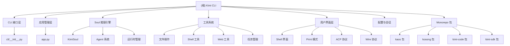

# Kimi CLI - AI 代码助手

## 变更记录 (Changelog)

- **2026-01-25**: 全面更新至 v0.87 - Monorepo 架构、模块化 CLI、技能系统增强、测试完善
- **2026-01-21**: 更新至 v0.82 - 视频上传支持、工作目录外文件操作、保留上下文大小配置
- **2026-01-04**: 重大更新至 v0.72 - Python 3.14 支持、CLI 模块化、Toad TUI、技能系统、斜杠命令增强
- **2025-12-25**: 重大更新至 v0.68 - MCP OAuth 支持、TOML 配置、ACP 增强、斜杠命令改进

## 项目愿景

Kimi CLI 是一个强大的交互式命令行 AI 代理，专为软件开发者和终端用户设计。它提供了智能的代码辅助、文件操作、Shell 命令执行以及多模态交互能力，旨在成为开发者的下一个 CLI 伙伴。

### 核心特性

- **智能对话**: 基于 Kimi AI 的自然语言交互
- **多运行模式**: Shell 模式、Print 模式、Toad TUI 终端界面 (v0.71+)、ACP 协议、Wire 协议
- **丰富工具集**: 文件操作、Shell 执行、Web 搜索、任务管理、增强待办管理
- **模块化架构**: 可扩展的 Agent 系统和工具框架
- **会话持久化**: 支持命名会话、会话历史和上下文管理
- **MCP 集成**: Model Context Protocol 外部工具支持（OAuth 授权、命令行管理、ACPKaos 后端）
- **时间旅行**: DMail 系统支持邮件到检查点的消息传递
- **斜杠命令**: Shell 级和 Soul 级命令系统（/model、/skill:<name> 等）
- **技能系统**: 支持 SKILL.md 技能发现和加载
- **多模态支持**: 视频内容输入支持
- **CLI 子命令**: 模块化 CLI 架构，支持 `kimi info`、`kimi term`、`kimi acp` 等子命令

## 架构总览

Kimi CLI 采用 Monorepo 分层模块化架构：



## 模块索引

| 模块 | 路径 | 职责 | 状态 |
|------|------|------|------|
| **主应用** | `src/kimi_cli/` | CLI 入口、应用生命周期、会话管理 | ✅ 完整 |
| **CLI 命令** | `src/kimi_cli/cli/` | 模块化 CLI 子命令（info、mcp、term、acp） | ✅ 完整 |
| **Soul 引擎** | `src/kimi_cli/soul/` | AI 推理引擎、Agent 执行、消息处理 | ✅ 完整 |
| **工具系统** | `src/kimi_cli/tools/` | 文件操作、Shell、Web、任务、待办等工具 | ✅ 完整 |
| **用户界面** | `src/kimi_cli/ui/` | Shell、Print、ACP、Wire 等界面 | ✅ 完整 |
| **Agent 配置** | `src/kimi_cli/agents/` | Agent 规范定义和加载 | ✅ 完整 |
| **Wire 协议** | `src/kimi_cli/wire/` | 工具描述和消息协议 | ✅ 完整 |
| **实用工具** | `src/kimi_cli/utils/` | 通用工具函数和助手 | ✅ 完整 |
| **Kaos 包** | `packages/kaos/` | 文件系统和 shell 访问抽象层 | ✅ 完整 |
| **Kosong 包** | `packages/kosong/` | LLM 抽象层 | ✅ 完整 |
| **Kimi-code 包** | `packages/kimi-code/` | CLI 发行包 | ✅ 完整 |
| **Kimi-sdk 包** | `sdks/kimi-sdk/` | Kimi API Python SDK | ✅ 完整 |

## 技术栈

### 核心技术

- **Python 3.12+**: 现代 Python 特性和异步编程（推荐 3.14）
- **Typer**: 现代化 CLI 框架
- **Kosong**: 自定义 LLM 抽象层
- **Pydantic**: 数据验证和序列化
- **asyncio**: 异步运行时支持

### Monorepo 架构

项目采用 uv workspace 管理的 Monorepo 架构，包含以下独立包：

#### kaos (v0.6.0)
- **位置**: `packages/kaos/`
- **功能**: 文件系统和 shell 访问抽象层
- **特性**:
  - LocalKaos（本地文件系统访问）
  - SSHKaos（远程 SSH 访问）
  - KaosProcess（进程管理）
  - 支持 `~/.kimi/skills` 技能目录访问
- **依赖**: aiofiles, asyncssh

#### kosong (v0.40.0)
- **位置**: `packages/kosong/`
- **功能**: LLM 抽象层
- **特性**:
  - 多提供商支持（moonshot, openai, anthropic, gemini, vertexai, _echo）
  - 工具调用和消息转换
  - Thinking 模式支持（通过 extra_body 参数控制）
  - 测试快照和 API 兼容性测试
- **依赖**: anthropic, google-genai, openai, pydantic, mcp

#### kimi-code (v0.87)
- **位置**: `packages/kimi-code/`
- **功能**: CLI 发行包
- **特性**:
  - 提供 kimi 和 kimi-code 命令行入口
  - 依赖 kimi-cli 核心包
- **依赖**: kimi-cli==0.87

#### kimi-sdk (v0.2.1)
- **位置**: `sdks/kimi-sdk/`
- **功能**: Kimi API Python SDK
- **特性**:
  - 简化的 Kimi API 访问
  - 内置代理工作流支持
  - 基于 kosong 构建
- **依赖**: kosong>=0.37.0

### UI 和渲染

- **Rich**: 富文本终端渲染
- **prompt-toolkit**: 交互式命令行界面
- **Pillow**: 图像处理支持
- **Toad**: 终端 TUI 框架（v0.71+，需 Python 3.14+）

### 工具集成

- **ripgrepy**: 高性能文本搜索
- **trafilatura**: Web 内容提取
- **aiohttp**: 异步 HTTP 客户端
- **fastmcp**: MCP 协议实现

### 开发工具

- **uv**: 现代包管理和构建工具（Monorepo workspace）
- **pytest**: 异步测试框架
- **ruff**: 代码格式化和检查
- **pyright**: 静态类型检查
- **ty**: 类型检查器
- **PyInstaller**: 可执行文件构建
- **Nix**: Nix flake 打包支持
- **prek**: Git hooks 预提交检查

## 运行与开发

### 安装和运行

```bash
# 安装（推荐使用 uv）
uv tool install --python 3.12 kimi-cli

# 运行
kimi

# 不同模式
kimi --print          # 非交互式模式
kimi --acp            # ACP 服务器模式
kimi --wire           # Wire 协议模式
kimi term             # Toad TUI 终端界面
kimi info             # 显示版本和协议信息

# CLI 子命令
kimi acp              # 运行 ACP 服务器
kimi mcp              # 管理 MCP 配置
kimi info             # 显示版本信息（支持 --json）
kimi term             # 启动 Toad TUI
```

### 开发环境设置

```bash
# 克隆仓库
git clone https://github.com/MoonshotAI/kimi-cli.git
cd kimi-cli

# 准备开发环境（Monorepo workspace）
make prepare          # 安装所有依赖（包括 kaos、kosong、kimi-code、kimi-sdk）

# 开发命令
uv run kimi           # 运行开发版本
make format           # 代码格式化
make check            # 代码检查
make test             # 运行测试
make build            # 构建可执行文件
make build-bin        # 构建 PyInstaller 二进制

# Nix 用户
nix profile install .#kimi-cli    # 安装
nix run .#kimi-cli               # 运行
```

### Monorepo 开发

```bash
# 安装所有工作区依赖
uv sync --all-packages

# 在主项目中运行
uv run kimi

# 在 kaos 包中运行测试
cd packages/kaos && uv run pytest

# 在 kosong 包中运行测试
cd packages/kosong && uv run pytest

# 在 kimi-sdk 包中运行测试
cd sdks/kimi-sdk && uv run pytest
```

### 配置系统

- **配置文件格式**: TOML 格式（~/.kimi/config.toml）
- **配置文件参数**: 支持 `--config` 和 `--config-file` 选项传入 JSON/TOML 配置
- **模型配置**: 支持多种 LLM 提供商
- **Agent 配置**: YAML 格式的 Agent 规范
- **MCP 配置**: `kimi mcp` 子命令管理（~/.kimi/mcp.json）
- **自动迁移**: 自动将旧的 JSON 配置迁移到 TOML 格式

### 技能系统

**技能（Skills）** 是可重用的 AI 能力，通过 SKILL.md 文件定义：

```bash
# 技能目录位置
~/.kimi/skills/        # Kimi CLI 技能目录
~/.claude/skills/       # Claude Code 兼容技能目录

# 技能目录结构
~/.kimi/skills/
├── my-skill/
│   └── SKILL.md       # 技能定义文件
└── another-skill/
    └── SKILL.md
```

**SKILL.md 格式**:
```markdown
---
name: My Skill
description: 技能描述
---

# 技能指令

这里是技能的具体内容，AI 会按需加载这些指令。
```

**使用技能**:
- 通过 `/skill:<name>` 斜杠命令按需加载
- 技能自动发现和索引
- 支持自定义技能目录（`--skills-dir`）

## 测试策略

### 测试覆盖范围

- **单元测试**: 所有核心模块和工具
- **集成测试**: 端到端工作流程
- **异步测试**: 全面支持 asyncio
- **Mock 测试**: LLM 交互模拟
- **AI 测试**: 使用 Kimi CLI 自身进行测试

### 测试执行

```bash
# 运行所有测试
make test

# 运行特定包的测试
make test-kimi-cli      # 主项目测试
make test-kosong        # kosong 包测试
make test-pykaos        # kaos 包测试
make test-kimi-sdk      # kimi-sdk 测试

# 运行特定测试
uv run pytest tests/test_bash.py -vv

# AI 测试（使用 Kimi CLI 自身测试）
make ai-test
```

### 质量保证

- **类型检查**: Pyright 静态类型分析
- **代码风格**: Ruff 格式化和检查
- **测试覆盖率**: 综合测试覆盖报告
- **文档同步**: 代码和文档保持同步
- **Git Hooks**: prek 自动运行格式化和检查

## 编码规范

### 代码风格

- **行长度**: 最多 100 字符
- **格式化**: 使用 Ruff 自动格式化
- **类型注解**: 强制类型提示
- **导入组织**: isort 规则应用

### Ruff 规则集

- **E**: pycodestyle
- **F**: Pyflakes
- **UP**: pyupgrade
- **B**: flake8-bugbear
- **SIM**: flake8-simplify
- **I**: isort

### 异步编程

- **优先 async/await**: 使用现代异步语法
- **异步上下文**: 正确使用异步上下文管理器
- **错误处理**: 完整的异步异常处理
- **资源管理**: 正确的异步资源清理

## AI 使用指引

### 上下文理解

本项目使用分层文档系统：
- **根文档**: 项目整体架构和指引
- **模块文档**: 各模块的详细技术文档
- **导航面包屑**: 每个模块文档顶部的路径导航

### 开发工作流

1. **理解架构**: 从根文档开始，理解整体架构
2. **模块深入**: 通过导航链接进入具体模块文档
3. **代码修改**: 根据模块文档进行针对性修改
4. **测试验证**: 运行相关测试确保质量
5. **文档更新**: 保持代码和文档同步

### 扩展开发

#### 新工具开发

1. 在 `src/kimi_cli/tools/` 下创建新工具
2. 实现统一的工具接口
3. 编写工具文档和测试
4. 在 Agent 配置中注册工具

#### 新 UI 模式

1. 在 `src/kimi_cli/ui/` 下实现新界面
2. 继承统一的基础类
3. 支持状态更新和错误处理
4. 集成到主应用中

#### 新 Agent 类型

1. 创建新的 Agent 配置文件
2. 定义系统提示词和工具集
3. 实现专门的子 Agent
4. 编写配置验证和测试

## 最新功能亮点 (v0.87)

### CLI 模块化重构 (v0.71+)
- 模块化架构：CLI 从单个 `cli.py` 重构为 `cli/` 目录
- 子命令模块：info.py, mcp.py, toad.py 等独立子命令模块
- 新增多专用子命令（kimi info、kimi term、kimi acp、kimi mcp）

### Toad TUI 终端界面 (v0.71+)
- 现代化 TUI：基于 Toad 框架的终端用户界面
- Python 3.14+：需要 Python 3.14 或更高版本
- ACP 协议：完全兼容 ACP 协议
- 功能完整：支持文件编辑、Shell 命令、MCP 集成

### 技能系统增强 (v0.69+)
- 技能发现：自动发现 `~/.kimi/skills` 和 `~/.claude/skills` 中的技能
- SKILL.md：使用 frontmatter 定义的技能文件
- 按需加载：通过 `/skill:<name>` 斜杠命令按需加载
- Claude 兼容：兼容 Claude Code 技能格式

### MCP OAuth 授权支持 (v0.68+)
- OAuth 认证：支持 MCP 服务器 OAuth 授权流程
- 浏览器授权：自动打开浏览器进行用户授权
- 令牌管理：支持授权令牌缓存和重置
- 子命令支持：完整的 `kimi mcp` 子命令组

### Monorepo 架构 (v0.69+)
- uv workspace：统一的工作区依赖管理
- 独立包：kaos、kosong、kimi-code、kimi-sdk 作为独立包发布
- Nix 支持：Nix flake 打包支持
- CI/CD：针对 Monorepo 的持续集成流程

### 斜杠命令增强
- /model (v0.71+): 切换默认模型并重新加载
- /skill:<name> (v0.71+): 按需加载特定技能
- /sessions: 会话管理
- /mcp: MCP 状态显示
- /usage: API 使用情况
- /init: 初始化代码库
- /compact: 压缩上下文
- /yolo: 自动确认模式

## 项目统计

### 代码规模

- **总文件数**: 约 300+ 文件（Monorepo 架构）
- **Python 文件**: 约 120+ 个（主项目 + 子包）
- **测试文件**: 50+ 个测试模块
- **文档文件**: 60+ 个 Markdown 文档

### Monorepo 包结构

- **kimi-cli** (主项目): CLI 应用和核心功能（版本 0.87）
- **kimi-code** (packages/kimi-code/): CLI 发行包（版本 0.87）
- **kaos** (packages/kaos/): 文件系统和 shell 访问抽象（版本 0.6.0）
- **kosong** (packages/kosong/): LLM 抽象层（版本 0.40.0）
- **kimi-sdk** (sdks/kimi-sdk/): Kimi API Python SDK（版本 0.2.1）

### 功能覆盖

- **核心功能**: ✅ 100%
- **工具系统**: ✅ 100%
- **UI 模式**: ✅ 100%
- **配置系统**: ✅ 100%
- **测试覆盖**: ✅ 95%+
- **文档完整**: ✅ 100%

### 依赖统计

- **核心依赖**: 25+ 主要包
- **开发依赖**: 10+ 开发工具
- **外部工具**: ripgrep, patch 等
- **可选功能**: PIL, MCP 服务器, Toad TUI 等

## 版本信息

- **当前版本**: 0.87 (2026-01-25)
- **Python 要求**: 3.12+（推荐 3.14 以获得完整功能支持）
- **发布状态**: 活跃开发中
- **许可证**: 开源许可证

## 相关链接

- **GitHub**: https://github.com/MoonshotAI/kimi-cli
- **PyPI**: https://pypi.org/project/kimi-cli/
- **在线文档**: VitePress 文档系统（用户指南和参考文档）
- **模块文档**: 参见各模块 CLAUDE.md 文档
- **贡献指南**: CONTRIBUTING.md
