# Kimi CLI - AI 代码助手

## 变更记录 (Changelog)

- **2026-02-14**: 更新至 v1.12.0 - Web UI 多项优化、会话使用量指示器、消息队列统一工具栏
- **2026-02-11**: 更新至 v1.11.0 - 上下文使用量工具栏显示、错误处理改进
- **2026-02-08**: 更新至 v1.10.0 - 助手消息复制/分叉按钮、键盘快捷键支持、审批对话框增强
- **2026-02-03**: 更新至 v1.9.0 - Web UI 工具输入重构、媒体预览支持、消息渲染改进
- **2026-01-31**: 更新至 v1.8.0 - Wire replay 端点、会话 ID 重载保护、流畅自动滚动
- **2026-01-30**: 更新至 v1.7.0 - 默认 YOLO 模式配置、会话分叉功能、Anthropic Opus 4.6 自适应思考
- **2026-01-28**: 更新至 v1.6.0 - 存档支持、环境变量传递增强
- **2026-01-28**: 更新至 v1.5.0 - Web UI 活动状态指示器、审批请求处理增强
- **2026-01-28**: 更新至 v1.4.0 - /web 命令 IME 修复、会话连接状态消息改进
- **2026-01-28**: 更新至 v1.3 - OAuth 登录/登出、媒体文件标签包装、Agent 轮次认证修复
- **2026-01-27**: 更新至 v1.2 - 模型描述显示、v1.1 - kimi-for-coding 能力修复
- **2026-01-27**: 更新至 v1.0 - OAuth 登录系统、子 Agent 审批修复
- **2026-01-25**: 更新至 v0.87 - Monorepo 架构、模块化 CLI、技能系统增强、测试完善

## 项目愿景

Kimi CLI 是一个强大的交互式命令行 AI 代理，专为软件开发者和终端用户设计。它提供了智能的代码辅助、文件操作、Shell 命令执行以及多模态交互能力，旨在成为开发者的下一个 CLI 伙伴。

### 核心特性

- **智能对话**: 基于 Kimi AI 的自然语言交互
- **多运行模式**: Shell 模式、Print 模式、Toad TUI 终端界面 (v0.71+)、ACP 协议、Wire 协议
- **丰富工具集**: 文件操作、Shell 执行、Web 搜索、任务管理、增强待办管理
- **模块化架构**: 可扩展的 Agent 系统和工具框架
- **会话持久化**: 支持命名会话、会话历史和上下文管理
- **MCP 集成**: Model Context Protocol 外部工具支持（OAuth 授权、命令行管理、ACPKaos 后端）
- **时间旅行**: DMail 系统支持邮件到检查点的消息传递
- **斜杠命令**: Shell 级和 Soul 级命令系统（/model、/skill:<name> 等）
- **技能系统**: 支持 SKILL.md 技能发现和加载
- **Flow Skills**: 嵌入式 Agent Flow（Mermaid/D2）流程图技能
- **多模态支持**: 图片、视频内容输入支持
- **CLI 子命令**: 模块化 CLI 架构，支持 `kimi info`、`kimi term`、`kimi acp`、`kimi login/logout` 等子命令
- **OAuth 登录**: Kimi 账户 OAuth 授权登录/登出 (v1.0+)

## 架构总览

Kimi CLI 采用 Monorepo 分层模块化架构：

```mermaid
graph TD
    A["(根) Kimi CLI"] --> B["CLI 接口层"];
    A --> C["应用管理层"];
    A --> D["Soul 推理引擎"];
    A --> E["工具系统"];
    A --> F["用户界面层"];
    A --> G["配置与会话"];
    A --> H["认证系统"];
    A --> I["技能系统"];
    A --> J["Wire 协议"];
    A --> K["Web UI 系统"];
    A --> L["Monorepo 包"];

    B --> B1["cli/__init__.py"];
    B --> B2["cli/info.py"];
    B --> B3["cli/web.py"];
    B --> B4["cli/login.py"];
    C --> C1["app.py"];
    D --> D1["KimiSoul"];
    D --> D2["Agent 系统"];
    D --> D3["运行时管理"];
    E --> E1["文件操作"];
    E --> E2["Shell 工具"];
    E --> E3["Web 工具"];
    E --> E4["任务管理"];
    E --> E5["媒体读取"];
    F --> F1["Shell 界面"];
    F --> F2["Print 模式"];
    F --> F3["ACP 协议"];
    F --> F4["Toad TUI"];
    F --> F5["Web UI"];
    F --> F6["Wire 协议"];
    H --> H1["OAuth 授权"];
    H --> H2["平台管理"];
    I --> I1["技能发现"];
    I --> I2["Flow 解析"];
    I --> I3["Mermaid/D2"];
    J --> J1["Wire 服务器"];
    J --> J2["JSON-RPC"];
    J --> J3["文件后端"];
    K --> K1["Web API"];
    K --> K2["Web Runner"];
    K --> K3["Sessions Store"];
    L --> L1["kaos 包"];
    L --> L2["kosong 包"];
    L --> L3["kimi-code 包"];
    L --> L4["kimi-sdk 包"];

    click D1 "./src/kimi_cli/soul/CLAUDE.md" "查看 Soul 模块文档"
    click D2 "./src/kimi_cli/agents/CLAUDE.md" "查看 Agent 配置文档"
    click E1 "./src/kimi_cli/tools/CLAUDE.md" "查看工具系统文档"
    click F1 "./src/kimi_cli/ui/CLAUDE.md" "查看 UI 模块文档"
    click H1 "./src/kimi_cli/auth/CLAUDE.md" "查看 Auth 模块文档"
    click I1 "./src/kimi_cli/skill/CLAUDE.md" "查看 Skill 模块文档"
    click J1 "./src/kimi_cli/wire/CLAUDE.md" "查看 Wire 模块文档"
```



## 模块索引

| 模块 | 路径 | 职责 | 状态 |
|------|------|------|------|
| **主应用** | `src/kimi_cli/` | CLI 入口、应用生命周期、会话管理 | ✅ 完整 |
| **CLI 命令** | `src/kimi_cli/cli/` | 模块化 CLI 子命令（info、mcp、term、acp、login、logout、web） | ✅ 完整 |
| **Soul 引擎** | `src/kimi_cli/soul/` | AI 推理引擎、Agent 执行、消息处理 | ✅ 完整 |
| **工具系统** | `src/kimi_cli/tools/` | 文件操作、Shell、Web、任务、待办、媒体读取等工具 | ✅ 完整 |
| **用户界面** | `src/kimi_cli/ui/` | Shell、Print、ACP、Toad TUI、Web UI 等界面 | ✅ 完整 |
| **认证系统** | `src/kimi_cli/auth/` | OAuth 授权、平台管理、令牌刷新 (v1.0+) | ✅ 完整 |
| **技能系统** | `src/kimi_cli/skill/` | 技能发现、Flow 解析（Mermaid/D2） | ✅ 完整 |
| **Wire 协议** | `src/kimi_cli/wire/` | Wire 服务器、JSON-RPC、文件后端 | ✅ 完整 |
| **ACP 协议** | `src/kimi_cli/acp/` | Agent Client Protocol 实现 (v0.7.0+) | ✅ 完整 |
| **Web UI 系统** | `src/kimi_cli/web/` | Web API、会话管理、消息处理 (v1.9.0+) | ✅ 完整 |
| **Agent 配置** | `src/kimi_cli/agents/` | Agent 规范定义和加载 | ✅ 完整 |
| **实用工具** | `src/kimi_cli/utils/` | 通用工具函数和助手 | ✅ 完整 |
| **Kaos 包** | `packages/kaos/` | 文件系统和 shell 访问抽象层 | ✅ 完整 |
| **Kosong 包** | `packages/kosong/` | LLM 抽象层 | ✅ 完整 |
| **Kimi-code 包** | `packages/kimi-code/` | CLI 发行包 | ✅ 完整 |
| **Kimi-sdk 包** | `sdks/kimi-sdk/` | Kimi API Python SDK | ✅ 完整 |
| **Web 前端** | `web/` | React + TypeScript Web UI (v1.9.0+) | ✅ 完整 |

## 技术栈

### 核心技术

- **Python 3.12+**: 现代 Python 特性和异步编程（推荐 3.14）
- **Typer**: 现代化 CLI 框架
- **Kosong**: 自定义 LLM 抽象层
- **Pydantic**: 数据验证和序列化
- **asyncio**: 异步运行时支持

### Monorepo 架构

项目采用 uv workspace 管理的 Monorepo 架构，包含以下独立包：

#### kaos (v0.7.0)
- **位置**: `packages/kaos/`
- **功能**: 文件系统和 shell 访问抽象层
- **特性**:
  - LocalKaos（本地文件系统访问）
  - SSHKaos（远程 SSH 访问）
  - KaosProcess（进程管理）
  - 支持 `~/.kimi/skills` 技能目录访问
- **依赖**: aiofiles, asyncssh

#### kosong (v0.42.0)
- **位置**: `packages/kosong/`
- **功能**: LLM 抽象层
- **特性**:
  - 多提供商支持（moonshot, openai, anthropic, gemini, vertexai, _echo）
  - 工具调用和消息转换
  - Thinking 模式支持（通过 extra_body 参数控制）
  - Anthropic Opus 4.6+ 自适应思考模式 (v1.7.0+)
  - 测试快照和 API 兼容性测试
- **依赖**: anthropic, google-genai, openai, pydantic, mcp

#### kimi-code (v1.12.0)
- **位置**: `packages/kimi-code/`
- **功能**: CLI 发行包
- **特性**:
  - 提供 kimi 和 kimi-code 命令行入口
  - 依赖 kimi-cli 核心包
- **依赖**: kimi-cli==1.12.0

#### kimi-sdk (v0.2.1)
- **位置**: `sdks/kimi-sdk/`
- **功能**: Kimi API Python SDK
- **特性**:
  - 简化的 Kimi API 访问
  - 内置代理工作流支持
  - 基于 kosong 构建
- **依赖**: kosong>=0.37.0

### ACP 协议

- **agent-client-protocol**: v0.7.0 - Agent Client Protocol 实现
- **ACP Server**: ACP 服务器实现，支持 MCP 工具转换
- **ACP Session**: 会话管理和状态追踪
- **ACP Kaos**: Kaos 工具到 ACP 工具的转换

### UI 和渲染

- **Rich**: 富文本终端渲染
- **prompt-toolkit**: 交互式命令行界面
- **Pillow**: 图像处理支持
- **Toad**: 终端 TUI 框架（v0.71+，需 Python 3.14+）
- **keyring**: 安全令牌存储（v1.0+）

### 工具集成

- **ripgrepy**: 高性能文本搜索
- **trafilatura**: Web 内容提取
- **aiohttp**: 异步 HTTP 客户端
- **fastmcp**: MCP 协议实现

### Web UI 技术栈 (v1.9.0+)

- **前端框架**: React 19.2.0 + TypeScript
- **构建工具**: Vite 7.2.4
- **UI 组件**: Shadcn/ui (Radix UI + Tailwind CSS 4.1.17)
- **状态管理**: Zustand 5.0.9
- **代码高亮**: Shiki 3.20.0 + React Syntax Highlighter
- **Diff 显示**: diff + gitdiff-parser
- **动画引擎**: Motion 12.23.24 + tw-animate-css 1.4.0
- **流程图**: @xyflow/react 12.9.3
- **AI SDK**: Vercel AI SDK (ai) 5.0.99
- **流式响应**: streamdown 1.6.10
- **虚拟列表**: react-virtuoso 4.17.0
- **实时扫描**: react-scan 0.4.3 (性能优化)
- **API 客户端**: OpenAPI 生成的类型安全客户端
- **实时通信**: WebSocket (via FastAPI WebSockets)
- **后端框架**: FastAPI + Uvicorn
- **API 文档**: Scalar (FastAPI 集成)

### 开发工具

- **uv**: 现代包管理和构建工具（Monorepo workspace）
- **pytest**: 异步测试框架
- **ruff**: 代码格式化和检查
- **pyright**: 静态类型检查
- **ty**: 类型检查器
- **PyInstaller**: 可执行文件构建
- **Nix**: Nix flake 打包支持
- **prek**: Git hooks 预提交检查

## 运行与开发

### 安装和运行

```bash
# 安装（推荐使用 uv）
uv tool install --python 3.12 kimi-cli

# 运行
kimi

# 不同模式
kimi --print          # 非交互式模式
kimi --acp            # ACP 服务器模式
kimi --wire           # Wire 协议模式
kimi term             # Toad TUI 终端界面
kimi info             # 显示版本和协议信息
kimi web              # 启动 Web UI (v1.9.0+)

# CLI 子命令
kimi acp              # 运行 ACP 服务器
kimi mcp              # 管理 MCP 配置
kimi info             # 显示版本信息（支持 --json）
kimi term             # 启动 Toad TUI
kimi web              # 启动 Web UI 服务器 (v1.9.0+)
kimi login            # Kimi 账户登录 (v1.0+)
kimi logout           # Kimi 账户登出 (v1.0+)
```

### 开发环境设置

```bash
# 克隆仓库
git clone https://github.com/MoonshotAI/kimi-cli.git
cd kimi-cli

# 准备开发环境（Monorepo workspace）
make prepare          # 安装所有依赖（包括 kaos、kosong、kimi-code、kimi-sdk）

# 开发命令
uv run kimi           # 运行开发版本
make format           # 代码格式化
make check            # 代码检查
make test             # 运行测试
make build            # 构建可执行文件
make build-bin        # 构建 PyInstaller 二进制

# Nix 用户
nix profile install .#kimi-cli    # 安装
nix run .#kimi-cli               # 运行
```

### Monorepo 开发

```bash
# 安装所有工作区依赖
uv sync --all-packages

# 在主项目中运行
uv run kimi

# 在 kaos 包中运行测试
cd packages/kaos && uv run pytest

# 在 kosong 包中运行测试
cd packages/kosong && uv run pytest

# 在 kimi-sdk 包中运行测试
cd sdks/kimi-sdk && uv run pytest
```

### 配置系统

- **配置文件格式**: TOML 格式（~/.kimi/config.toml）
- **配置文件参数**: 支持 `--config` 和 `--config-file` 选项传入 JSON/TOML 配置
- **模型配置**: 支持多种 LLM 提供商
- **Agent 配置**: YAML 格式的 Agent 规范
- **MCP 配置**: `kimi mcp` 子命令管理（~/.kimi/mcp.json）
- **自动迁移**: 自动将旧的 JSON 配置迁移到 TOML 格式

### OAuth 登录系统 (v1.0+)

**Kimi 账户登录** 提供便捷的 OAuth 授权方式：

```bash
# 登录 Kimi 账户
kimi login

# 登出 Kimi 账户
kimi logout

# JSON 事件输出（用于脚本集成）
kimi login --json
kimi logout --json
```

**斜杠命令**:
- `/login` - 在 Shell 模式下登录
- `/logout` - 在 Shell 模式下登出

**特性**:
- 浏览器自动打开授权页面
- 令牌安全存储（keyring 优先，文件后备）
- 自动令牌刷新
- 多平台支持（Kimi Code、Moonshot AI）

### 技能系统

**技能（Skills）** 是可重用的 AI 能力，通过 SKILL.md 文件定义：

```bash
# 技能目录位置
~/.kimi/skills/        # Kimi CLI 技能目录
~/.claude/skills/       # Claude Code 兼容技能目录
~/.config/agents/skills/  # 用户级技能目录（优先）
./agents/skills/        # 项目级技能目录
./.kimi/skills/
./.claude/skills/

# 技能目录结构
~/.kimi/skills/
├── my-skill/
│   └── SKILL.md       # 技能定义文件
└── another-skill/
    └── SKILL.md
```

**SKILL.md 格式**:
```markdown
---
name: My Skill
description: 技能描述
type: standard  # 或 "flow"（用于 Flow Skills）
---

# 技能指令

这里是技能的具体内容，AI 会按需加载这些指令。
```

**Flow Skills** (v0.81+):
- 支持 Mermaid 和 D2 流程图格式
- 使用 `/flow:<skill-name>` 或 `/skill:<skill-name>` 调用
- 流程图定义工作流程和决策节点

**使用技能**:
- 通过 `/skill:<name>` 斜杠命令按需加载
- 通过 `/flow:<name>` 调用 Flow Skills
- 技能自动发现和索引（内置 → 用户 → 项目）
- 支持自定义技能目录（`--skills-dir`）

## 测试策略

### 测试覆盖范围

- **单元测试**: 所有核心模块和工具
- **集成测试**: 端到端工作流程
- **异步测试**: 全面支持 asyncio
- **Mock 测试**: LLM 交互模拟
- **AI 测试**: 使用 Kimi CLI 自身进行测试

### 测试执行

```bash
# 运行所有测试
make test

# 运行特定包的测试
make test-kimi-cli      # 主项目测试
make test-kosong        # kosong 包测试
make test-pykaos        # kaos 包测试
make test-kimi-sdk      # kimi-sdk 测试

# 运行特定测试
uv run pytest tests/test_bash.py -vv

# AI 测试（使用 Kimi CLI 自身测试）
make ai-test
```

### 质量保证

- **类型检查**: Pyright 静态类型分析
- **代码风格**: Ruff 格式化和检查
- **测试覆盖率**: 综合测试覆盖报告
- **文档同步**: 代码和文档保持同步
- **Git Hooks**: prek 自动运行格式化和检查

## 编码规范

### 代码风格

- **行长度**: 最多 100 字符
- **格式化**: 使用 Ruff 自动格式化
- **类型注解**: 强制类型提示
- **导入组织**: isort 规则应用

### Ruff 规则集

- **E**: pycodestyle
- **F**: Pyflakes
- **UP**: pyupgrade
- **B**: flake8-bugbear
- **SIM**: flake8-simplify
- **I**: isort

### 异步编程

- **优先 async/await**: 使用现代异步语法
- **异步上下文**: 正确使用异步上下文管理器
- **错误处理**: 完整的异步异常处理
- **资源管理**: 正确的异步资源清理

## AI 使用指引

### 上下文理解

本项目使用分层文档系统：
- **根文档**: 项目整体架构和指引
- **模块文档**: 各模块的详细技术文档
- **导航面包屑**: 每个模块文档顶部的路径导航

### 开发工作流

1. **理解架构**: 从根文档开始，理解整体架构
2. **模块深入**: 通过导航链接进入具体模块文档
3. **代码修改**: 根据模块文档进行针对性修改
4. **测试验证**: 运行相关测试确保质量
5. **文档更新**: 保持代码和文档同步

### 扩展开发

#### 新工具开发

1. 在 `src/kimi_cli/tools/` 下创建新工具
2. 实现统一的工具接口
3. 编写工具文档和测试
4. 在 Agent 配置中注册工具

#### 新 UI 模式

1. 在 `src/kimi_cli/ui/` 下实现新界面
2. 继承统一的基础类
3. 支持状态更新和错误处理
4. 集成到主应用中

#### 新 Agent 类型

1. 创建新的 Agent 配置文件
2. 定义系统提示词和工具集
3. 实现专门的子 Agent
4. 编写配置验证和测试

#### 新技能开发

1. 在技能目录创建技能文件夹
2. 编写 SKILL.md 文件（frontmatter + 内容）
3. 对于 Flow Skills，嵌入 Mermaid/D2 流程图
4. 使用 `/skill:<name>` 或 `/flow:<name>` 测试

## 最新功能亮点 (v1.12.0)

### Web UI 全面增强 (v1.12.0)

**v1.12.0 优化**:
- **多项 UI 优化** (v1.12.0): 完善 Web UI 用户体验和交互细节
- **Ctrl+C 优雅退出** (v1.12.0): 启用 Ctrl+C 优雅退出 Web 服务器
- **端口复用** (v1.12.0): 设置 SO_REUSEADDR 检查端口可用性
- **提示消息更新** (v1.12.0): 更新提示消息清晰度，移除未使用的 workDir 属性
- **stderr 恢复** (v1.12.0): 修复 /web 命令切换到 Web 模式时 stderr 问题

### Web UI 全面增强 (v1.9.0+)

**技术架构** (v1.9.0+):
- **前端技术栈**: React 18+ + TypeScript + Vite
- **UI 组件库**: Shadcn/ui (基于 Radix UI 和 Tailwind CSS)
- **后端 API**: FastAPI + Uvicorn 服务器
- **实时通信**: WebSocket 支持消息流传输
- **API 文档**: Scalar 集成的交互式 API 文档
- **代码生成**: OpenAPI 规范自动生成类型安全客户端

**界面重构**:
- **工具输入 UI 重设计** (v1.9.0): 全新工具输入界面，支持更好的交互体验
- **媒体预览支持** (v1.9.0): 在 Web UI 中直接预览图片和视频文件
- **消息渲染改进** (v1.9.0): 优化助手消息的显示效果和布局
- **移动端适配** (v1.9.0): 提升移动端提示词输入的用户体验
- **代码高亮** (v1.9.0): React Syntax Highlighter 集成
- **Diff 显示** (v1.9.0): 内置代码差异对比组件

**交互增强**:
- **上下文使用量指示器** (v1.11.0): 在提示工具栏显示详细的 token 使用情况和配额
- **助手消息复制/分叉** (v1.10.0): 支持一键复制和分叉助手消息
- **会话分叉** (v1.10.0): 从任意助手响应创建新会话分支
- **统一提示工具栏** (v1.10.0): 消息队列和统一提示工具栏整合
- **键盘快捷键** (v1.10.0): 审批对话框支持键盘快捷键操作
- **活动状态指示器** (v1.5.0): 在聊天界面显示活动状态
- **文件提及** (v1.9.0): 支持 @ 符号快速引用文件
- **斜杠命令菜单** (v1.9.0): 交互式斜杠命令选择器

**会话管理**:
- **会话 ID 重载保护** (v1.8.0): 重载时保留会话 ID
- **连接状态改进** (v1.4.0): 优化会话连接状态消息和错误处理
- **会话持久化** (v1.9.0): 会话数据服务器端存储
- **会话搜索** (v1.9.0): 全文搜索历史消息

### Wire 协议增强 (v1.8.0+)

- **Replay 端点** (v1.8.0): 新增 Wire replay 端点支持消息回放
- **审批请求处理** (v1.5.0): 增强审批请求处理和消息状态更新
- **审批对话框快捷键** (v1.10.0): 支持键盘操作审批对话框

### 配置系统增强 (v1.7.0+)

- **默认 YOLO 模式** (v1.7.0): 新增 `default_yolo` 配置选项，自动启用自动确认模式
- **max_steps 别名** (v1.8.0): 同时支持 `max_steps_per_turn` 和 `max_steps_per_run` 作为别名

### LLM 能力增强 (v1.7.0+)

- **自适应思考模式** (v1.7.0): Anthropic Opus 4.6+ 模型支持自适应思考模式，根据任务复杂度自动调整思考深度

### MCP 集成增强 (v1.10.0+)

- **MCP 配置加载** (v1.10.0): 从 JSON 文件加载 MCP 配置并处理错误
- **MCP OAuth 管理** (v1.0+): 支持 Model Context Protocol 外部工具 OAuth 授权

### Kaos 环境变量增强 (v1.6.0)

- **exec 环境参数** (v1.6.0): 为 exec 方法添加环境变量参数支持
- **PyInstaller 子进程** (v1.6.0): 修复 PyInstaller 环境下子进程环境变量传递

### 存档支持 (v1.6.0)

- **Archive 功能** (v1.6.0): 新增存档支持，便于项目状态管理

### 技能系统增强 (v1.7.0+)

- **codex-worker skill** (v1.7.0): 新增代码工作技能
- **worktree-status skill** (v1.8.0): 新增 Git worktree 状态检查技能
- **/init 命令改进** (v1.6.0): 修复 /init 命令中 load_agents_md 的异步等待问题

### OAuth 登录系统 (v1.0+)
- 浏览器授权：自动打开浏览器进行 OAuth 授权
- 安全存储：支持 keyring 和文件存储
- 令牌刷新：自动刷新过期的访问令牌
- 平台管理：支持 Kimi Code 和 Moonshot AI 平台
- 斜杠命令：`/login` 和 `/logout` 命令支持
- CLI 子命令：`kimi login` 和 `kimi logout`

### Flow Skills (v0.81+)
- 流程图支持：Mermaid 和 D2 格式
- 工作流定义：通过流程图定义复杂工作流程
- 决策节点：支持条件分支和决策
- 统一调用：`/skill:<name>` 和 `/flow:<name>` 都可调用

### ReadMediaFile 工具 (v0.83+)
- 图片读取：支持 PNG、JPG、GIF 等格式
- 视频读取：支持 MP4、WebM 等格式
- 媒体标签：使用描述性标签包装媒体内容
- 路径追踪：使用文件路径作为媒体标识符

### Wire 协议增强 (v0.80+)
- 初始化方法：客户端/服务器信息交换
- 外部工具：支持外部工具调用
- 审批响应：支持 ApprovalRequest 和 ApprovalResponse
- 文件后端：支持消息持久化到文件

### CLI 模块化重构 (v0.71+)
- 模块化架构：CLI 从单个 `cli.py` 重构为 `cli/` 目录
- 子命令模块：info.py, mcp.py, toad.py 等独立子命令模块
- 新增多专用子命令（kimi info、kimi term、kimi acp、kimi mcp、kimi login、kimi logout）

### Toad TUI 终端界面 (v0.71+)
- 现代化 TUI：基于 Toad 框架的终端用户界面
- Python 3.14+：需要 Python 3.14 或更高版本
- ACP 协议：完全兼容 ACP 协议
- 功能完整：支持文件编辑、Shell 命令、MCP 集成

### 技能系统增强 (v0.69+)
- 技能发现：自动发现 `~/.kimi/skills` 和 `~/.claude/skills` 中的技能
- SKILL.md：使用 frontmatter 定义的技能文件
- 按需加载：通过 `/skill:<name>` 斜杠命令按需加载
- Claude 兼容：兼容 Claude Code 技能格式
- 分层加载：内置 → 用户 → 项目

### 斜杠命令增强
- /login (v1.0+): 登录 Kimi 账户
- /logout (v1.0+): 登出 Kimi 账户
- /model (v0.71+): 切换默认模型并重新加载
- /skill:<name> (v0.71+): 按需加载特定技能
- /flow:<name> (v0.81+): 调用 Flow Skills
- /sessions: 会话管理
- /mcp: MCP 状态显示
- /usage: API 使用情况
- /init: 初始化代码库
- /compact: 压缩上下文
- /yolo: 自动确认模式

## 项目统计

### 代码规模

- **总文件数**: 约 7700+ 文件（包含 web 前端代码）
- **Python 文件**: 267 个（主项目 + 子包）
- **TypeScript/TSX 文件**: 250+ 个（Web UI 前端）
- **测试文件**: 65+ 个测试模块
- **文档文件**: 7750+ 个 Markdown 文档（包括 node_modules 和依赖）

### Monorepo 包结构

- **kimi-cli** (主项目): CLI 应用和核心功能（版本 1.12.0）
- **kimi-code** (packages/kimi-code/): CLI 发行包（版本 1.12.0）
- **kaos** (packages/kaos/): 文件系统和 shell 访问抽象（版本 0.7.0）
- **kosong** (packages/kosong/): LLM 抽象层（版本 0.42.0）
- **kimi-sdk** (sdks/kimi-sdk/): Kimi API Python SDK（版本 0.2.1）

### 功能覆盖

- **核心功能**: ✅ 100%
- **工具系统**: ✅ 100%
- **UI 模式**: ✅ 100%
- **配置系统**: ✅ 100%
- **认证系统**: ✅ 100% (v1.0+)
- **技能系统**: ✅ 100%
- **Wire 协议**: ✅ 100%
- **测试覆盖**: ✅ 95%+
- **文档完整**: ✅ 100%

### 依赖统计

**Python 依赖**:
- **核心依赖**: 28+ 主要包 (typer, kosong, pydantic, rich, aiohttp, fastapi 等)
- **开发依赖**: 12+ 开发工具 (pytest, ruff, pyright, PyInstaller 等)
- **外部工具**: ripgrep, patch 等
- **可选功能**: PIL, MCP 服务器, Toad TUI, keyring 等

**Web 前端依赖**:
- **核心框架**: React 19.2.0, TypeScript 5.9.3
- **UI 库**: Radix UI 1.4.3, Shadcn/ui, Tailwind CSS 4.1.17
- **状态管理**: Zustand 5.0.9
- **代码高亮**: Shiki 3.20.0, refractor 5.0.0
- **动画**: Motion 12.23.24, tw-animate-css 1.4.0
- **构建工具**: Vite 7.2.4, Biome 2.3.8
- **AI 集成**: Vercel AI SDK (ai) 5.0.99, streamdown 1.6.10
- **开发工具**: OpenAPI Generator, rollup-plugin-visualizer

## 版本信息

- **当前版本**: 1.12.0 (2026-02-14)
- **文档更新**: 2026-02-18
- **Python 要求**: 3.12+（推荐 3.14 以获得完整功能支持）
- **发布状态**: 活跃开发中
- **许可证**: 开源许可证

## 相关链接

- **GitHub**: https://github.com/MoonshotAI/kimi-cli
- **PyPI**: https://pypi.org/project/kimi-cli/
- **在线文档**: VitePress 文档系统（用户指南和参考文档）
- **模块文档**: 参见各模块 CLAUDE.md 文档
- **贡献指南**: CONTRIBUTING.md
