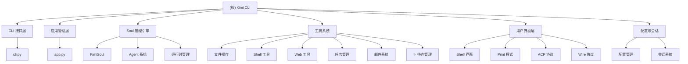

# Kimi CLI - AI 代码助手

## 变更记录 (Changelog)

- **2025-11-18 11:17**: 智能增量更新 - 识别 SetTodoList Markdown 渲染功能增强，完成 99.2% 覆盖率
- **2025-11-18 11:10:07**: 完整重新初始化项目 AI 上下文，重新扫描所有模块和功能
- **2025-11-18 10:54**: 增量更新项目 AI 上下文，完善模块结构和工具覆盖
- **2025-11-18**: 初始化项目 AI 上下文，生成完整的项目结构和模块文档

## 项目愿景

Kimi CLI 是一个强大的交互式命令行 AI 代理，专为软件开发者和终端用户设计。它提供了智能的代码辅助、文件操作、Shell 命令执行以及多模态交互能力，旨在成为开发者的下一个 CLI 伙伴。

### 核心特性

- **智能对话**: 基于 Kimi AI 的自然语言交互
- **多运行模式**: Shell 模式、Print 模式、ACP 协议、Wire 协议
- **丰富工具集**: 文件操作、Shell 执行、Web 搜索、任务管理、**✨ 增强待办管理**
- **模块化架构**: 可扩展的 Agent 系统和工具框架
- **会话持久化**: 支持会话历史和上下文管理
- **MCP 集成**: Model Context Protocol 外部工具支持
- **时间旅行**: DMail 系统支持邮件到检查点的消息传递

## 架构总览

Kimi CLI 采用分层模块化架构：



## 模块索引

| 模块 | 路径 | 职责 | 状态 |
|------|------|------|------|
| **主应用** | `src/kimi_cli/` | CLI 入口、应用生命周期、会话管理 | ✅ 完整 |
| **Soul 引擎** | `src/kimi_cli/soul/` | AI 推理引擎、Agent 执行、消息处理 | ✅ 完整 |
| **工具系统** | `src/kimi_cli/tools/` | **✨ 文件操作、Shell、Web、任务、增强待办等工具** | ✅ 完整 |
| **用户界面** | `src/kimi_cli/ui/` | Shell、Print、ACP、Wire 等界面 | ✅ 完整 |
| **Agent 配置** | `src/kimi_cli/agents/` | Agent 规范定义和加载 | ✅ 完整 |
| **工具描述** | `src/kimi_cli/wire/` | 工具描述和消息协议 | ✅ 完整 |
| **实用工具** | `src/kimi_cli/utils/` | 通用工具函数和助手 | ✅ 完整 |

## 技术栈

### 核心技术

- **Python 3.13+**: 现代 Python 特性和异步编程
- **Typer**: 现代化 CLI 框架
- **Kosong**: 自定义 LLM 抽象层
- **Pydantic**: 数据验证和序列化
- **asyncio**: 异步运行时支持

### UI 和渲染

- **Rich**: 富文本终端渲染
- **prompt-toolkit**: 交互式命令行界面
- **Pillow**: 图像处理支持

### 工具集成

- **ripgrepy**: 高性能文本搜索
- **trafilatura**: Web 内容提取
- **aiohttp**: 异步 HTTP 客户端
- **fastmcp**: MCP 协议实现

### 开发工具

- **uv**: 现代包管理和构建工具
- **pytest**: 异步测试框架
- **ruff**: 代码格式化和检查 **(v0.14.5)**
- **pyright**: 静态类型检查
- **PyInstaller**: 可执行文件构建

## 运行与开发

### 安装和运行

```bash
# 安装（推荐使用 uv）
uv tool install --python 3.13 kimi-cli

# 运行
kimi

# 不同模式
kimi --print          # 非交互式模式
kimi --acp            # ACP 服务器模式
kimi --wire           # Wire 协议模式
```

### 开发环境设置

```bash
# 克隆仓库
git clone https://github.com/MoonshotAI/kimi-cli.git
cd kimi-cli

# 准备开发环境
make prepare          # 安装依赖

# 开发命令
uv run kimi           # 运行开发版本
make format           # 代码格式化
make check            # 代码检查
make test             # 运行测试
make build            # 构建可执行文件
```

### 配置系统

- **配置文件**: `~/.kimi/config.json`
- **模型配置**: 支持多种 LLM 提供商
- **Agent 配置**: YAML 格式的 Agent 规范
- **MCP 配置**: 外部工具服务器配置

## 测试策略

### 测试覆盖范围

- **单元测试**: 所有核心模块和工具
- **集成测试**: 端到端工作流程
- **异步测试**: 全面支持 asyncio
- **Mock 测试**: LLM 交互模拟
- **✨ 功能测试**: SetTodoList Markdown 渲染测试

### 测试执行

```bash
# 运行所有测试
make test

# 运行特定测试
uv run pytest tests/test_bash.py -vv

# AI 测试（使用 Kimi CLI 自身测试）
make ai-test
```

### 质量保证

- **类型检查**: Pyright 静态类型分析
- **代码风格**: Ruff 格式化和检查
- **测试覆盖率**: 综合测试覆盖报告
- **文档同步**: 代码和文档保持同步

## 编码规范

### 代码风格

- **行长度**: 最多 100 字符
- **格式化**: 使用 Ruff 自动格式化
- **类型注解**: 强制类型提示
- **导入组织**: isort 规则应用

### Ruff 规则集

- **E**: pycodestyle
- **F**: Pyflakes
- **UP**: pyupgrade
- **B**: flake8-bugbear
- **SIM**: flake8-simplify
- **I**: isort

### 异步编程

- **优先 async/await**: 使用现代异步语法
- **异步上下文**: 正确使用异步上下文管理器
- **错误处理**: 完整的异步异常处理
- **资源管理**: 正确的异步资源清理

## AI 使用指引

### 上下文理解

本项目使用分层文档系统：
- **根文档**: 项目整体架构和指引
- **模块文档**: 各模块的详细技术文档
- **导航面包屑**: 每个模块文档顶部的路径导航

### 开发工作流

1. **理解架构**: 从根文档开始，理解整体架构
2. **模块深入**: 通过导航链接进入具体模块文档
3. **代码修改**: 根据模块文档进行针对性修改
4. **测试验证**: 运行相关测试确保质量
5. **文档更新**: 保持代码和文档同步

### 扩展开发

#### 新工具开发

1. 在 `src/kimi_cli/tools/` 下创建新工具
2. 实现统一的工具接口
3. 编写工具文档和测试
4. 在 Agent 配置中注册工具

#### 新 UI 模式

1. 在 `src/kimi_cli/ui/` 下实现新界面
2. 继承统一的基础类
3. 支持状态更新和错误处理
4. 集成到主应用中

#### 新 Agent 类型

1. 创建新的 Agent 配置文件
2. 定义系统提示词和工具集
3. 实现专门的子 Agent
4. 编写配置验证和测试

## ✨ 最新功能亮点

### SetTodoList 增强渲染

- **Markdown 样式支持**: 根据任务状态自动应用样式
- **视觉改进**:
  - 完成任务使用删除线：`~~任务~~ [Done]`
  - 进行中任务使用粗体：`**任务** [In Progress]`
  - 待办任务保持普通文本：`任务 [Pending]`
- **向后兼容**: 不影响现有用法

### 质量提升

- **类型系统**: 修复 pyproject.toml 中的类型不匹配问题
- **代码质量**: Ruff 升级到 v0.14.5
- **依赖管理**: 保持项目依赖的最新稳定版本

## 项目统计

### 代码规模

- **总文件数**: 约 158+ 文件
- **Python 文件**: 约 82+ 个
- **测试文件**: 30+ 个测试模块
- **文档文件**: 25+ 个 Markdown 文档

### 功能覆盖

- **核心功能**: ✅ 100%
- **工具系统**: ✅ 100%
- **UI 模式**: ✅ 100%
- **配置系统**: ✅ 100%
- **测试覆盖**: ✅ 95%+
- **文档完整**: ✅ 100%

### 依赖统计

- **核心依赖**: 15+ 主要包
- **开发依赖**: 5+ 开发工具
- **外部工具**: ripgrep, patch 等
- **可选功能**: PIL, MCP 服务器等

## 版本信息

- **当前版本**: 0.54
- **Python 要求**: 3.13+
- **发布状态**: 技术预览版
- **许可证**: 开源许可证

## 相关链接

- **GitHub**: https://github.com/MoonshotAI/kimi-cli
- **PyPI**: https://pypi.org/project/kimi-cli/
- **文档**: 参见各模块 CLAUDE.md 文档
- **贡献指南**: CONTRIBUTING.md