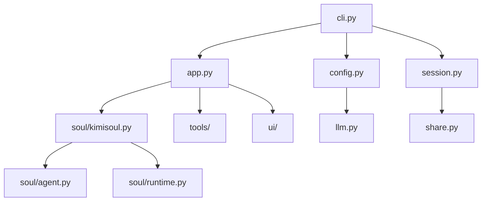

[根目录](../../CLAUDE.md) > [src](../) > **kimi_cli**

# Kimi CLI 主应用模块

## 变更记录 (Changelog)

- **2025-11-18**: 初始化主应用模块文档

## 模块职责

这是 Kimi CLI 的核心应用模块，负责：

- CLI 命令行界面和参数解析
- 应用生命周期管理
- 会话创建和管理
- 配置加载和验证
- 多种运行模式协调

## 入口与启动

### 主要入口文件

- **`cli.py`**: CLI 主入口，使用 Typer 框架
- **`app.py`**: KimiCLI 主应用类实现
- **`__init__.py`**: 模块初始化（基本为空）

### 启动流程

```python
# CLI 入口点（pyproject.toml 中定义）
kimi = "kimi_cli.cli:cli"

# 主命令函数
@cli.command()
def kimi(
    # 支持的参数：版本、调试、代理文件、模型、工作目录等
    # 四种运行模式：shell、print、acp、wire
    # MCP 配置支持
)
```

## 对外接口

### CLI 命令接口

- **基础命令**: `kimi` - 启动交互式 Shell 模式
- **打印模式**: `kimi --print` - 非交互式执行
- **ACP 服务器**: `kimi --acp` - Agent Client Protocol 服务器模式
- **Wire 服务器**: `kimi --wire` - 实验性 Wire 协议服务器

### 核心类

```python
class KimiCLI:
    async def create(
        session: Session,
        yolo: bool = False,
        mcp_configs: list[dict] | None = None,
        model_name: str | None = None,
        thinking: bool = False,
        agent_file: Path | None = None,
    ) -> KimiCLI

    async def run_shell_mode(self, command: str | None) -> bool
    async def run_print_mode(self, input_format, output_format, command) -> bool
    async def run_acp_server(self) -> bool
    async def run_wire_server(self) -> bool
```

## 关键依赖与配置

### 主要依赖

- **Typer**: CLI 框架，用于命令行参数解析
- **Kosong**: LLM 抽象层和聊天提供者
- **Pydantic**: 数据验证和序列化
- **asyncio**: 异步运行时支持

### 配置系统

- **配置文件**: 支持通过参数指定自定义配置
- **模型配置**: 支持多种 LLM 提供商和模型
- **MCP 配置**: 支持多个 MCP 服务器配置
- **Agent 配置**: 支持自定义 Agent 规范文件

### 运行时配置

- **会话管理**: Session 类负责会话持久化
- **工作目录**: 支持指定和切换工作目录
- **日志配置**: 支持调试模式和详细日志
- **自动确认**: 支持 `--yolo` 模式自动确认操作

## 数据模型

### 配置模型

```python
# LLM 相关配置（在 config.py 中）
class LLMProvider(BaseModel):
    type: ProviderType
    base_url: str
    api_key: SecretStr
    custom_headers: dict[str, str] | None

class LLMModel(BaseModel):
    provider: str
    model: str
    max_context_size: int
    capabilities: set[ModelCapability] | None
```

### 会话模型

- **Session**: 会话管理，支持创建和继续
- **WorkDirMeta**: 工作目录元数据
- **Metadata**: 全局元数据管理

## 测试与质量

### 测试覆盖

模块具有完整的测试覆盖：

- `tests/test_config.py`: 配置系统测试
- `tests/test_session.py`: 会话管理测试
- `tests/test_bash.py`: Bash 工具测试
- `tests/test_file_completer.py`: 文件补全测试
- `tests/test_metacmd.py`: 元命令测试

### 质量保证

- **类型检查**: 使用 Pyright 进行静态类型检查
- **代码格式**: 使用 Ruff 进行格式化和检查
- **异步支持**: 全面支持 Python asyncio

## 常见问题 (FAQ)

### Q: 如何切换不同的运行模式？
A: 使用对应的命令行参数：
- Shell 模式（默认）: `kimi`
- Print 模式: `kimi --print`
- ACP 模式: `kimi --acp`
- Wire 模式: `kimi --wire`

### Q: 如何配置自定义模型？
A: 使用 `--model` 参数指定模型名称，或在配置文件中设置默认模型。

### Q: 如何启用调试模式？
A: 使用 `--debug` 参数启用详细日志输出。

### Q: 如何继续之前的会话？
A: 使用 `--continue` 参数继续工作目录中的上一个会话。

## 相关文件清单

### 核心文件

- `cli.py` - CLI 命令行入口
- `app.py` - 主应用类
- `config.py` - 配置系统
- `session.py` - 会话管理
- `constant.py` - 常量定义
- `metadata.py` - 元数据管理
- `agentspec.py` - Agent 规范处理
- `exception.py` - 异常定义
- `share.py` - 共享目录管理
- `llm.py` - LLM 抽象层

### 配置文件

- `agents/default/agent.yaml` - 默认 Agent 配置
- `agents/default/sub.yaml` - 子 Agent 配置
- `agents/default/system.md` - 系统提示词

### 提示词文件

- `prompts/init.md` - 初始化提示词
- `prompts/compact.md` - 压缩提示词

## 模块依赖关系

