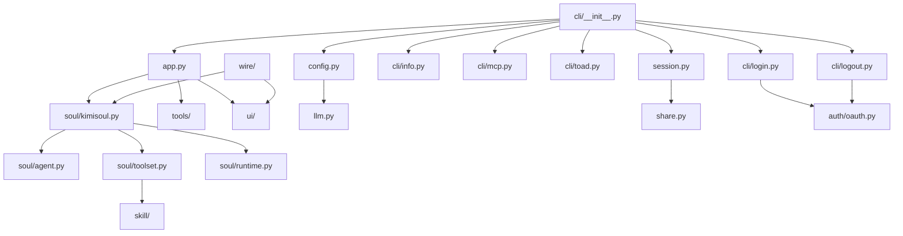

[根目录](../../CLAUDE.md) > [src](../) > **kimi_cli**

# Kimi CLI 主应用模块

## 变更记录 (Changelog)

- **2026-01-28**: 更新至 v1.3 - OAuth 登录/登出、Flow Skills、Wire 模块提升
- **2026-01-04**: 更新至 v0.72 - CLI 模块化重构、Toad TUI、技能系统、Monorepo 架构
- **2025-12-25**: 更新至 v0.68 - 添加 MCP OAuth 支持、配置文件迁移到 TOML、ACP 增强功能
- **2025-11-18**: 初始化主应用模块文档

## 模块职责

这是 Kimi CLI 的核心应用模块，负责：

- CLI 命令行界面和参数解析
- 应用生命周期管理
- 会话创建和管理
- 配置加载和验证
- 多种运行模式协调
- OAuth 认证管理 (v1.0+)
- 技能系统集成 (v0.69+)
- Flow Skills 支持 (v0.81+)

## 入口与启动

### 主要入口文件 (v0.71+ 模块化重构)

- **`cli/__init__.py`**: CLI 主入口，使用 Typer 框架
- **`cli/__main__.py`**: Python 模块执行入口
- **`cli/info.py`**: `kimi info` 子命令实现
- **`cli/mcp.py`**: `kimi mcp` 子命令组实现
- **`cli/toad.py`**: `kimi term` TUI 启动器
- **`app.py`**: KimiCLI 主应用类实现
- **`__init__.py`**: 模块初始化（基本为空）

### 启动流程

```python
# CLI 入口点（pyproject.toml 中定义）
kimi = "kimi_cli.cli:cli"

# 主命令函数
@cli.callback(invoke_without_command=True)
def kimi(
    ctx: typer.Context,
    # 支持的参数：版本、调试、代理文件、模型、工作目录等
    # 五种运行模式：shell、print、acp、wire、term
    # MCP 配置支持
    # 技能目录配置 (v0.69+)
)
```

### CLI 子命令 (v0.71+)

```python
# 子命令注册
cli.add_typer(info_cli, name="info")    # kimi info
cli.add_typer(mcp_cli, name="mcp")      # kimi mcp
cli.command()(run_acp)                  # kimi acp
cli.command()(run_term)                 # kimi term
cli.command()(login)                    # kimi login (v1.0+)
cli.command()(logout)                   # kimi logout (v1.0+)
```

## 对外接口

### CLI 命令接口 (v1.3 更新)

**基础命令**:
- `kimi` - 启动交互式 Shell 模式
- `kimi --print` - 非交互式执行
- `kimi --acp` - Agent Client Protocol 服务器模式
- `kimi --wire` - Wire 协议服务器
- `kimi --session/-S <id>` - 指定会话 ID 恢复会话

**子命令 (v0.71+)**:
- `kimi term` - 启动 Toad TUI 终端界面（需要 Python 3.14+）
- `kimi info` - 显示版本和协议信息（支持 `--json` 格式）
- `kimi acp` - 运行 ACP 服务器
- `kimi mcp` - MCP 服务器配置管理子命令组
- `kimi login` - Kimi 账户登录 (v1.0+)
- `kimi logout` - Kimi 账户登出 (v1.0+)

**新增选项 (v0.69-v1.3)**:
- `--skills-dir DIR` - 自定义技能目录路径（默认 `~/.kimi/skills`）
- `--final-message-only` / `--quiet` - Print 模式下仅输出最终消息 (v0.70+)

### OAuth 子命令 (v1.0+)

```bash
# 登录 Kimi 账户
kimi login [--json]

# 登出 Kimi 账户
kimi logout [--json]
```

### MCP 子命令 (v0.68+)

```bash
# 添加 MCP 服务器
kimi mcp add <name> [--transport stdio|http] [TARGET_OR_COMMAND...]

# 添加 HTTP 服务器（支持 OAuth）
kimi mcp add --transport http --auth oauth <name> <url>

# 添加 stdio 服务器
kimi mcp add --transport stdio <name> -- <command> [args...]

# 列出所有 MCP 服务器
kimi mcp list

# 测试 MCP 服务器连接
kimi mcp test <name>

# OAuth 授权
kimi mcp auth <name>

# 重置 OAuth 授权
kimi mcp reset-auth <name>

# 删除 MCP 服务器
kimi mcp remove <name>
```

### 核心类 (v0.69-v1.3 更新)

```python
class KimiCLI:
    async def create(
        session: Session,
        yolo: bool = False,
        mcp_configs: list[dict] | None = None,
        model_name: str | None = None,
        thinking: bool = False,
        agent_file: Path | None = None,
        config: Config | None = None,  # v0.68+ 支持 Config 对象
        skills_dir: Path | None = None,  # v0.69+ 支持自定义技能目录
    ) -> KimiCLI

    async def run_shell(self, command: str | None) -> bool  # v0.59+ 重命名
    async def run_print(self, input_format, output_format, command) -> bool  # v0.59+ 重命名
    async def run_acp(self) -> bool  # v0.59+ 重命名
    async def run_wire_stdio(self) -> bool  # v0.59+ 重命名
    async def run(self, user_input: str) -> AsyncIterator[WireMessage]  # v0.59+ 新增

# v1.0+ OAuth 管理
class OAuthManager:
    """OAuth 令牌管理器"""
    def __init__(self, config: Config) -> None
    def common_headers(self) -> dict[str, str]
    def resolve_api_key(self, api_key: SecretStr, oauth: OAuthRef | None) -> str
    async def ensure_fresh(self, runtime: Runtime) -> None
    @asynccontextmanager
    async def refreshing(self, runtime: Runtime) -> AsyncIterator[None]

# v0.69+ 技能系统
class Skill(BaseModel):
    """技能信息模型"""
    name: str
    description: str
    type: SkillType  # "standard" 或 "flow" (v0.81+)
    dir: KaosPath
    flow: Flow | None  # Flow Skills (v0.81+)

    @property
    def skill_md_file(self) -> KaosPath:
        """SKILL.md 文件路径"""
        return self.dir / "SKILL.md"

async def discover_skills(skills_dir: KaosPath) -> list[Skill]:
    """发现指定目录中的所有技能"""

async def resolve_skills_roots(work_dir: KaosPath) -> list[KaosPath]:
    """解析分层技能根目录（内置 → 用户 → 项目）"""
```

## 关键依赖与配置

### 主要依赖

- **Typer**: CLI 框架，用于命令行参数解析
- **Kosong**: LLM 抽象层和聊天提供者
- **Pydantic**: 数据验证和序列化
- **asyncio**: 异步运行时支持
- **keyring**: 安全令牌存储 (v1.0+)
- **aiohttp**: 异步 HTTP 客户端

### 配置系统

- **配置文件格式**: v0.66+ 迁移到 TOML 格式（~/.kimi/config.toml）
- **配置文件参数**: v0.68+ 支持 `--config` 和 `--config-file` 选项传入 JSON/TOML 配置
- **模型配置**: 支持多种 LLM 提供商
- **OAuth 配置**: v1.0+ 支持 OAuth 令牌存储和自动刷新
- **MCP 配置**: 支持多个 MCP 服务器配置（~/.kimi/mcp.json）
- **Agent 配置**: 支持自定义 Agent 规范文件
- **自动迁移**: 自动将旧的 JSON 配置迁移到 TOML 格式

### TOML 配置示例 (v0.66+)

```toml
# ~/.kimi/config.toml
default_model = "moonshot-v1-8k"

[models.moonshot-v1-8k]
provider = "moonshot"
model = "moonshot-v1-8k"
max_context_size = 8192

[providers.moonshot]
type = "moonshot"
base_url = "https://api.moonshot.cn/v1"
api_key = "sk-your-api-key"

[loop_control]
max_steps_per_run = 100
max_retries_per_step = 3

[mcp.client]
tool_call_timeout_ms = 60000
```

### OAuth 配置 (v1.0+)

```python
# 在 LLMProvider 中使用 OAuth
class LLMProvider(BaseModel):
    type: ProviderType
    base_url: str
    api_key: SecretStr
    oauth: OAuthRef | None  # OAuth 引用

class OAuthRef(BaseModel):
    storage: Literal["keyring", "file"]
    key: str  # 令牌键名
```

### 运行时配置

- **会话管理**: Session 类负责会话持久化
  - v0.64+ 支持命名会话 (`Session.create(work_dir, session_id)`)
  - v0.64+ 支持列出和切换会话 (`/sessions` 元命令)
- **工作目录**: 支持指定和切换工作目录
- **日志配置**: 支持调试模式和详细日志
- **自动确认**: 支持 `--yolo` 模式自动确认操作

### 斜杠命令 (v0.66+)

斜杠命令分为两个级别：

**Shell 级命令**:
- `/login` - 登录 Kimi 账户 (v1.0+)
- `/logout` - 登出 Kimi 账户 (v1.0+)
- `/sessions` - 列出和切换会话 (v0.64+)
- `/mcp` - 显示 MCP 服务器和工具状态 (v0.66+)
- `/model` - 切换默认模型并重新加载 (v0.71+)
- `/setup` - 设置 LLM 提供商和模型
- `/reload` - 重新加载配置
- `/update` - 检查并自动更新
- `/debug` - 调试上下文
- `/usage` - 显示 API 使用情况 (v0.65+)

**KimiSoul 级命令**:
- `/init` - 分析代码库并生成 AGENTS.md
- `/compact` - 压缩上下文
- `/yolo` - 启用 YOLO 模式
- `/clear` / `/reset` - 清除上下文
- `/feedback` - 发送反馈
- `/skill:<name>` - 按需加载指定技能 (v0.71+)
- `/flow:<name>` - 调用 Flow Skills (v0.81+)

## 数据模型

### 配置模型

```python
# LLM 相关配置（在 config.py 中）
class LLMProvider(BaseModel):
    type: ProviderType  # moonshot, openai, anthropic, gemini, vertexai 等
    base_url: str
    api_key: SecretStr
    env: dict[str, str] | None  # v0.68+ 新增
    custom_headers: dict[str, str] | None
    oauth: OAuthRef | None  # v1.0+ 新增

class LLMModel(BaseModel):
    provider: str
    model: str
    max_context_size: int
    capabilities: set[ModelCapability] | None  # thinking, tool_calling, streaming, image_in, video_in

class MCPClientConfig(BaseModel):  # v0.66+ 新增
    tool_call_timeout_ms: int = 60000

class Services(BaseModel):
    moonshot_search: MoonshotSearchConfig | None
    moonshot_fetch: MoonshotFetchConfig | None

class Config(BaseModel):
    default_model: str
    models: dict[str, LLMModel]
    providers: dict[str, LLMProvider]
    loop_control: LoopControl
    services: Services
    mcp: MCPConfig  # v0.66+ 新增
```

### 会话模型

- **Session**: 会话管理，支持创建和继续
  - v0.64+ 支持命名会话 `Session.create(work_dir, session_id)`
  - v0.64+ 支持查找和列出 `Session.find()` 和 `Session.list()`
- **WorkDirMeta**: 工作目录元数据
- **Metadata**: 全局元数据管理

### Wire 消息模型 (v0.59+)

```python
class TurnBegin(BaseModel):
    """标记每次 agent 轮次的开始"""

class StatusUpdate(BaseModel):
    """状态更新消息"""
    step: int
    snapshot: StatusSnapshot
    token_usage: dict | None  # v0.66+ 新增
    message_id: str | None  # v0.66+ 新增

class ApprovalRequest(BaseModel):
    """操作确认请求"""
    title: str
    description: str
    display: list[DisplayBlock] | None  # v0.68+ 新增差异显示
```

### OAuth 模型 (v1.0+)

```python
class OAuthToken:
    """OAuth 令牌"""
    access_token: str
    refresh_token: str
    expires_at: float
    scope: str
    token_type: str

class OAuthEvent:
    """OAuth 事件"""
    type: OAuthEventKind  # "info", "error", "waiting", "verification_url", "success"
    message: str
    data: dict[str, Any] | None
```

### 技能模型 (v0.69+, v0.81+ 更新)

```python
class Skill(BaseModel):
    """技能信息"""
    name: str
    description: str
    type: SkillType  # "standard" 或 "flow"
    dir: KaosPath
    flow: Flow | None  # Flow Skills

class Flow:
    """流程图数据结构"""
    nodes: dict[str, FlowNode]
    outgoing: dict[str, list[FlowEdge]]
    begin_id: str
    end_id: str
```

## 测试与质量

### 测试覆盖

模块具有完整的测试覆盖：

- `tests/test_config.py`: 配置系统测试
- `tests/test_session.py`: 会话管理测试
- `tests/test_bash.py`: Bash 工具测试
- `tests/test_file_completer.py`: 文件补全测试
- `tests/test_metacmd.py`: 元命令测试
- `tests/test_auth.py`: OAuth 测试 (v1.0+)
- `tests/test_skill.py`: 技能系统测试
- `tests/test_flow.py`: Flow 解析测试

### 质量保证

- **类型检查**: 使用 Pyright 进行静态类型检查
- **代码格式**: 使用 Ruff 进行格式化和检查
- **异步支持**: 全面支持 Python asyncio

## 常见问题 (FAQ)

### Q: 如何切换不同的运行模式？
A: 使用对应的命令行参数：
- Shell 模式（默认）: `kimi`
- Print 模式: `kimi --print`
- ACP 模式: `kimi --acp` 或 `kimi acp`
- Wire 模式: `kimi --wire`
- **Toad TUI** (v0.71+): `kimi term`

### Q: 如何使用 Toad TUI？
A: (v0.71+) 运行 `kimi term` 启动 Toad 终端界面。
要求：Python 3.14+ 且已安装 Toad 依赖包。如遇到依赖缺失错误，运行 `uv sync --python 3.14` 安装。

### Q: 如何创建和使用技能？
A: (v0.69+)
1. 在 `~/.kimi/skills/` 或 `~/.claude/skills/` 创建技能目录
2. 在目录中创建 `SKILL.md` 文件，使用 frontmatter 定义技能
3. 使用 `/skill:<name>` 斜杠命令按需加载
4. 对于 Flow Skills (v0.81+)，在 SKILL.md 中嵌入 Mermaid/D2 流程图

### Q: 如何配置自定义模型？
A: 使用 `--model` 参数指定模型名称，或在配置文件中设置默认模型。
v0.71+ 可使用 `/model` 斜杠命令动态切换模型。

### Q: 如何启用调试模式？
A: 使用 `--debug` 参数启用详细日志输出。

### Q: 如何继续之前的会话？
A: 使用 `--continue` 参数继续工作目录中的上一个会话，或使用 `--session/-S <id>` 指定会话 ID。

### Q: 如何配置 MCP 服务器？
A: 使用 `kimi mcp` 子命令组：
```bash
kimi mcp add my-server --transport http https://example.com/mcp
kimi mcp add local-tool --transport stdio -- npx my-mcp-server
```

### Q: 如何查看版本信息？
A: (v0.71+) 使用 `kimi info` 查看版本和协议信息，支持 `--json` 格式输出。

### Q: 如何使用 OAuth 登录？
A: (v1.0+) 运行 `kimi login`，会自动打开浏览器进行授权。授权完成后自动配置模型。

### Q: 配置文件格式从 JSON 改为 TOML 后如何迁移？
A: v0.66+ 会自动将旧的 JSON 配置迁移到 TOML 格式，原始 JSON 文件会被备份为 `config.json.bak`。

### Q: ACP 模式支持哪些新功能？
A: v0.68+ ACP 模式支持：
- 显示文件差异预览
- 在 ACP 客户端终端运行 Shell 命令
- 连接到 ACP 客户端管理的 MCP 服务器
- 斜杠命令广播（单会话模式）
- ACPKaos 后端支持 (v0.70+)

### Q: 支持哪些 LLM 提供商？
A: 支持多种提供商：
- moonshot (Moonshot AI)
- openai (OpenAI 及兼容 API)
- anthropic (Anthropic Claude)
- gemini (Google Gemini)
- vertexai (Google Vertex AI)
- _echo (测试/调试用，v0.69+)

### Q: Print 模式如何只输出最终消息？
A: (v0.70+) 使用 `--final-message-only` 或 `--quiet` 选项：
```bash
kimi --print --final-message-only -c "你的问题"
```

### Q: Flow Skills 和标准技能有什么区别？
A: (v0.81+) Flow Skills 包含 Mermaid/D2 流程图，定义工作流程和决策逻辑。标准技能是纯文本指令。

### Q: 如何调用 Flow Skills？
A: (v0.81+) 使用 `/flow:<name>` 或 `/skill:<name>` 斜杠命令都可以调用 Flow Skills。

## 相关文件清单

### 核心文件

**CLI 入口 (v0.71+ 重构)**:
- `cli/__init__.py` - CLI 主入口（原 cli.py）
- `cli/__main__.py` - Python 模块执行入口
- `cli/info.py` - `kimi info` 子命令
- `cli/mcp.py` - MCP 服务器管理子命令组

**应用核心**:
- `app.py` - 主应用类
- `config.py` - 配置系统（支持 TOML/JSON）
- `session.py` - 会话管理（支持命名会话）
- `toad.py` - **✨ Toad TUI 启动器** (v0.71+)
- `constant.py` - 常量定义
- `metadata.py` - 元数据管理
- `agentspec.py` - Agent 规范处理
- `exception.py` - 异常定义
- `share.py` - 共享目录管理
- `llm.py` - LLM 抽象层

**认证系统 (v1.0+)**:
- `auth/__init__.py` - OAuth 模块初始化
- `auth/oauth.py` - OAuth 授权流程
- `auth/platforms.py` - 平台管理

**技能系统 (v0.69+)**:
- `skill/__init__.py` - **✨ 技能发现和加载**
- `skill/flow/__init__.py` - Flow 基础类型 (v0.81+)
- `skill/flow/mermaid.py` - Mermaid 解析器 (v0.81+)
- `skill/flow/d2.py` - D2 解析器 (v0.81+)

**Wire 协议**:
- `wire/__init__.py` - Wire 核心实现
- `wire/server.py` - Wire 服务器 (v0.80+)
- `wire/types.py` - 消息类型定义
- `wire/file.py` - 文件后端 (v0.80+)

### 配置文件

- `agents/default/agent.yaml` - 默认 Agent 配置
- `agents/default/sub.yaml` - 子 Agent 配置
- `agents/default/system.md` - 系统提示词
- `agents/okabe/agent.yaml` - 内置 okabe Agent（启用 SendDMail）

### 提示词文件

- `prompts/init.md` - 初始化提示词
- `prompts/compact.md` - 压缩提示词

## 模块依赖关系 (v1.3 更新)


