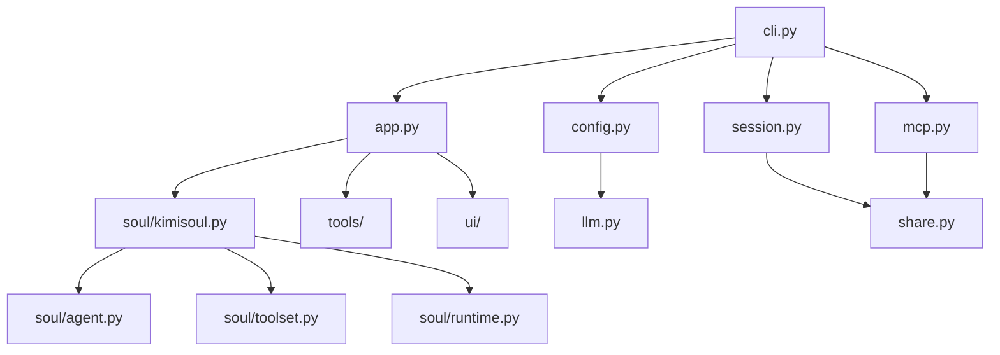

[根目录](../../CLAUDE.md) > [src](../) > **kimi_cli**

# Kimi CLI 主应用模块

## 变更记录 (Changelog)

- **2025-12-25**: 更新至 v0.68 - 添加 MCP OAuth 支持、配置文件迁移到 TOML、ACP 增强功能
- **2025-11-18**: 初始化主应用模块文档

## 模块职责

这是 Kimi CLI 的核心应用模块，负责：

- CLI 命令行界面和参数解析
- 应用生命周期管理
- 会话创建和管理
- 配置加载和验证
- 多种运行模式协调

## 入口与启动

### 主要入口文件

- **`cli.py`**: CLI 主入口，使用 Typer 框架
- **`app.py`**: KimiCLI 主应用类实现
- **`__init__.py`**: 模块初始化（基本为空）

### 启动流程

```python
# CLI 入口点（pyproject.toml 中定义）
kimi = "kimi_cli.cli:cli"

# 主命令函数
@cli.command()
def kimi(
    # 支持的参数：版本、调试、代理文件、模型、工作目录等
    # 四种运行模式：shell、print、acp、wire
    # MCP 配置支持
)
```

## 对外接口

### CLI 命令接口

- **基础命令**: `kimi` - 启动交互式 Shell 模式
- **打印模式**: `kimi --print` - 非交互式执行
- **ACP 服务器**: `kimi --acp` - Agent Client Protocol 服务器模式
- **Wire 服务器**: `kimi --wire` - 实验性 Wire 协议服务器
- **MCP 管理**: `kimi mcp` - MCP 服务器配置管理子命令组
- **会话管理**: `kimi --session/-S <id>` - 指定会话 ID 恢复会话

### MCP 子命令 (v0.68+)

```bash
# 添加 MCP 服务器
kimi mcp add <name> [--transport stdio|http] [TARGET_OR_COMMAND...]

# 添加 HTTP 服务器（支持 OAuth）
kimi mcp add --transport http --auth oauth <name> <url>

# 添加 stdio 服务器
kimi mcp add --transport stdio <name> -- <command> [args...]

# 列出所有 MCP 服务器
kimi mcp list

# 测试 MCP 服务器连接
kimi mcp test <name>

# OAuth 授权
kimi mcp auth <name>

# 重置 OAuth 授权
kimi mcp reset-auth <name>

# 删除 MCP 服务器
kimi mcp remove <name>
```

### 核心类

```python
class KimiCLI:
    async def create(
        session: Session,
        yolo: bool = False,
        mcp_configs: list[dict] | None = None,
        model_name: str | None = None,
        thinking: bool = False,
        agent_file: Path | None = None,
        config: Config | None = None,  # v0.68+ 支持 Config 对象
    ) -> KimiCLI

    async def run_shell(self, command: str | None) -> bool  # v0.59+ 重命名
    async def run_print(self, input_format, output_format, command) -> bool  # v0.59+ 重命名
    async def run_acp(self) -> bool  # v0.59+ 重命名
    async def run_wire_stdio(self) -> bool  # v0.59+ 重命名
    async def run(self, user_input: str) -> AsyncIterator[WireMessage]  # v0.59+ 新增
```

## 关键依赖与配置

### 主要依赖

- **Typer**: CLI 框架，用于命令行参数解析
- **Kosong**: LLM 抽象层和聊天提供者
- **Pydantic**: 数据验证和序列化
- **asyncio**: 异步运行时支持

### 配置系统

- **配置文件格式**: v0.66+ 迁移到 TOML 格式（~/.kimi/config.toml）
- **配置文件参数**: v0.68+ 支持 `--config` 和 `--config-file` 选项传入 JSON/TOML 配置
- **模型配置**: 支持多种 LLM 提供商和模型
- **MCP 配置**: 支持多个 MCP 服务器配置（~/.kimi/mcp.json）
- **Agent 配置**: 支持自定义 Agent 规范文件
- **自动迁移**: 自动将旧的 JSON 配置迁移到 TOML 格式

### TOML 配置示例 (v0.66+)

```toml
# ~/.kimi/config.toml
default_model = "moonshot-v1-8k"

[models.moonshot-v1-8k]
provider = "moonshot"
model = "moonshot-v1-8k"
max_context_size = 8192

[providers.moonshot]
type = "moonshot"
base_url = "https://api.moonshot.cn/v1"
api_key = "sk-your-api-key"

[loop_control]
max_steps_per_run = 100
max_retries_per_step = 3

[mcp.client]
tool_call_timeout_ms = 60000
```

### 运行时配置

- **会话管理**: Session 类负责会话持久化
  - v0.64+ 支持命名会话 (`Session.create(work_dir, session_id)`)
  - v0.64+ 支持列出和切换会话 (`/sessions` 元命令)
- **工作目录**: 支持指定和切换工作目录
- **日志配置**: 支持调试模式和详细日志
- **自动确认**: 支持 `--yolo` 模式自动确认操作

### 斜杠命令 (v0.66+)

斜杠命令分为两个级别：

**Shell 级命令**:
- `/sessions` - 列出和切换会话 (v0.64+)
- `/mcp` - 显示 MCP 服务器和工具状态 (v0.66+)
- `/setup` - 设置 LLM 提供商和模型
- `/reload` - 重新加载配置
- `/update` - 检查并自动更新
- `/debug` - 调试上下文
- `/usage` - 显示 API 使用情况 (v0.65+)

**KimiSoul 级命令**:
- `/init` - 分析代码库并生成 AGENTS.md
- `/compact` - 压缩上下文
- `/yolo` - 启用 YOLO 模式
- `/clear` / `/reset` - 清除上下文
- `/feedback` - 发送反馈

## 数据模型

### 配置模型

```python
# LLM 相关配置（在 config.py 中）
class LLMProvider(BaseModel):
    type: ProviderType  # moonshot, openai, anthropic, gemini, vertexai 等
    base_url: str
    api_key: SecretStr
    env: dict[str, str] | None  # v0.68+ 新增
    custom_headers: dict[str, str] | None

class LLMModel(BaseModel):
    provider: str
    model: str
    max_context_size: int
    capabilities: set[ModelCapability] | None  # thinking, tool_calling, streaming

class MCPClientConfig(BaseModel):  # v0.66+ 新增
    tool_call_timeout_ms: int = 60000

class Services(BaseModel):
    moonshot_search: MoonshotSearchConfig | None
    moonshot_fetch: MoonshotFetchConfig | None

class Config(BaseModel):
    default_model: str
    models: dict[str, LLMModel]
    providers: dict[str, LLMProvider]
    loop_control: LoopControl
    services: Services
    mcp: MCPConfig  # v0.66+ 新增
```

### 会话模型

- **Session**: 会话管理，支持创建和继续
  - v0.64+ 支持命名会话 `Session.create(work_dir, session_id)`
  - v0.64+ 支持查找和列出 `Session.find()` 和 `Session.list()`
- **WorkDirMeta**: 工作目录元数据
- **Metadata**: 全局元数据管理

### Wire 消息模型 (v0.59+)

```python
class TurnBegin(BaseModel):
    """标记每次 agent 轮次的开始"""

class StatusUpdate(BaseModel):
    """状态更新消息"""
    step: int
    snapshot: StatusSnapshot
    token_usage: dict | None  # v0.66+ 新增
    message_id: str | None  # v0.66+ 新增

class ApprovalRequest(BaseModel):
    """操作确认请求"""
    title: str
    description: str
    display: list[DisplayBlock] | None  # v0.68+ 新增差异显示
```

## 测试与质量

### 测试覆盖

模块具有完整的测试覆盖：

- `tests/test_config.py`: 配置系统测试
- `tests/test_session.py`: 会话管理测试
- `tests/test_bash.py`: Bash 工具测试
- `tests/test_file_completer.py`: 文件补全测试
- `tests/test_metacmd.py`: 元命令测试

### 质量保证

- **类型检查**: 使用 Pyright 进行静态类型检查
- **代码格式**: 使用 Ruff 进行格式化和检查
- **异步支持**: 全面支持 Python asyncio

## 常见问题 (FAQ)

### Q: 如何切换不同的运行模式？
A: 使用对应的命令行参数：
- Shell 模式（默认）: `kimi`
- Print 模式: `kimi --print`
- ACP 模式: `kimi --acp`
- Wire 模式: `kimi --wire`

### Q: 如何配置自定义模型？
A: 使用 `--model` 参数指定模型名称，或在配置文件中设置默认模型。

### Q: 如何启用调试模式？
A: 使用 `--debug` 参数启用详细日志输出。

### Q: 如何继续之前的会话？
A: 使用 `--continue` 参数继续工作目录中的上一个会话，或使用 `--session/-S <id>` 指定会话 ID。

### Q: 如何配置 MCP 服务器？
A: 使用 `kimi mcp` 子命令组：
```bash
kimi mcp add my-server --transport http https://example.com/mcp
kimi mcp add local-tool --transport stdio -- npx my-mcp-server
```

### Q: 配置文件格式从 JSON 改为 TOML 后如何迁移？
A: v0.66+ 会自动将旧的 JSON 配置迁移到 TOML 格式，原始 JSON 文件会被备份为 `config.json.bak`。

### Q: ACP 模式支持哪些新功能？
A: v0.68+ ACP 模式支持：
- 显示文件差异预览
- 在 ACP 客户端终端运行 Shell 命令
- 连接到 ACP 客户端管理的 MCP 服务器
- 斜杠命令广播（单会话模式）

### Q: 支持哪些 LLM 提供商？
A: 支持多种提供商：
- moonshot (Moonshot AI)
- openai (OpenAI 及兼容 API)
- anthropic (Anthropic Claude)
- gemini (Google Gemini)
- vertexai (Google Vertex AI)

## 相关文件清单

### 核心文件

- `cli.py` - CLI 命令行入口
- `app.py` - 主应用类
- `config.py` - 配置系统（支持 TOML/JSON）
- `session.py` - 会话管理（支持命名会话）
- `mcp.py` - MCP 服务器管理子命令（v0.64+）
- `constant.py` - 常量定义
- `metadata.py` - 元数据管理
- `agentspec.py` - Agent 规范处理
- `exception.py` - 异常定义
- `share.py` - 共享目录管理
- `llm.py` - LLM 抽象层

### 配置文件

- `agents/default/agent.yaml` - 默认 Agent 配置
- `agents/default/sub.yaml` - 子 Agent 配置
- `agents/default/system.md` - 系统提示词
- `agents/okabe/agent.yaml` - 内置 okabe Agent（启用 SendDMail）

### 提示词文件

- `prompts/init.md` - 初始化提示词
- `prompts/compact.md` - 压缩提示词

## 模块依赖关系

